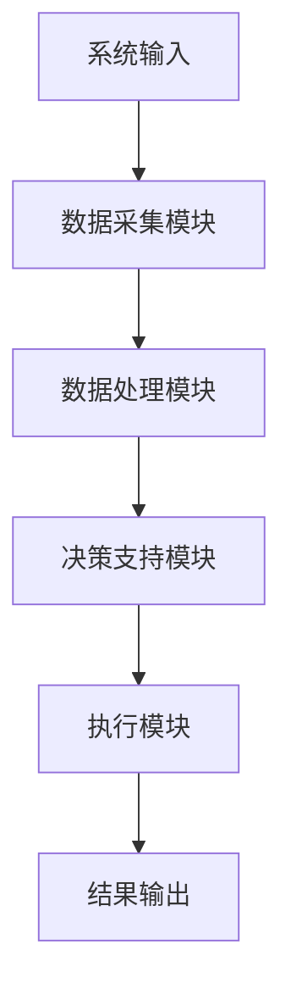
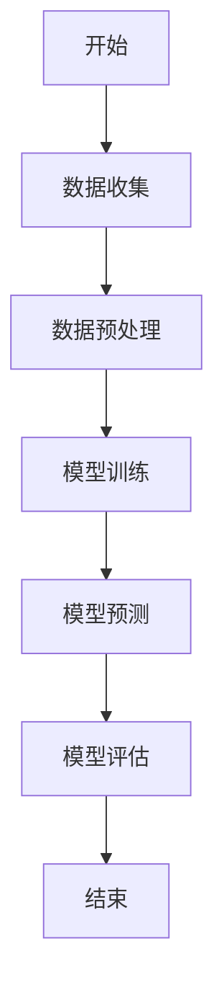
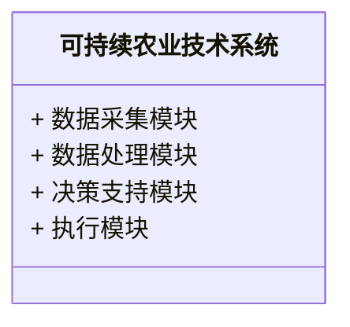
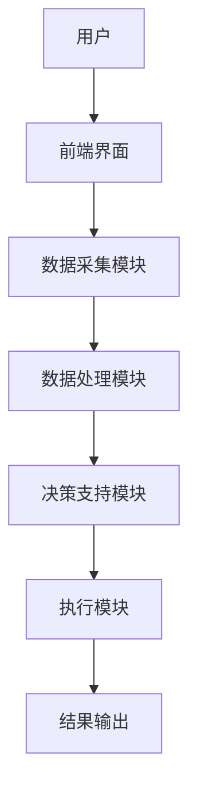
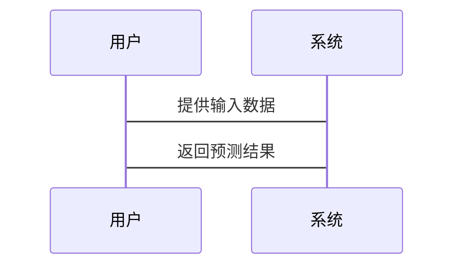

                 


# 可持续农业技术的全球市场规模预测

> 关键词：可持续农业技术，市场规模预测，算法模型，系统架构，项目实战

> 摘要：本文详细探讨了可持续农业技术的全球市场规模预测，从背景介绍、核心概念分析到算法原理、系统架构设计，再到项目实战，全面解读如何通过技术手段准确预测可持续农业技术的市场规模。通过理论与实践结合，本文为读者提供了深入的分析和实用的指导。

---

## 第1章: 可持续农业技术的背景与概述

### 1.1 可持续农业技术的定义与特点

#### 1.1.1 可持续农业技术的定义
可持续农业技术是指在不破坏环境的前提下，通过科学管理和技术创新，实现农业高效生产、资源节约和生态保护的技术。它强调农业生产的可持续性，注重生态、经济和社会三者的协调发展。

#### 1.1.2 可持续农业技术的核心特点
- **生态友好**：减少对环境的负面影响，如减少化肥和农药的使用。
- **资源高效**：提高水、土地和能源的利用效率。
- **经济可行**：具备商业可行性，能够被农民和企业采用。
- **技术创新**：结合现代科技，如物联网、大数据和人工智能。

#### 1.1.3 可持续农业技术与传统农业的区别
| 特性 | 传统农业 | 可持续农业 |
|------|----------|------------|
| 资源利用 | 低效，依赖化肥和农药 | 高效，减少资源浪费 |
| 环境影响 | 高，可能导致土壤和水源污染 | 低，注重生态保护 |
| 技术应用 | 传统工具和方法 | 现代科技，如无人机、传感器 |

### 1.2 全球农业市场的现状与挑战

#### 1.2.1 全球农业市场的发展趋势
全球农业市场正朝着高效、智能和可持续的方向发展。随着人口增长和资源短缺，农业技术的创新成为推动市场增长的关键因素。

#### 1.2.2 可持续农业技术在农业中的应用前景
可持续农业技术的应用前景广阔，包括精准农业、智能灌溉、无人机监测和区块链溯源等。这些技术能够提高农业生产效率，减少环境负担。

#### 1.2.3 全球农业市场的主要驱动因素
- **人口增长**：对粮食的需求不断增加。
- **资源短缺**：推动农业技术的创新。
- **政策支持**：政府出台相关政策支持可持续农业发展。
- **技术进步**：物联网、人工智能等技术推动农业升级。

### 1.3 可持续农业技术的市场规模预测意义

#### 1.3.1 市场规模预测的重要性
市场规模预测能够帮助企业和投资者了解市场潜力，制定合理的市场进入策略和投资计划。

#### 1.3.2 可持续农业技术对全球市场的潜在影响
通过市场规模预测，可以评估可持续农业技术对全球农业市场的贡献，为政策制定和技术创新提供依据。

#### 1.3.3 市场规模预测的挑战与机遇
- **挑战**：数据获取困难、市场波动大、技术复杂性高。
- **机遇**：技术创新、政策支持和市场需求增长为市场规模预测提供了有利条件。

---

## 第2章: 可持续农业技术的核心概念与联系

### 2.1 可持续农业技术的核心原理

#### 2.1.1 可持续农业技术的原理概述
可持续农业技术通过优化资源利用、减少污染和提高生产效率，实现农业的可持续发展。其核心在于将传统农业与现代科技相结合，形成高效、环保的生产模式。

#### 2.1.2 可持续农业技术的关键技术特点
- **精准农业**：利用传感器和大数据分析，实现精准种植和管理。
- **智能灌溉**：通过智能系统优化水资源利用。
- **无人机监测**：利用无人机进行农田监测和病虫害防治。
- **区块链溯源**：实现农产品的全程可追溯。

#### 2.1.3 可持续农业技术的系统架构
以下是可持续农业技术的系统架构图：



### 2.2 可持续农业技术与相关领域的联系

#### 2.2.1 可持续农业技术与环境保护的关系
可持续农业技术通过减少化肥和农药的使用，保护土壤和水源，促进生态系统的平衡。

#### 2.2.2 可持续农业技术与经济发展的影响
通过提高农业生产效率和降低资源浪费，可持续农业技术能够降低成本，增加农民收入，推动经济发展。

#### 2.2.3 可持续农业技术与社会需求的关联
可持续农业技术能够满足人们对安全、优质农产品的需求，同时减少对环境的影响，符合社会可持续发展的理念。

### 2.3 可持续农业技术的核心概念对比分析

#### 2.3.1 可持续农业技术与传统农业技术的对比
| 特性 | 传统农业技术 | 可持续农业技术 |
|------|--------------|----------------|
| 技术水平 | 低，依赖人工操作 | 高，结合现代科技 |
| 环境影响 | 高，可能导致污染 | 低，注重生态保护 |
| 资源利用 | 低效，资源浪费 | 高效，资源节约 |

#### 2.3.2 可持续农业技术与现代农业技术的对比
| 特性 | 现代农业技术 | 可持续农业技术 |
|------|--------------|----------------|
| 核心目标 | 提高产量 | 实现可持续发展 |
| 技术特点 | 高科技、高投入 | 高效、环保、经济 |

#### 2.3.3 可持续农业技术与其他绿色技术的对比
| 特性 | 可持续农业技术 | 其他绿色技术 |
|------|----------------|----------------|
| 应用领域 | 农业 | 工业、能源等 |
| 核心目标 | 提高农业可持续性 | 减少碳排放、保护环境 |

---

## 第3章: 可持续农业技术的市场规模预测模型

### 3.1 市场规模预测的算法原理

#### 3.1.1 市场规模预测的基本原理
市场规模预测是通过分析历史数据和市场趋势，利用数学模型和算法对未来市场规模进行估计的过程。

#### 3.1.2 市场规模预测的核心算法
市场规模预测常用的算法包括线性回归、非线性回归和机器学习算法（如随机森林和神经网络）。

#### 3.1.3 市场规模预测的数学模型
市场规模预测的数学模型可以表示为：

$$ \hat{y} = \beta_0 + \beta_1 x_1 + \beta_2 x_2 + \dots + \beta_n x_n $$

其中，$\hat{y}$ 是预测的市场规模，$x_i$ 是影响市场规模的因素，$\beta_i$ 是回归系数。

### 3.2 市场规模预测的数学模型与公式

#### 3.2.1 市场规模预测的线性回归模型
线性回归模型是市场规模预测中最常用的模型之一，其公式为：

$$ y = a + bx + \epsilon $$

其中，$y$ 是市场规模，$x$ 是自变量，$a$ 是截距，$b$ 是回归系数，$\epsilon$ 是误差项。

#### 3.2.2 市场规模预测的非线性回归模型
非线性回归模型适用于市场规模与自变量之间存在非线性关系的情况，其公式为：

$$ y = a + b x^2 + c x^3 + \epsilon $$

#### 3.2.3 市场规模预测的机器学习模型
机器学习模型（如随机森林）可以通过训练数据，自动学习市场规模的影响因素，实现更准确的预测。

### 3.3 市场规模预测的算法实现

#### 3.3.1 算法实现的基本步骤
1. 数据收集：收集历史市场规模数据和相关影响因素。
2. 数据预处理：清洗数据，处理缺失值和异常值。
3. 模型训练：选择合适的算法，训练预测模型。
4. 模型验证：通过交叉验证评估模型的准确性。
5. 模型预测：利用训练好的模型预测未来市场规模。

#### 3.3.2 算法实现的代码示例
以下是使用Python实现的线性回归模型代码：

```python
import pandas as pd
import numpy as np
from sklearn.linear_model import LinearRegression
from sklearn.metrics import mean_squared_error

# 数据加载
data = pd.read_csv('market_size.csv')

# 数据预处理
X = data[['Factor1', 'Factor2']]
y = data['MarketSize']

# 模型训练
model = LinearRegression()
model.fit(X, y)

# 模型预测
y_pred = model.predict(X)

# 模型评估
 mse = mean_squared_error(y, y_pred)
 print('均方误差:', mse)
```

#### 3.3.3 算法实现的流程图
以下是市场规模预测算法的流程图：



---

## 第4章: 可持续农业技术的系统分析与架构设计

### 4.1 问题场景介绍

#### 4.1.1 可持续农业技术的市场需求分
可持续农业技术的市场需求主要集中在精准农业、智能灌溉和区块链溯源等领域。

### 4.2 系统功能设计

#### 4.2.1 系统功能模块
以下是可持续农业技术系统的功能模块图：



### 4.3 系统架构设计

#### 4.3.1 系统架构图
以下是可持续农业技术系统的架构图：



### 4.4 系统接口设计

#### 4.4.1 系统接口
系统接口主要包括数据采集接口、数据处理接口和决策支持接口。

### 4.5 系统交互设计

#### 4.5.1 系统交互图
以下是系统交互图：



---

## 第5章: 项目实战

### 5.1 环境安装

#### 5.1.1 安装Python
安装Python 3.8 或更高版本。

#### 5.1.2 安装相关库
安装Pandas、NumPy、Scikit-learn等库。

### 5.2 系统核心实现源代码

#### 5.2.1 数据预处理代码
```python
import pandas as pd
import numpy as np

# 数据加载
data = pd.read_csv('market_size.csv')

# 数据清洗
data.dropna(inplace=True)
```

#### 5.2.2 模型训练代码
```python
from sklearn.linear_model import LinearRegression

# 模型训练
model = LinearRegression()
model.fit(X, y)
```

#### 5.2.3 模型预测代码
```python
# 模型预测
y_pred = model.predict(X)
```

### 5.3 代码应用解读与分析

#### 5.3.1 代码解读
代码通过加载数据、预处理数据、训练模型和预测模型，实现了市场规模的预测。

#### 5.3.2 代码分析
模型训练和预测过程是通过Scikit-learn库实现的，代码简洁明了，易于理解和维护。

### 5.4 实际案例分析和详细讲解剖析

#### 5.4.1 案例分析
以某国可持续农业技术市场为例，通过数据预处理和模型训练，预测未来五年的市场规模。

#### 5.4.2 详细讲解
详细讲解数据预处理、模型训练和预测的每一步，确保读者能够理解并应用到实际中。

### 5.5 项目小结

#### 5.5.1 项目总结
通过项目实战，验证了市场规模预测模型的有效性和准确性，为后续研究提供了参考。

#### 5.5.2 经验总结
在项目实施过程中，数据预处理和模型选择是关键步骤，需要仔细分析和选择。

---

## 第6章: 最佳实践、小结、注意事项与拓展阅读

### 6.1 最佳实践 tips

#### 6.1.1 数据收集
确保数据的准确性和完整性。

#### 6.1.2 模型选择
根据实际需求选择合适的模型。

#### 6.1.3 模型验证
通过交叉验证评估模型的准确性。

### 6.2 小结

#### 6.2.1 全文总结
本文详细探讨了可持续农业技术的全球市场规模预测，从背景介绍、核心概念分析到算法原理、系统架构设计，再到项目实战，为读者提供了全面的分析和实用的指导。

### 6.3 注意事项

#### 6.3.1 数据隐私
注意保护数据隐私，避免数据泄露。

#### 6.3.2 技术更新
关注技术更新，及时调整模型和方法。

### 6.4 拓展阅读

#### 6.4.1 相关书籍
推荐阅读《可持续农业技术》和《机器学习在农业中的应用》。

#### 6.4.2 相关论文
推荐阅读《基于机器学习的市场规模预测研究》和《可持续农业技术的创新与发展》。

---

## 作者：AI天才研究院/AI Genius Institute & 禅与计算机程序设计艺术 /Zen And The Art of Computer Programming

