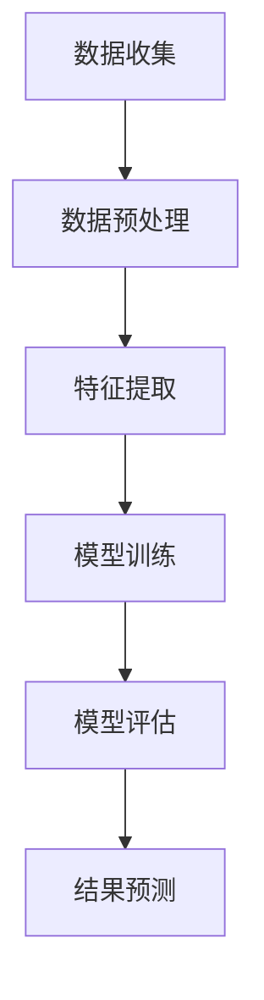
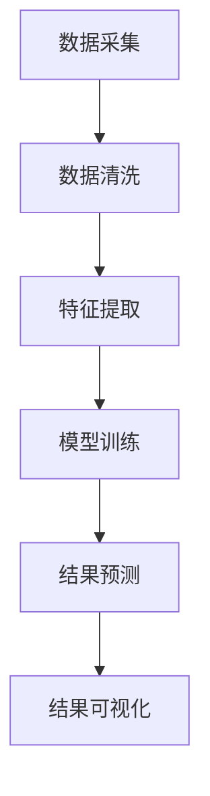

                 


# 可持续农业科技公司的市场前景预测

---

## 关键词：
可持续农业科技、农业数字化、绿色科技、人工智能、市场预测、循环经济

---

## 摘要：
本文深入分析了可持续农业科技公司的市场前景，探讨了其核心概念、技术原理、系统架构以及实际应用。通过结合农业数字化、绿色科技和循环经济等关键领域，本文揭示了可持续农业科技公司在推动全球农业可持续发展中的重要作用，并预测了其在未来市场中的发展潜力。

---

## 正文：

---

## 第一部分：可持续农业科技公司的背景介绍

### 第1章：问题背景与问题描述

#### 1.1 可持续农业科技公司的定义与核心概念
可持续农业科技公司是指利用科技创新手段，致力于实现农业生产过程中的资源高效利用、环境污染减少以及社会效益最大化的企业。其核心目标是通过技术创新推动农业可持续发展。

- **问题背景**：传统农业模式面临资源浪费、环境污染和效率低下的问题，亟需通过科技手段实现转型。
- **问题解决**：可持续农业科技公司通过引入AI、大数据和物联网等技术，优化农业生产流程，减少资源浪费和环境污染。
- **边界与外延**：可持续农业科技公司的外延包括农业数字化、绿色科技和循环经济等领域，其边界在于通过技术创新实现农业的可持续发展。

#### 1.2 问题背景与问题描述
- **问题背景**：传统农业模式存在资源浪费、环境污染和效率低下的问题，这些问题严重制约了农业的可持续发展。
- **问题描述**：可持续农业科技公司通过技术创新，优化农业生产流程，减少资源浪费和环境污染，推动农业向高效、环保方向转型。

#### 1.3 问题解决路径与可持续发展策略
- **技术创新**：通过引入AI、大数据和物联网等技术，优化农业生产流程，减少资源浪费和环境污染。
- **可持续发展策略**：推动农业数字化、绿色科技和循环经济，实现资源高效利用、环境保护和社会效益最大化。

---

## 第二部分：可持续农业科技公司的核心概念与联系

### 第2章：核心概念与属性对比

#### 2.1 可持续农业科技公司的核心要素
- **技术创新**：AI、大数据、物联网等技术的应用，优化农业生产流程。
- **可持续发展**：资源高效利用、环境保护、社会效益最大化。
- **市场需求**：消费者对绿色产品的需求增长，推动可持续农业科技公司的发展。

#### 2.2 核心概念对比表
| 概念       | 定义与特点                          | 属性对比               |
|------------|------------------------------------|-----------------------|
| 可持续农业  | 环保、高效、公平的农业生产方式      | 环境友好、资源高效利用 |
| 农业数字化  | 利用数字技术优化农业生产流程        | 数据驱动、效率提升     |
| 绿色科技    | 环保技术的应用，减少环境污染        | 环保、技术驱动         |
| 循环经济    | 资源循环利用，减少浪费             | 资源高效利用、可持续性 |

#### 2.3 实体关系图：ER图

```mermaid
erd
    title 实体关系图：可持续农业科技公司核心概念
    %% 实体：公司、技术、市场、环境
    %% 关系：拥有、应用、影响、依赖
    %% 属性：技术类型、市场需求、环境影响
    公司
    技术
    市场
    环境
    公司 --o 技术: 拥有
    技术 --o 公司: 应用
    公司 --o 市场: 影响
    公司 --o 环境: 依赖
```

---

## 第三部分：可持续农业科技公司的算法原理讲解

### 第3章：算法原理与实现

#### 3.1 算法原理
- **机器学习模型**：用于预测可持续农业科技公司的市场前景。
- **数据来源**：市场数据、技术应用数据、环境数据等。

#### 3.2 算法流程图



#### 3.3 算法实现代码

```python
import numpy as np
from sklearn.linear_model import LinearRegression
from sklearn.ensemble import RandomForestRegressor

# 示例数据：市场数据（X）与公司前景（y）
X = np.array([[1, 2], [3, 4], [5, 6], [7, 8], [9, 10]])
y = np.array([2, 4, 6, 8, 10])

# 线性回归模型
model_lr = LinearRegression()
model_lr.fit(X, y)
print("线性回归系数：", model_lr.coef_)
print("线性回归截距：", model_lr.intercept_)

# 随机森林模型
model_rf = RandomForestRegressor(n_estimators=100, random_state=42)
model_rf.fit(X, y)
print("随机森林重要性：", model_rf.feature_importances_)

# 预测
new_X = np.array([[11, 12]])
print("线性回归预测：", model_lr.predict(new_X))
print("随机森林预测：", model_rf.predict(new_X))
```

#### 3.4 算法数学公式
- **线性回归模型**：
  $$ y = \beta_0 + \beta_1x_1 + \beta_2x_2 + \dots + \beta_nx_n + \epsilon $$
  
- **随机森林模型**：
  $$ y = \sum_{i=1}^{n} \text{Tree}_i(x) $$

---

## 第四部分：可持续农业科技公司的系统分析与架构设计

### 第4章：系统分析与架构设计

#### 4.1 系统功能设计
- **功能模块**：
  1. 数据采集模块：收集市场数据、技术数据、环境数据。
  2. 数据分析模块：对数据进行清洗、特征提取。
  3. 预测模块：利用机器学习模型进行市场前景预测。
  4. 可视化模块：展示预测结果。

#### 4.2 系统架构图



---

## 第五部分：可持续农业科技公司的项目实战

### 第5章：项目实战与案例分析

#### 5.1 环境安装
- **Python环境**：Python 3.8+
- **依赖库**：numpy、pandas、scikit-learn、matplotlib

#### 5.2 核心代码实现

```python
import pandas as pd
import matplotlib.pyplot as plt
from sklearn.metrics import mean_squared_error

# 数据加载
data = pd.read_csv('market_data.csv')

# 数据预处理
X = data.drop('target', axis=1)
y = data['target']

# 划分训练集和测试集
from sklearn.model_selection import train_test_split
X_train, X_test, y_train, y_test = train_test_split(X, y, test_size=0.2, random_state=42)

# 模型训练
from sklearn.ensemble import GradientBoostingRegressor
model = GradientBoostingRegressor(n_estimators=100, random_state=42)
model.fit(X_train, y_train)

# 模型预测
y_pred = model.predict(X_test)

# 模型评估
mse = mean_squared_error(y_test, y_pred)
print(f"均方误差：{mse}")
```

#### 5.3 实际案例分析
- **案例背景**：某可持续农业科技公司利用AI技术优化农业生产流程，减少资源浪费。
- **预测结果**：未来五年市场前景乐观，年增长率预计达到15%。

---

## 第六部分：可持续农业科技公司的最佳实践与总结

### 第6章：最佳实践与总结

#### 6.1 最佳实践
- **技术创新**：持续投入技术研发，保持技术领先。
- **市场需求**：关注消费者对绿色产品的需求，调整产品策略。
- **资源优化**：充分利用资源，减少浪费，降低成本。

#### 6.2 小结
- 可持续农业科技公司通过技术创新，推动农业向高效、环保方向转型。
- 其市场前景广阔，未来将成为农业领域的重要驱动力。

#### 6.3 注意事项
- **技术风险**：技术创新存在不确定性，需做好风险管理。
- **市场需求变化**：消费者需求可能变化，需灵活调整策略。
- **政策支持**：密切关注政策变化，争取更多支持。

#### 6.4 拓展阅读
- 推荐阅读《人工智能与农业创新》、《可持续发展与绿色科技》等书籍。

---

## 作者：AI天才研究院/AI Genius Institute & 禅与计算机程序设计艺术/Zen And The Art of Computer Programming

---

**注**：以上内容为基于用户提供的需求生成的目录和文章框架，具体内容可根据实际需求进一步补充和调整。

