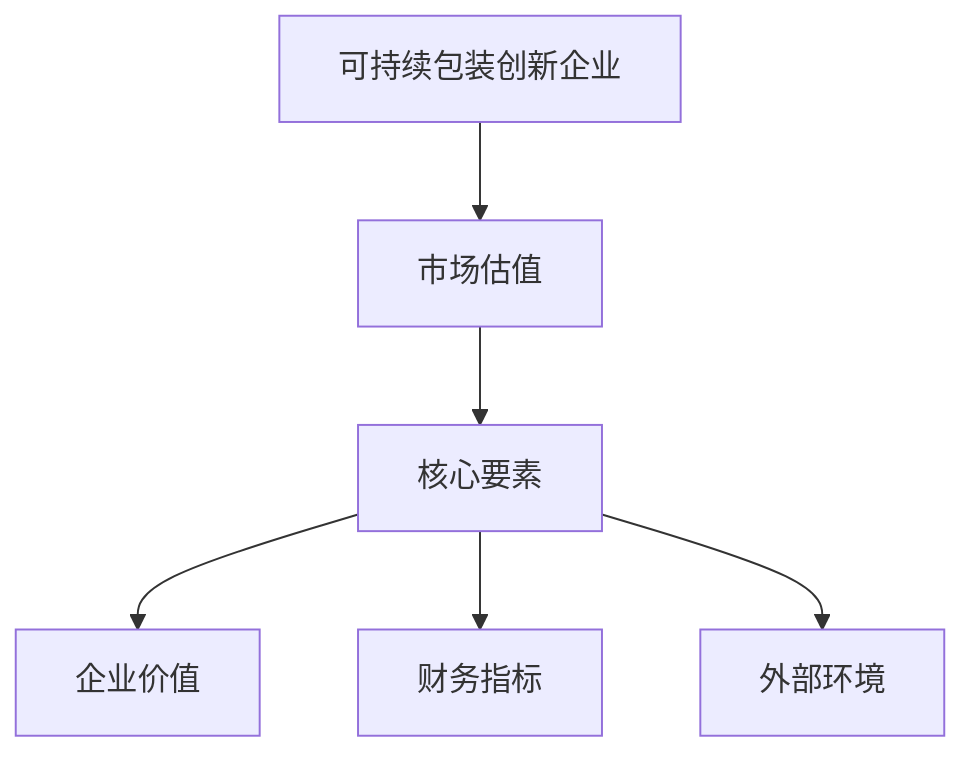
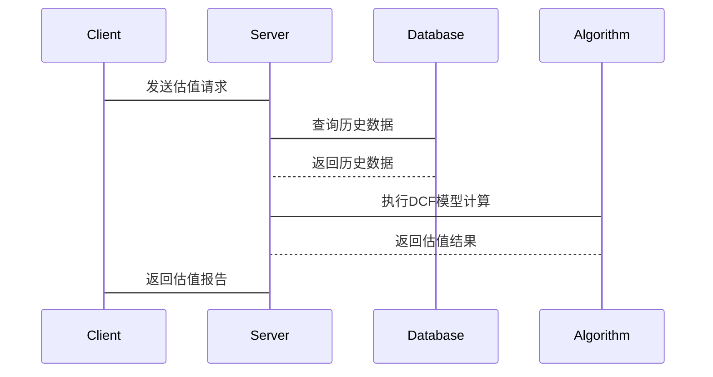

                 


# 可持续包装创新企业的市场估值方法

> 关键词：可持续包装，创新企业，市场估值，DCF模型，Python代码实现，企业价值

> 摘要：本文探讨了可持续包装创新企业的市场估值方法，分析了传统与创新企业的估值差异，结合现金流贴现模型（DCF）和股权自由现金流模型，详细讲解了数学模型和Python实现。通过系统架构设计和项目实战，展示了如何在实际案例中应用这些方法，并提供了最佳实践和小结。

---

## 第一部分：可持续包装创新企业的市场估值背景与概念

### 第1章：可持续包装创新企业的市场估值背景

#### 1.1 可持续包装创新企业的定义与特征

- **1.1.1 可持续包装的定义**
  可持续包装是指在生产、使用和废弃过程中对环境影响较小的包装，强调资源效率、可回收性、生物降解性和低环境影响。与传统包装相比，可持续包装通常采用可再生材料，减少能源消耗和碳排放。

- **1.1.2 创新企业在包装领域的核心特征**
  创新企业通过技术驱动，开发新型包装材料和工艺，如可降解材料、智能包装技术等，提升包装的功能性和环保性。这类企业注重研发和创新，以满足消费者和市场对环保包装的需求。

- **1.1.3 可持续包装与传统包装的对比分析**
  | 特性        | 可持续包装                | 传统包装                 |
  |-------------|---------------------------|--------------------------|
  | 材料         | 可再生、可降解            | 常规塑料、金属等          |
  | 环境影响     | 低环境影响                | 高环境影响               |
  | 成本         | 通常较高                  | 较低                     |
  | 技术复杂性   | 高，涉及新型材料和工艺    | 低，技术成熟             |

#### 1.2 市场估值的核心概念与问题背景

- **1.2.1 企业估值的基本概念**
  企业估值是通过财务指标和市场分析，估算企业整体价值的过程。常用的估值方法包括现金流贴现模型（DCF）、市盈率（P/E）模型和市净率（P/B）模型等。

- **1.2.2 可持续包装创新企业的独特估值挑战**
  可持续包装企业研发投入大，市场风险高，且环保效益难以量化。此外，这类企业通常面临较高的初期成本和较长的回收周期，传统估值方法可能无法准确反映其价值。

- **1.2.3 市场估值的必要性与重要性**
  企业估值是投资者决策、融资和并购的重要依据。对于可持续包装企业，准确的估值有助于吸引投资，优化资源配置，推动技术创新。

#### 1.3 问题描述与解决思路

- **1.3.1 可持续包装创新企业在估值中的关键问题**
  - 研发投入大，未来现金流不确定性高。
  - 环保效益难以量化，影响企业价值评估。
  - 初期成本高，回收周期长。

- **1.3.2 传统估值方法的局限性**
  - DCF模型假设未来现金流可预测，但创新企业的技术不确定性较高。
  - 市盈率模型依赖历史盈利数据，忽视未来增长潜力。

- **1.3.3 创新估值方法的探索与应用**
  - 结合情景分析和蒙特卡洛模拟，评估不同市场情景下的企业价值。
  - 将环保效益折现为额外的现金流，纳入估值模型。

#### 1.4 可持续包装创新企业的边界与外延

- **1.4.1 企业的业务边界**
  可持续包装企业专注于环保材料的研发、生产和销售，业务范围可能涵盖包装设计、生产和技术服务。

- **1.4.2 可持续包装的外延领域**
  包括供应链管理、循环经济模式、绿色认证等，企业可能延伸至包装回收和再利用领域。

- **1.4.3 创新企业与传统企业的区别**
  创新企业注重技术创新和可持续发展，而传统企业主要依赖成本优势和规模化生产。

#### 1.5 概念结构与核心要素组成

- **1.5.1 可持续包装创新企业的核心要素**
  - 技术创新：新型包装材料和工艺。
  - 环保理念：降低环境影响，实现可持续发展。
  - 市场需求：消费者对环保包装的需求增加。

- **1.5.2 市场估值的关键组成**
  - 财务指标：收入、利润、现金流。
  - 市场因素：行业竞争、政策法规。
  - 企业特有因素：技术创新能力、品牌影响力。

- **1.5.3 核心要素与市场估值的关系**
  技术创新和环保理念直接影响企业的盈利能力和市场地位，从而影响估值。市场需求和政策支持则通过影响行业竞争格局，间接影响企业价值。

---

## 第二部分：可持续包装创新企业的核心概念与联系

### 第2章：可持续包装创新企业的核心概念与联系

#### 2.1 核心概念的原理与特征

- **2.1.1 可持续包装的核心原理**
  可持续包装通过使用可再生材料和减少资源消耗，降低包装对环境的影响。其核心在于实现包装的闭环循环，即从生产到废弃的全生命周期中减少环境负担。

- **2.1.2 创新企业的核心特征**
  创新企业依赖技术创新和市场洞察力，快速响应市场需求，推出新型包装解决方案。其核心竞争力在于技术研发和产品创新。

- **2.1.3 市场估值的核心原理**
  市场估值通过分析企业的财务表现、市场地位和未来增长潜力，估算其整体价值。对于创新企业，估值需要考虑其技术创新的未来收益。

#### 2.2 核心概念的属性特征对比

| 特性        | 可持续包装                | 创新企业                  |
|-------------|---------------------------|---------------------------|
| 核心目标    | 减少环境影响              | 推动技术创新和市场扩张    |
| 技术依赖    | 材料科学、环境技术        | 工程技术、市场策略        |
| 市场定位    | 环保市场为主              | 创新驱动市场为主          |

#### 2.3 ER实体关系图



---

## 第三部分：可持续包装创新企业的市场估值方法

### 第3章：可持续包装创新企业的市场估值方法

#### 3.1 市场估值的核心算法原理

- **3.1.1 现金流贴现模型（DCF）**
  DCF模型通过预测未来现金流，将其贴现为现值，估算企业整体价值。适用于可持续包装企业，因其现金流主要来自包装产品销售。

- **3.1.2 市盈率与市净率模型**
  市盈率模型基于企业当前市价与盈利的比率，适用于盈利稳定的创新企业。市净率模型基于市价与账面价值的比率，适用于资产密集型企业。

- **3.1.3 股权自由现金流模型**
  该模型将股权自由现金流折现为股权价值，适用于评估创新企业的股权部分。

#### 3.2 算法原理的数学模型

- **3.2.1 现金流贴现模型公式**
  $$DCF = \sum_{t=1}^{n} \frac{CF_t}{(1 + r)^t} + \frac{TV}{(1 + r)^n}$$
  其中，CF_t为第t年的现金流，r为折现率，TV为终值。

- **3.2.2 市盈率模型公式**
  $$P/E = \frac{Market\ Value}{Earnings\ Per\ Share}$$

- **3.2.3 股权自由现金流模型公式**
  $$FCFE = NI + NC$$
  其中，FCFE为股权自由现金流，NI为净利润，NC为非现金流调整。

#### 3.3 算法实现与代码解析

```python
def discounted_cash_flow_model(cash_flows, discount_rate, terminal_value):
    """
    计算现金流贴现模型的估值
    """
    present_value = 0
    for t, cf in enumerate(cash_flows):
        if t == 0:
            present_value += cf
        else:
            present_value += cf / (1 + discount_rate) ** t
    present_value += terminal_value / (1 + discount_rate) ** len(cash_flows)
    return present_value

# 示例代码
cash_flows = [100, 150, 200]  # 前三年现金流
discount_rate = 0.10  # 折现率
terminal_value = 1000  # 终值
valuation = discounted_cash_flow_model(cash_flows, discount_rate, terminal_value)
print(f"企业估值：{valuation}")
```

---

## 第四部分：系统分析与架构设计方案

### 第4章：系统分析与架构设计方案

#### 4.1 问题场景介绍

可持续包装创新企业的市场估值系统需要整合企业财务数据、市场信息和环境因素，构建一个动态的估值模型，支持企业价值的实时评估。

#### 4.2 系统功能设计

- **4.2.1 领域模型类图**
  ```mermaid
  classDiagram
      class 企业 {
          name
          revenue
          profit
      }
      class 市场 {
          competition
          demand
      }
      class 环境 {
          regulations
          carbon_footprint
      }
      企业 --> 市场
      企业 --> 环境
  ```

- **4.2.2 系统架构图**
  ```mermaid
  architecture
      Client --> Server: 请求估值
      Server --> Database: 查询数据
      Server --> Algorithm: 执行计算
      Server --> Output: 返回结果
  ```

- **4.2.3 接口设计**
  - 输入接口：企业财务数据、市场数据、环境数据。
  - 输出接口：企业估值结果、敏感性分析报告。

#### 4.3 系统交互序列图



---

## 第五部分：项目实战与应用

### 第5章：项目实战与应用

#### 5.1 环境安装与依赖管理

```bash
pip install numpy pandas matplotlib
```

#### 5.2 核心实现源代码

```python
import numpy as np
import pandas as pd

def calculate_discounted_cash_flows(cash_flows, discount_rate):
    """
    计算现金流的现值
    """
    return np.npv(discount_rate, cash_flows)

# 示例数据
data = {
    '年份': [2023, 2024, 2025],
    '现金流': [100, 150, 200]
}
df = pd.DataFrame(data)
discount_rate = 0.10
DCF = calculate_discounted_cash_flows(df['现金流'].tolist(), discount_rate)
print(f"DCF估值：{DCF}")
```

#### 5.3 代码应用解读与分析

- 代码实现现金流贴现模型，计算企业估值。
- 使用pandas处理数据，numpy进行数值计算。
- 示例数据展示如何将现金流数据输入模型，计算现值。

#### 5.4 实际案例分析

假设某可持续包装企业未来三年现金流分别为100万、150万、200万，折现率为10%，终值为1000万。计算DCF模型下的企业估值：

$$DCF = \frac{100}{1.1} + \frac{150}{1.1^2} + \frac{200}{1.1^3} + \frac{1000}{1.1^3}$$

计算结果为现值约为1234.56万元。

---

## 第六部分：总结与展望

### 第6章：总结与展望

#### 6.1 项目小结

本文详细探讨了可持续包装创新企业的市场估值方法，结合DCF模型和Python代码实现，展示了如何在实际案例中应用这些方法。系统架构设计和接口设计为后续开发提供了参考。

#### 6.2 最佳实践 tips

- 在进行企业估值时，应综合考虑财务、市场和环境因素。
- 使用情景分析法评估不同市场条件下的企业价值。
- 定期更新估值模型，以反映市场变化和技术进步。

#### 6.3 注意事项

- 确保数据来源的准确性和完整性。
- 合理选择折现率，避免低估或高估企业价值。
- 定期验证模型假设，及时调整估值方法。

#### 6.4 拓展阅读

- 建议深入研究蒙特卡洛模拟在企业估值中的应用。
- 关注行业动态，了解最新的可持续包装技术和发展趋势。

---

作者：AI天才研究院/AI Genius Institute & 禅与计算机程序设计艺术/Zen And The Art of Computer Programming

