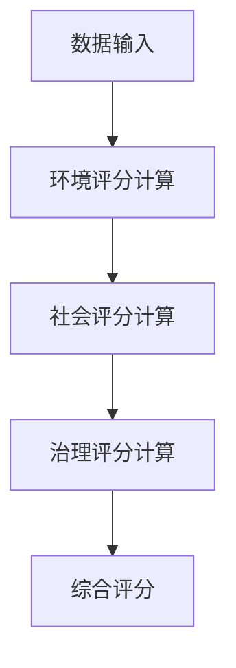

                 


# 可持续发展投资（ESG）：长期价值创造的新范式

> 关键词：ESG，可持续发展，投资策略，长期价值，风险管理

> 摘要：本文探讨了可持续发展投资（ESG）如何成为长期价值创造的新范式。通过分析ESG的核心概念、评估方法和投资策略，结合实际案例和系统架构设计，展示了ESG在投资中的应用及其对社会和环境的积极影响。文章还提供了算法原理和数学模型，帮助投资者更好地理解和实施ESG投资。

---

## 第1章：ESG的背景与发展

### 1.1 ESG的起源与发展

ESG（环境、社会、治理）投资是一种新兴的可持续投资策略，起源于20世纪90年代。随着全球对环境问题和社会责任的关注增加，ESG投资逐渐成为主流。以下是ESG的起源与发展历程：

- **20世纪90年代**：ESG概念的初步提出，主要关注环境因素。
- **21世纪初**：社会和治理因素逐渐被纳入考虑，形成完整的ESG框架。
- **近年来**：随着气候变化和企业治理问题的加剧，ESG投资迅速发展，成为全球投资的重要组成部分。

### 1.2 ESG的核心要素

ESG由三个核心要素组成：环境（E）、社会（S）和治理（G）。

#### 1.2.1 环境（E）
- 包括碳排放、能源使用效率、环境合规等指标。
- 通过减少碳足迹和提高能源效率，企业可以降低环境风险。

#### 1.2.2 社会（S）
- 包括劳工权益、社区参与、产品责任等。
- 企业应关注员工福利、社会责任和产品安全，提升社会影响力。

#### 1.2.3 治理（G）
- 包括董事会结构、高管激励、透明度等。
- 良好的公司治理可以提高企业效率和抗风险能力。

### 1.3 ESG与传统投资的对比

| 项目 | ESG投资 | 传统投资 |
|------|---------|----------|
| 目标 | 长期可持续收益 | 短期最大化收益 |
| 风险 | 低环境和社会风险 | 高环境和社会风险 |
| 收益 | 包括社会和环境效益 | 仅考虑经济效益 |

---

## 第2章：ESG的理论框架与评估方法

### 2.1 环境（E）评估的核心指标

#### 2.1.1 碳排放
- **指标**：单位产品碳排放量。
- **影响**：高碳排放可能导致政策风险和声誉损失。

#### 2.1.2 能源使用效率
- **指标**：单位能源消耗产出。
- **影响**：提高效率可降低成本和环境影响。

### 2.2 社会（S）评估的核心指标

#### 2.2.1 劳工权益
- **指标**：员工满意度、劳动纠纷率。
- **影响**：良好的劳工关系有助于提高员工效率和企业声誉。

### 2.3 治理（G）评估的核心指标

#### 2.3.1 董事会结构
- **指标**：独立董事比例、董事会多样性。
- **影响**：多样化的董事会有助于更有效的决策。

---

## 第3章：ESG投资策略与风险管理

### 3.1 ESG投资策略的分类

#### 3.1.1 排除法
- **策略**：排除不符合ESG标准的企业。
- **适用场景**：对ESG要求严格的投资者。

#### 3.1.2 选择法
- **策略**：选择符合ESG标准的企业进行投资。
- **适用场景**：希望降低风险的投资机构。

#### 3.1.3 介入法
- **策略**：通过股东权利推动企业改善ESG表现。
- **适用场景**：长期投资者和机构投资者。

### 3.2 ESG风险管理框架

#### 3.2.1 风险识别
- **步骤**：识别潜在的环境、社会和治理风险。

#### 3.2.2 风险评估
- **方法**：使用定量和定性方法评估风险影响。

#### 3.2.3 风险应对策略
- **措施**：分散投资、监控和定期评估。

---

## 第4章：系统架构与算法原理

### 4.1 系统架构设计

#### 4.1.1 功能模块
- **数据采集**：收集企业ESG数据。
- **评分计算**：计算ESG评分。
- **投资决策**：基于评分制定投资策略。

#### 4.1.2 接口设计
- **API接口**：用于数据交互。

#### 4.1.3 交互流程
- **用户输入**：选择投资目标。
- **系统处理**：计算ESG评分并生成报告。

### 4.2 算法原理

#### 4.2.1 ESG评分算法



#### 4.2.2 投资策略算法

```python
def calculate_esg_score(company_data):
    e_score = sum(company_data['environment']) / len(company_data['environment'])
    s_score = sum(company_data['social']) / len(company_data['social'])
    g_score = sum(company_data['governance']) / len(company_data['governance'])
    total_score = (e_score + s_score + g_score) / 3
    return total_score

# 示例使用
company_data = {
    'environment': [85, 90, 75],
    'social': [80, 85, 70],
    'governance': [75, 90, 80]
}
score = calculate_esg_score(company_data)
print(f"ESG综合得分为：{score}")
```

---

## 第5章：项目实战与案例分析

### 5.1 环境安装

#### 5.1.1 安装工具
- **Python环境**：安装Python 3.8及以上版本。
- **依赖库**：安装`pandas`, `numpy`, `scikit-learn`。

### 5.2 核心代码实现

```python
import pandas as pd
import numpy as np

def calculate_esg_score(data):
    e_score = np.mean(data['environment'])
    s_score = np.mean(data['social'])
    g_score = np.mean(data['governance'])
    total_score = (e_score + s_score + g_score) / 3
    return total_score

# 示例数据
data = pd.DataFrame({
    'environment': [85, 90, 75],
    'social': [80, 85, 70],
    'governance': [75, 90, 80]
})

score = calculate_esg_score(data)
print(f"综合得分为：{score}")
```

### 5.3 案例分析

#### 5.3.1 案例背景
- **公司**：某绿色能源企业。
- **数据**：环境得分90，社会得分85，治理得分80。

#### 5.3.2 评分计算
- 综合得分 = (90 + 85 + 80) / 3 = 85

#### 5.3.3 投资决策
- 该企业ESG得分高，适合长期投资。

---

## 第6章：最佳实践与小结

### 6.1 最佳实践

- **持续关注**：定期更新ESG数据和评估标准。
- **技术驱动**：利用大数据和AI技术提升评估效率。
- **风险控制**：制定严格的ESG风险监控机制。

### 6.2 小结

ESG投资不仅关注企业的经济效益，还考虑其对环境和社会的影响。通过科学的评估方法和投资策略，投资者可以实现长期价值创造和可持续发展。

---

## 作者

作者：AI天才研究院/AI Genius Institute & 禅与计算机程序设计艺术 /Zen And The Art of Computer Programming

---

这篇文章详细探讨了ESG投资的核心概念、评估方法、系统架构和实际应用，结合代码和案例分析，帮助读者全面理解ESG投资的价值和实践方法。

