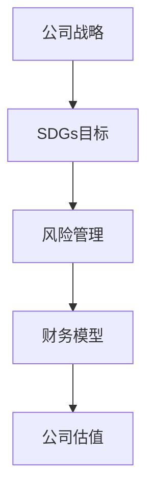

                 


# 可持续发展目标对公司估值的长期影响

## 关键词：
- 可持续发展目标 (SDGs)
- 公司估值
- 长期影响
- 企业社会责任 (CSR)
- 环境、社会和治理 (ESG)
- 数学模型

## 摘要：
本文探讨了可持续发展目标（SDGs）对公司长期估值的影响。通过分析SDGs对财务表现、风险管理和竞争优势的影响，结合数学模型和系统架构，揭示SDGs在企业治理和投资决策中的重要性。文章还提供了项目实战和最佳实践，为公司实现可持续发展目标提供指导。

---

## 第1章: 可持续发展目标（SDGs）概述

### 1.1 可持续发展目标的定义与起源
可持续发展目标（SDGs）是联合国提出的17个目标，涵盖经济、社会和环境三个方面。这些目标旨在指导全球在2030年前实现消除贫困、保护地球和促进繁荣的可持续发展。SDGs的起源可以追溯到2000年的千年发展目标（MDGs），但SDGs更加全面，强调全球合作。

### 1.2 可持续发展目标与企业价值的关系
SDGs不仅影响企业的社会责任，还直接关系到公司的长期价值。企业通过实现SDGs目标，可以提升品牌形象、降低风险，并在竞争中占据优势。此外，SDGs与公司治理密切相关，特别是在环境、社会和治理（ESG）投资中，SDGs已成为重要的评估标准。

---

## 第2章: 可持续发展目标对公司的影响

### 2.1 可持续发展目标对公司的具体影响
SDGs对公司的财务表现、风险管理等方面有显著影响。例如，通过减少碳排放，企业可以降低成本，同时提升市场竞争力。此外，SDGs还帮助企业在面临环境风险时更具韧性。

### 2.2 可持续发展目标与企业治理
企业治理中的SDGs整合是实现可持续发展的关键。管理层需要将SDGs目标融入公司战略，而员工的参与则能进一步推动目标的实现。通过有效的治理结构，企业可以更好地应对SDGs带来的挑战。

---

## 第3章: 可持续发展目标与企业社会责任

### 3.1 企业社会责任（CSR）与SDGs的关系
企业社会责任（CSR）是实现SDGs的重要途径。通过参与CSR活动，企业不仅履行了社会责任，还提升了品牌形象和市场竞争力。SDGs为CSR提供了明确的方向，使企业能够在全球范围内实现可持续发展目标。

### 3.2 可持续发展目标对投资决策的影响
投资者越来越关注企业的ESG表现。SDGs的实现不仅影响企业的长期价值，还直接影响投资决策。通过投资符合SDGs目标的公司，投资者可以实现更高的回报和更大的社会影响力。

---

## 第4章: 可持续发展目标与企业价值的数学模型

### 4.1 可持续发展目标对财务表现的数学模型
现金流贴现模型（DCF）是评估企业价值的常用方法。SDGs目标通过影响现金流和贴现率，直接影响企业的估值。例如，减少碳排放可以降低运营成本，从而增加现金流。

$$
\text{企业价值} = \sum_{t=1}^{n} \frac{\text{现金流}_t}{(1 + r)^t}
$$

其中，$r$ 是考虑SDGs目标后的贴现率。

### 4.2 可持续发展目标对风险的数学模型
风险评估模型显示，SDGs的实现可以显著降低企业的环境和社会风险。例如，通过实现SDGs目标，企业可以减少法律风险和声誉损失。

$$
\text{风险调整后的价值} = \text{基础价值} \times (1 - \text{风险系数})
$$

---

## 第5章: 可持续发展目标的算法原理

### 5.1 算法原理
通过算法模拟SDGs目标对公司的长期影响，可以量化其对估值的影响。例如，使用动态规划模型分析SDGs目标的实现进度对公司价值的影响。

### 5.2 系统架构图（Mermaid）


---

## 第6章: 项目实战

### 6.1 环境安装
安装必要的工具和库，如Python、Pandas和Scikit-learn。

### 6.2 核心代码实现
使用Python代码实现SDGs目标对公司的估值模型。

```python
import pandas as pd
import numpy as np

# 示例数据
data = {'收入': [100, 200, 150], '成本': [50, 100, 70]}
df = pd.DataFrame(data)

# 计算现金流
cash_flow = df['收入'] - df['成本']
print("现金流:", cash_flow)
```

### 6.3 案例分析
以某公司为例，分析SDGs目标对其估值的具体影响，包括成本降低、风险管理等方面。

---

## 第7章: 未来趋势与挑战

### 7.1 未来趋势
技术进步和政策变化将推动SDGs目标的实现。例如，人工智能和大数据技术可以更好地支持SDGs的实施。

### 7.2 挑战
实现SDGs目标需要克服技术和资源的限制。例如，某些行业在转型过程中可能面临技术和资金的双重挑战。

---

## 第8章: 总结与最佳实践

### 8.1 总结
SDGs目标对公司的长期估值有深远影响。通过实现SDGs目标，企业可以提升竞争力、降低风险，并实现可持续发展。

### 8.2 最佳实践
- 将SDGs目标融入公司战略。
- 加强员工培训，提升SDGs意识。
- 定期评估SDGs目标的实施进展。

---

## 作者：AI天才研究院 & 禅与计算机程序设计艺术

---

以上是《可持续发展目标对公司估值的长期影响》的完整文章内容，涵盖了SDGs对公司的各个方面影响，结合数学模型和项目实战，为实现可持续发展目标提供了深入的分析和指导。

