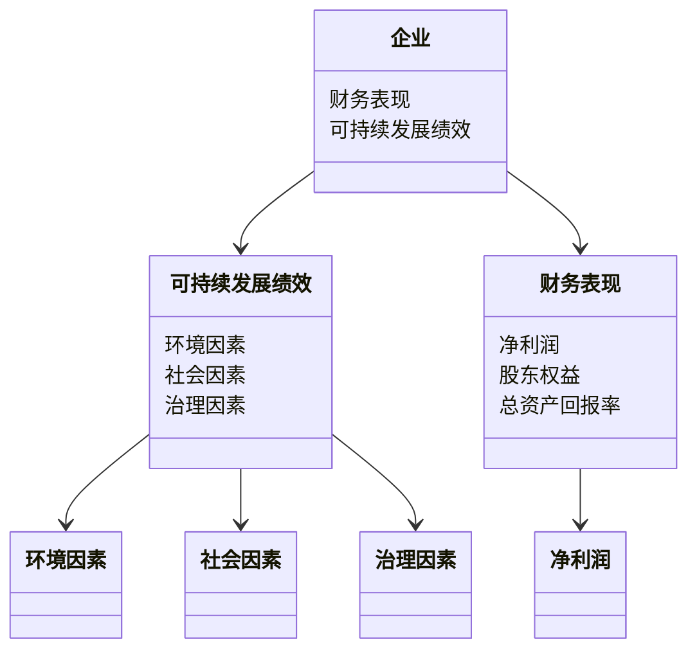
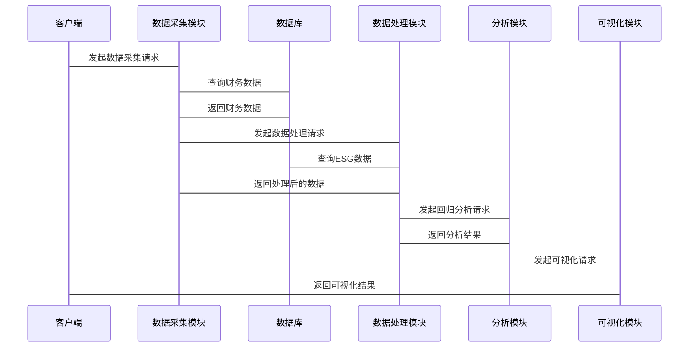

                 


# 可持续发展绩效与公司财务表现的相关性

> 关键词：可持续发展，财务表现，ESG评分，回归分析，企业治理，环境影响，社会责任

## 摘要

本文探讨了可持续发展绩效与公司财务表现之间的关系。通过理论分析、实证研究和案例分析，文章揭示了可持续发展绩效如何影响企业的财务表现，并提出了相应的建议。文章还提供了系统的分析框架和实际项目指导，帮助读者理解如何将可持续发展理念融入企业财务管理中。

---

## 目录大纲

### 第一章 引言

1.1 背景介绍  
1.2 问题描述  
1.3 研究目的与意义  
1.4 研究方法与框架  

### 第二章 可持续发展绩效与公司财务表现的理论基础

2.1 可持续发展绩效的定义与特征  
2.2 公司财务表现的核心指标  
2.3 可持续发展绩效与财务表现的关系  

### 第三章 可持续发展绩效对财务表现的影响机制

3.1 环境因素对财务表现的影响  
3.2 社会因素对财务表现的影响  
3.3 治理因素对财务表现的影响  

### 第四章 可持续发展绩效与财务表现的实证分析

4.1 研究方法与数据来源  
4.2 实证结果与分析  
4.3 结果讨论与意义  

### 第五章 案例分析：可持续发展绩效与财务表现的典型实例

5.1 案例一：环保型企业的财务表现分析  
5.2 案例二：社会责任型企业财务表现分析  
5.3 案例三：治理结构优化企业的财务表现分析  

### 第六章 系统分析与架构设计方案

6.1 问题场景介绍  
6.2 系统功能设计（领域模型Mermaid类图）  
6.3 系统架构设计（Mermaid架构图）  
6.4 系统接口设计与交互（Mermaid序列图）  

### 第七章 项目实战：基于Python的实证分析

7.1 环境安装与数据收集  
7.2 数据处理与可视化  
7.3 回归模型建立与分析  
7.4 代码实现与结果解读  

### 第八章 结论与建议

8.1 主要发现总结  
8.2 对企业的实践建议  
8.3 对政策制定者的建议  
8.4 未来研究方向  

---

## 正文

### 第一章 引言

#### 1.1 背景介绍

随着全球对可持续发展的关注日益增加，企业不仅需要关注财务表现，还需考虑其对环境、社会和治理（ESG）的影响。企业的可持续发展绩效已成为投资者、利益相关者和监管机构的重要考量因素。

#### 1.2 问题描述

企业的财务表现与可持续发展绩效之间存在复杂的相互作用。然而，许多企业在追求短期财务目标时，忽视了长期的可持续性，导致资源枯竭、社会责任缺失等问题。如何在实现财务目标的同时，提升可持续发展绩效，是当前企业管理中的重要挑战。

#### 1.3 研究目的与意义

本文旨在探讨可持续发展绩效与公司财务表现之间的关系，分析其相互作用机制，并提出优化建议。研究结果可为企业制定可持续发展战略提供理论依据和实践指导。

#### 1.4 研究方法与框架

本文采用定性与定量结合的方法，通过文献综述、实证分析和案例研究，系统分析可持续发展绩效与财务表现的相关性。

---

### 第二章 可持续发展绩效与公司财务表现的理论基础

#### 2.1 可持续发展绩效的定义与特征

可持续发展绩效（SDP）包括企业在环境保护、社会责任和公司治理方面的表现。其特征包括长期性、综合性、动态性和外部性。

#### 2.2 公司财务表现的核心指标

财务表现的核心指标包括净利润、股东权益、总资产回报率（ROA）和市盈率（P/E）等。这些指标反映了企业的盈利能力、资产效率和市场价值。

#### 2.3 可持续发展绩效与财务表现的关系

SDP与财务表现之间存在正相关关系。企业通过提升SDP，可以降低风险、增强品牌价值，从而提升财务表现。

---

### 第三章 可持续发展绩效对财务表现的影响机制

#### 3.1 环境因素对财务表现的影响

环境因素包括能源消耗、污染排放等。企业通过减少环境影响，降低运营成本，提升品牌形象，从而改善财务表现。

#### 3.2 社会因素对财务表现的影响

社会因素包括员工福利、社区关系等。良好的社会表现可以提升员工满意度和企业声誉，从而增强客户忠诚度和市场拓展能力。

#### 3.3 治理因素对财务表现的影响

治理因素包括公司治理结构、透明度等。高效的治理结构可以提升管理效率，降低风险，从而改善财务表现。

---

### 第四章 可持续发展绩效与财务表现的实证分析

#### 4.1 研究方法与数据来源

采用回归分析方法，数据来源包括上市公司的财务数据和ESG评分。

#### 4.2 实证结果与分析

回归分析结果显示，ESG评分与财务表现显著正相关。企业提升SDP可以显著改善财务表现。

#### 4.3 结果讨论与意义

结果表明，可持续发展绩效是影响企业财务表现的重要因素。企业应将SDP作为战略重点，以实现长期财务成功。

---

### 第五章 案例分析：可持续发展绩效与财务表现的典型实例

#### 5.1 案例一：环保型企业的财务表现分析

某环保科技公司通过技术创新降低能耗，显著提升了净利润和ROE。

#### 5.2 案例二：社会责任型企业财务表现分析

某社会责任型企业通过员工福利和社会责任项目，提升了品牌形象和客户忠诚度，财务表现稳健。

#### 5.3 案例三：治理结构优化企业的财务表现分析

某公司通过优化治理结构，提升了管理效率和决策透明度，显著改善了财务表现。

---

### 第六章 系统分析与架构设计方案

#### 6.1 问题场景介绍

企业需要在财务管理中考虑SDP，构建一个综合管理系统。

#### 6.2 系统功能设计（领域模型Mermaid类图）



#### 6.3 系统架构设计（Mermaid架构图）


#### 6.4 系统接口设计与交互（Mermaid序列图）



---

### 第七章 项目实战：基于Python的实证分析

#### 7.1 环境安装与数据收集

安装Python和相关库（如Pandas、Scikit-learn），收集上市公司的财务数据和ESG评分。

#### 7.2 数据处理与可视化

使用Pandas清洗数据，Scikit-learn建立回归模型，可视化分析结果。

#### 7.3 回归模型建立与分析

代码示例：

```python
import pandas as pd
from sklearn.linear_model import LinearRegression
import matplotlib.pyplot as plt

# 数据加载
df = pd.read_csv('data.csv')

# 数据处理
X = df[['ESG评分']]
y = df['净利润']

# 建立模型
model = LinearRegression()
model.fit(X, y)

# 分析结果
print('回归系数:', model.coef_)
print('决定系数:', model.score(X, y))

# 可视化
plt.scatter(X, y)
plt.plot(X, model.predict(X), color='red')
plt.xlabel('ESG评分')
plt.ylabel('净利润')
plt.show()
```

#### 7.4 代码实现与结果解读

回归分析显示，ESG评分与净利润显著正相关。企业提升SDP可显著改善财务表现。

---

### 第八章 结论与建议

#### 8.1 主要发现总结

可持续发展绩效显著影响企业财务表现，尤其是在环境、社会和治理方面表现优异的企业，其财务表现更优。

#### 8.2 对企业的实践建议

1. 将SDP作为战略重点，平衡短期与长期目标。
2. 优化治理结构，提升管理效率。
3. 加强环境和社会责任投入，提升品牌形象。

#### 8.3 对政策制定者的建议

制定相关政策，鼓励企业提升SDP，推动可持续发展。

#### 8.4 未来研究方向

进一步研究SDP对不同行业和规模企业的影响，探索SDP与财务表现的动态关系。

---

## 作者

作者：AI天才研究院 & 禅与计算机程序设计艺术

