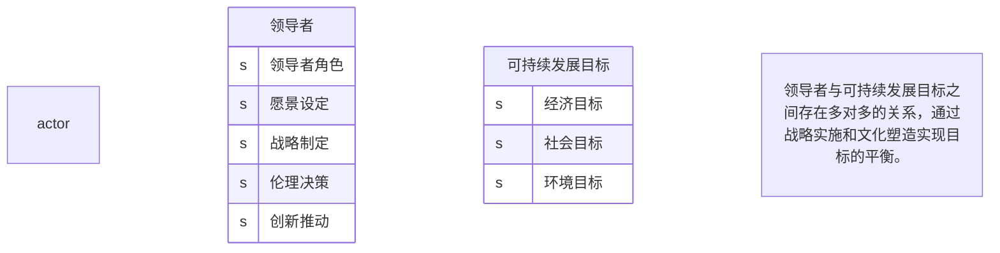
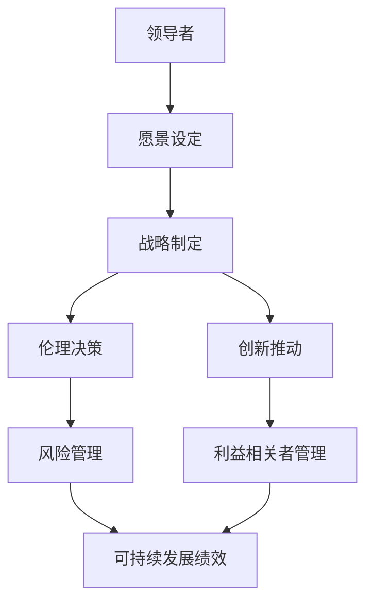

                 


# 可持续发展领导力对公司长期价值的影响

> 关键词：可持续发展领导力, 企业长期价值, 可持续发展战略, 领导力转型, 企业风险管理

> 摘要：可持续发展领导力是指领导者在推动企业实现可持续发展目标的过程中所展现的能力和思维方式。本文从可持续发展领导力的核心概念出发，分析其对公司的长期价值的影响，探讨如何通过战略制定、风险管理、文化塑造和利益相关者管理等方面，提升企业可持续发展能力，从而实现长期价值最大化。文章还结合实际案例，总结了可持续发展领导力在企业中的最佳实践，并展望了未来的发展趋势。

---

## 第一部分: 可持续发展领导力的背景与核心概念

### 第1章: 可持续发展领导力的定义与背景

#### 1.1 可持续发展领导力的定义
- **领导力的基本概念**：领导力是通过愿景设定、决策制定和团队激励来引导组织向既定目标前进的能力。
- **可持续发展的基本概念**：可持续发展强调在满足当前需求的同时，不损害后代满足其需求的能力，涵盖经济、社会和环境三个方面。
- **可持续发展领导力的定义**：可持续发展领导力是指领导者在推动企业实现可持续发展目标的过程中，综合运用战略思维、伦理责任和创新能力，引领组织实现长期价值的能力。

#### 1.2 可持续发展领导力的背景与重要性
- **当前商业环境的变化**：全球气候变化、资源枯竭、社会不平等等问题的加剧，使得企业必须将可持续发展作为核心战略。
- **可持续发展成为全球关注的焦点**：政府、投资者、消费者和利益相关者对企业社会责任的期望越来越高。
- **可持续发展领导力对企业长期价值的影响**：通过可持续发展领导力，企业可以构建长期竞争优势，提升品牌声誉，吸引和留住人才，增强抗风险能力。

#### 1.3 可持续发展领导力的核心要素
- **战略性思维**：领导者需要从长远角度制定可持续发展战略，平衡短期利益与长期目标。
- **伦理与责任**：领导者应具备强烈的社会责任感，关注环境保护、员工福利和社会公平。
- **创新与变革**：可持续发展要求领导者具备创新能力，推动组织进行绿色转型和商业模式创新。

### 第2章: 可持续发展领导力的核心概念与联系

#### 2.1 可持续发展领导力的核心原理
- **领导力的三重使命**：领导者的使命不仅是追求经济效益，还包括保护环境和促进社会福祉。
- **可持续发展的三重底线**：企业需要在经济、社会和环境三个方面实现平衡。
- **两者结合的内在逻辑**：可持续发展领导力通过整合三重底线目标，实现企业的长期价值。

#### 2.2 可持续发展领导力的核心要素对比
- **领导力风格对比分析**
  - 传统领导力：注重短期目标和效率，可能忽视可持续性。
  - 变革型领导力：注重愿景和创新，但可能不够关注可持续性。
  - 可持续发展领导力：强调三重底线的平衡，注重长期价值。
- **可持续发展维度对比分析**
  - 经济维度：关注成本控制和利润最大化。
  - 社会维度：关注员工福利、社区参与和公平性。
  - 环境维度：关注碳排放、资源利用和生态保护。
- **三重底线与领导力目标的对比**
  - 经济目标：短期盈利与长期增长。
  - 社会目标：员工满意度与社会影响力。
  - 环境目标：生态足迹与资源效率。

#### 2.3 可持续发展领导力的ER实体关系图


---

## 第二部分: 可持续发展领导力的算法与系统分析

### 第3章: 可持续发展领导力的算法原理

#### 3.1 可持续发展领导力的数学模型
- **模型假设**：企业价值（V）= 短期利润（P） + 长期可持续发展能力（S）。
- **公式推导**：
  $$ V = P + S $$
  $$ S = \alpha \cdot E + \beta \cdot S + \gamma \cdot G $$
  其中，E为环境影响，S为社会影响，G为治理能力，α、β、γ为权重系数。

#### 3.2 可持续发展领导力的决策树
```mermaid
decisionTree
    决策：是否采用可持续发展战略？
        是
        |
            决策：选择哪种可持续发展战略？
                是
                |
                    结果：企业价值提升
                否
                |
                    结果：企业价值下降
        否
        |
            结果：企业价值不变或下降
```

#### 3.3 可持续发展领导力的系统架构
- **系统功能设计**：构建三重底线的平衡系统，包括数据采集、目标设定、决策优化和结果反馈。
- **系统架构图**


---

## 第三部分: 可持续发展领导力的项目实战

### 第4章: 可持续发展领导力的项目实施

#### 4.1 项目背景与目标
- **项目背景**：某跨国公司面临资源浪费和员工士气低落的问题。
- **项目目标**：通过可持续发展领导力提升企业效率和员工满意度。

#### 4.2 项目实施步骤
1. **环境分析**：识别企业的资源浪费问题和员工不满的主要原因。
2. **战略制定**：制定绿色生产计划和员工福利改善方案。
3. **利益相关者管理**：与供应商、员工和客户沟通新战略，确保各方支持。
4. **实施与监控**：分阶段实施绿色生产计划，定期监控资源利用率和员工满意度。

#### 4.3 项目成果与分析
- **资源利用率提升**：通过优化生产流程，资源浪费减少30%。
- **员工满意度提升**：员工福利改善，员工满意度提高20%。
- **品牌影响力提升**：公司在行业中的绿色形象增强，吸引更多的客户和投资者。

---

## 第四部分: 可持续发展领导力的最佳实践

### 第5章: 可持续发展领导力的最佳实践

#### 5.1 关键成功因素
- **领导层的坚定承诺**：领导者必须以身作则，展示对可持续发展的支持。
- **利益相关者的参与**：通过与利益相关者的合作，确保可持续发展战略的有效实施。
- **持续改进机制**：建立定期评估和反馈机制，持续优化可持续发展绩效。

#### 5.2 案例分析
- **案例：某科技公司可持续发展转型**
  - **背景**：公司面临高碳排放和员工流失问题。
  - **措施**：推行绿色供应链管理，优化员工福利政策。
  - **结果**：碳排放减少20%，员工满意度提高40%，品牌形象显著提升。

#### 5.3 未来展望
- **领导力转型**：未来领导力将更加注重可持续性，领导者需要具备更强的系统思维和创新能力。
- **技术驱动的可持续发展**：人工智能、大数据等技术将为可持续发展提供新的工具和方法。

---

## 结语

可持续发展领导力不仅是企业应对当前挑战的关键，也是实现长期价值的核心。通过本文的分析，我们可以看到，可持续发展领导力的实施需要领导者具备战略性思维、伦理责任和创新能力。同时，企业需要通过系统的战略制定、利益相关者管理和持续改进机制，确保可持续发展战略的有效实施。未来，随着技术的进步和社会的变化，可持续发展领导力将继续演进，为企业创造更大的长期价值。

---

**作者：AI天才研究院/AI Genius Institute & 禅与计算机程序设计艺术 /Zen And The Art of Computer Programming**

