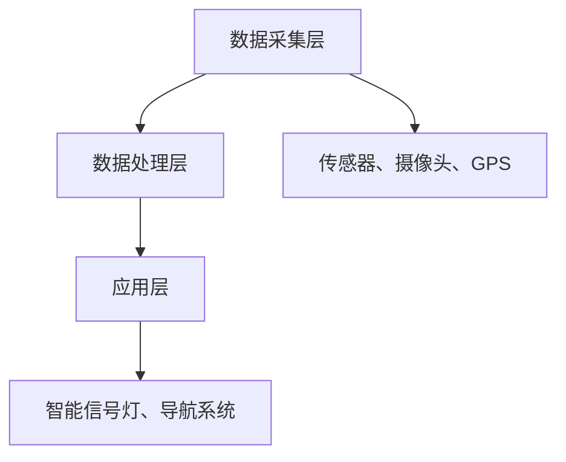
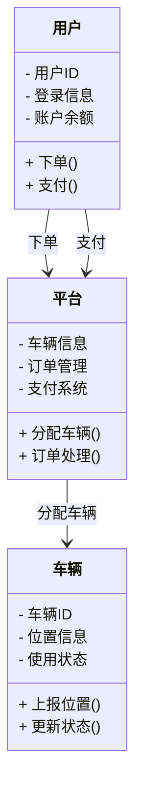
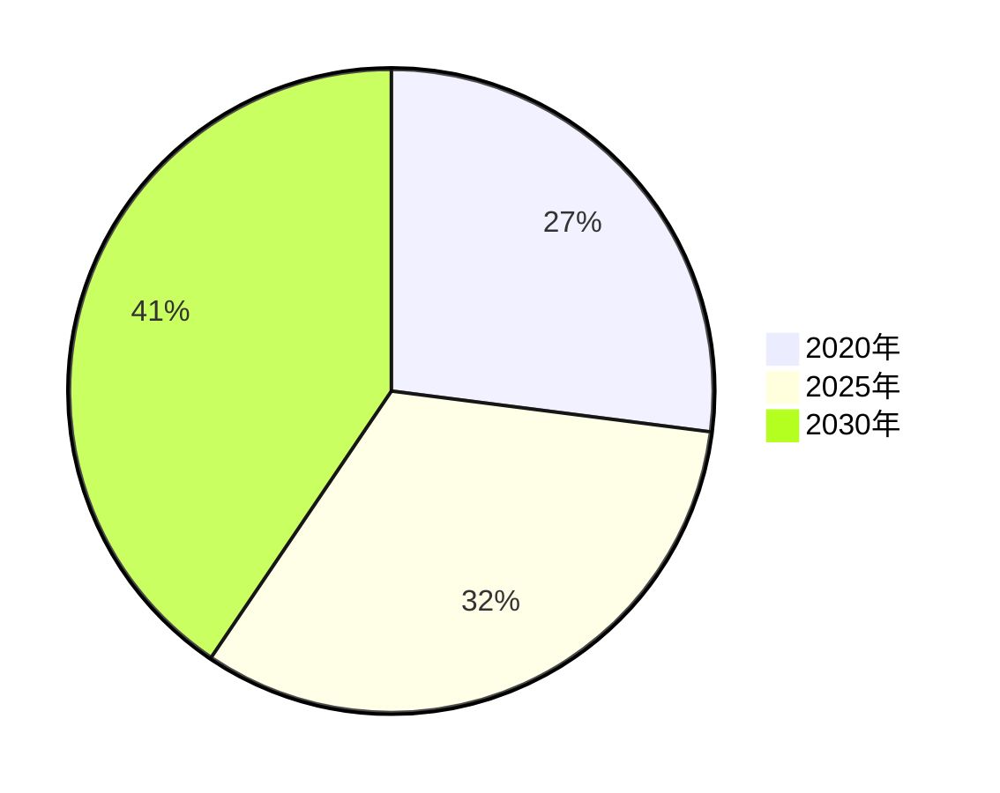

                 


# 可持续城市交通解决方案的市场前景

---

## 关键词  
可持续交通、智能交通系统、共享出行、碳中和、城市交通优化、市场分析

---

## 摘要  
随着城市化进程的加快和环保压力的增加，可持续城市交通解决方案成为全球关注的焦点。本文从技术、经济和政策等多个角度，系统分析了可持续城市交通的核心概念、技术实现、市场前景及实际应用。通过结合智能交通系统、共享出行模式等创新技术，探讨了如何在城市交通中实现绿色、智能、高效的交通管理。文章还结合实际案例，分析了不同城市在可持续交通解决方案中的成功经验，为相关领域的研究和实践提供了参考。

---

## 第一部分：可持续城市交通的背景与挑战

### 第1章：可持续城市交通的核心概念

#### 1.1 可持续城市交通的定义与内涵  
可持续城市交通是指在城市交通系统中，通过优化资源配置、减少能源消耗和环境污染，实现交通服务的长期性和可持续性。其核心目标是满足城市居民的出行需求，同时降低对环境的负面影响。

**核心要素对比表：**

| 核心要素 | 描述 | 示例 |
|----------|------|------|
| 绿色 | 减少碳排放，采用新能源技术 | 电动公交车、共享单车 |
| 智能 | 利用大数据和人工智能优化交通 | 智能信号灯、实时导航 |
| 高效 | 提高交通资源利用率 | 共享出行、拼车服务 |

**ER实体关系图：**

```mermaid
er
    entity(城市交通系统) {
        - 用户
        - 车辆
        - 路网
        - 交通信号灯
        - 出行需求
    }
```

#### 1.2 城市交通的主要问题  
城市交通面临的主要问题包括：  
1. **交通拥堵**：城市道路资源有限，导致高峰期交通效率低下。  
2. **环境污染**：传统燃油车辆的尾气排放加剧了空气污染问题。  
3. **能源消耗**：城市交通占用了大量化石能源，加剧了能源危机。  
4. **交通不平等**：不同收入群体在交通资源获取上的不平等。  

#### 1.3 可持续交通的目标与意义  
可持续交通的目标是通过技术创新和模式优化，实现以下几点：  
1. 减少碳排放，应对气候变化。  
2. 提高交通效率，缓解城市交通压力。  
3. 促进社会公平，满足不同群体的出行需求。  

---

## 第二部分：可持续城市交通的技术解决方案

### 第2章：智能交通系统的原理与应用

#### 2.1 智能交通系统的定义与架构  
智能交通系统（ITS）是一种通过先进的信息技术、数据处理技术和通信技术，对交通系统进行实时监测和优化的系统。其架构通常分为数据采集层、数据处理层和应用层。

**系统架构图：**



#### 2.2 智能交通系统的算法原理  
智能交通系统的核心算法包括交通流预测和信号灯控制。以下是一个简单的交通流预测模型：

**预测模型公式：**

$$ Q(t) = \alpha \cdot Q(t-1) + (1-\alpha) \cdot I(t) $$

其中，$Q(t)$ 表示当前流量，$\alpha$ 表示预测系数，$I(t)$ 表示输入流量。

**预测流程图：**


#### 2.3 智能交通系统的应用场景  
智能交通系统广泛应用于以下场景：  
1. **实时交通优化**：通过实时数据调整信号灯配时，减少拥堵。  
2. **智能信号灯控制**：基于交通流量动态调整信号灯时序。  
3. **共享出行平台**：通过大数据分析优化车辆调度。  

---

### 第3章：共享出行与新型交通模式

#### 3.1 共享出行的定义与特点  
共享出行是一种基于互联网平台的新型出行模式，其特点是按需使用、共享资源和高效匹配。  

**共享出行模式对比表：**

| 模式 | 描述 | 优点 | 缺点 |
|------|------|------|------|
| 共享单车 | 铸铁自行车 | 绿色环保、使用灵活 | 管理成本高 |
| 拼车服务 | 多人共享一辆车 | 降低成本、减少空驶 | 用户体验差 |
| 共享汽车 | 短期租赁 | 节省购车成本 | 资产贬值快 |

**系统功能设计类图：**



---

## 第三部分：可持续城市交通的市场分析

### 第4章：市场规模与商业模式

#### 4.1 可持续交通的市场规模  
根据市场研究，全球智能交通系统市场规模预计在未来几年将以年均8%的速度增长，到2030年将达到数千亿美元。  

**市场规模预测图：**



#### 4.2 可持续交通的商业模式  
可持续交通的商业模式包括：  
1. **政府主导模式**：政府投资建设基础设施，提供公共服务。  
2. **市场主导模式**：企业通过共享出行平台盈利。  
3. **混合模式**：政府与企业合作，共同分担成本和收益。  

---

## 第四部分：项目实战与系统设计

### 第5章：系统设计与实现

#### 5.1 项目背景与需求分析  
某城市希望通过智能交通系统优化交通流量，减少拥堵和污染。  

**项目目标：**  
1. 实现交通流量实时监测。  
2. 提供智能信号灯控制。  
3. 提供实时导航服务。  

**系统功能需求：**

| 功能模块 | 描述 |
|----------|------|
| 数据采集 | 采集交通流量、车辆位置等数据 |
| 数据处理 | 对数据进行清洗、分析和建模 |
| 应用层 | 提供实时信号灯控制和导航服务 |

#### 5.2 系统架构设计  
基于分层架构设计，系统分为数据采集层、数据处理层和应用层。

**系统架构图：**


#### 5.3 项目实施与代码实现  
以下是交通流量预测模型的Python代码实现：

```python
import numpy as np

def traffic_flow_prediction(Q_prev, I_current, alpha=0.7):
    return alpha * Q_prev + (1 - alpha) * I_current

# 示例数据
Q_prev = 100  # 上一时刻的流量
I_current = 120  # 当前时刻的输入流量
alpha = 0.7

Q_current = traffic_flow_prediction(Q_prev, I_current, alpha)
print(f"当前流量预测值为：{Q_current}")
```

---

## 第五部分：结论与展望

### 第6章：总结与未来展望  
可持续城市交通解决方案是实现城市可持续发展的重要组成部分。通过技术创新和模式优化，智能交通系统和共享出行模式为城市交通的绿色、智能、高效发展提供了新的可能。未来，随着人工智能和大数据技术的进一步发展，可持续交通将更加智能化和个性化，为城市居民提供更加便捷、环保的出行方式。

---

## 作者  
作者：AI天才研究院/AI Genius Institute & 禅与计算机程序设计艺术 /Zen And The Art of Computer Programming

