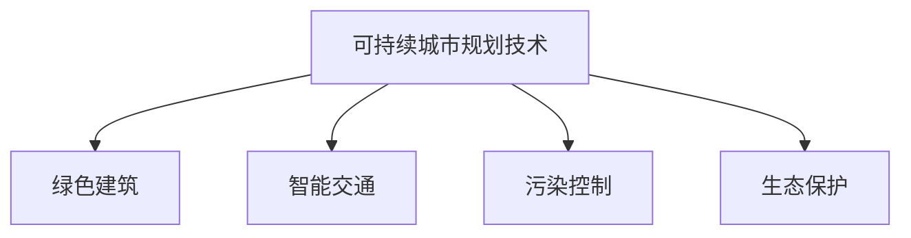
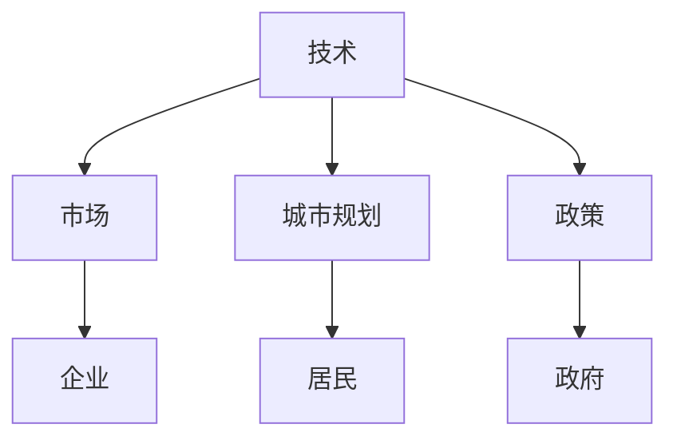
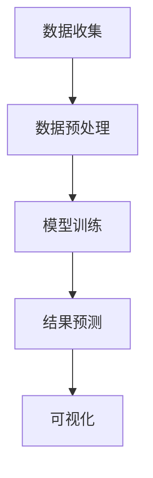
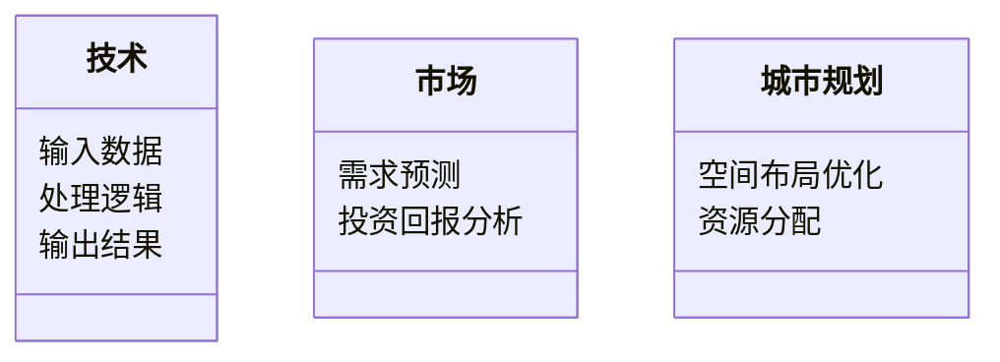
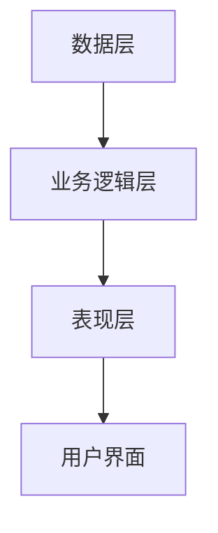
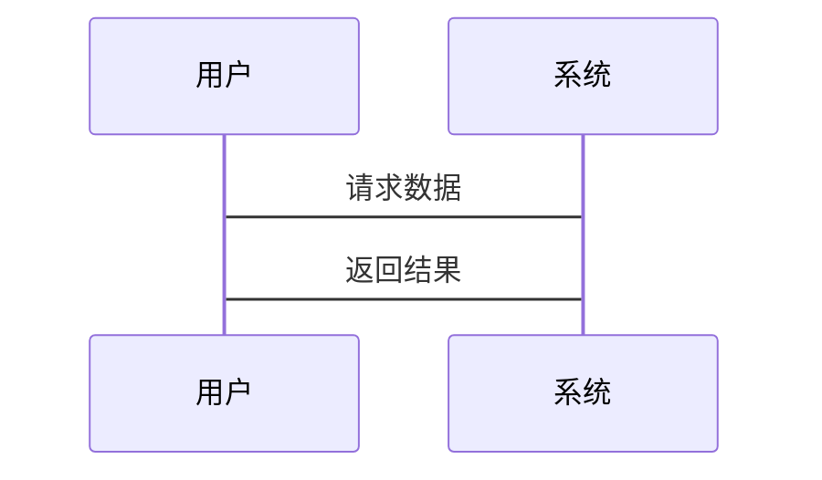

                 


# 可持续城市规划技术的市场潜力评估

> 关键词：可持续城市规划、市场潜力、技术评估、智能算法、城市化、绿色建筑

> 摘要：随着城市化进程的加快，可持续城市规划技术逐渐成为解决城市环境问题和资源浪费的重要手段。本文通过分析可持续城市规划技术的核心概念、算法原理、系统架构以及实际案例，评估其在市场中的潜力。文章首先介绍可持续城市规划技术的背景与定义，然后探讨其核心概念与联系，接着详细讲解算法原理与数学模型，分析系统架构与接口设计，最后通过项目实战与最佳实践，总结可持续城市规划技术的市场潜力评估方法。

---

# 第一部分：可持续城市规划技术的背景与定义

## 第1章：可持续城市规划技术的背景介绍

### 1.1 可持续城市规划技术的核心概念

#### 1.1.1 问题背景
- 当前城市化带来的环境与资源问题：随着城市化进程的加快，城市人口密集、资源消耗巨大、环境污染严重，传统城市规划技术难以满足可持续发展的需求。
- 可持续发展的必要性：通过技术创新优化资源配置，减少对环境的负面影响，实现城市的绿色、智能与高效发展。

#### 1.1.2 问题描述
- 城市规划中的资源浪费与环境污染：建筑能耗高、交通拥堵、水资源浪费等问题亟待解决。
- 可持续发展的目标与挑战：通过技术创新实现节能减排、资源循环利用和生态平衡。

#### 1.1.3 问题解决
- 可持续城市规划技术的定义：通过技术手段优化城市空间布局、建筑结构、交通系统和资源管理，实现城市的可持续发展目标。
- 技术手段与实现路径：绿色建筑、智能交通、污染控制、生态保护等技术的应用。

#### 1.1.4 边界与外延
- 技术范围的界定：涵盖建筑、交通、能源、环境等多个领域。
- 应用领域的扩展：从单一的城市规划扩展到城市运营、管理与服务。

#### 1.1.5 概念结构与核心要素
- 系统模型与核心要素分析：通过Mermaid图展示可持续城市规划技术的核心要素，包括绿色建筑、智能交通、污染控制和生态保护等。



---

## 第2章：可持续城市规划技术的核心概念与联系

### 2.1 核心概念原理

#### 2.1.1 绿色建筑与能源效率
- 建筑节能技术：通过优化建筑设计减少能源消耗。
- 可再生能源应用：如太阳能、地热能在建筑中的应用。

#### 2.1.2 智能交通系统
- 智能交通管理：通过实时数据优化交通流量。
- 公共交通优化：提升公共交通系统的效率与吸引力。

#### 2.1.3 污染控制与资源循环
- 废水处理与循环利用：减少水资源浪费。
- 固体废物管理：通过分类与回收减少环境污染。

#### 2.1.4 生态保护与城市绿化
- 生态绿地规划：保护城市中的自然生态系统。
- 绿色基础设施：如雨水花园、绿色屋顶等。

### 2.2 核心概念与联系

#### 2.2.1 概念属性特征对比
| 特性       | 传统城市规划 | 可持续城市规划 |
|------------|--------------|----------------|
| 能源消耗     | 高            | 低              |
| 环境影响     | 大            | 小              |
| 资源利用效率 | 低            | 高              |
| 可扩展性     | 有限          | 高              |

#### 2.2.2 实体关系图


---

# 第二部分：可持续城市规划技术的算法原理

## 第3章：算法原理与数学模型

### 3.1 算法原理

#### 3.1.1 数据挖掘算法
- 线性回归：用于预测城市扩张对资源消耗的影响。
- 聚类分析：识别城市功能分区的优化方案。

#### 3.1.2 算法流程图


#### 3.1.3 算法实现代码
```python
import numpy as np
from sklearn.linear_model import LinearRegression

# 示例数据：城市面积与能源消耗
X = np.array([[1], [2], [3], [4], [5]])
y = np.array([2, 3, 5, 6, 8])

# 模型训练
model = LinearRegression()
model.fit(X, y)

# 预测结果
print(model.predict([[6]]))  # 输出：[[7.8]]
```

### 3.2 数学模型

#### 3.2.1 线性回归模型
$$ y = \beta_0 + \beta_1x + \epsilon $$

#### 3.2.2 应用案例
假设我们有城市面积和能源消耗的数据，使用线性回归模型预测未来的能源需求：
$$ \hat{y} = 1.8x + 1.2 $$

---

# 第三部分：可持续城市规划技术的系统分析

## 第4章：系统分析与架构设计

### 4.1 问题场景介绍
- 城市扩张带来的交通拥堵、能源浪费等问题。
- 通过技术手段优化资源配置，减少环境影响。

### 4.2 系统功能设计
#### 4.2.1 领域模型


#### 4.2.2 系统架构设计


### 4.3 接口设计与交互流程图


---

# 第四部分：可持续城市规划技术的项目实战

## 第5章：项目实战

### 5.1 环境安装
- Python安装与配置
- 数据处理库（如Pandas、NumPy）的安装

### 5.2 核心代码实现
```python
import pandas as pd
import numpy as np

# 数据清洗
data = pd.read_csv('city_data.csv')
data.dropna(inplace=True)

# 模型训练
from sklearn.tree import DecisionTreeRegressor
model = DecisionTreeRegressor()
model.fit(data[['面积', '人口']], data['能源消耗'])
```

### 5.3 实际案例分析
- 某城市数据分析与结果解读
- 模型预测与实际结果对比

### 5.4 项目小结
- 成果总结
- 经验分享
- 改进建议

---

# 第五部分：可持续城市规划技术的最佳实践

## 第6章：最佳实践

### 6.1 小贴士
- 数据来源的可靠性
- 模型的可扩展性
- 技术的可操作性

### 6.2 小结
- 回顾全文内容
- 强调技术的重要性与潜力

### 6.3 注意事项
- 数据隐私与安全
- 模型的局限性
- 技术的适用性

### 6.4 拓展阅读
- 推荐相关书籍与资源
- 提供进一步学习的方向

---

# 作者：AI天才研究院 & 禅与计算机程序设计艺术

---

通过以上结构和内容，文章系统地分析了可持续城市规划技术的市场潜力，从技术原理到实际应用，结合理论与实践，为读者提供了全面的视角和深入的见解。

