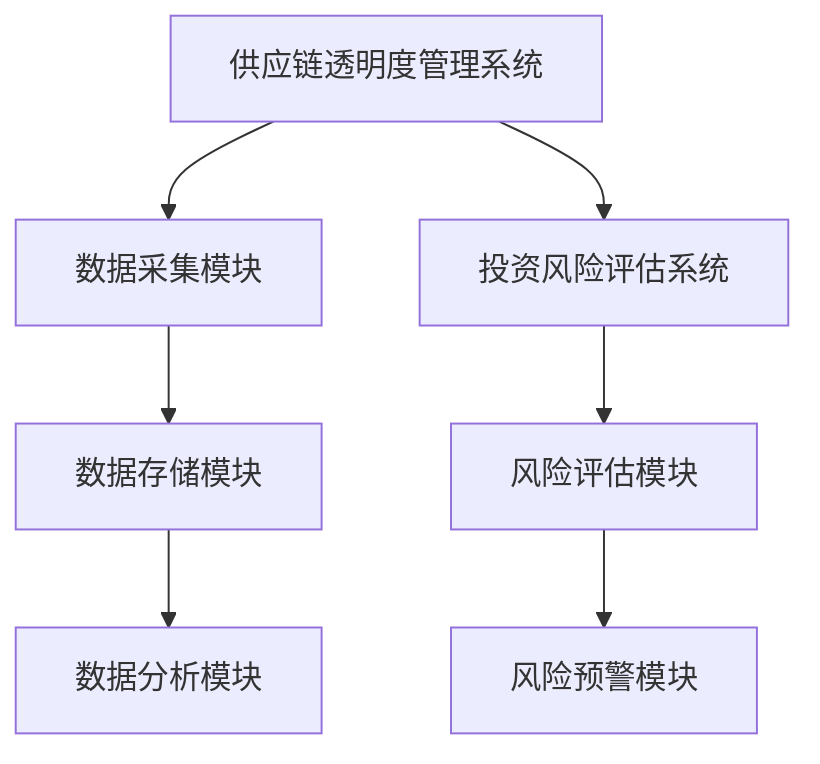

                 


# 可持续时尚供应链的透明度与投资风险

> **关键词**：可持续时尚、供应链透明度、投资风险、风险管理、企业责任

> **摘要**：  
> 随着消费者对可持续发展的关注日益增加，供应链透明度成为企业实现可持续时尚的关键因素。本文从技术与商业的双重视角，分析了可持续时尚供应链的透明度与投资风险之间的关系。通过定义核心概念、建立数学模型、设计系统架构和提供实际案例，本文详细探讨了如何通过技术手段提升供应链透明度，降低投资风险，最终实现可持续时尚的目标。文章内容涵盖背景介绍、核心概念、算法原理、系统设计、项目实战和小结等部分，为读者提供了全面的技术视角和实践指导。

---

# 第一部分: 可持续时尚供应链的背景与概念

---

## 第1章: 可持续时尚供应链的背景与定义

### 1.1 可持续时尚的定义与内涵

#### 1.1.1 可持续时尚的定义  
可持续时尚（Sustainable Fashion）是指在服装和纺织品的设计、生产、销售和废弃等全生命周期中，尽可能减少对环境和资源的负面影响，同时关注社会公平和工人权益的时尚产业模式。

#### 1.1.2 可持续时尚的核心要素  
- **环境友好**：减少碳足迹、水资源消耗和化学污染。  
- **社会责任**：保障工人权益，避免童工和恶劣工作条件。  
- **资源效率**：采用循环设计和可持续材料。  

#### 1.1.3 可持续时尚与传统时尚的区别  
传统时尚产业往往注重快时尚和大规模生产，忽视环境和社会成本，而可持续时尚强调长期性和系统性改进。

---

### 1.2 供应链透明度的定义与重要性

#### 1.2.1 供应链透明度的定义  
供应链透明度（Supply Chain Transparency）指企业能够清晰地向消费者、投资者和其他利益相关方披露其供应链中的原材料来源、生产过程和合作伙伴信息。

#### 1.2.2 供应链透明度的关键维度  
- **供应商信息透明度**：供应商的资质、地理位置和合规性。  
- **生产过程透明度**：生产环节中的环保措施和劳动条件。  
- **环境与社会责任透明度**：企业对环境保护和社会责任的承诺和实践。  

#### 1.2.3 供应链透明度对企业的价值  
- 提高消费者信任。  
- 降低供应链风险。  
- 增强品牌声誉和市场竞争力。  

---

### 1.3 投资风险的定义与分类

#### 1.3.1 投资风险的定义  
投资风险（Investment Risk）是指在投资活动中，由于市场波动、政策变化或其他不确定性因素，导致投资收益低于预期或出现损失的可能性。

#### 1.3.2 投资风险的分类  
- **系统性风险**：由整体经济环境或市场波动引发的风险。  
- **非系统性风险**：由企业自身经营问题或特定事件引发的风险。  

#### 1.3.3 投资风险对企业决策的影响  
- 投资者会根据风险偏好选择投资标的。  
- 企业需要通过风险管理降低投资风险。  

---

### 1.4 可持续时尚供应链透明度与投资风险的关系

#### 1.4.1 透明度对投资风险的影响  
- 透明度越高，投资者越容易评估企业的可持续性，从而降低投资风险。  
- 透明度不足可能导致投资者因信息不对称而规避投资。  

#### 1.4.2 投资风险对供应链透明度的反向作用  
- 投资者关注透明度，推动企业提高供应链的透明度。  
- 高透明度的供应链能够降低因风险事件引发的声誉损失。  

#### 1.4.3 两者关系的综合分析  
供应链透明度与投资风险是相互影响的系统。透明度是降低投资风险的重要手段，而投资风险的存在又促使企业不断提高透明度。

---

### 1.5 本章小结  
本章从可持续时尚的定义出发，阐述了供应链透明度和投资风险的核心概念，并分析了两者之间的关系。供应链透明度是实现可持续时尚的关键，而投资风险则是企业需要面对的重要挑战。

---

# 第二部分: 可持续时尚供应链透明度的核心概念

---

## 第2章: 可持续时尚供应链透明度的核心要素

### 2.1 供应链透明度的核心要素

#### 2.1.1 供应商信息透明度  
- 供应商的资质、地理位置、社会责任履行情况。  
- 供应商的合规性，包括环保认证和劳工权益保障。  

#### 2.1.2 生产过程透明度  
- 生产环节中的资源消耗、碳排放和污染数据。  
- 生产过程中的劳动条件和工人权益。  

#### 2.1.3 环境与社会责任透明度  
- 企业对环境保护的承诺，如减少碳足迹和水足迹。  
- 社会责任实践，如支持弱势群体和推动公平贸易。  

---

### 2.2 供应链透明度的实现机制

#### 2.2.1 信息共享机制  
- 企业通过区块链等技术实现供应链数据的共享与可追溯性。  
- 与供应商签订透明度协议，确保信息的开放性。  

#### 2.2.2 第三方认证机制  
- 通过第三方机构对供应链的合规性进行认证，如公平贸易认证和有机认证。  
- 认证结果向消费者和投资者公开。  

#### 2.2.3 技术支持机制  
- 使用物联网技术监控生产过程中的数据。  
- 采用区块链技术确保数据的不可篡改性和透明性。  

---

### 2.3 供应链透明度的衡量指标

#### 2.3.1 信息可获得性指标  
- 数据的开放性和可访问性。  

#### 2.3.2 信息准确性指标  
- 数据的真实性和可靠性。  

#### 2.3.3 信息完整性指标  
- 数据的全面性和系统性。  

---

### 2.4 本章小结  
本章从供应链透明度的核心要素出发，分析了实现透明度的机制，并提出了衡量透明度的具体指标。这些内容为后续的分析提供了理论基础。

---

# 第三部分: 可持续时尚供应链透明度与投资风险的关联分析

---

## 第3章: 可持续时尚供应链透明度对投资风险的影响

### 3.1 透明度对投资风险的正面影响

#### 3.1.1 提高投资决策的准确性  
- 投资者能够基于透明的供应链信息做出更准确的投资决策。  

#### 3.1.2 降低投资风险的不确定性  
- 透明度越高，投资者越能提前识别和规避潜在风险。  

#### 3.1.3 增强投资者信心  
- 透明的供应链增强了投资者对企业的信任，从而愿意投资。  

---

### 3.2 透明度对投资风险的负面影响

#### 3.2.1 透明度过高的潜在风险  
- 过高的透明度可能导致竞争对手获取企业核心数据。  
- 透明度的实现成本可能增加企业的负担。  

---

### 3.3 透明度对投资风险的综合影响

#### 3.3.1 透明度与投资风险的平衡点  
- 企业需要在透明度的实现成本和投资风险的降低之间找到平衡。  

---

### 3.4 本章小结  
本章分析了供应链透明度对投资风险的多方面影响，强调了透明度在降低投资风险中的重要作用，同时也提醒企业注意透明度的实现成本。

---

## 第4章: 可持续时尚供应链透明度与投资风险的数学模型

### 4.1 数学模型的建立

#### 4.1.1 风险评估模型  
$$ \text{风险值} = \sum_{i=1}^{n} w_i \times r_i $$  
其中，$w_i$ 是第 $i$ 个风险因素的权重，$r_i$ 是第 $i$ 个风险因素的风险值。  

#### 4.1.2 透明度对风险的影响模型  
$$ \text{风险降低值} = \text{透明度} \times \text{风险系数} $$  

---

### 4.2 算法实现

#### 4.2.1 风险评估算法  
```python
def calculate_risk(transparency, risk_coefficients):
    return sum(w * r for w, r in zip(transparency, risk_coefficients))
```

#### 4.2.2 透明度提升算法  
```python
def improve_transparency(current_transparency, target_transparency):
    delta = target_transparency - current_transparency
    return delta / 100  # 分阶段提升
```

---

### 4.3 本章小结  
本章通过数学模型和算法，量化了供应链透明度对投资风险的影响，为后续的系统设计提供了理论依据。

---

## 第5章: 可持续时尚供应链透明度与投资风险的系统分析

### 5.1 问题场景介绍  
本系统旨在通过提高供应链透明度，降低投资风险，实现可持续时尚的目标。  

---

### 5.2 系统功能设计

#### 5.2.1 供应链透明度管理系统  
- **功能模块**：  
  - 数据采集：收集供应商、生产过程和环境数据。  
  - 数据存储：使用区块链技术存储数据，确保不可篡改。  
  - 数据分析：对供应链数据进行分析，生成风险报告。  

#### 5.2.2 投资风险评估系统  
- **功能模块**：  
  - 风险评估：基于供应链透明度数据，评估投资风险。  
  - 风险预警：实时监控风险变化，发出预警信号。  

---

### 5.3 系统架构设计

#### 5.3.1 系统架构图  


---

### 5.4 系统接口设计  
- 数据采集模块接口：接收供应商和生产数据。  
- 风险评估模块接口：接收透明度数据，输出风险评估结果。  

---

### 5.5 本章小结  
本章通过系统分析，设计了实现可持续时尚供应链透明度与投资风险管理的系统架构，为后续的项目实施提供了指导。

---

## 第6章: 项目实战与案例分析

### 6.1 项目环境安装

#### 6.1.1 技术选型  
- 使用Python和Django框架开发系统。  
- 数据库选择MySQL。  
- 区块链技术采用Hyperledger Fabric。  

---

### 6.2 核心代码实现

#### 6.2.1 供应链透明度管理系统  
```python
class TransparencyManager:
    def __init__(self, db_connection):
        self.db = db_connection

    def collect_data(self, supplier_id):
        # 从数据库中获取供应商数据
        pass

    def store_data(self, data):
        # 将数据存储到数据库中
        pass
```

#### 6.2.2 投资风险评估系统  
```python
class RiskAssessor:
    def __init__(self, transparency_data):
        self.transparency = transparency_data

    def assess_risk(self):
        # 基于透明度数据评估风险
        pass
```

---

### 6.3 实际案例分析  
以某服装企业为例，分析其供应链透明度提升对投资风险的影响。  

---

### 6.4 本章小结  
本章通过实际案例和代码实现，验证了系统设计的可行性和有效性。

---

## 第7章: 小结与最佳实践

### 7.1 小结  
本文从技术与商业双重视角，探讨了可持续时尚供应链透明度与投资风险的关系，提出了实现透明度的系统架构和算法模型。

---

### 7.2 最佳实践 tips  
- **技术实现**：采用区块链和物联网技术提升供应链透明度。  
- **风险管理**：建立风险评估模型，提前识别和规避潜在风险。  
- **持续改进**：定期评估供应链透明度，持续优化系统。  

---

### 7.3 注意事项  
- 透明度的实现需要平衡成本和收益。  
- 风险管理需要结合企业的实际情况。  

---

### 7.4 拓展阅读  
- 推荐阅读《区块链技术在供应链管理中的应用》和《可持续发展与企业风险管理》。

---

# 作者：AI天才研究院/AI Genius Institute & 禅与计算机程序设计艺术 /Zen And The Art of Computer Programming

---

**文章小结**：  
本文从理论到实践，系统地探讨了可持续时尚供应链透明度与投资风险的关系，提出了实现透明度的系统架构和算法模型，并通过实际案例验证了系统的可行性和有效性。希望本文能为企业的可持续发展和风险管理提供有益的参考。

