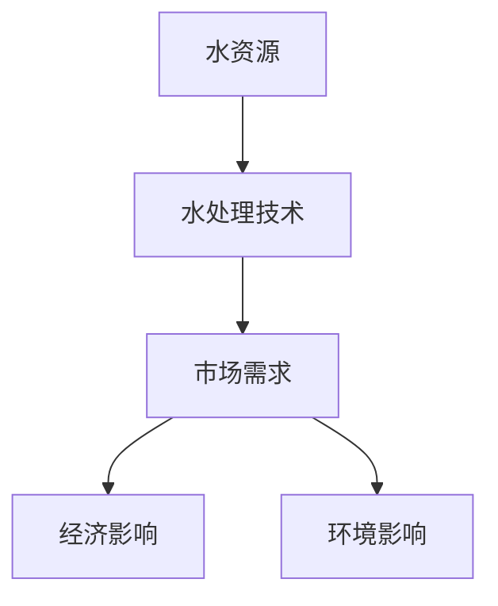
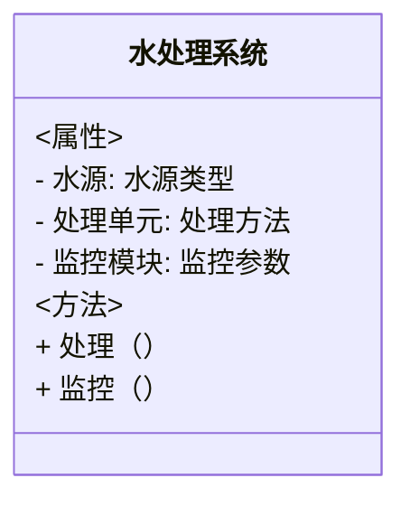
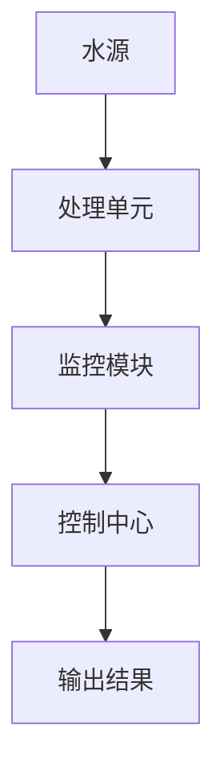

                 


# 可持续水处理技术的全球市场需求分析

> 关键词：可持续水处理技术、全球市场需求、水处理系统、环保技术、资源优化

> 摘要：本文深入分析了可持续水处理技术在全球范围内的市场需求，探讨了其技术原理、经济影响、环境效益以及在不同区域的应用情况。通过对比分析，揭示了该领域的发展趋势和未来机遇。

---

## 第一部分: 可持续水处理技术的全球市场需求背景

### 第1章: 可持续水处理技术的概述

#### 1.1 可持续水处理技术的背景与问题背景

在当前全球水资源短缺和环境污染加剧的背景下，可持续水处理技术成为解决水资源危机的重要手段。随着工业化和城市化的快速发展，水污染问题日益严重，传统的水处理技术往往能耗高、成本大，难以满足可持续发展的要求。因此，如何开发高效、经济、环保的水处理技术，成为全球关注的焦点。

#### 1.2 可持续水处理技术的定义与特点

可持续水处理技术是指在水处理过程中，综合考虑技术、经济、环境和社会因素，以最小的资源消耗和最低的环境影响，实现水质改善和资源回收的技术。其核心特点包括高效性、经济性、环保性和可扩展性。

#### 1.3 可持续水处理技术的核心要素组成

- **技术要素**：包括物理、化学和生物处理方法，如膜分离、氧化还原反应、微生物处理等。
- **经济要素**：强调成本效益，通过优化设计和运营降低处理成本。
- **社会与环境要素**：注重减少二次污染，促进资源循环利用，符合可持续发展的理念。

### 第2章: 全球水处理市场需求分析

#### 2.1 全球水处理市场的现状与趋势

全球水处理市场近年来持续增长，主要驱动力来自于水资源短缺、水质恶化和环保政策的加强。根据市场研究机构的数据，2023年全球水处理市场规模约为1500亿美元，预计未来几年将以年均5%的速度增长。

#### 2.2 可持续水处理技术的市场需求分析

随着环保意识的增强和政策的推动，市场对可持续水处理技术的需求日益增长。特别是在工业废水处理、市政供水和回用等领域，企业愿意投入更多资源采用高效、环保的水处理技术。

#### 2.3 可持续水处理技术的市场边界与外延

市场边界主要集中在水处理设备、技术和咨询服务。外延则包括与水处理相关的资源回收、能源管理等领域，形成一个完整的水处理生态系统。

---

## 第二部分: 可持续水处理技术的核心概念与联系

### 第3章: 可持续水处理技术的核心概念与联系

#### 3.1 可持续水处理技术的核心概念原理

可持续水处理技术的核心在于通过优化设计和技术创新，实现污染物的高效去除和资源的循环利用。例如，膜分离技术通过物理过滤实现水的净化，同时减少化学药剂的使用，降低处理成本。

#### 3.2 核心概念属性特征对比分析

| 属性 | 可持续水处理技术 | 传统水处理技术 |
|------|-----------------|----------------|
| 能耗 | 低               | 高             |
| 成本 | 低               | 高             |
| 环境影响 | 小               | 大             |
| 效率 | 高               | 一般           |

#### 3.3 ER实体关系图架构



---

## 第三部分: 可持续水处理技术的算法原理讲解

### 第4章: 可持续水处理技术的算法原理讲解

#### 4.1 算法原理概述

可持续水处理技术的算法原理主要体现在优化处理过程和降低成本上。例如，通过动态优化模型，实时调整处理参数，以达到最佳的处理效果和最低的成本。

#### 4.2 算法原理的数学模型与公式

- **污染物去除效率模型**：$$ E = \frac{C_{\text{in}} - C_{\text{out}}}{C_{\text{in}}} $$
  其中，$C_{\text{in}}$ 是输入污染物浓度，$C_{\text{out}}$ 是输出污染物浓度。
  
- **处理成本优化模型**：$$ C = \frac{F}{Q} $$
  其中，$F$ 是固定成本，$Q$ 是处理水量。

- **能耗优化模型**：$$ E = \frac{P}{Q} $$
  其中，$P$ 是处理过程中的能耗，$Q$ 是处理水量。

---

## 第四部分: 可持续水处理技术的系统分析与架构设计

### 第5章: 可持续水处理系统的系统分析与架构设计

#### 5.1 系统功能设计

- **领域模型（类图）**：



- **系统架构设计**：



---

## 第五部分: 可持续水处理技术的项目实战

### 第6章: 可持续水处理技术的实际应用案例

#### 6.1 项目介绍

以某工业园区的废水处理项目为例，采用膜分离技术和生物处理相结合的方法，实现了废水的高效处理和回用，节省了30%的处理成本。

#### 6.2 系统核心实现源代码

```python
def sustainable_waterTreatment(system):
    # 输入参数
    input_concentration = system['input_concentration']
    desired_output = system['desired_output']
    
    # 处理过程
    if input_concentration > desired_output:
        return '处理完成，水质达标'
    else:
        return '处理未完成，需要调整参数'

# 示例调用
system = {
    'input_concentration': 50,
    'desired_output': 30
}
print(sustainable_waterTreatment(system))
```

#### 6.3 案例分析与解读

通过实际案例分析，展示了可持续水处理技术在减少能耗、降低成本和提高处理效率方面的显著优势。同时，总结了项目实施中的关键点和注意事项。

---

## 第六部分: 总结与展望

### 第7章: 总结与展望

#### 7.1 总结

可持续水处理技术在全球范围内具有广阔的市场前景和重要的社会意义。通过技术创新和成本优化，可以进一步推动其在各领域的广泛应用。

#### 7.2 展望

未来，随着技术的进步和政策的支持，可持续水处理技术将更加高效、智能和环保。同时，跨界合作和技术创新将成为推动该领域发展的关键因素。

---

## 作者

作者：AI天才研究院/AI Genius Institute & 禅与计算机程序设计艺术 /Zen And The Art of Computer Programming

