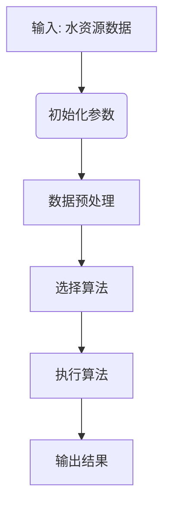
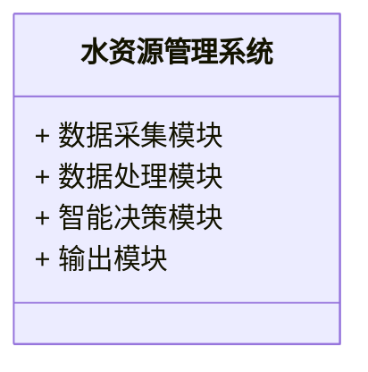
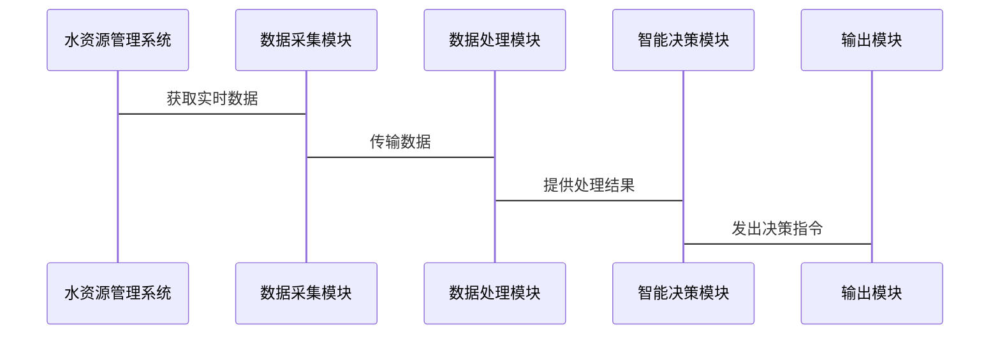

                 


# 可持续水资源管理技术的市场需求分析

> 关键词：可持续水资源管理、市场需求分析、技术解决方案、系统设计、项目案例、环境科学、信息技术

> 摘要：本文深入分析了可持续水资源管理技术的市场需求，探讨了其背后的技术原理、系统架构和实际应用。通过详细的技术分析、系统设计和项目案例，本文揭示了市场需求的核心驱动因素，并为未来的技术发展提供了方向和建议。

---

## 第一部分：可持续水资源管理技术的背景与现状

### 第1章：问题背景与现状

#### 1.1 问题背景
- **水资源短缺的全球性问题**：全球水资源分布不均，局部地区水资源短缺严重。
- **可持续水资源管理的定义与目标**：通过技术手段实现水资源的高效利用和保护。
- **问题的紧迫性和重要性**：水资源短缺对经济、生态和社会的深远影响。

#### 1.2 问题描述
- **水资源管理的主要挑战**：包括资源分配不均、污染、浪费和管理效率低下。
- **当前水资源利用的低效性**：传统管理方式的不足和改进的必要性。
- **可持续水资源管理的核心问题**：如何在技术和管理上实现高效、公平和可持续的水资源分配。

#### 1.3 问题解决
- **技术手段在水资源管理中的作用**：大数据分析、人工智能、物联网等技术的应用。
- **可持续水资源管理的技术路径**：从数据采集到智能决策的技术链条。
- **技术与政策的结合**：政策引导和技术支持的双向作用。

#### 1.4 边界与外延
- **可持续水资源管理的边界**：明确技术应用的范围和限制。
- **相关领域的外延**：与环保、能源、农业等领域的关联。
- **技术与管理的结合范围**：技术在管理中的具体应用范围和方式。

#### 1.5 概念结构与核心要素
- **核心概念的构成**：包括技术手段、管理策略、政策支持等。
- **核心要素的特征**：技术的创新性、管理的系统性、政策的引导性。
- **概念结构的可视化**：通过图表展示各概念之间的关系。

---

## 第二部分：核心概念与联系

### 第2章：核心概念原理

#### 2.1 核心概念的系统性分析
- **可持续水资源管理的理论基础**：基于生态学和经济学的理论。
- **技术手段的实现原理**：大数据分析、人工智能算法、物联网传感器等的技术原理。
- **核心概念的系统性分析**：从系统角度理解各要素的相互作用。

#### 2.2 核心概念属性特征对比
- **技术手段的对比分析**：不同技术在水资源管理中的优缺点对比。
- **不同技术的优缺点**：如AI算法的高精度与计算资源消耗大的对比。
- **技术属性与市场需求的关系**：市场需求驱动技术选择和优化。

#### 2.3 ER实体关系图架构
```mermaid
erd
  title 可持续水资源管理核心概念关系图
  partition 系统边界内实体 {
    entity 技术手段 {
      attribute 技术类型, 实现原理
      relationship- 与市场需求建立联系
    }
    entity 管理策略 {
      attribute 战略目标, 实施方法
      relationship- 依赖技术手段实现
    }
    entity 政策支持 {
      attribute 政策内容, 实施效果
      relationship- 支持管理策略的执行
    }
  }
```

---

## 第三部分：算法原理讲解

### 第3章：算法原理与数学模型

#### 3.1 算法原理
- **优化算法**：如遗传算法、模拟退火算法在水资源分配中的应用。
- **预测模型**：如时间序列分析、机器学习模型用于需求预测和资源分配。
- **算法步骤**：详细描述算法的输入、处理过程和输出。

#### 3.2 算法流程图


#### 3.3 Python代码实现
```python
import numpy as np

def optimize_water_distribution(data):
    # 数据预处理
    processed_data = data preprocessing steps
    # 选择算法
    algorithm = '遗传算法'
    # 执行算法
    result = run_algorithm(processed_data, algorithm)
    return result
```

#### 3.4 数学模型
- **线性规划模型**：用于资源分配的数学表达。
  $$ \text{目标函数：} \sum_{i} x_i \text{最大化} $$
  $$ \text{约束条件：} \sum_{i} a_i x_i \leq b $$
- **动态模型**：用于预测水资源变化趋势。
  $$ \frac{d x}{d t} = k x (1 - x/K) $$

---

## 第四部分：系统分析与架构设计

### 第4章：系统分析与架构设计

#### 4.1 问题场景介绍
- **需求场景**：城市水资源管理中的典型问题。
- **项目介绍**：基于AI的水资源管理系统设计。

#### 4.2 系统功能设计
- **领域模型**：通过Mermaid类图展示系统模块和功能。


#### 4.3 系统架构设计
- **架构图**：展示系统的分层结构。


#### 4.4 系统接口设计
- **接口描述**：系统各模块之间的接口定义。
- **交互流程图**：展示系统各模块的交互流程。


---

## 第五部分：项目实战

### 第5章：项目实战与案例分析

#### 5.1 环境安装
- **安装步骤**：安装Python、相关库（如numpy、pandas、scikit-learn）和开发工具。

#### 5.2 核心代码实现
```python
import numpy as np
from sklearn import linear_model

def main():
    # 数据加载
    data = np.loadtxt('water_data.csv', delimiter=',')
    # 模型训练
    model = linear_model.LinearRegression()
    model.fit(data[:, :-1], data[:, -1])
    # 预测结果
    predictions = model.predict(new_data)
    print('预测结果:', predictions)

if __name__ == '__main__':
    main()
```

#### 5.3 代码应用解读
- **代码功能**：通过机器学习模型预测水资源需求。
- **数据处理**：数据预处理和特征选择的具体步骤。
- **结果分析**：模型的准确性和应用场景。

#### 5.4 实际案例分析
- **案例背景**：某城市水资源管理项目。
- **案例分析**：技术应用的具体过程和效果。
- **详细讲解**：从数据采集到模型部署的全过程。

#### 5.5 项目小结
- **项目总结**：项目的成功经验和教训。
- **经验总结**：技术选择和实施的关键点。

---

## 第六部分：总结与展望

### 第6章：总结与展望

#### 6.1 核心内容总结
- **总结市场需求分析的核心内容**：技术与市场的双向驱动。
- **总结系统设计的关键点**：模块化设计和高扩展性。

#### 6.2 未来展望
- **技术发展趋势**：AI和大数据技术的进一步融合。
- **市场需求的变化**：可持续发展成为更重要的驱动因素。

#### 6.3 最佳实践 tips
- **技术应用建议**：选择适合的技术方案。
- **系统设计建议**：注重模块化和可扩展性。
- **注意事项**：数据安全和隐私保护的重要性。

#### 6.4 拓展阅读
- **推荐书籍和文章**：深入学习可持续水资源管理和技术应用的资源。

---

## 作者信息

作者：AI天才研究院/AI Genius Institute & 禅与计算机程序设计艺术 /Zen And The Art of Computer Programming

