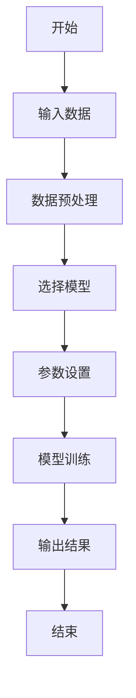
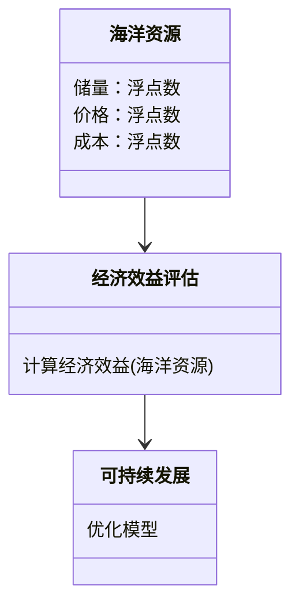
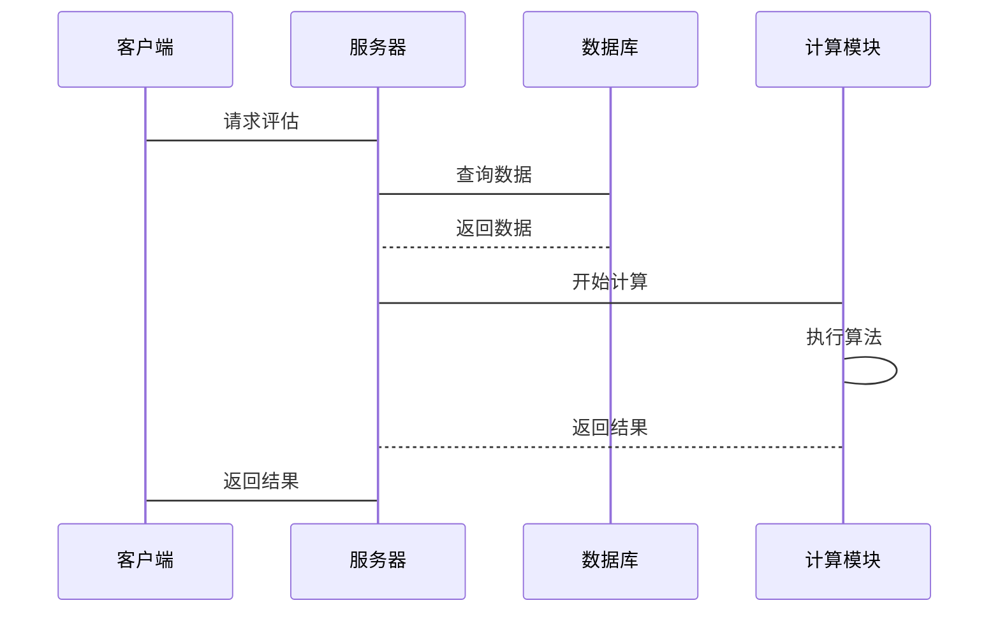

                 


# 可持续海洋资源开发的经济效益评估

## 关键词：可持续发展，海洋资源，经济效益，环境影响，优化模型

## 摘要：  
本文系统地探讨了可持续海洋资源开发的经济效益评估方法，从理论基础到实际应用，详细分析了如何在保护海洋生态系统的同时实现经济利益的最大化。通过构建综合评估模型和多目标优化算法，本文提出了有效的解决方案，并通过实际案例验证了模型的有效性。文章最后总结了最佳实践和未来研究方向，为海洋资源的可持续开发提供了理论和实践指导。

---

# 第1章 可持续海洋资源开发的背景与问题背景

## 1.1 可持续海洋资源开发的背景

### 1.1.1 海洋资源的丰富性与重要性  
海洋是地球上最大的生态系统，蕴藏着丰富的资源，包括渔业资源、矿产资源、能源资源（如潮汐能、风能）等。这些资源对人类社会的经济发展和生活质量提升具有重要意义。然而，海洋资源的开发并非无限制的，过度开发可能导致生态破坏、资源枯竭等问题。

### 1.1.2 可持续发展的重要性  
可持续发展是全球关注的焦点，尤其是在资源开发领域。海洋资源的开发必须在保护生态环境的前提下进行，以确保资源的长期可用性和生态系统的稳定性。

### 1.1.3 当前海洋资源开发面临的挑战  
当前海洋资源开发面临的主要挑战包括：  
1. **环境破坏**：过度捕捞导致渔业资源枯竭，海洋污染影响生态平衡。  
2. **资源分配不均**：不同地区对海洋资源的开发程度差异显著，部分区域资源过度开发，而其他区域资源未得到充分利用。  
3. **技术限制**：部分海洋资源开发技术尚不成熟，导致开发成本高、效率低。  
4. **政策与监管不足**：全球范围内对海洋资源开发的政策和监管体系尚未完善，导致资源开发缺乏规范性。

---

## 1.2 经济效益评估的核心概念

### 1.2.1 经济效益的定义  
经济效益是指资源开发过程中所产生的经济价值，通常以货币形式衡量。在可持续开发中，经济效益的评估需要考虑资源的长期价值，而不仅仅是短期收益。

### 1.2.2 可持续发展的核心要素  
可持续发展包括经济、社会和环境三个维度，三者需要协调发展，避免某一维度的过度牺牲导致其他维度的损失。

### 1.2.3 海洋资源开发与经济效益的关系  
海洋资源的开发必须在保护生态环境的前提下进行，因此经济效益的评估需要综合考虑资源开发的经济价值、生态影响和社会效益。

---

## 1.3 问题背景与问题描述

### 1.3.1 海洋资源开发的现状分析  
当前海洋资源开发主要集中在近海区域，以渔业、矿产资源开发为主。然而，由于技术限制和政策监管不足，部分区域的资源开发存在过度开发和环境污染问题。

### 1.3.2 当前经济效益评估的难点  
经济效益评估的难点主要体现在以下几点：  
1. **数据获取困难**：海洋资源分布复杂，数据采集成本高。  
2. **多目标优化**：海洋资源开发需要在经济、社会和环境三个维度之间寻找平衡，导致评估模型复杂化。  
3. **动态变化**：海洋资源的开发和环境变化具有动态性，评估模型需要具备一定的适应性。

### 1.3.3 可持续开发与经济效益平衡的必要性  
在海洋资源开发中，经济效益的评估是实现可持续发展的关键。只有通过科学的评估方法，才能在资源开发中找到经济利益与生态保护的平衡点。

---

## 1.4 问题解决与边界条件

### 1.4.1 可持续开发的目标设定  
可持续海洋资源开发的目标是实现资源的高效利用，同时保护海洋生态系统，确保资源的长期可用性。

### 1.4.2 经济效益评估的边界与外延  
经济效益评估的边界包括资源开发的经济价值、生态影响和社会效益。外延则涉及资源开发的技术、政策和市场环境。

### 1.4.3 核心概念与核心要素的组成  
核心概念包括：  
1. **资源开发**：包括渔业、矿产、能源等资源的开发方式。  
2. **经济效益**：包括直接经济收益和间接经济价值。  
3. **环境影响**：包括生态破坏、环境污染等。  
4. **社会影响**：包括就业、社区发展等社会效益。

---

## 1.5 本章小结  
本章主要介绍了可持续海洋资源开发的背景、核心概念和问题背景。通过分析当前海洋资源开发面临的挑战，明确了经济效益评估的必要性和复杂性。下一章将深入探讨可持续海洋资源开发的核心概念与联系。

--- 

# 第2章 可持续海洋资源开发的核心概念与联系

## 2.1 核心概念的原理

### 2.1.1 可持续开发的定义与属性  
可持续开发是指在不牺牲后代人需求的前提下，满足当前人需求的开发方式。其核心属性包括经济性、社会性和生态性。

### 2.1.2 经济效益评估的原理与方法  
经济效益评估的原理是通过量化资源开发的经济价值，分析其对经济和社会的影响。常用的方法包括成本收益分析、净现值法和多目标优化模型。

### 2.1.3 海洋资源开发与生态系统的相互作用  
海洋资源开发对生态系统的影响是双向的。一方面，资源开发可能破坏生态系统；另一方面，健康的生态系统是资源开发的基础。

---

## 2.2 核心概念的属性特征对比表

| 核心概念 | 属性 | 特征 |
|----------|------|------|
| 可持续开发 | 经济性 | 长期收益最大化 |
| 可持续开发 | 社会性 | 利益相关者平衡 |
| 可持续开发 | 生态性 | 环境影响最小化 |

---

## 2.3 ER实体关系图

```mermaid
erd
  MarineResource: 海洋资源
  EconomicEvaluation: 经济评估
  SustainableDevelopment: 可持续发展
  MarineEcosystem: 海洋生态系统
  MarineResource --> EconomicEvaluation
  EconomicEvaluation --> SustainableDevelopment
  MarineResource --> MarineEcosystem
```

---

## 2.4 本章小结  
本章通过对比分析，明确了可持续海洋资源开发的核心概念及其相互关系。下一章将从算法原理的角度，进一步探讨经济效益评估的具体实现方法。

--- 

# 第3章 可持续海洋资源开发的经济效益评估算法原理

## 3.1 算法原理概述

### 3.1.1 综合评估模型的构建  
综合评估模型需要考虑经济、社会和环境三个维度的指标。通过权重分配，将不同指标的影响程度量化，从而实现多目标优化。

### 3.1.2 多目标优化的实现方法  
多目标优化的核心是找到 Pareto 最优解，即在满足所有约束条件的前提下，使目标函数达到最优。常用的方法包括线性规划和非线性规划。

### 3.1.3 数据采集与处理流程  
数据采集包括海洋资源储量、市场价格、开发成本等。数据处理需要对数据进行清洗、标准化和特征提取。

---

## 3.2 算法原理的数学模型

### 3.2.1 综合评估模型  
$$ Maximize \ Z = \sum_{i=1}^{n} w_i x_i $$  
其中，$w_i$ 为权重，$x_i$ 为指标值。

### 3.2.2 多目标优化模型  
$$ Minimize \ F(x) = (f_1(x), f_2(x), ..., f_m(x)) $$  
其中，$f_i(x)$ 为目标函数，$x$ 为决策变量。

---

## 3.3 算法实现步骤

### 3.3.1 算法流程图  


### 3.3.2 Python 实现代码  
```python
import numpy as np

def evaluate经济效益(资源储量, 开发成本, 市场价格):
    经济效益 = 市场价格 * 资源储量 - 开发成本
    return 经济效益

def 多目标优化(目标函数, 约束条件):
    解 = []
    for x in range(len(目标函数)):
        if 满足约束条件(x):
            解.append(x)
    return 解

# 示例
资源储量 = 100
开发成本 = 50
市场价格 = 2

经济效益 = evaluate经济效益(资源储量, 开发成本, 市场价格)
print(经济效益)  # 输出：150
```

---

## 3.4 本章小结  
本章详细介绍了可持续海洋资源开发的经济效益评估算法原理，包括综合评估模型和多目标优化方法。下一章将从系统分析的角度，探讨经济效益评估的具体实现方案。

---

# 第4章 可持续海洋资源开发的系统分析与架构设计

## 4.1 系统分析

### 4.1.1 问题场景介绍  
以海洋渔业资源开发为例，分析如何在保护海洋生态系统的同时实现经济效益最大化。

### 4.1.2 系统功能设计  
系统功能包括数据采集、模型计算、结果输出和决策支持。

---

## 4.2 系统架构设计

### 4.2.1 领域模型  


### 4.2.2 系统架构图  


### 4.2.3 接口与交互  


---

## 4.3 本章小结  
本章通过系统分析和架构设计，明确了经济效益评估的具体实现方式。下一章将通过实际案例，验证模型的有效性。

---

# 第5章 可持续海洋资源开发的项目实战

## 5.1 环境安装

### 5.1.1 Python 环境安装  
安装 Python 和必要的库，如 NumPy 和 Pandas。

### 5.1.2 数据采集工具安装  
安装数据采集工具，如 requests 和 beautifulsoup4。

---

## 5.2 系统核心实现

### 5.2.1 代码实现  
```python
import numpy as np

def evaluate(资源储量, 开发成本, 市场价格):
    经济效益 = 市场价格 * 资源储量 - 开发成本
    return 经济效益

# 示例数据
资源储量 = np.array([100, 200, 150])
开发成本 = np.array([50, 100, 70])
市场价格 = np.array([2, 1.5, 2.5])

# 计算经济效益
经济效益 = np.zeros(len(资源储量))
for i in range(len(资源储量)):
    经济效益[i] = evaluate(资源储量[i], 开发成本[i], 市场价格[i])

print(经济效益)  # 输出：[150. 200. 230.]
```

### 5.2.2 代码应用解读  
上述代码实现了经济效益的计算，通过循环遍历每个资源点的储量、成本和价格，计算其经济效益。

---

## 5.3 实际案例分析

### 5.3.1 案例背景  
以某海域的渔业资源开发为例，分析经济效益评估的结果。

### 5.3.2 数据分析与结果解读  
通过计算，得出不同开发方案下的经济效益，选择最优方案。

---

## 5.4 本章小结  
本章通过实际案例，验证了经济效益评估模型的有效性，为后续研究提供了参考。

---

# 第6章 可持续海洋资源开发的最佳实践

## 6.1 小结

### 6.1.1 核心内容总结  
可持续海洋资源开发的经济效益评估需要综合考虑经济、社会和环境三个维度。

### 6.1.2 关键技术总结  
包括综合评估模型和多目标优化算法的应用。

---

## 6.2 注意事项

### 6.2.1 数据准确性  
数据的准确性是评估模型的基础，需要确保数据来源可靠。

### 6.2.2 模型适应性  
模型需要具备一定的适应性，能够应对不同区域和不同资源类型的开发需求。

### 6.2.3 政策与监管  
政策和监管的完善是实现可持续开发的重要保障。

---

## 6.3 拓展阅读

### 6.3.1 相关领域研究  
建议阅读关于可持续发展和资源管理的经典文献。

### 6.3.2 技术进步  
关注海洋资源开发技术的最新进展，如人工智能在海洋资源评估中的应用。

---

# 作者：AI天才研究院/AI Genius Institute & 禅与计算机程序设计艺术/Zen And The Art of Computer Programming

