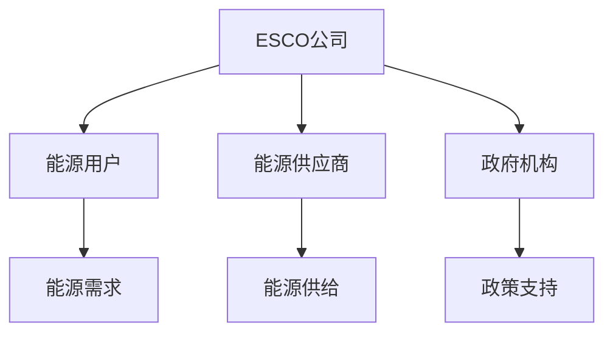

                 

# 可持续能源服务公司（ESCO）的商业模式分析

## 关键词：
可持续能源、ESCO、商业模式、节能服务、收益分享

## 摘要：
可持续能源服务公司（ESCO）通过提供节能服务，帮助客户降低能源消耗，从而实现可持续发展目标。本文详细分析了ESCO的商业模式，包括其核心要素、盈利来源、客户关系管理以及成功案例，探讨了其在可持续能源领域中的作用和发展前景。

---

# 第一部分: 可持续能源服务公司（ESCO）的背景与概念

## 第1章: 可持续能源服务公司（ESCO）概述

### 1.1 ESCO的定义与特点
ESCO（Energy Service Company）是指通过提供节能服务，帮助客户减少能源消耗并实现可持续发展目标的企业。其核心特点包括：
- **节能服务**：ESCO通过技术改造和管理优化，帮助客户降低能源消耗。
- **收益分享**：ESCO通常与客户签订合同，根据实际节约的能源费用来分享收益。
- **长期合作**：ESCO与客户建立长期合作关系，确保节能效果的持续性。

### 1.2 可持续能源服务的背景与发展趋势
随着全球能源需求的增长和环境问题的加剧，可持续能源逐渐成为全球关注的焦点。ESCO作为一种创新的商业模式，通过技术和服务的结合，为客户提供节能解决方案，推动了能源结构的优化和可持续发展。

### 1.3 ESCO的核心要素
- **问题背景**：能源浪费和环境污染是当前全球面临的重大挑战。
- **问题描述**：传统能源模式依赖化石燃料，导致能源浪费和环境污染。
- **问题解决**：ESCO通过技术创新和管理优化，降低能源消耗。
- **边界与外延**：ESCO的服务范围包括能源审计、技术改造、能效管理等，外延涉及政府政策、客户需求和技术发展。
- **概念结构**：ESCO以客户需求为导向，通过技术和服务实现节能目标，与政府、能源供应商等多方利益相关者形成协同效应。

---

## 第2章: 可持续能源服务公司的商业模式分析

### 2.1 ESCO商业模式的核心概念
- **核心定义**：ESCO通过与客户签订合同，提供节能服务并分享节能收益。
- **核心要素**：
  - **客户**：ESCO的核心客户包括工业企业、商业建筑、政府机构等。
  - **服务内容**：包括能源审计、技术改造、能效管理等。
  - **收益分享**：ESCO与客户按比例分享节能带来的收益。
  - **风险管理**：ESCO承担节能技术改造的成本和风险。

### 2.2 ESCO商业模式的特征对比
以下是ESCO商业模式与传统能源模式的对比：

| **对比维度** | **ESCO模式** | **传统能源模式** |
|--------------|---------------|------------------|
| 收益来源     | 节能收益分享   | 能源销售          |
| 风险承担     | ESCO承担      | 客户承担          |
| 合同关系     | 长期合作       | 一次性交易        |

### 2.3 ESCO商业模式的ER实体关系图（Mermaid）

---

# 第二部分: 可持续能源服务公司的商业模式分析

## 第3章: ESCO商业模式的核心要素

### 3.1 ESCO的盈利来源
ESCO的盈利主要来源于以下几个方面：
- **节能服务费**：根据合同约定，ESCO收取节能服务费。
- **节能收益分享**：ESCO与客户按比例分享节能带来的收益。
- **技术销售**：销售节能设备和技术解决方案。

### 3.2 ESCO的客户价值主张
- **降低能源成本**：通过节能技术改造，为客户降低能源消耗成本。
- **减少环境影响**：通过减少能源浪费，降低碳排放，支持可持续发展目标。
- **提升能源效率**：通过优化能源管理，提高能源使用效率。

### 3.3 ESCO的客户关系管理
- **客户分类**：根据客户的需求和规模，进行客户分类，制定个性化的服务方案。
- **长期合作**：通过签订长期合同，建立稳定的客户关系。
- **持续优化**：定期对客户的能源使用情况进行评估，优化节能方案。

---

## 第4章: ESCO商业模式的成功案例分析

### 4.1 案例背景
某工业企业由于设备老化，能源消耗较高，导致运营成本上升。通过引入ESCO的节能服务，企业实现了能源消耗的显著下降。

### 4.2 案例分析
- **服务内容**：ESCO对企业的生产线进行能效评估，提出技术改造方案，包括更换节能设备和优化能源管理。
- **收益分享**：ESCO与企业按5:5的比例分享节能带来的收益。
- **实施效果**：通过技术改造，企业每年节约能源费用100万元，ESCO获得50万元的收益分享。

---

## 第5章: ESCO商业模式的挑战与对策

### 5.1 ESCO面临的挑战
- **技术风险**：节能技术的不确定性可能导致节能效果不达预期。
- **客户信任**：客户对ESCO的节能服务效果可能存在疑虑。
- **政策支持**：政府政策的不确定性可能影响ESCO的业务开展。

### 5.2 应对策略
- **技术创新**：加大对节能技术研发的投入，提高技术的可靠性和效果。
- **客户教育**：通过宣传和案例分享，提升客户对ESCO服务的认知和信任。
- **政策倡导**：积极参与政策制定，争取更多的政策支持和资金补贴。

---

## 第6章: ESCO商业模式的未来发展趋势

### 6.1 数字化与智能化
随着人工智能和大数据技术的发展，ESCO可以通过数字化手段优化能源管理，提高节能效率。

### 6.2 全球化与合作
ESCO可以通过国际合作，推广节能技术和经验，拓展国际市场。

### 6.3 可持续发展
未来，ESCO将更加注重可持续发展，推动绿色能源的应用和推广，助力全球碳中和目标的实现。

---

## 第7章: 总结与展望

ESCO作为一种创新的商业模式，通过提供节能服务，为客户和社会创造价值。随着技术的进步和政策的支持，ESCO将在可持续能源领域发挥越来越重要的作用。未来，ESCO需要不断创新和优化，以应对市场变化和客户需求，推动能源结构的优化和可持续发展目标的实现。

---

## 作者：AI天才研究院/AI Genius Institute & 禅与计算机程序设计艺术 /Zen And The Art of Computer Programming

