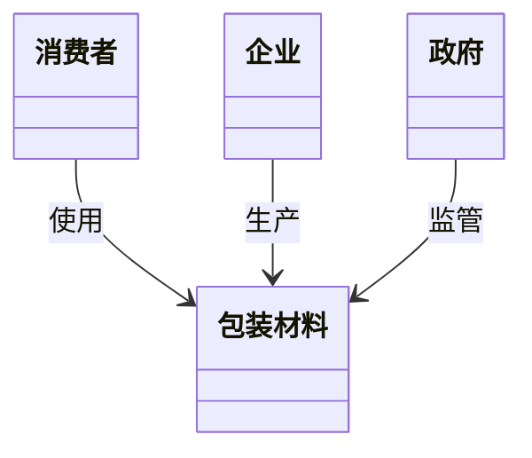
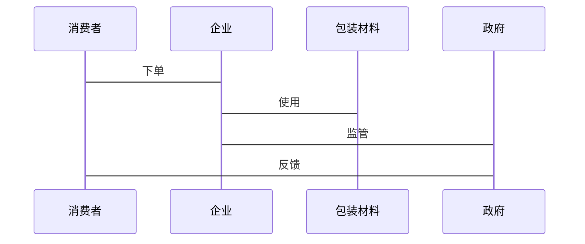

                 


# 可持续食品包装创新的市场接受度研究

## 关键词：
可持续食品包装、市场接受度、循环经济、生态设计、消费者行为、环境影响

## 摘要：
随着全球环境问题的日益严重，食品包装的可持续性已成为行业关注的焦点。本文通过分析可持续食品包装创新的市场接受度，探讨消费者行为、技术可行性和商业模式对可持续包装推广的影响。文章从背景、核心概念、分析方法、系统架构到实际案例，全面剖析可持续包装的创新路径，为行业提供理论支持和实践指导。

---

## 第一部分：可持续食品包装创新的背景与现状

### 第1章：可持续食品包装创新的背景与问题背景

#### 1.1 可持续食品包装创新的背景
- 1.1.1 环境问题与可持续发展的背景
  - 随着全球气候变化和资源枯竭，可持续发展成为全球共识。
  - 食品包装行业作为资源消耗和环境污染的主要来源之一，亟需转型。
  - 可持续包装的定义：采用环保材料、减少资源消耗、降低碳排放的包装方式。

- 1.1.2 食品包装行业的现状与挑战
  - 传统包装材料（如塑料、金属、玻璃）的环境问题。
  - 消费者环保意识的提升推动市场对可持续包装的需求。
  - 政策法规对包装行业的影响，如欧盟的循环经济行动计划。

- 1.1.3 可持续包装的核心要素
  - 环保材料的选择：可降解、可回收、可堆肥的材料。
  - 生态设计原则：减少包装层数、简化结构、提高材料利用率。
  - 生命周期评估（LCA）：从生产到废弃的全周期环境影响分析。

#### 1.2 问题背景与问题描述
- 1.2.1 食品包装对环境的影响
  - 废弃包装物的处理问题：塑料污染、白色污染。
  - 包装生产过程中的能源消耗和碳排放。
  - 包装材料对生态系统的影响，如海洋污染。

- 1.2.2 可持续包装的必要性与紧迫性
  - 消费者对环保产品的偏好增加。
  - 政府和企业的环保承诺推动可持续包装的创新。
  - 全球供应链的绿色转型需求。

- 1.2.3 问题解决的路径与目标
  - 开发环保材料：如PLA（聚乳酸）、淀粉基材料。
  - 推动循环经济模式：包装的回收、再利用。
  - 提高消费者环保意识，促进可持续包装的市场接受度。

#### 1.3 研究意义与研究边界
- 1.3.1 研究可持续包装创新的意义
  - 为企业提供环保包装的设计和选择依据。
  - 为消费者提供绿色消费的决策支持。
  - 为政策制定者提供行业发展的参考。

- 1.3.2 研究的边界与外延
  - 研究范围：食品包装材料的创新、生产过程的优化、消费者行为分析。
  - 研究对象：消费者、企业、政府。
  - 研究方法：生命周期评估、消费者行为分析、市场调研。

- 1.3.3 核心概念与关键要素的结构化分析
  - 核心概念：可持续包装、循环经济、绿色设计。
  - 关键要素：材料选择、生产过程、消费者接受度、政策支持。

---

## 第二部分：核心概念与联系

### 第2章：可持续包装与循环经济的核心概念

#### 2.1 可持续包装的核心概念
- 2.1.1 可持续包装的定义与属性
  - 定义：可持续包装是指在生产、使用和废弃过程中对环境影响最小的包装。
  - 属性：可降解、可回收、可堆肥、低能耗。

- 2.1.2 生态设计与绿色包装的对比
  - 生态设计：从设计阶段考虑环境影响，减少资源消耗。
  - 绿色包装：采用环保材料，注重包装的可回收性和可降解性。

- 2.1.3 可降解材料与传统包装的对比
  - 可降解材料：如PLA、PHA，能够在自然环境中分解。
  - 传统包装：如PET、PE，难以分解，造成环境污染。

#### 2.2 循环经济与可持续包装的关系
- 2.2.1 循经济的基本原理
  - 减量化：减少资源消耗。
  - 再利用：延长产品和材料的生命周期。
  - 再循环：将废弃物转化为新资源。

- 2.2.2 可持续包装在循环经济中的角色
  - 作为循环经济的重要组成部分，推动包装的循环利用。
  - 通过设计创新，实现包装的多次使用和回收。

- 2.2.3 循环经济与包装创新的协同效应
  - 包装生产过程的绿色化：减少能源消耗和碳排放。
  - 包装材料的循环利用：降低原材料需求，减少废弃物产生。

#### 2.3 核心概念的ER实体关系图
```mermaid
er
actor: 消费者
actor: 企业
actor: 政府
actor: 环境
actor: 市场
```

---

## 第三部分：分析方法

### 第3章：消费者行为与市场趋势分析

#### 3.1 消费者行为分析
- 3.1.1 消费者对可持续包装的认知
  - 研究方法：问卷调查、深度访谈。
  - 影响因素：环保意识、价格敏感性、品牌忠诚度。

- 3.1.2 消费者对可持续包装的接受度
  - 高接受度群体：环保意识强、愿意为环保支付溢价的消费者。
  - 低接受度群体：价格敏感、对环保不敏感的消费者。

- 3.1.3 消费者行为的驱动因素
  - 环保价值观：消费者愿意为环保产品支付更高价格。
  - 价格敏感性：价格差异对购买决策的影响。
  - 品牌信任：消费者对品牌的环保承诺的信任度。

#### 3.2 市场趋势与预测模型
- 3.2.1 市场趋势分析
  - 全球可持续包装市场的增长趋势。
  - 区域市场的差异：发达国家 vs 发展中国家。
  - 驱动因素：政策支持、消费者需求、技术创新。

- 3.2.2 预测模型的构建
  - 数据来源：市场调研数据、消费者行为数据、政策数据。
  - 模型选择：多元回归模型、时间序列分析。
  - 模型假设：市场增长与环保政策、消费者行为的相关性。

- 3.2.3 预测结果与分析
  - 预测结果：未来5年可持续包装市场的增长率。
  - 主要驱动因素：消费者环保意识的提升、政策支持的加强。

#### 3.3 消费者接受度的影响因素
- 3.3.1 材料属性的影响
  - 可降解材料的性能：如强度、耐久性。
  - 成本与传统材料的对比。

- 3.3.2 包装设计的影响
  - 设计的环保性：是否使用可回收材料、是否可重复使用。
  - 设计的美观性：是否吸引消费者注意。

- 3.3.3 价格因素的影响
  - 可持续包装的成本溢价。
  - 消费者愿意为环保支付的额外费用。

---

## 第四部分：系统分析与架构设计

### 第4章：可持续包装创新的系统分析

#### 4.1 问题场景介绍
- 问题场景：某食品企业希望推出可持续包装，但面临市场接受度不确定的问题。
- 项目目标：通过系统分析，确定影响市场接受度的关键因素，制定推广策略。

#### 4.2 系统功能设计
- 4.2.1 领域模型设计
  - 用例：消费者决策、企业生产、政府监管。
  - 实体：消费者、企业、政府、包装材料。

- 4.2.2 领域模型的Mermaid类图


#### 4.3 系统架构设计
- 4.3.1 系统架构的Mermaid架构图


- 4.3.2 系统接口设计
  - 消费者与企业的接口：订单系统、反馈系统。
  - 企业与政府的接口：合规报告、补贴申请。
  - 政府与市场的接口：政策发布、监管执法。

- 4.3.3 系统交互的Mermaid序列图


---

## 第五部分：项目实战

### 第5章：可持续包装创新的实践案例

#### 5.1 某食品企业的包装创新实践
- 5.1.1 项目背景：企业推出可降解包装，但市场接受度低于预期。
- 5.1.2 实践过程：选择PLA材料，优化包装设计，制定营销策略。
- 5.1.3 成果与经验：通过改进设计和营销，显著提高市场接受度。

#### 5.2 消费者接受度调查与分析
- 5.2.1 调查方法：问卷调查、焦点小组讨论。
- 5.2.2 数据分析：消费者对价格、设计、品牌的偏好。
- 5.2.3 结果解读：高接受度群体的特征与需求。

#### 5.3 环境影响与成本效益分析
- 5.3.1 环境影响评估：使用生命周期评估方法，对比传统包装和可持续包装的环境影响。
- 5.3.2 成本效益分析：可持续包装的初始成本、长期节约、投资回报。
- 5.3.3 结论：在特定市场条件下，可持续包装具有成本竞争力。

---

## 第六部分：总结与建议

### 第6章：总结与未来展望

#### 6.1 核心结论
- 可持续包装创新是实现绿色发展的关键。
- 消费者行为是影响市场接受度的核心因素。
- 政策支持和商业模式创新是推动可持续包装的重要力量。

#### 6.2 改进建议
- 提高消费者环保意识：通过教育和宣传。
- 优化包装设计：兼顾环保性和美观性。
- 加强政企合作：制定支持政策，建立回收体系。

#### 6.3 未来研究方向
- 智能包装技术：如可追踪、可自监测的包装。
- 包装材料的创新：如新型可降解材料的研发。
- 消费者行为的动态研究：随着环保意识的提升，持续跟踪市场变化。

---

## 作者：AI天才研究院/AI Genius Institute & 禅与计算机程序设计艺术 /Zen And The Art of Computer Programming

