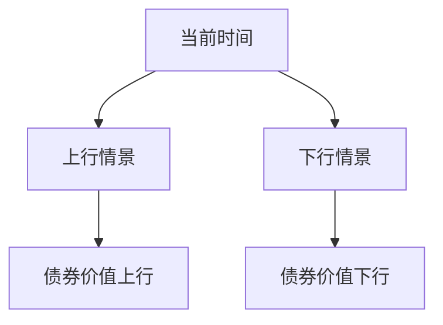

                 

# 可转换债券策略：兼具股债特性的灵活工具

---

## 关键词：
可转换债券、股债特性、债券策略、期权定价、风险管理

---

## 摘要：
可转换债券是一种兼具债券和股票特性的金融工具，能够在不同市场环境下灵活调整投资策略。本文深入分析可转换债券的核心概念、定价模型、投资策略及风险管理，结合实际案例和数学模型，帮助投资者理解其内在逻辑和应用场景。

---

## 第一部分：可转换债券的基本概念

### 第1章：可转换债券的定义与特点

#### 1.1 可转换债券的基本定义
可转换债券（Convertible Bond）是一种债券，允许持有者在特定条件下将其转换为发行公司的股票。它结合了债券的固定收益特性和股票的资本增值潜力，是一种混合型金融工具。

#### 1.2 可转换债券的主要特点
- **债券特性**：定期支付利息，到期偿还本金。
- **股票特性**：可转换为股票，享受股价上涨的收益。
- **期权特性**：转换权赋予持有者在特定价格和时间下转换的权利，类似于看涨期权。

#### 1.3 可转换债券与普通债券的区别
| 特性 | 可转换债券 | 普通债券 |
|------|------------|----------|
| 转换权 | 有         | 无       |
| 股票收益 | 有         | 无       |
| 风险 | 中等        | 较低     |

### 第2章：可转换债券的核心概念与原理

#### 2.1 可转换债券的核心要素
- **转换价格**：债券持有人可以将债券转换为股票的价格，通常高于发行时的股价。
- **到期日**：债券的期限，到期后可选择转换或偿还本金。
- **票面利率**：债券的年利息支付率。

#### 2.2 转换权的期权价值
可转换债券的转换权可以看作是一种看涨期权，其价值由以下公式计算：

$$ C = S_0 - K e^{-rT} $$

其中：
- \( S_0 \) 是当前股价。
- \( K \) 是执行价格（转换价格）。
- \( r \) 是无风险利率。
- \( T \) 是期权到期时间。

#### 2.3 股票价格波动对债券价值的影响
股票价格的波动会影响可转换债券的期权价值，从而影响整体债券价值。通过Black-Scholes模型可以计算期权价值：

$$ C = S_0 N(d_1) - K e^{-rT} N(d_2) $$

其中：
- \( d_1 = \frac{\ln(\frac{S_0}{K}) + (r + \frac{\sigma^2}{2})T}{\sigma \sqrt{T}} \)
- \( d_2 = d_1 - \sigma \sqrt{T} \)
- \( N() \) 是标准正态分布的累积分布函数。

### 第3章：可转换债券的股债混合特性

#### 3.1 债券特性
- **利息支付**：固定，提供稳定的收益。
- **本金偿还**：到期后偿还本金，本金安全。

#### 3.2 股票特性
- **股价上涨收益**：通过转换权分享股价上涨的收益。
- **风险**：如果股价下跌，债券价值可能低于面值。

#### 3.3 混合特性分析
可转换债券在不同市场条件下表现出不同的特性：
- **牛市**：股票上涨，转换权价值增加，债券价值上升。
- **熊市**：股票下跌，债券价值主要由债券部分支撑。

---

## 第二部分：可转换债券的定价模型

### 第4章：可转换债券定价的基本原理

#### 4.1 期权定价模型
可转换债券的转换权可以看作是股票的看涨期权，其价值可以通过Black-Scholes模型计算。以下是Black-Scholes模型的公式：

$$ C = S_0 N(d_1) - K e^{-rT} N(d_2) $$

其中：
- \( S_0 \) 是当前股价。
- \( K \) 是执行价格。
- \( r \) 是无风险利率。
- \( T \) 是期权到期时间。
- \( \sigma \) 是股价波动率。

#### 4.2 二叉树模型分析
二叉树模型用于模拟股票价格的波动，计算可转换债券在不同情景下的价值。以下是二叉树模型的流程图：

### 第5章：可转换债券的定价公式与应用

#### 5.1 理论定价公式
可转换债券的理论价值是债券部分和期权部分的总和：

$$ V = B + C $$

其中：
- \( B \) 是债券的现值。
- \( C \) 是转换权的期权价值。

#### 5.2 实际应用
在实际投资中，可转换债券的定价受多种因素影响，包括市场利率、股价波动率和发行公司的信用状况。投资者需要结合这些因素进行综合分析。

---

## 第三部分：可转换债券的投资策略

### 第6章：可转换债券的投资策略

#### 6.1 基本分析
投资者需要分析发行公司的财务状况、行业前景和竞争优势，以评估债券的信用风险和转换潜力。

#### 6.2 技术分析
通过技术分析工具，如移动平均线和相对强弱指数，判断债券的市场趋势和买卖信号。

#### 6.3 套利机会
利用不同市场中的价格差异，寻找套利机会，优化投资收益。

### 第7章：风险管理

#### 7.1 信用风险
发行公司可能无法按时偿还本金和利息，投资者需要评估公司的信用评级。

#### 7.2 市场风险
股价波动和利率变动会影响债券的价值，投资者需要分散投资以降低风险。

#### 7.3 到期风险
债券到期时，若股价低于转换价格，投资者可能无法获得满意的收益。

---

## 第四部分：实战案例分析

### 第8章：可转换债券的实战案例

#### 8.1 案例背景
某公司发行的可转换债券，面值为100元，票面利率为2%，转换价格为20元，到期时间为5年。

#### 8.2 案例分析
假设当前股价为15元，市场利率为3%，股价波动率为30%。

#### 8.3 投资决策
计算期权价值，判断是否值得投资。

---

## 作者：AI天才研究院

---

### 小结
可转换债券是一种灵活的金融工具，兼具股债特性，适合不同市场环境下的投资需求。通过深入理解其核心概念、定价模型和投资策略，投资者可以更好地利用这一工具实现资产配置和风险控制。

