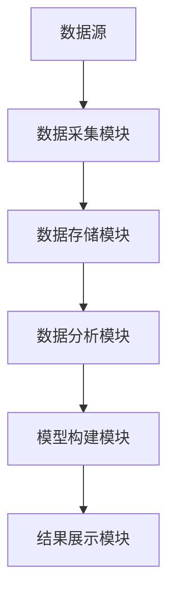
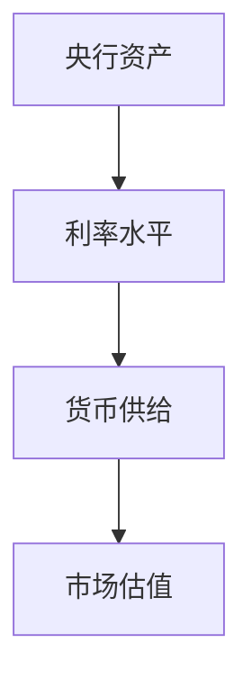

                 


# 各国央行总资产对市场估值的影响分析

> 关键词：各国央行、总资产、市场估值、货币政策、宏观经济、金融资产

> 摘要：本文系统分析了各国央行总资产对市场估值的影响，从理论到实证，从机制到案例，全面探讨了央行资产对市场估值的核心影响路径。结合货币政策传导机制和宏观经济理论，本文构建了一个完整的分析框架，并通过实证分析和案例研究，揭示了央行资产对市场估值的复杂影响关系。文章最后提出了政策建议和未来研究方向。

---

# 目录

## 第一部分：背景与概念

### 第1章：央行总资产与市场估值的定义与关系

#### 1.1 央行总资产的定义与构成

- 1.1.1 央行资产的定义
- 1.1.2 央行资产的主要构成
- 1.1.3 央行资产与市场估值的关系

#### 1.2 市场估值的定义与特征

- 1.2.1 市场估值的定义
- 1.2.2 市场估值的核心指标
- 1.2.3 市场估值与经济周期的关系

#### 1.3 问题背景与研究意义

- 1.3.1 央行资产对市场估值影响的背景
- 1.3.2 研究的重要性与必要性
- 1.3.3 研究的创新点与局限性

---

## 第二部分：央行总资产对市场估值的影响机制

### 第2章：货币政策传导机制中的央行资产

#### 2.1 货币政策传导机制的概述

- 2.1.1 货币政策的基本概念
- 2.1.2 货币政策的传导路径
- 2.1.3 货币政策传导机制的核心要素

#### 2.2 央行资产在货币政策中的作用

- 2.2.1 央行资产在货币政策中的地位
- 2.2.2 央行资产对货币供给的影响
- 2.2.3 央行资产对利率水平的影响

#### 2.3 货币政策传导机制的数学模型

- 2.3.1 货币政策传导机制的简化模型
- 2.3.2 央行资产与市场利率的关系模型
- 2.3.3 央行资产对市场估值的传导路径

---

### 第3章：央行总资产对市场估值的直接与间接影响

#### 3.1 央行资产对市场估值的直接路径

- 3.1.1 央行资产持有对市场流动性的直接影响
- 3.1.2 央行资产持有对市场风险偏好的直接影响
- 3.1.3 央行资产持有对市场预期的直接影响

#### 3.2 央行资产对市场估值的间接路径

- 3.2.1 央行资产通过影响利率间接影响市场估值
- 3.2.2 央行资产通过影响流动性间接影响市场估值
- 3.2.3 央行资产通过影响市场参与者行为间接影响市场估值

---

## 第三部分：实证分析与案例研究

### 第4章：实证分析框架与方法

#### 4.1 数据来源与处理

- 4.1.1 数据来源
- 4.1.2 数据清洗与处理
- 4.1.3 数据分析方法

#### 4.2 央行总资产与市场估值的相关性分析

- 4.2.1 相关性分析
- 4.2.2 回归分析
- 4.2.3 时间序列分析

#### 4.3 央行总资产对市场估值的影响系数估计

- 4.3.1 系数估计方法
- 4.3.2 系数估计结果
- 4.3.3 结果分析

---

### 第5章：典型央行的案例分析

#### 5.1 美联储的案例分析

- 5.1.1 美联储资产规模的变化
- 5.1.2 美联储资产对美国市场估值的影响
- 5.1.3 美联储资产对全球市场估值的影响

#### 5.2 欧洲央行的案例分析

- 5.2.1 欧洲央行资产规模的变化
- 5.2.2 欧洲央行资产对欧洲市场估值的影响
- 5.2.3 欧洲央行资产对全球市场估值的影响

#### 5.3 中国人民银行的案例分析

- 5.3.1 中国人民银行资产规模的变化
- 5.3.2 中国人民银行资产对国内市场估值的影响
- 5.3.3 中国人民银行资产对全球市场估值的影响

---

## 第四部分：系统架构与算法实现

### 第6章：系统架构设计

#### 6.1 系统功能设计

- 6.1.1 数据采集模块
- 6.1.2 数据分析模块
- 6.1.3 模型构建模块
- 6.1.4 结果展示模块

#### 6.2 系统架构图

- 使用 Mermaid 绘制系统架构图



#### 6.3 接口设计与交互流程

- 使用 Mermaid 绘制系统交互图


---

### 第7章：算法实现与数学模型

#### 7.1 货币政策传导机制的数学模型

- 使用 Mermaid 绘制货币政策传导机制图



- 使用 LaTeX 公式表示数学模型

$$ V = \beta \cdot C + \epsilon $$

其中：
- \( V \) 表示市场估值
- \( C \) 表示央行资产
- \( \beta \) 表示影响系数
- \( \epsilon \) 表示误差项

#### 7.2 回归分析的实现

- 使用 Python 代码实现回归分析

```python
import pandas as pd
import numpy as np
from sklearn.linear_model import LinearRegression

# 数据准备
data = pd.DataFrame({
    'C': [100, 200, 300, 400, 500],
    'V': [150, 250, 350, 450, 550]
})

# 模型训练
model = LinearRegression()
model.fit(data[['C']], data['V'])

# 结果分析
print('回归系数：', model.coef_)
print('截距：', model.intercept_)
```

---

## 第五部分：结论与建议

### 第8章：研究结论

#### 8.1 核心发现

- 央行总资产对市场估值的影响路径
- 不同央行的资产规模对市场估值的影响差异

#### 8.2 研究局限性

- 数据限制
- 模型假设的简化
- 实证分析的局限性

---

### 第9章：政策建议与未来研究方向

#### 9.1 政策建议

- 央行资产规模的调控建议
- 货币政策传导机制的优化建议
- 全球化背景下的协同政策建议

#### 9.2 未来研究方向

- 央行资产对不同资产类别估值的影响研究
- 不同经济周期下的影响差异研究
- 数字货币时代下的央行资产影响研究

---

## 作者

作者：AI天才研究院/AI Genius Institute & 禅与计算机程序设计艺术 /Zen And The Art of Computer Programming

---

> **注意事项**：
> - 本文基于学术研究，仅供参考，不构成投资建议。
> - 数据分析部分可根据具体需求进行调整和扩展。
> - 欢迎读者提出宝贵意见与建议，共同完善相关研究。

---

> **扩展阅读**：
> - 关于货币政策的深入研究
> - 全球央行资产负债表的变化趋势
> - 金融市场估值的多因素分析

---

希望这篇文章能满足您的需求！如果需要进一步调整或补充，请随时告知。

