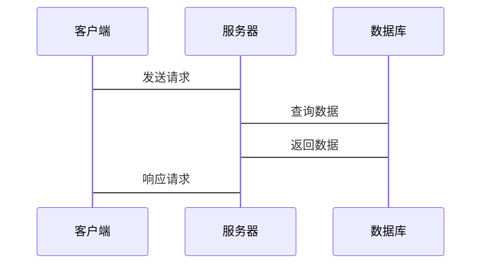

                 


# 合成生物学的发展前景与投资风险分析

> 关键词：合成生物学, 投资风险, 发展前景, 基因编辑, 合成基因回路, 代谢工程, 生物技术

> 摘要：合成生物学作为一门新兴的交叉学科，结合了生物学、化学、工程学和信息技术，致力于通过设计和构建新的生物系统来解决复杂的现实问题。本文将从合成生物学的基本概念、核心技术、算法原理、系统架构、项目实战以及投资风险分析等方面进行详细探讨，旨在为读者提供全面的了解和深入的分析。

---

## 第1章 合成生物学的基本概念与起源

### 1.1 合成生物学的定义与核心概念

#### 1.1.1 合成生物学的定义
合成生物学（Synthetic Biology）是研究如何通过设计和构建新的生物系统来解决复杂科学问题的交叉学科。它结合了生物学、化学、工程学和信息技术，旨在模拟、设计和制造生物组件、装置和系统。

#### 1.1.2 合成生物学的核心概念
合成生物学的核心概念包括：
1. **基因回路**：通过设计基因回路来实现特定功能。
2. **代谢通路**：优化生物体内的代谢通路以提高产物的产量。
3. **生物模块化**：将生物系统分解为模块化的组件，便于组合和优化。

#### 1.1.3 合成生物学与传统生物学的区别
| 特性 | 合成生物学 | 传统生物学 |
|------|------------|------------|
| 目标 | 设计新系统 | 描述现有系统 |
| 方法 | 工程化方法 | 实验与观察 |
| 应用 | 工业生产、医疗 | 基础研究 |

### 1.2 合成生物学的起源与发展

#### 1.2.1 合成生物学的历史背景
合成生物学的起源可以追溯到20世纪90年代，随着基因编辑技术的发展，科学家开始尝试设计和构建人工基因回路。

#### 1.2.2 合成生物学的关键里程碑
1. **第一个合成基因回路**：2000年，科学家在细菌中构建了第一个合成基因回路。
2. **合成病毒基因组**：2002年，科学家成功合成了一种病毒的基因组。
3. **合成细胞**：2010年，Craig Venter团队成功构建了第一个完全合成的细胞。

#### 1.2.3 当前合成生物学的研究现状
当前，合成生物学的研究主要集中在基因编辑、代谢工程和生物模块化设计方面。

### 1.3 合成生物学的学科关联

#### 1.3.1 合成生物学与生物技术的关系
生物技术为合成生物学提供了工具和技术支持，而合成生物学推动了生物技术的创新。

#### 1.3.2 合成生物学与化学工程的交叉
化学工程在合成生物学中用于优化生物系统的代谢通路和反应条件。

#### 1.3.3 合成生物学与信息技术的融合
信息技术在合成生物学中用于基因组设计、数据分析和模拟预测。

### 1.4 合成生物学的应用领域

#### 1.4.1 医药领域的应用
合成生物学在医药领域的应用包括药物合成、基因治疗和疫苗开发。

#### 1.4.2 能源领域的应用
合成生物学在能源领域的应用包括生物燃料的生产。

#### 1.4.3 化工领域的应用
合成生物学在化工领域的应用包括生物材料的生产。

#### 1.4.4 食品与农业领域的应用
合成生物学在食品与农业领域的应用包括食品添加剂的生产。

---

## 第2章 合成生物学的核心技术与方法

### 2.1 合成生物学的关键技术

#### 2.1.1 基因编辑技术
基因编辑技术（如CRISPR-Cas9）是合成生物学的核心工具之一，用于精确修改基因组。

#### 2.1.2 合成基因回路
合成基因回路是通过设计基因组模块来实现特定功能的技术。

#### 2.1.3 代谢工程
代谢工程是通过优化生物体内的代谢通路来提高产物的产量。

### 2.2 合成生物学的核心方法

#### 2.2.1 系统生物学方法
系统生物学方法通过建模和模拟来研究生物系统的整体行为。

#### 2.2.2 合成基因组设计
合成基因组设计是通过计算机辅助设计来优化基因组结构。

#### 2.2.3 数字化设计与自动化合成
数字化设计与自动化合成是通过计算机辅助设计和自动化设备来实现生物系统的构建。

### 2.3 合成生物学的工具箱

#### 2.3.1 基因合成工具
基因合成工具用于合成特定的基因序列。

#### 2.3.2 生物模块化设计
生物模块化设计是将生物系统分解为模块化的组件，便于组合和优化。

#### 2.3.3 生物信息学工具
生物信息学工具用于分析和设计生物系统。

### 2.4 合成生物学的实验流程

#### 2.4.1 设计阶段
设计阶段包括基因组设计和模块化设计。

#### 2.4.2 合成阶段
合成阶段包括基因合成和系统构建。

#### 2.4.3 测试与优化阶段
测试与优化阶段包括功能验证和参数优化。

---

## 第3章 合成生物学的数学模型与算法原理

### 3.1 合成生物学中的数学建模

#### 3.1.1 基因调控网络的建模
基因调控网络的建模是通过数学模型来描述基因表达的动态行为。

#### 3.1.2 代谢通路的数学描述
代谢通路的数学描述是通过代谢方程来模拟代谢过程。

#### 3.1.3 生物系统的动态模型
生物系统的动态模型是通过微分方程来描述系统的动态行为。

### 3.2 合成生物学中的优化算法

#### 3.2.1 基因回路设计的优化方法
基因回路设计的优化方法包括遗传算法和模拟退火。

#### 3.2.2 生物系统的参数优化
生物系统的参数优化是通过优化算法来调整系统参数以达到最佳性能。

#### 3.2.3 多目标优化问题
多目标优化问题是通过优化多个目标函数来找到最优解。

### 3.3 合成生物学中的计算工具

#### 3.3.1 基因组模拟软件
基因组模拟软件用于模拟基因组的结构和功能。

#### 3.3.2 系统生物学分析工具
系统生物学分析工具用于分析生物系统的整体行为。

#### 3.3.3 机器学习在合成生物学中的应用
机器学习在合成生物学中的应用包括基因组预测和系统优化。

### 3.4 合成生物学中的数学公式

#### 3.4.1 基因表达的数学模型
基因表达的数学模型可以表示为：
$$
\frac{dx}{dt} = kx - \alpha x
$$

#### 3.4.2 代谢通路的平衡方程
代谢通路的平衡方程可以表示为：
$$
v_{forward} = v_{reverse}
$$

---

## 第4章 合成生物学的系统分析与架构设计

### 4.1 系统分析

#### 4.1.1 问题场景介绍
问题场景介绍包括生物系统的功能需求和约束条件。

#### 4.1.2 系统功能设计
系统功能设计是通过领域模型来描述系统的功能模块。

### 4.2 系统架构设计

#### 4.2.1 领域模型（Mermaid类图）


#### 4.2.2 系统架构图（Mermaid架构图）


#### 4.2.3 系统交互图（Mermaid序列图）


---

## 第5章 合成生物学的项目实战

### 5.1 环境安装

#### 5.1.1 安装依赖
```bash
pip install numpy matplotlib
```

### 5.2 核心代码实现

#### 5.2.1 基因回路设计
```python
def gene_circuit_design(genes):
    return [gene for gene in genes if gene.active]
```

#### 5.2.2 代谢通路优化
```python
from scipy.optimize import minimize

def optimize_metabolism(cognome, constraints):
    result = minimize(objective_function, cognome, constraints)
    return result.x
```

### 5.3 案例分析

#### 5.3.1 案例介绍
案例介绍包括项目的背景和目标。

#### 5.3.2 代码应用解读
代码应用解读包括核心代码的功能和实现细节。

#### 5.3.3 实际案例分析
实际案例分析包括项目的实际应用和结果。

---

## 第6章 合成生物学的投资风险分析

### 6.1 技术风险

#### 6.1.1 技术可行性
技术可行性是合成生物学项目成功的关键因素之一。

#### 6.1.2 技术成熟度
技术成熟度是评估合成生物学项目风险的重要指标。

### 6.2 市场风险

#### 6.2.1 市场需求
市场需求是合成生物学项目成功的重要因素。

#### 6.2.2 市场竞争
市场竞争是合成生物学项目面临的主要挑战之一。

### 6.3 政策风险

#### 6.3.1 政策法规
政策法规是合成生物学项目面临的主要风险之一。

#### 6.3.2 政府支持
政府支持是合成生物学项目成功的重要保障。

### 6.4 伦理风险

#### 6.4.1 伦理问题
伦理问题是合成生物学项目面临的重要挑战。

#### 6.4.2 社会接受度
社会接受度是合成生物学项目成功的重要因素。

---

## 第7章 总结与展望

### 7.1 总结
合成生物学作为一门新兴的交叉学科，具有广阔的发展前景和重要的社会意义。

### 7.2 展望
未来，合成生物学将在医药、能源、化工和农业等领域发挥更大的作用。

### 7.3 最佳实践 tips
1. 在合成生物学项目中，注重技术可行性。
2. 在投资合成生物学项目时，关注市场需求和政策法规。

### 7.4 注意事项
1. 合成生物学项目具有较高的技术风险。
2. 合成生物学项目需要多学科团队的协作。

### 7.5 拓展阅读
推荐阅读Craig Venter的《生命的密码》。

---

## 作者：AI天才研究院/AI Genius Institute & 禅与计算机程序设计艺术 /Zen And The Art of Computer Programming

---

通过以上内容，我们对合成生物学的发展前景和投资风险进行了全面的分析。合成生物学作为一门前沿学科，具有广阔的应用前景和重要的社会意义，但也伴随着技术、市场和政策等多方面的风险。

