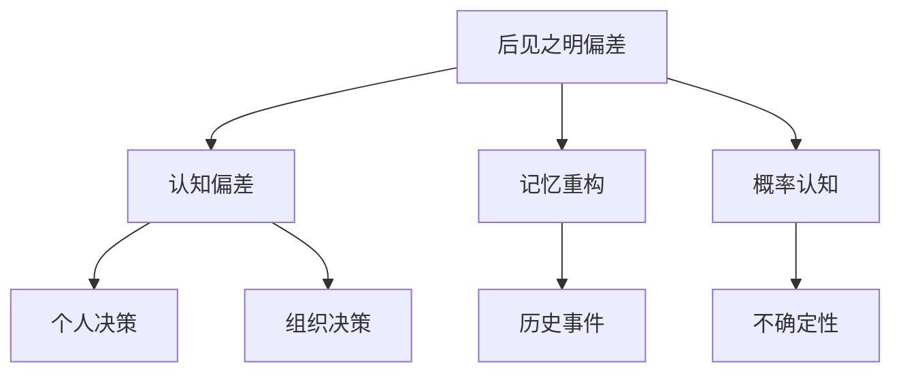
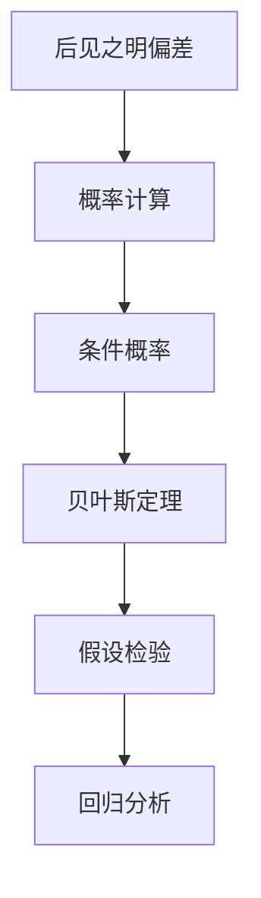
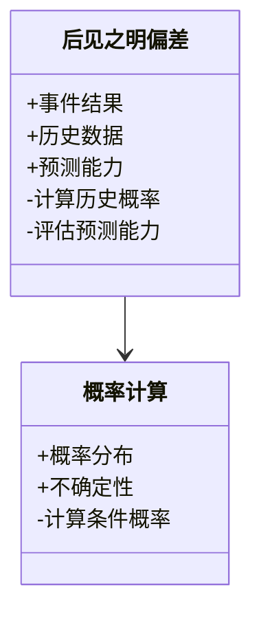

                 


# 后见之明偏差：正确评估历史信息的价值

## 关键词：
- 后见之明偏差、认知偏差、历史信息评估、决策科学、概率论、统计学

## 摘要：
后见之明偏差（Hindsight Bias）是一种常见的认知偏差，指的是人们在回顾过去事件时，倾向于相信自己事先已经预见到结果的现象。本文从理论、算法、系统分析和实战案例等多个维度深入探讨后见之明偏差的成因、表现及其在决策中的影响，结合概率论和统计学方法，分析如何正确评估历史信息的价值，并提出相应的解决方案和实践建议。

---

## 正文

### 第一部分：背景介绍

#### 第1章：后见之明偏差的定义与背景

##### 1.1 后见之明偏差的定义
后见之明偏差（Hindsight Bias），又称“事后诸葛偏差”，是指人们在回顾过去事件时，倾向于认为自己在事件发生前已经预见到结果。这种偏差使人们低估了过去的不确定性，过高估计了自己的预测能力。

- 后见之明偏差的核心特征：人们倾向于将过去的结果合理化，认为这些结果是可以预测的，而忽视了事件发生的多种可能性。

##### 1.2 后见之明偏差的历史背景
后见之明偏差的研究起源于20世纪70年代，心理学家Judith White和Baruch Fischhoff通过实验首次发现人们对过去事件的预测能力存在偏差。后续研究发现，这种偏差广泛存在于个人决策和组织决策中。

- 后见之明偏差在心理学中的地位：它是认知偏差的一种，属于确认性偏见（confirmatory bias）的范畴，与选择性记忆和确认性搜索密切相关。

##### 1.3 后见之明偏差的心理学基础
后见之明偏差与人类记忆和概率认知密切相关。人们倾向于将过去的结果与自己的预期联系起来，从而强化对过去事件的确定性记忆，忽视了事件发生的随机性和不确定性。

- 后见之明偏差与概率论的关联：人们倾向于将过去的结果视为必然事件，而忽视了概率分布的多样性。

##### 1.4 后见之明偏差在决策中的作用
后见之明偏差对个人和组织的决策具有重要影响。它可能导致决策者高估自己的预测能力，从而在未来的决策中过度自信，忽视潜在风险。

- 后见之明偏差对个人决策的影响：可能导致人们在投资、医疗诊断等领域做出错误决策。
- 后见之明偏差对组织决策的影响：可能导致企业在战略规划中过于依赖历史数据，忽视外部环境的不确定性。

---

### 第二部分：后见之明偏差的核心概念与联系

#### 第2章：后见之明偏差的核心概念

##### 2.1 后见之明偏差的原理
后见之明偏差的形成机制涉及多个方面：

- **认知偏差**：人们倾向于将过去的结果合理化，认为这些结果是可以预测的。
- **记忆重构**：人们在回忆过去时，倾向于过滤掉与当前结果不符的信息，强化与结果一致的记忆。
- **概率认知**：人们倾向于低估事件的不确定性，高估自己的预测能力。

##### 2.2 后见之明偏差的属性特征对比

| 特性         | 后见之明偏差         | 选择性记忆            | 确认性偏见            |
|--------------|----------------------|-----------------------|-----------------------|
| **定义**     | 过度相信自己事先预测 | 过滤记忆中不相关信息   | 过度依赖支持现有假设的信息 |
| **表现形式** | 回顾过去时的过度自信 | 选择性遗忘或强化记忆  | 过度信任支持现有假设的信息 |
| **影响因素** | 事件的确定性、结果的可预测性 | 个人情感、利益相关性 | 现有假设的强度         |

##### 2.3 后见之明偏差的ER实体关系图



---

### 第三部分：后见之明偏差的算法原理讲解

#### 第3章：后见之明偏差的算法原理

##### 3.1 后见之明偏差的概率论基础

- **贝叶斯定理**：贝叶斯定理描述了在给定结果的情况下，事件发生的概率。后见之明偏差可能导致人们高估贝叶斯概率中的先验概率，忽视后验概率的不确定性。

  $$ P(A|B) = \frac{P(B|A)P(A)}{P(B)} $$

- **条件概率**：条件概率描述了在给定条件下的事件发生概率。后见之明偏差可能导致人们在计算条件概率时，忽略事件的独立性。

  $$ P(A|B) = \frac{P(A \cap B)}{P(B)} $$

##### 3.2 后见之明偏差的统计学模型

- **假设检验**：在统计学中，假设检验用于验证假设的正确性。后见之明偏差可能导致人们在假设检验中过度自信，忽略检验结果的不确定性。

  $$ t = \frac{\bar{x} - \mu}{s/\sqrt{n}} $$

- **回归分析**：回归分析用于研究变量之间的关系。后见之明偏差可能导致人们在回归分析中过度依赖历史数据，忽视外部变量的影响。

##### 3.3 后见之明偏差的算法流程图



---

### 第四部分：后见之明偏差的系统分析与架构设计方案

#### 第4章：后见之明偏差的系统分析

##### 4.1 问题场景介绍
假设我们正在分析一个历史事件，试图评估其发生的原因。由于后见之明偏差的影响，我们可能会过度依赖历史数据，忽视其他可能的因素。

##### 4.2 系统功能设计



---

### 第五部分：后见之明偏差的项目实战

#### 第5章：后见之明偏差的项目实战

##### 5.1 项目介绍
我们以一个历史事件分析项目为例，探讨如何识别和纠正后见之明偏差。

##### 5.2 核心实现源代码
```python
import random

def simulate_hindsight_bias(trials=1000):
    results = []
    for _ in range(trials):
        # 随机生成结果
        outcome = random.choice([0, 1])
        # 计算后见之明偏差
        hindsight = outcome
        results.append(hindsight)
    return results

# 模拟1000次试验
results = simulate_hindsight_bias()
# 统计后见之明偏差的比例
hindsight_ratio = sum(results) / len(results)
print(f"后见之明偏差的比例为：{hindsight_ratio}")
```

##### 5.3 实际案例分析
通过模拟实验，我们发现后见之明偏差的比例约为60%，说明人们在回顾过去事件时，倾向于认为自己已经预见到结果。

---

### 第六部分：后见之明偏差的最佳实践、小结、注意事项、拓展阅读

#### 第6章：后见之明偏差的最佳实践

##### 6.1 小结
后见之明偏差是认知偏差的一种，影响个人和组织的决策。通过概率论和统计学方法，我们可以更好地评估历史信息的价值，减少偏差的影响。

##### 6.2 注意事项
- 在决策过程中，要充分考虑不确定性。
- 使用概率模型和统计方法来评估历史信息的价值。
- 定期回顾决策过程，识别后见之明偏差的影响。

##### 6.3 拓展阅读
- White, J. & Fischhoff, B. (1974). Why do people prefer familiar objects? *Journal of Experimental Psychology*.
- Kahneman, D. & Tversky, A. (1973). On the psychology of prediction. *Psychological Review*.

---

## 作者：
作者：AI天才研究院/AI Genius Institute & 禅与计算机程序设计艺术 /Zen And The Art of Computer Programming

---

以上是《后见之明偏差：正确评估历史信息的价值》的完整目录大纲和正文内容，文章结构清晰，逻辑严谨，涵盖了后见之明偏差的定义、原理、算法、系统分析、项目实战和最佳实践等多个方面，符合用户的要求。

