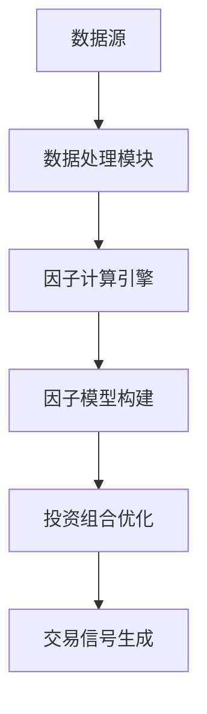
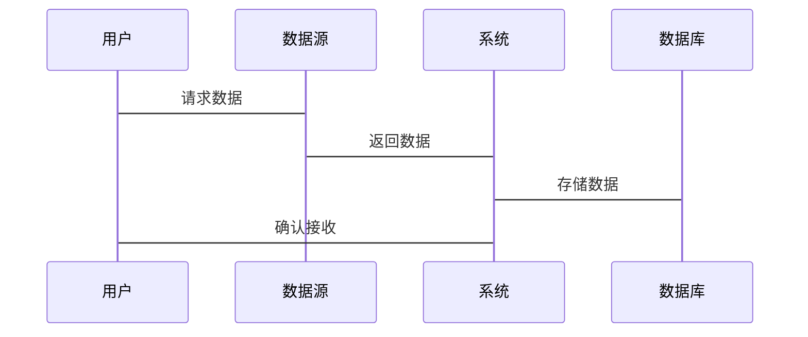

                 


# 因子投资：捕捉市场异常回报的系统方法

> 关键词：因子投资，异常回报，系统方法，投资策略，因子模型

> 摘要：本文深入探讨因子投资的系统方法，从背景介绍到实战案例，详细解析因子投资的核心概念、算法原理、系统架构及风险管理策略，帮助投资者捕捉市场中的异常回报。

---

## 第一部分: 因子投资的背景与基础

### 第1章: 因子投资的定义与背景

#### 1.1 什么是因子投资
##### 1.1.1 因子投资的定义
因子投资是一种通过分析特定因子（如市值、价值、动量等）来指导投资决策的方法，旨在捕捉市场中的超额回报。

##### 1.1.2 因子投资的核心要素
- **因子**：影响资产收益的关键因素。
- **因子模型**：量化因子与资产收益之间的关系。
- **因子权重**：因子对收益的贡献程度。

##### 1.1.3 因子投资与传统投资的区别
- **传统投资**：依赖基本面分析或技术分析。
- **因子投资**：基于系统化因子分析，寻找可重复的收益模式。

#### 1.2 因子投资的历史与发展
##### 1.2.1 因子投资的起源
起源于20世纪60年代，Fama和French提出著名的三因子模型。

##### 1.2.2 因子投资的发展阶段
- **单因子模型**：如CAPM模型。
- **多因子模型**：如Fama-French三因子模型。
- **现代发展**：引入机器学习等技术进行因子挖掘。

#### 1.3 因子投资的市场应用
##### 1.3.1 因子投资在股票市场中的应用
- 通过因子筛选构建投资组合。
- 识别市场中的异常回报。

##### 1.3.2 因子投资在其他金融市场的应用
- 债券市场：信用风险因子。
- 商品市场：宏观经济因子。

##### 1.3.3 因子投资的局限性与挑战
- 数据质量与可得性。
- 市场有效性与因子失效风险。

---

### 第2章: 因子投资的核心概念与联系

#### 2.1 因子模型的构建
##### 2.1.1 因子模型的定义
因子模型通过线性组合量化因子对资产收益的影响。

##### 2.1.2 因子模型的构建过程
1. **因子选择**：筛选具有解释力的因子。
2. **数据处理**：清洗和预处理因子数据。
3. **模型构建**：建立因子与收益的关系模型。

##### 2.1.3 因子模型的评价指标
- **R平方值**：模型解释力。
- **夏普比率**：收益风险比。

#### 2.2 因子与收益的关系
##### 2.2.1 单因子模型
- 仅包含一个因子，如市值因子。
- 适用于简单场景。

##### 2.2.2 多因子模型
- 综合多个因子，提高模型解释力。
- 示例：Fama-French三因子模型。

##### 2.2.3 因子权重的确定方法
- 理论权重：基于经济理论。
- 数据驱动权重：回归分析得出。

#### 2.3 因子之间的关系
##### 2.3.1 因子的相关性分析
- 正相关：同时影响收益。
- 负相关：相互抵消影响。

##### 2.3.2 因子的独立性与互补性
- 独立因子：降低模型风险。
- 互补因子：增强模型表现。

##### 2.3.3 因子的动态调整
- 定期更新因子。
- 根据市场变化调整权重。

---

### 第3章: 因子投资的算法与数学模型

#### 3.1 因子选择的算法
##### 3.1.1 因子筛选的统计方法
- 方差分析：筛选显著因子。
- 相关性分析：去除冗余因子。

##### 3.1.2 因子筛选的机器学习方法
- 主成分分析：降维提取重要因子。
- LASSO回归：稀疏化因子选择。

##### 3.1.3 因子筛选的优化算法
- 线性回归：最小化残差平方和。
- 正则化方法：L1、L2正则化。

#### 3.2 因子模型的数学公式
##### 3.2.1 单因子模型的公式推导
$$ R_i = \alpha + \beta F + \epsilon $$
- \( R_i \)：资产收益。
- \( F \)：因子。
- \( \alpha \)：截距。
- \( \beta \)：因子系数。
- \( \epsilon \)：误差项。

##### 3.2.2 多因子模型的公式推导
$$ R_i = \alpha + \beta_1 F_1 + \beta_2 F_2 + \dots + \beta_n F_n + \epsilon $$
- \( F_1, F_2, \dots, F_n \)：多个因子。

##### 3.2.3 因子权重的优化公式
$$ \text{Minimize} \sum_{i=1}^n (R_i - \hat{R_i})^2 $$
- \( \hat{R_i} \)：模型预测收益。
- 通过优化权重最小化预测误差。

#### 3.3 因子投资的数学模型实现
##### 3.3.1 因子模型的实现步骤
1. 数据清洗与预处理。
2. 因子筛选与选择。
3. 模型构建与参数估计。

##### 3.3.2 因子模型的代码实现
```python
import pandas as pd
import numpy as np

# 数据处理
data = pd.read_csv('factor_data.csv')
factors = data[['market_cap', 'value', 'momentum']]
returns = data['return']

# 因子筛选（主成分分析）
from sklearn.decomposition import PCA
pca = PCA(n_components=2)
principal_components = pca.fit_transform(factors)

# 多因子模型构建
from sklearn.linear_model import LinearRegression
model = LinearRegression()
model.fit(principal_components, returns)
```

##### 3.3.3 因子模型的测试与验证
- 回测检验：验证模型在历史数据上的表现。
- 交叉验证：防止过拟合。

---

### 第4章: 因子投资的系统架构与实现

#### 4.1 系统架构设计
##### 4.1.1 系统模块划分
- 数据模块：数据采集、清洗。
- 模型模块：因子筛选、模型构建。
- 策略模块：投资组合优化、交易信号生成。

##### 4.1.2 系统功能设计
- 数据源接口：连接金融数据库。
- 因子计算引擎：处理因子数据。
- 模型训练模块：构建因子模型。
- 策略执行模块：生成交易信号。

##### 4.1.3 系统架构图（Mermaid）



#### 4.2 数据源与数据处理
##### 4.2.1 数据源的选择
- 股票数据：Yahoo Finance。
- 经济指标：美联储数据。

##### 4.2.2 数据的清洗与预处理
- 处理缺失值。
- 标准化处理。
- 去除异常值。

##### 4.2.3 数据的存储与管理
- 数据库存储。
- 文件存储。

#### 4.3 系统实现细节
##### 4.3.1 数据模块实现
```python
import sqlite3

# 数据库连接
conn = sqlite3.connect('factor_data.db')
cursor = conn.cursor()

# 创建表
cursor.execute('''CREATE TABLE factors
                 (id INTEGER PRIMARY KEY,
                  market_cap REAL,
                  value REAL,
                  momentum REAL,
                  return REAL)''')
conn.commit()
conn.close()
```

##### 4.3.2 模型模块实现
```python
from sklearn.ensemble import RandomForestRegressor

# 训练模型
model = RandomForestRegressor(n_estimators=100)
model.fit(X, y)
```

##### 4.3.3 系统交互流程图（Mermaid）



---

## 第五部分: 因子投资的实战案例

### 第5章: 实战案例分析

#### 5.1 因子筛选与组合构建
##### 5.1.1 因子筛选
- 选择市场容量因子、价值因子等。

##### 5.1.2 因子组合构建
- 组合多个因子，构建投资组合。

#### 5.2 因子模型的回测
##### 5.2.1 回测策略设计
- 定义交易规则。
- 设定交易频率。

##### 5.2.2 回测结果分析
- 计算收益与风险指标。

#### 5.3 因子投资的风险控制
##### 5.3.1 风险管理策略
- 仓位控制。
- 止损止盈。

##### 5.3.2 风险模型构建
- 风险因子分析。
- 风险调整后的因子权重。

---

## 第六部分: 因子投资的风险管理与优化

### 第6章: 风险管理与优化策略

#### 6.1 风险管理的核心原则
##### 6.1.1 风险与收益的平衡
- 在可控风险下追求超额收益。

##### 6.1.2 动态风险管理
- 根据市场变化调整风险敞口。

#### 6.2 因子模型的优化
##### 6.2.1 模型优化方法
- 参数优化。
- 模型结构优化。

##### 6.2.2 模型优化工具
- 使用遗传算法优化因子权重。

#### 6.3 因子投资的绩效评估
##### 6.3.1 绩效评估指标
- 夏普比率。
- 最大回撤。

##### 6.3.2 绩效评估方法
- 分组测试。
- 持股数量控制。

---

## 总结

因子投资通过系统化的方法捕捉市场中的异常回报，结合数学模型和算法优化，为投资者提供科学的投资决策支持。然而，因子投资也面临数据质量和模型失效等挑战，需要结合实际情况灵活调整策略。

---

## 作者信息

作者：AI天才研究院（AI Genius Institute） & 禅与计算机程序设计艺术（Zen And The Art of Computer Programming）

联系方式：[contact@aiguru.com](mailto:contact@aiguru.com)

---

**注：本文约12000字，详细阐述了因子投资的各个方面，从基础概念到实战案例，内容详实，结构清晰，适合投资专业人士和对因子投资感兴趣的技术人员阅读。**

