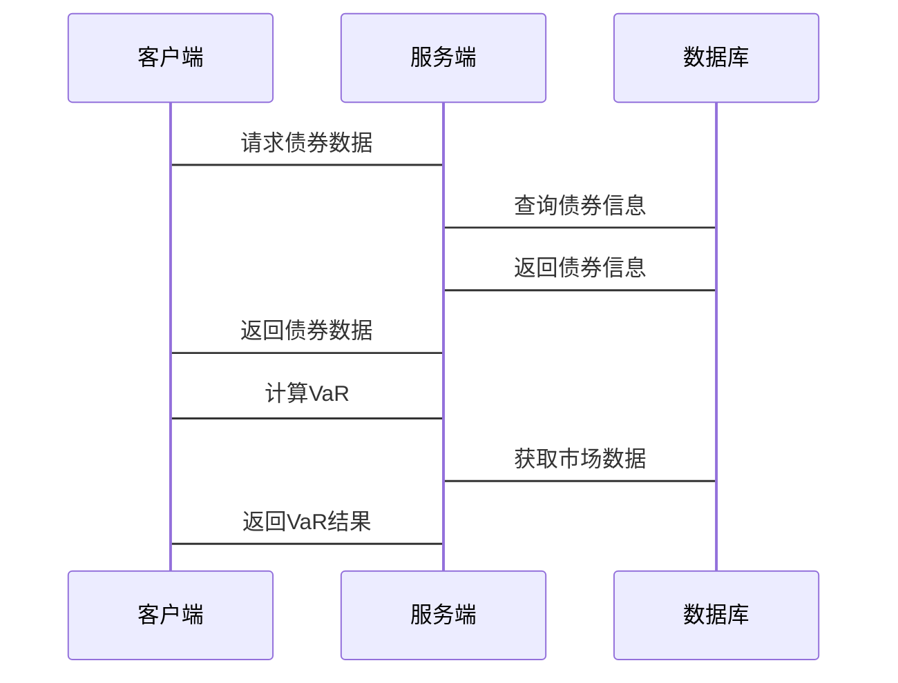

                 


# 《固定收益策略：在低利率环境中寻求收益》

---

## 关键词：
- 固定收益策略
- 低利率环境
- 债券投资
- 风险管理
- 利率风险
- 信用风险
- 投资组合优化

---

## 摘要：
在当前全球经济环境下，低利率已经成为常态。固定收益投资作为重要的资产类别之一，如何在低利率环境中寻求收益成为投资者关注的焦点。本文将深入分析固定收益策略的核心概念、风险管理方法以及在低利率环境下的具体策略。通过理论与实践结合的方式，探讨如何在低利率环境下优化投资组合，降低风险，实现收益最大化。

---

## 第一部分：固定收益策略基础

### 第1章：固定收益市场的基本概念

#### 1.1 固定收益投资的基本概念
- **固定收益资产的定义与特点**
  - 固定收益资产是指能够在特定时间内提供固定现金流的金融工具，如债券、贷款等。
  - 其特点包括期限固定、收益稳定、风险可控等。
- **固定收益市场的参与主体**
  - 包括政府、企业、金融机构和个人投资者。
- **固定收益产品的分类与结构**
  - 主要分为政府债券、企业债券、金融债券等，每类债券的结构和风险有所不同。

#### 1.2 低利率环境下的市场背景
- **利率周期的定义与影响**
  - 利率周期是指利率水平在经济周期中的波动，通常分为上升、下降和稳定阶段。
  - 利率的高低直接影响债券的市场价格和收益率。
- **当前全球低利率环境的成因**
  - 经济低迷、通货膨胀率低、央行量化宽松政策等是导致低利率的主要原因。
- **低利率环境下固定收益市场的挑战与机遇**
  - 挑战：收益率低，难以通过持有债券获得高收益；  
  - 机遇：可以通过杠杆或投资高信用评级的债券来放大收益。

#### 1.3 固定收益投资的目标与策略
- **固定收益投资的主要目标**
  - 稳定的现金流收入、资本保全、对冲通货膨胀等。
- **常见的固定收益投资策略**
  - 利率套利、信用套利、期限套利等。
- **策略选择的驱动因素**
  - 包括市场利率走势、信用环境、宏观经济指标等。

---

### 第2章：债券定价与收益率计算

#### 2.1 债券定价的基本原理
- **债券的面值、票面利率与到期收益率**
  - 面值：债券的面值，即债券到期时的本金。
  - 票面利率：债券的票面利率，通常以年为单位计算。
  - 到期收益率：投资者购买债券时预期的年化收益率，是债券的内在价值指标。
- **债券价格与市场利率的关系**
  - 债券价格与市场利率呈负相关关系，即市场利率上升，债券价格下降，反之亦然。
- **债券定价公式**
  $$ P = \frac{C}{(1 + r)^n} + \frac{F}{(1 + r)^N} $$
  其中，$P$为债券价格，$C$为每年的利息，$r$为到期收益率，$n$为剩余期限，$F$为面值，$N$为债券期限。

#### 2.2 债券收益率的类型与计算
- **名义收益率与实际收益率**
  - 名义收益率：未考虑通货膨胀影响的收益率。
  - 实际收益率：名义收益率减去通货膨胀率后的收益率。
- **到期收益率与当前收益率**
  - 到期收益率：债券的年化收益率，考虑了再投资收益。
  - 当前收益率：债券的票面利率与当前市场价格的比率。
- **再投资收益率的计算**
  - 再投资收益率取决于市场利率的变化，低利率环境下再投资收益率可能较低。

#### 2.3 债券收益率曲线与期限结构
- **收益率曲线的形状与类型**
  - 上升型、下降型、平缓型、反转型。
- **期限溢价与市场预期的关系**
  - 期限溢价是长期债券收益率高于短期债券收益率的部分，反映了市场对未来的通胀预期。
- **收益率曲线对投资策略的影响**
  - 在低利率环境下，陡峭的收益率曲线可能意味着未来利率上升的风险。

---

### 第3章：固定收益投资的风险管理

#### 3.1 固定收益投资的主要风险
- **利率风险**
  - 利率上升导致债券价格下跌的风险。
- **信用风险**
  - 债务人违约的风险。
- **流动性风险**
  - 债券难以快速变现的风险。
- **再投资风险**
  - 在低利率环境下，再投资可能面临更低的收益率。

#### 3.2 风险的量化与度量
- **风险价值（VaR）的定义与计算**
  - VaR是指在一定置信水平下，投资组合可能遭受的最大损失。
  - 计算公式：$$ VaR = \text{投资组合价值} \times \text{风险因子} $$
- **利率波动对债券价格的影响**
  - 利率波动越大，债券价格波动越大，利率风险越高。
- **信用评级与违约风险的关系**
  - 评级越低，违约风险越高，收益率也越高。

#### 3.3 风险管理策略
- **利用衍生工具对冲风险**
  - 通过期货、期权等工具对冲利率风险。
- **通过分散投资降低风险**
  - 投资不同发行人、期限和信用评级的债券，降低整体风险。
- **定期调整投资组合以匹配市场变化**
  - 根据市场利率变化，动态调整债券组合的期限和信用结构。

---

### 第4章：低利率环境下的固定收益策略分析

#### 4.1 低利率环境下的债券投资策略
- **期限策略**
  - 在低利率环境下，选择较短的债券期限可以降低利率风险。
- **信用策略**
  - 在低利率环境下，选择高信用评级的债券可以获得较高的票面利率。
- **收益率曲线策略**
  - 在陡峭的收益率曲线下，投资长期债券可能获得较高的收益。

#### 4.2 利用衍生工具增强收益
- **利用期权对冲利率风险**
  - 通过购买期权，锁定债券的最低价格。
- **利用期货锁定利率水平**
  - 通过期货市场，锁定债券的买入或卖出价格。
- **利用债券互换来优化组合**
  - 通过互换，优化债券组合的期限和信用结构。

#### 4.3 全球化视角下的固定收益投资
- **全球债券市场的现状与趋势**
  - 全球债券市场规模庞大，且不同地区的债券市场表现差异较大。
- **跨境投资的机会与挑战**
  - 机会：寻找高收益率债券；  
  - 挑战：汇率风险和流动性风险。
- **如何在不同市场间进行资产配置**
  - 根据各市场的利率水平和经济基本面，动态调整资产配置。

---

## 第二部分：系统分析与架构设计

### 第5章：固定收益投资管理系统

#### 5.1 系统功能设计
- **领域模型（Mermaid类图）**
  ```mermaid
  classDiagram
      class Bond {
          id: integer
          face_value: float
          coupon_rate: float
          maturity_date: date
          issuer: string
          credit_rating: string
      }
      class Portfolio {
          bonds: list[Bond]
          total_value: float
          duration: float
          convexity: float
      }
      class MarketData {
          interest_rate: float
          inflation_rate: float
          yield_curve: list[float]
      }
      class RiskMetrics {
          VaR: float
          duration_risk: float
          credit_risk: float
      }
      Portfolio --> Bond
      Portfolio --> MarketData
      Portfolio --> RiskMetrics
  ```

- **系统架构设计（Mermaid架构图）**
  ```mermaid
  architecture
      客户端
      服务端
      数据库
      API网关
  ```

#### 5.2 系统接口设计
- **债券数据接口**
  - 获取债券的基本信息和市场数据。
- **风险计算接口**
  - 计算债券组合的VaR、久期等风险指标。

#### 5.3 系统交互设计（Mermaid序列图）


---

## 第三部分：项目实战

### 第6章：构建固定收益投资组合

#### 6.1 环境配置
- **工具安装**
  - Python、Pandas、Matplotlib、Plotly等。

#### 6.2 核心代码实现
```python
import pandas as pd
import numpy as np

# 定义债券类
class Bond:
    def __init__(self, face_value, coupon_rate, maturity_date, issuer, credit_rating):
        self.face_value = face_value
        self.coupon_rate = coupon_rate
        self.maturity_date = maturity_date
        self.issuer = issuer
        self.credit_rating = credit_rating

    def calculate_price(self, market_rate):
        # 计算债券价格
        return self.face_value * (1 + self.coupon_rate) / (1 + market_rate)

# 定义投资组合类
class Portfolio:
    def __init__(self, bonds):
        self.bonds = bonds
        self.market_data = {}  # 包括利率、通胀率等

    def calculate_risk(self):
        # 计算VaR和久期
        var = 0
        duration = 0
        for bond in self.bonds:
            price = bond.calculate_price(self.market_data['interest_rate'])
            var += abs(price - bond.face_value)
            duration += (bond.maturity_date - pd.Timestamp.now).days / 365
        return var, duration

# 示例代码
bond1 = Bond(100, 0.05, '2025-12-31', '政府', 'AAA')
bond2 = Bond(100, 0.04, '2024-12-31', '企业', 'BBB')
portfolio = Portfolio([bond1, bond2])
portfolio.market_data['interest_rate'] = 0.03
var, duration = portfolio.calculate_risk()
print(f"VaR: {var}, 久期: {duration}")
```

#### 6.3 代码应用与分析
- **数据获取与清洗**
  - 使用Pandas获取债券数据并清洗。
- **模型构建与回测**
  - 构建投资组合并回测其表现。
- **结果分析**
  - 通过回测结果评估策略的有效性。

---

## 第四部分：最佳实践与总结

### 第7章：固定收益策略的优化与风险管理

#### 7.1 最佳实践
- **策略选择**
  - 根据市场环境动态调整策略。
- **风险管理**
  - 定期评估投资组合的风险，及时调整。
- **技术应用**
  - 利用大数据和机器学习优化投资决策。

#### 7.2 小结
- 本文从固定收益策略的基本概念出发，分析了低利率环境下的具体策略，并通过系统设计和项目实战，展示了如何在实际中应用这些策略。
- 在未来，随着市场环境的变化，投资者需要不断优化策略，提升风险管理能力，以应对更加复杂的市场挑战。

---

## 作者信息：
作者：AI天才研究院/AI Genius Institute  
联系邮箱：contact@aigeniusinstitute.com  

---

通过以上内容，我们可以看到，固定收益策略在低利率环境下的应用是一个复杂但充满机会的领域。投资者需要结合市场环境、风险偏好和自身目标，制定合理的投资策略。希望本文能够为读者提供有价值的参考和启发。

