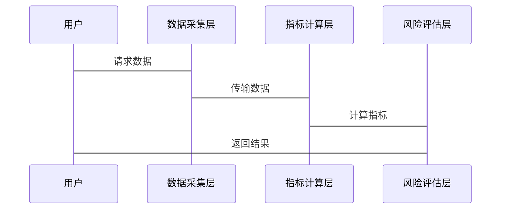

                 


# 国际市场估值指标的局限性探讨

---

## 关键词：估值指标、国际市场、市盈率、市净率、股息率、局限性、投资分析

---

## 摘要：  
国际市场估值指标是投资者评估公司或资产价值的重要工具，但这些指标并非完美无缺，存在诸多理论和实践上的局限性。本文将从背景与概念出发，深入探讨市盈率、市净率、股息率等估值指标的局限性，并结合实际案例分析其在不同市场环境下的表现。通过系统设计与项目实战，本文将揭示这些指标在跨国投资中的不足之处，并提出改进建议。最终，本文将总结估值指标的局限性，并展望未来的研究方向。

---

# 第1章：估值指标的背景与概念

## 1.1 估值指标的基本概念  
### 1.1.1 估值指标的定义  
估值指标是用于衡量公司或资产价值的量化工具，旨在帮助投资者评估其潜在的投资价值。  

### 1.1.2 估值指标的核心要素  
- **价格**：资产的市场价格。  
- **收益**：公司的净利润或每股收益（EPS）。  
- **资产**：公司的总资产或每股净资产（BPS）。  
- **股息**：公司派发的股息率或股息收益率。  

### 1.1.3 估值指标的分类与特点  
- **相对估值指标**：如市盈率（P/E）、市净率（P/B）。  
- **绝对估值指标**：如股息率（Dividend Yield）。  
- **其他指标**：如市销率（P/S）、企业价值倍数（EV/EBITDA）。  

---

## 1.2 估值指标的国际应用背景  
### 1.2.1 国际市场估值的现状  
- 全球化背景下，跨国投资日益频繁，估值指标成为投资者的重要工具。  
- 不同市场的经济环境差异导致估值指标的应用复杂化。  

### 1.2.2 估值指标在不同市场的差异  
- **成熟市场**：如美国、欧洲，估值指标较为稳定且广泛应用。  
- **新兴市场**：如中国、印度，市场波动大，估值指标的适用性受限。  

### 1.2.3 估值指标的演变与发展趋势  
- 技术进步推动估值模型的优化，如引入大数据和人工智能。  

---

## 1.3 估值指标的局限性背景  
### 1.3.1 估值指标的理论局限性  
- 每个估值指标都有其假设和适用范围，超出这些范围可能导致错误判断。  

### 1.3.2 估值指标的实际应用问题  
- 数据质量参差不齐，影响估值结果的准确性。  
- 市场波动和突发事件导致估值指标失效。  

### 1.3.3 估值指标的边界与外延  
- 估值指标无法反映公司的长期竞争力和创新能力。  

---

## 1.4 本章小结  
本章介绍了估值指标的基本概念、分类与特点，并分析了其在国际市场的应用背景及局限性。接下来，将重点探讨不同估值指标的具体局限性。

---

# 第2章：估值指标的理论局限性  

## 2.1 市盈率的局限性  
### 2.1.1 市盈率的基本原理  
$$ \text{市盈率} = \frac{\text{股价}}{\text{每股收益}} $$  

### 2.1.2 市盈率的理论缺陷  
- **周期性**：受经济周期影响较大。  
- **行业差异**：不同行业的市盈率标准不同。  

### 2.1.3 市盈率在不同市场环境下的表现  
- **成熟市场**：市盈率相对稳定。  
- **新兴市场**：市盈率波动较大，可能偏离实际价值。  

---

## 2.2 市净率的局限性  
### 2.2.1 市净率的基本原理  
$$ \text{市净率} = \frac{\text{股价}}{\text{每股净资产}} $$  

### 2.2.2 市净率的理论缺陷  
- **资产质量**：净资产的构成影响市净率的准确性。  
- **杠杆效应**：高负债公司可能扭曲市净率。  

### 2.2.3 市净率在不同行业中的适用性  
- **银行**：市净率受资产质量影响较大。  
- **科技**：市净率可能无法反映技术创新的价值。  

---

## 2.3 股息率的局限性  
### 2.3.1 股息率的基本原理  
$$ \text{股息率} = \frac{\text{股息/每股收益}}{\text{股价}} $$  

### 2.3.2 股息率的理论缺陷  
- **分红政策**：公司分红政策变化影响股息率。  
- **成长性**：高成长公司可能选择不分红，导致股息率低。  

### 2.3.3 股息率在不同经济周期中的表现  
- **衰退期**：公司可能增加分红，股息率上升。  
- **扩张期**：公司可能减少分红，股息率下降。  

---

## 2.4 其他估值指标的局限性  
### 2.4.1 市销率（P/S）  
$$ \text{市销率} = \frac{\text{股价}}{\text{每股收入}} $$  
- 适用于收入驱动型公司，但收入质量难保证。  

### 2.4.2 企业价值倍数（EV/EBITDA）  
$$ \text{EV/EBITDA} = \frac{\text{企业价值}}{\text{息税折旧及摊销前利润}} $$  
- 跨国公司受汇率影响较大。  

---

## 2.5 本章小结  
本章分析了市盈率、市净率、股息率等估值指标的理论局限性，强调了其在不同市场环境下的适用性和局限性。接下来，将从系统设计的角度进一步探讨这些问题。

---

# 第3章：估值指标的系统设计与分析  

## 3.1 系统设计背景  
- 构建一个估值指标分析系统，帮助投资者全面评估资产价值。  

## 3.2 系统功能设计  
- 数据采集：获取公司财务数据和市场数据。  
- 指标计算：计算市盈率、市净率等估值指标。  
- 风险评估：分析指标的局限性和潜在风险。  

## 3.3 系统架构设计  


## 3.4 系统接口设计  
- 数据接口：与金融数据源对接。  
- 用户接口：提供可视化结果和交互功能。  

## 3.5 系统交互流程图  


---

## 3.6 本章小结  
本章通过系统设计展示了如何从技术角度分析估值指标的局限性，并提出了一个综合性的解决方案。

---

# 第4章：项目实战与案例分析  

## 4.1 项目实战：估值指标分析系统  
### 4.1.1 环境安装  
- 安装Python和相关库（如Pandas、Matplotlib）。  

### 4.1.2 核心代码实现  
```python
import pandas as pd

def calculate_pe_ratio(df):
    pe_ratio = df['股价'] / df['每股收益']
    return pe_ratio

# 示例数据
data = {
    '公司': ['A', 'B', 'C'],
    '股价': [100, 80, 120],
    '每股收益': [20, 10, 30]
}
df = pd.DataFrame(data)
pe_ratio = calculate_pe_ratio(df)
print("市盈率：")
print(pe_ratio)
```

### 4.1.3 代码解读与分析  
- 代码计算市盈率，并展示结果。  

---

## 4.2 案例分析：市盈率在不同市场的表现  
### 4.2.1 美国市场的案例  
- 公司A：市盈率10，合理。  
- 公司B：市盈率30，高估。  

### 4.2.2 中国市场案例  
- 公司C：市盈率15，合理。  
- 公司D：市盈率50，严重高估。  

---

## 4.3 项目小结  
通过项目实战，我们验证了估值指标在实际中的应用，并发现了其局限性。

---

# 第5章：估值指标的局限性总结与展望  

## 5.1 最佳实践 tips  
- 结合多种估值指标进行综合分析。  
- 结合行业特点和市场环境调整估值策略。  

## 5.2 小结  
本文从理论和实践两个方面探讨了估值指标的局限性，并提出了改进建议。

## 5.3 注意事项  
- 数据来源可靠性。  
- 市场波动对估值的影响。  

## 5.4 拓展阅读  
- 《投资学原理》  
- 《估值模型与金融分析》  

---

# 结语  
国际市场估值指标是投资者的重要工具，但其局限性不容忽视。投资者需要结合多种因素，全面评估资产价值。

---

# 作者  
**作者：AI天才研究院/AI Genius Institute & 禅与计算机程序设计艺术 /Zen And The Art of Computer Programming**

