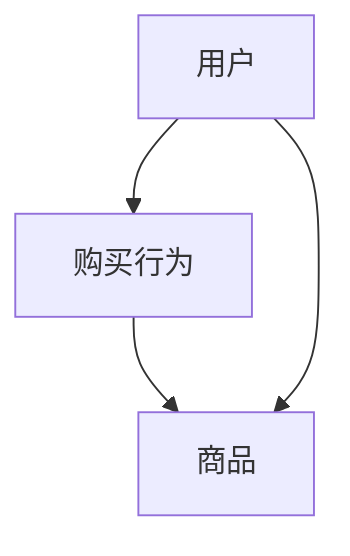
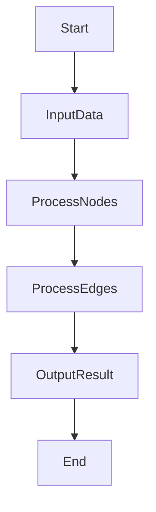
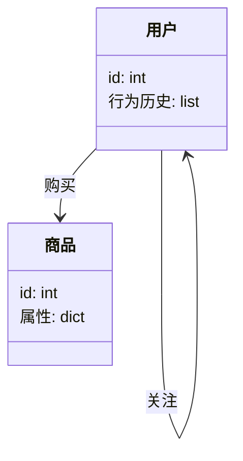

                 


# 图神经网络：处理结构化数据的AI Agent

> 关键词：图神经网络，结构化数据，AI Agent，图数据，算法原理

> 摘要：图神经网络（Graph Neural Networks, GNNs）是一种处理结构化数据的AI技术，通过建模图结构中的节点和边，能够有效处理社交网络、推荐系统、生物信息学等领域的复杂关系数据。本文将深入探讨图神经网络的核心概念、算法原理、系统设计和实际应用，帮助读者理解并掌握这一前沿技术。

---

## 正文部分

### 第一部分：背景介绍

#### 第1章：图神经网络概述

##### 1.1 图数据与结构化数据的定义
- 1.1.1 图数据的定义与特点
  - 图数据由节点和边组成，节点代表实体，边代表关系。
  - 图结构能够捕捉数据之间的复杂关系，如社交网络中的用户关系。
- 1.1.2 结构化数据与非结构化数据的对比
  - 结构化数据：有明确的组织形式，如表格数据，便于计算机处理。
  - 非结构化数据：如文本、图像，需通过特定方法提取结构信息。
- 1.1.3 图神经网络的背景与意义
  - 图神经网络在处理结构化数据方面具有独特优势，广泛应用于多个领域。

##### 1.2 图神经网络的核心概念
- 1.2.1 图数据的表示方法
  - 使用邻接矩阵或边列表示图结构。
- 1.2.2 节点、边与图的属性
  - 节点：代表实体，可携带属性信息。
  - 边：代表关系，可携带权重或方向信息。
- 1.2.3 图神经网络的定义与特点
  - 图神经网络通过聚合邻居节点的信息来更新节点表示。

##### 1.3 图神经网络的应用场景
- 1.3.1 社交网络分析
  - 分析用户行为、检测社区结构。
- 1.3.2 推荐系统
  - 基于用户行为图进行个性化推荐。
- 1.3.3 生物信息学
  - 分析生物分子结构，如蛋白质相互作用网络。
- 1.3.4 交通网络优化
  - 建模交通网络，优化路线规划。

### 第二部分：核心概念与联系

#### 第2章：图神经网络的核心概念与联系

##### 2.1 图神经网络的核心原理
- 2.1.1 图的遍历与传播
  - 通过遍历图结构，将信息从一个节点传播到另一个节点。
- 2.1.2 节点表示与特征提取
  - 利用图结构信息，提取节点的低维表示。
- 2.1.3 图结构信息的利用
  - 结合图的拓扑结构，提升模型的表达能力。

##### 2.2 图神经网络的实体关系图


##### 2.3 图神经网络的算法流程


### 第三部分：算法原理

#### 第3章：图神经网络的算法原理

##### 3.1 图卷积网络（GCN）
- 3.1.1 GCN的基本原理
  - GCN通过聚合每个节点的邻居信息来更新节点表示。
- 3.1.2 GCN的数学模型
  $$ y = \sum_{j} A_{ij} x_j $$

##### 3.2 图注意力网络（GAT）
- 3.2.1 GAT的核心思想
  - 使用注意力机制，根据边的权重动态调整信息聚合的方式。
- 3.2.2 GAT的注意力机制
  $$ \alpha_{ij} = \text{softmax}(e^{A_{ij}}) $$

### 第四部分：数学模型与公式

#### 第4章：图神经网络的数学模型

##### 4.1 图的表示
- 邻接矩阵表示：
  $$ A_{ij} = 1 \text{ 如果节点i和节点j相连，否则0} $$

##### 4.2 节点表示的更新
- GCN的更新公式：
  $$ h_i^{(l+1)} = \sum_{j} A_{ij} h_j^{(l)} $$

##### 4.3 图注意力机制
- GAT的注意力权重计算：
  $$ \alpha_{ij} = \frac{\exp(a^T h_i + b^T h_j)}{\sum_{k} \exp(a^T h_i + b^T h_k)} $$

### 第五部分：系统分析与架构设计

#### 第5章：图神经网络的系统设计

##### 5.1 项目背景与需求分析
- 系统目标：构建一个基于GNN的推荐系统。
- 用户需求：根据用户行为图推荐相关内容。

##### 5.2 系统功能设计
- 领域模型：


- 系统架构：


##### 5.3 系统接口与交互流程
- 用户请求推荐：
  ```mermaid
  sequenceDiagram
    用户 -> API: 请求推荐
    API -> 后端: 查询用户行为
    后端 -> 图模型: 生成推荐列表
    图模型 -> API: 返回推荐结果
    API -> 用户: 显示推荐
  ```

### 第六部分：项目实战

#### 第6章：基于GNN的推荐系统实现

##### 6.1 环境安装
- Python安装：
  ```bash
  python --version
  ```
- 安装依赖：
  ```bash
  pip install numpy tensorflow-gpu pyg
  ```

##### 6.2 核心代码实现
- 加载数据：
  ```python
  import torch
  from torch_geometric.data import Data

  x = torch.randn(4, 16)  # 特征矩阵
  edge_index = torch.tensor([[0, 1, 2, 3], [1, 2, 3, 0]], dtype=torch.long)  # 边索引
  data = Data(x=x, edge_index=edge_index)
  ```

- 定义模型：
  ```python
  import torch.nn as nn
  from torch_geometric.nn import GCNConv

  class GNNModel(nn.Module):
      def __init__(self):
          super(GNNModel, self).__init__()
          self.conv1 = GCNConv(16, 8, add_self_loops=True)
          self.conv2 = GCNConv(8, 4, add_self_loops=True)
          self.fc = nn.Linear(4, 1)

      def forward(self, data):
          x = self.conv1(data.x, data.edge_index)
          x = self.conv2(x, data.edge_index)
          x = self.fc(x)
          return x
  ```

##### 6.3 案例分析与结果展示
- 训练模型：
  ```python
  model = GNNModel()
  optimizer = torch.optim.Adam(model.parameters(), lr=0.01)
  criterion = nn.MSELoss()

  for epoch in range(100):
      out = model(data)
      loss = criterion(out, labels)
      loss.backward()
      optimizer.step()
  ```

### 第七部分：总结与展望

#### 第7章：总结与展望

##### 7.1 内容总结
- 图神经网络在处理结构化数据方面具有显著优势。
- GCN和GAT是两种重要的图神经网络模型。

##### 7.2 最佳实践 tips
- 数据预处理：确保图数据的完整性和准确性。
- 模型调优：选择合适的超参数，如学习率和批量大小。
- 应用场景：根据需求选择合适的模型和算法。

##### 7.3 未来展望
- 更高效的方法：如图注意力机制的改进。
- 新型图结构：如动态图和异构图的建模。
- 结合其他技术：如强化学习和生成模型的结合。

---

### 作者：AI天才研究院 & 禅与计算机程序设计艺术

---

**附录：**

- 代码示例：完整的GNN模型实现。
- 图表说明：所有Mermaid图表的详细解释。
- 参考文献：相关论文和书籍的引用列表。

---

**感谢您的阅读！**

