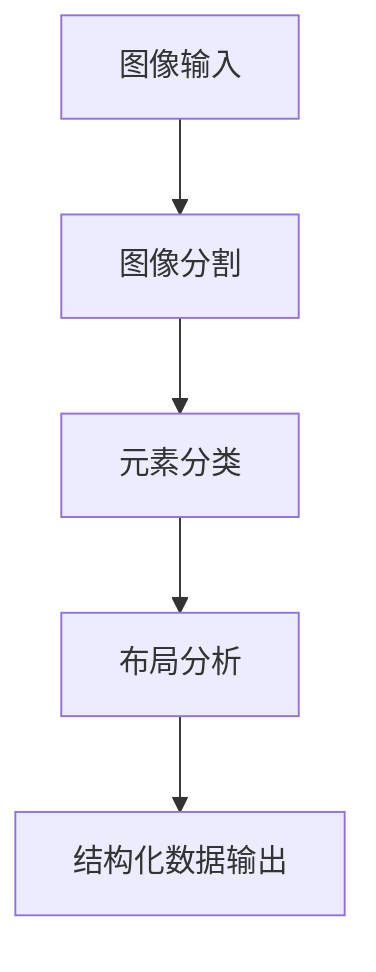
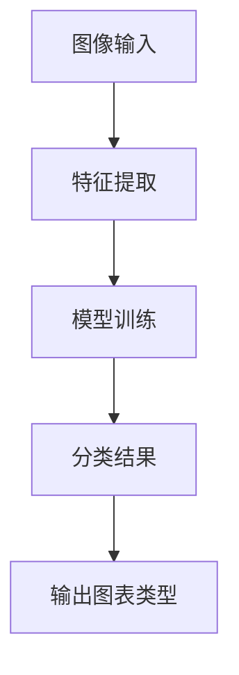
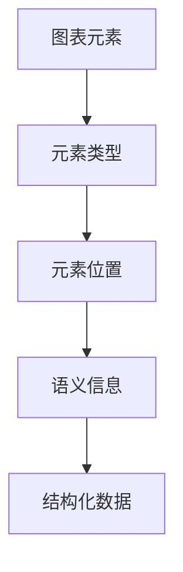

                 


# 图表理解：增强AI Agent的数据分析能力

## 关键词：图表理解，AI Agent，数据分析，图像识别，数据可视化，深度学习

## 摘要：图表理解是AI Agent增强数据分析能力的核心技术，通过对图表的结构分析、模式识别和语义理解，AI Agent能够更高效地处理和分析复杂数据，提升数据可视化能力。本文将从图表理解的基本概念、算法原理、系统设计到实际项目案例，全面解析如何通过图表理解技术提升AI Agent的数据分析能力。

---

## 第一部分：图表理解基础

### 第1章：图表理解的背景与概念

#### 1.1 图表理解的定义与重要性

图表理解是指通过计算机视觉技术，对图表中的图形、文字、数据等元素进行识别、分析和理解，进而提取图表的语义信息。它是人工智能技术在数据分析领域的重要应用之一。

**图表理解的重要性：**
- 数据可视化是人类理解和分析数据的重要工具。
- 图表理解能够帮助AI Agent自动提取数据信息，减少人工干预。
- 图表理解是实现智能数据分析和决策支持的关键技术。

#### 1.2 图表的类型与特点

图表类型多样，每种图表都有其独特的结构和信息表达方式。

**常见图表类型：**

| 图表类型 | 描述 | 特点 |
|----------|------|------|
| 柱状图 | 显示数据的分类比较 | 易于比较，适合离散数据 |
| 折线图 | 显示数据的变化趋势 | 适合连续数据，强调趋势 |
| 饼图 | 显示数据的构成比例 | 强调部分与整体的关系 |
| 散点图 | 显示数据点的分布 | 适合展示二维数据关系 |
| 面积图 | 显示数据的累积趋势 | 强调总量与部分的关系 |

**图表的结构与信息层次：**
- 主体：图表的核心内容，包括坐标轴、数据点、线条等。
- 标题：图表的名称，用于概括图表的主题。
- 标签与注释：用于解释图表中的元素和数据。

#### 1.3 图表理解的核心问题

图表理解涉及多个关键问题，包括：

1. **图表元素识别：** 对图表中的文字、线条、数据点等元素进行识别。
2. **图表结构分析：** 理解图表的布局和元素之间的关系。
3. **图表语义理解：** 提取图表的语义信息，理解图表所表达的内容。

**图表理解的流程：**
1. 图像采集与预处理：获取图表图像，进行降噪、增强等处理。
2. 图表元素识别：使用图像分割和目标检测技术，识别图表中的元素。
3. 图表结构分析：分析图表的布局和元素之间的关系。
4. 图表语义理解：提取图表的语义信息，生成结构化数据。

**图表理解的系统架构：**
- 数据输入：接收图表图像或图像路径。
- 数据处理：对图像进行预处理和特征提取。
- 数据分析：通过算法对图表进行结构分析和语义理解。
- 数据输出：输出结构化数据或语义信息。

### 第2章：图表理解的核心概念与联系

#### 2.1 图表结构分析原理

**图表结构分析的关键步骤：**
1. **图像分割：** 将图表图像分割为独立的元素，如坐标轴、数据点等。
2. **元素分类：** 对分割后的元素进行分类，确定其类型（如文字、数字、线条等）。
3. **布局分析：** 理解元素之间的空间关系，确定图表的结构。

**图表结构分析的流程图：**



#### 2.2 图表模式识别与分类

**图表模式识别的关键技术：**
- **图像分类：** 通过卷积神经网络（CNN）对图表类型进行分类。
- **特征提取：** 提取图表的视觉特征，如颜色、形状、纹理等。
- **模型训练：** 使用标注数据训练模型，提高分类准确率。

**图表类型分类的流程图：**



#### 2.3 图表语义理解与关联

**图表语义理解的关键步骤：**
1. **数据提取：** 从图表中提取文字、数字等信息。
2. **语义分析：** 理解图表所表达的含义，生成结构化数据。
3. **信息关联：** 将图表信息与其他数据源关联，提供更全面的分析。

**图表语义理解的实体关系图：**



---

## 第二部分：图表理解的算法原理

### 第3章：图表结构分析算法

#### 3.1 图像分割算法

**基于深度学习的图像分割：**
- 使用U-Net等模型对图表图像进行分割，识别图表中的元素。
- 使用交叉熵损失函数优化模型。

**图像分割的数学模型：**

$$
\text{Loss} = -\frac{1}{N}\sum_{i=1}^{N} y_i \log(p_i) + (1 - y_i) \log(1 - p_i)
$$

其中，$y_i$ 是真实标签，$p_i$ 是预测概率。

**图像分割的Python代码示例：**

```python
import tensorflow as tf
from tensorflow.keras import layers

model = tf.keras.Sequential([
    layers.Conv2D(64, (3,3), activation='relu', padding='same'),
    layers.Conv2D(64, (3,3), activation='relu', padding='same'),
    layers.MaxPooling2D((2,2)),
    layers.Conv2D(128, (3,3), activation='relu', padding='same'),
    layers.Conv2D(128, (3,3), activation='relu', padding='same'),
    layers.MaxPooling2D((2,2)),
    layers.Conv2D(256, (3,3), activation='relu', padding='same'),
    layers.Conv2D(256, (3,3), activation='relu', padding='same'),
    layers.UpSampling2D((2,2)),
    layers.Conv2DTranspose(128, (2,2), strides=(2,2), activation='relu'),
    layers.UpSampling2D((2,2)),
    layers.Conv2DTranspose(64, (2,2), strides=(2,2), activation='relu'),
    layers.Conv2D(1, (1,1), activation='sigmoid')
])
```

#### 3.2 图表元素识别算法

**基于目标检测的图表元素识别：**
- 使用YOLO等目标检测算法，识别图表中的元素。
- 使用非极大值抑制（NMS）优化检测结果。

**目标检测的数学模型：**

$$
\text{Loss} = \lambda_{\text{cls}}\mathcal{L}_{\text{cls}} + \lambda_{\text{loc}}\mathcal{L}_{\text{loc}}
$$

其中，$\mathcal{L}_{\text{cls}}$ 是分类损失，$\mathcal{L}_{\text{loc}}$ 是定位损失，$\lambda$ 是平衡因子。

**目标检测的Python代码示例：**

```python
import tensorflow as tf
from tensorflow.keras import layers

model = tf.keras.Sequential([
    layers.Conv2D(64, (3,3), activation='relu', padding='same'),
    layers.Conv2D(64, (3,3), activation='relu', padding='same'),
    layers.MaxPooling2D((2,2)),
    layers.Conv2D(128, (3,3), activation='relu', padding='same'),
    layers.Conv2D(128, (3,3), activation='relu', padding='same'),
    layers.MaxPooling2D((2,2)),
    layers.Conv2D(256, (3,3), activation='relu', padding='same'),
    layers.Conv2D(256, (3,3), activation='relu', padding='same'),
    layers.Flatten(),
    layers.Dense(128, activation='relu'),
    layers.Dense(2, activation='sigmoid')
])
```

#### 3.3 图表布局分析算法

**基于卷积神经网络的图表布局分析：**
- 使用双向长短期记忆网络（Bi-LSTM）对图表布局进行分析。
- 使用CRF层优化序列标注结果。

**布局分析的数学模型：**

$$
\text{Loss} = \sum_{i=1}^{N} \text{CE}(y_i, \hat{y}_i)
$$

其中，$\text{CE}$ 是交叉熵损失，$y_i$ 是真实标签，$\hat{y}_i$ 是预测标签。

**布局分析的Python代码示例：**

```python
import tensorflow as tf
from tensorflow.keras import layers

model = tf.keras.Sequential([
    layers.Conv2D(64, (3,3), activation='relu', padding='same'),
    layers.Conv2D(64, (3,3), activation='relu', padding='same'),
    layers.MaxPooling2D((2,2)),
    layers.Conv2D(128, (3,3), activation='relu', padding='same'),
    layers.Conv2D(128, (3,3), activation='relu', padding='same'),
    layers.MaxPooling2D((2,2)),
    layers.Flatten(),
    layers.Dense(128, activation='relu'),
    layers.Dense(128, activation='relu'),
    layers.Dense(1, activation='sigmoid')
])
```

---

### 第4章：图表模式识别与分类

#### 4.1 图像分类算法

**基于卷积神经网络的图像分类：**
- 使用ResNet等模型对图表类型进行分类。
- 使用交叉熵损失函数优化模型。

**图像分类的数学模型：**

$$
\text{Loss} = -\frac{1}{N}\sum_{i=1}^{N} y_i \log(p_i) + (1 - y_i) \log(1 - p_i)
$$

其中，$y_i$ 是真实标签，$p_i$ 是预测概率。

**图像分类的Python代码示例：**

```python
import tensorflow as tf
from tensorflow.keras import layers

model = tf.keras.Sequential([
    layers.Conv2D(64, (3,3), activation='relu', padding='same'),
    layers.Conv2D(64, (3,3), activation='relu', padding='same'),
    layers.MaxPooling2D((2,2)),
    layers.Conv2D(128, (3,3), activation='relu', padding='same'),
    layers.Conv2D(128, (3,3), activation='relu', padding='same'),
    layers.MaxPooling2D((2,2)),
    layers.Flatten(),
    layers.Dense(256, activation='relu'),
    layers.Dense(10, activation='softmax')
])
```

#### 4.2 图表类型分类算法

**基于支持向量机（SVM）的图表类型分类：**
- 使用SVM对图表类型进行分类。
- 使用核函数提高分类性能。

**图表类型分类的数学模型：**

$$
\text{Loss} = \frac{1}{2}||w||^2 + \sum_{i=1}^{N} \max(0, 1 - y_i w^T x_i - b)
$$

其中，$w$ 是权重向量，$b$ 是偏置项，$y_i$ 是真实标签，$x_i$ 是输入样本。

**图表类型分类的Python代码示例：**

```python
from sklearn.svm import SVC

model = SVC(kernel='rb

