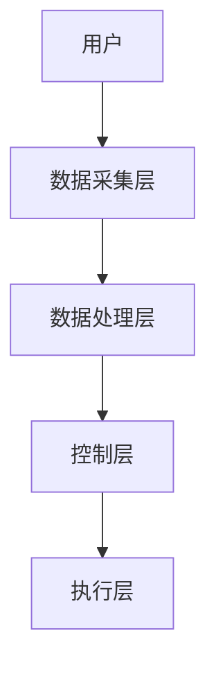
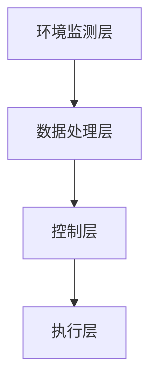
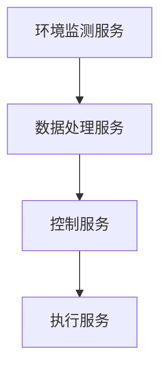

                 


# 垂直农业技术的发展与投资前景

> 关键词：垂直农业，农业技术，投资前景，农业数字化，智能种植，农业创新

> 摘要：本文系统地探讨了垂直农业技术的发展现状、核心技术、系统架构、商业模式以及投资前景。通过分析垂直农业的关键技术，如环境控制、自动化种植和物联网应用，本文揭示了其在提高土地利用率、减少资源消耗方面的优势。同时，结合实际案例和数学模型，本文详细阐述了垂直农业的投资分析与未来发展趋势，为投资者提供了有价值的参考。

---

## 第1章: 垂直农业技术的背景与定义

### 1.1 垂直农业的定义与核心概念

#### 1.1.1 垂直农业的定义
垂直农业是一种在垂直空间中进行农作物种植的技术，通过多层立体结构和智能技术实现高效种植。与传统农业相比，垂直农业不依赖自然条件，而是通过人工控制环境参数（如温度、湿度、光照）来优化生长条件。

#### 1.1.2 垂直农业的核心要素
| 核心要素 | 描述 |
|----------|------|
| 立体种植结构 | 多层立体种植，最大化土地利用率 |
| 智能环境控制 | 通过传感器和自动化设备控制环境参数 |
| 数字化管理 | 利用物联网和数据分析优化种植过程 |

#### 1.1.3 垂直农业与传统农业的区别
| 方面 | 垂直农业 | 传统农业 |
|------|---------|----------|
| 土地利用率 | 高 | 低 |
| 资源消耗 | 低 | 高 |
| 生长周期 | 短 | 长 |

### 1.2 垂直农业技术的背景与现状

#### 1.2.1 全球农业面临的挑战
- 地球人口快速增长，粮食需求增加。
- 耕地资源有限，传统农业难以满足需求。
- 气候变化导致传统农业不稳定。

#### 1.2.2 垂直农业技术的兴起
- 技术进步：物联网、人工智能和自动化技术的发展推动了垂直农业的发展。
- 市场需求：城市化进程中，人们对新鲜农产品的需求增加。

#### 1.2.3 当前垂直农业技术的应用现状
- **案例1**：日本的垂直农业大棚，采用LED光照和自动化系统。
- **案例2**：美国的垂直农业公司，专注于叶菜类作物的种植。

---

## 第2章: 垂直农业技术的核心技术与系统架构

### 2.1 垂直农业的关键技术

#### 2.1.1 环境控制技术
- **温度控制**：通过传感器实时监测并调节温度。
- **湿度控制**：利用喷雾系统保持空气湿度。
- **光照控制**：使用LED灯提供植物所需的光照。

#### 2.1.2 自动化种植技术
- **播种与移栽**：自动化设备完成播种和移栽。
- **灌溉与施肥**：精准控制灌溉水量和肥料供给。

#### 2.1.3 物联网技术在垂直农业中的应用
- 数据采集：传感器采集环境数据。
- 数据传输：通过物联网将数据传输到控制中心。
- 数据分析：利用大数据技术优化种植策略。

#### 2.1.4 AI技术的应用
- **种植预测**：基于历史数据和天气预报预测作物生长情况。
- **病虫害检测**：通过图像识别技术检测作物病虫害。

### 2.2 垂直农业系统的架构设计

#### 2.2.1 系统整体架构


#### 2.2.2 硬件部分设计
- **传感器**：温湿度传感器、光照传感器。
- **执行器**：电动阀、LED灯。
- **通信模块**：Wi-Fi或蓝牙模块。

#### 2.2.3 软件部分设计
- **数据采集模块**：采集环境数据。
- **数据处理模块**：分析数据并生成控制指令。
- **用户界面模块**：提供可视化操作界面。

---

## 第3章: 垂直农业技术的数学模型与算法原理

### 3.1 垂直农业环境控制的数学模型

#### 3.1.1 温度控制模型
$$ T(t) = T_{\text{set}} + \alpha \cdot (t - t_{\text{set}}) $$
其中，$T(t)$ 表示当前温度，$T_{\text{set}}$ 表示设定温度，$\alpha$ 表示温度变化速率，$t$ 表示时间。

#### 3.1.2 光照强度模型
$$ I(t) = I_{\text{max}} \cdot \sin\left(\frac{2\pi t}{T}\right) $$
其中，$I(t)$ 表示光照强度，$I_{\text{max}}$ 表示最大光照强度，$T$ 表示光照周期。

#### 3.1.3 湿度控制模型
$$ H(t) = H_{\text{set}} + \beta \cdot (t - t_{\text{set}}) $$
其中，$H(t)$ 表示当前湿度，$H_{\text{set}}$ 表示设定湿度，$\beta$ 表示湿度变化速率。

### 3.2 垂直农业种植优化算法

#### 3.2.1 基于遗传算法的种植优化
遗传算法是一种优化算法，通过模拟自然选择和遗传机制来寻找最优解。其步骤如下：
1. 初始化种群。
2. 计算适应度。
3. 选择优秀个体。
4. 进行交叉和变异。
5. 重复步骤2-4，直到满足终止条件。

#### 3.2.2 基于机器学习的种植预测
机器学习算法可以用来预测作物的生长情况。例如，使用随机森林算法进行分类，预测作物是否患病。

---

## 第4章: 垂直农业技术的系统分析与架构设计

### 4.1 系统功能设计

#### 4.1.1 环境监测模块
- 功能：实时监测温湿度、光照强度等环境参数。
- 输入：传感器数据。
- 输出：环境状态报告。

#### 4.1.2 自动化控制模块
- 功能：根据环境数据自动调节设备（如LED灯、喷雾系统）。
- 输入：控制指令。
- 输出：设备动作。

#### 4.1.3 数据分析模块
- 功能：分析历史数据，优化种植策略。
- 输入：历史环境数据、作物生长数据。
- 输出：优化建议。

### 4.2 系统架构设计

#### 4.2.1 分层架构设计


#### 4.2.2 微服务架构设计


#### 4.2.3 数据流设计
- 数据从传感器传到数据处理层，处理后传到控制层，控制层根据数据生成控制指令，传到执行层。

---

## 第5章: 垂直农业技术的项目实战

### 5.1 项目规划与实施

#### 5.1.1 项目背景与目标
- 项目背景：城市化进程中，土地资源有限，需要高效利用空间。
- 项目目标：实现垂直农业系统的规划、设计、实施和优化。

#### 5.1.2 项目需求分析
- 系统需求：实现环境监测、自动化控制、数据分析功能。
- 用户需求：用户需要实时查看环境数据，远程控制设备。

#### 5.1.3 项目实施计划
1. 确定项目需求。
2. 设计系统架构。
3. 实施硬件安装。
4. 开发软件系统。
5. 测试并优化系统。

### 5.2 系统核心实现

#### 5.2.1 环境监测系统的实现
- 使用Arduino控制器采集温湿度数据。
- 数据通过Wi-Fi模块传到云端。

#### 5.2.2 自动化种植系统的实现
- 使用Python编写控制脚本，控制LED灯和喷雾系统。
- 代码示例：
```python
import RPi.GPIO as GPIO
def control_light(gpio_pin):
    GPIO.output(gpio_pin, GPIO.HIGH)
```

#### 5.2.3 数据分析系统的实现
- 使用Python和Pandas进行数据分析。
- 代码示例：
```python
import pandas as pd
data = pd.read_csv('environment_data.csv')
print(data.head())
```

---

## 第6章: 垂直农业技术的投资分析与商业模式

### 6.1 垂直农业的投资分析

#### 6.1.1 市场需求分析
- 城市化进程加快，人们对新鲜农产品的需求增加。
- 疫情后，消费者更关注食品安全。

#### 6.1.2 投资成本分析
- 初期投资较高，包括设备采购和场地改造。
- 运营成本较低，资源利用效率高。

#### 6.1.3 投资回报分析
- 高效种植模式，缩短生长周期，提高产量。
- 市场价格较高，利润空间大。

### 6.2 垂直农业的商业模式

#### 6.2.1 产品销售模式
- 直接销售农产品，获取利润。

#### 6.2.2 服务订阅模式
- 提供环境监测和控制服务，按月收费。

#### 6.2.3 技术输出模式
- 将技术授权给其他企业，收取 royalties。

---

## 第7章: 垂直农业技术的未来展望与投资建议

### 7.1 垂直农业技术的未来发展趋势

#### 7.1.1 技术创新方向
- 更高效的人工智能算法。
- 更先进的环境控制技术。

#### 7.1.2 市场扩展方向
- 进一步拓展城市市场，扩大种植规模。
- 探索出口市场，拓展国际市场。

### 7.2 对投资者的建议

#### 7.2.1 技术创新的重要性
- 投资者应关注技术创新，选择具有核心竞争力的企业。

#### 7.2.2 市场风险的控制
- 了解市场需求，避免盲目投资。

#### 7.2.3 可持续发展
- 注重资源节约和环境保护，符合绿色发展趋势。

---

## 作者：AI天才研究院/AI Genius Institute & 禅与计算机程序设计艺术 /Zen And The Art of Computer Programming

