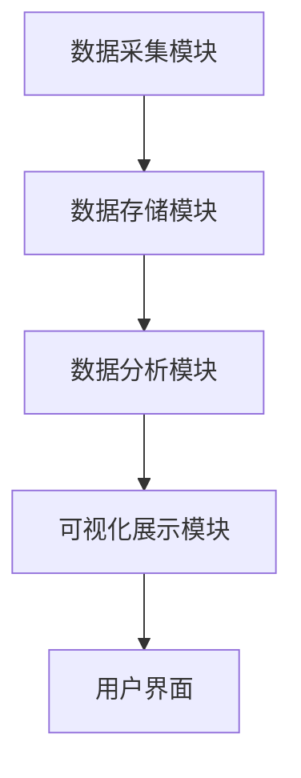

                 


# 埃及股市估值:中东北非地区的投资机会

> 关键词：埃及股市, 中东北非, 投资机会, 估值模型, 股市分析, 股票投资

> 摘要：本文深入分析了埃及股市的估值方法及其在中东北非地区的投资机会。通过介绍埃及股市的背景、核心概念、算法原理、数学模型、系统架构和项目实战，帮助投资者理解如何在该地区进行有效投资。

---

# 第1章：埃及股市的现状与重要性

## 1.1 埃及股市的历史与发展

### 1.1.1 埃及股市的起源与演变

埃及股市的历史可以追溯到1908年，当时成立了埃及证券交易所。经过多次改革和调整，埃及股市逐渐成为中东和北非地区的重要金融中心。近年来，埃及股市的市场规模稳步增长，吸引了大量国内外投资者。

### 1.1.2 埃及股市在中东及北非地区的位置

埃及股市在中东和北非地区具有重要地位，是该地区第二大股票市场。埃及股市的稳定性和增长潜力使其成为投资者关注的焦点。

### 1.1.3 当前埃及股市的市场规模与主要行业

埃及股市的主要行业包括金融、工业、能源和旅游等。近年来，埃及政府推动经济多元化，进一步促进了股市的发展。

---

## 1.2 埃及股市的经济影响

### 1.2.1 埃及股市对国家经济的推动作用

埃及股市为国家经济发展提供了资金支持，推动了企业成长和创新。同时，股市的稳定也为国家经济的稳定性提供了保障。

### 1.2.2 对投资者的影响与机会

埃及股市为投资者提供了多样化的投资选择，尤其是对于那些寻求高回报的投资者来说，埃及股市具有较大的吸引力。

### 1.2.3 埃及股市与国际市场的联系

埃及股市与国际市场的联系日益紧密，尤其是在全球化的背景下，埃及股市的波动对国际金融市场的影响也逐渐显现。

---

# 第2章：埃及股市估值的核心概念

## 2.1 埃及股市估值的基本原理

### 2.1.1 基本概念与定义

股票估值是通过对公司财务数据和市场情况的分析，确定股票的合理价格。埃及股市的估值方法与其他市场有相似之处，但也有一些独特性。

### 2.1.2 估值方法的分类与选择

常用的估值方法包括相对估值法和绝对估值法。相对估值法基于市场的相对指标，如市盈率和市净率；绝对估值法则基于公司的未来现金流折现。

### 2.1.3 影响估值的主要因素分析

影响埃及股市估值的主要因素包括宏观经济环境、行业状况、公司基本面和市场情绪等。

---

## 2.2 埃及股市与区域市场的对比

### 2.2.1 中东及北非地区股市的概况

中东和北非地区是全球经济增长最快的地区之一，股市表现也相对强劲。埃及股市在该地区具有重要地位。

### 2.2.2 埃及股市的独特性与优势

埃及股市的独特性在于其市场结构和行业分布。与沙特等其他中东国家相比，埃及股市更具多样性。

### 2.2.3 区域市场对埃及股市估值的影响

区域市场的波动对埃及股市估值有一定影响，尤其是在地缘政治和经济政策变化时。

---

# 第3章：埃及股市估值的算法原理

## 3.1 常见的估值指标

### 3.1.1 市盈率（P/E）

市盈率是股票价格与每股收益的比率，公式为：
$$ P/E = \frac{Price}{Earnings} $$

### 3.1.2 市净率（P/B）

市净率是股票价格与每股净资产的比率，公式为：
$$ P/B = \frac{Price}{Book\ Value} $$

### 3.1.3 股息率（Dividend Yield）

股息率是股息与股票价格的比率，公式为：
$$ Dividend\ Yield = \frac{Dividend}{Price} $$

## 3.2 基于历史数据的估值模型

### 3.2.1 市盈率模型

市盈率模型通过比较股票的当前市盈率与历史平均水平，判断股票的估值是否合理。

### 3.2.2 市净率模型

市净率模型通过比较股票的当前市净率与行业平均水平，判断股票的估值是否合理。

---

# 第4章：数学模型与公式解析

## 4.1 市盈率计算

### 示例计算

假设某公司每股收益为1.5美元，股票价格为30美元，则市盈率为：
$$ P/E = \frac{30}{1.5} = 20 $$

## 4.2 市净率计算

### 示例计算

假设某公司每股净资产为5美元，股票价格为25美元，则市净率为：
$$ P/B = \frac{25}{5} = 5 $$

---

# 第5章：埃及股市估值系统架构

## 5.1 系统功能设计

### 5.1.1 数据采集模块

数据采集模块负责收集埃及股市的历史数据、实时数据和公司财务数据。

### 5.1.2 数据分析模块

数据分析模块通过算法对数据进行清洗、分析和建模，得出股票的合理估值。

### 5.1.3 可视化展示模块

可视化展示模块将分析结果以图表形式展示，方便投资者理解和决策。

## 5.2 系统架构图



---

# 第6章：埃及股市估值的实战分析

## 6.1 环境安装与数据准备

### 6.1.1 数据源的选择与获取

可以从埃及证券交易所或金融数据供应商获取历史数据。

### 6.1.2 数据清洗与预处理

对数据进行清洗，处理缺失值和异常值。

## 6.2 核心算法实现

### 6.2.1 使用Python代码实现估值模型

```python
import pandas as pd

# 假设df是数据框，包含'Price'和'Earnings'列
df['P/E'] = df['Price'] / df['Earnings']
df['P/B'] = df['Price'] / df['Book Value']
```

---

# 第7章：最佳实践与投资策略

## 7.1 投资策略建议

### 7.1.1 基于估值的选股策略

优先选择市盈率和市净率合理的公司。

### 7.1.2 风险管理与分散投资

合理配置资产，避免过度集中。

## 7.2 注意事项与常见误区

### 7.2.1 避免盲目跟风

投资者应基于基本面分析，而非市场情绪。

### 7.2.2 保持长期视角

股市波动短期不可预测，长期趋势更值得关注。

---

# 参考文献

1. 埃及证券交易所官网
2. 《股票估值的原理与方法》
3. 中东和北非地区经济报告

---

# 索引

- 埃及股市
- 中东北非地区
- 投资机会
- 股票估值
- 估值模型

---

作者：AI天才研究院/AI Genius Institute & 禅与计算机程序设计艺术 /Zen And The Art of Computer Programming

