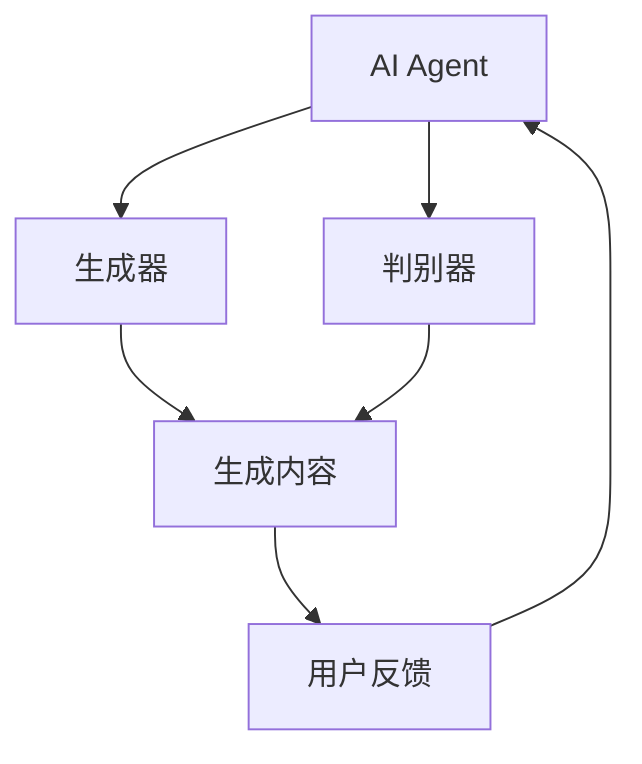

                 

<think>
好的，我需要根据用户的要求，详细撰写一篇关于基于GAN的AI Agent创造性内容生成的技术博客文章。首先，我会按照用户提供的目录大纲结构来组织内容，确保每个部分都涵盖必要的信息。

### 第一部分：背景介绍

#### 第1章：GAN与AI Agent概述

##### 1.1 问题背景

- **创造性内容生成的需求**：在当前数字化时代，创造性内容生成的需求日益增长。无论是艺术创作、文学作品，还是广告创意，都需要高效的生成方法。传统的生成方法，如模板生成，已经无法满足多样化的创意需求。

- **GAN在创造性内容生成中的优势**：生成式对抗网络（GAN）以其强大的生成能力，成为创造性内容生成的重要工具。GAN通过生成器和判别器的对抗训练，能够生成高质量、多样化的内容，如图像、文本和音乐等。

- **AI Agent在创造性任务中的角色**：AI Agent作为智能体，能够根据上下文和目标，协调和优化生成过程。它不仅能够生成内容，还能根据反馈进行调整，提升生成结果的质量。

##### 1.2 问题描述

- **创造性内容生成的挑战**：传统生成方法受限于规则和模板，难以应对复杂的创造性任务。生成的内容往往缺乏多样性和创新性，难以满足用户的个性化需求。

- **GAN在生成对抗中的作用**：GAN通过对抗训练，不断优化生成器的输出，使得生成的内容越来越逼真和多样化。这种对抗机制能够有效解决生成内容单一化的问题。

- **AI Agent与GAN结合的必要性**：AI Agent能够理解上下文，做出决策，协调生成过程。将AI Agent与GAN结合，可以实现更智能、更灵活的内容生成，满足多样化的用户需求。

##### 1.3 问题解决

- **GAN的基本原理**：GAN由生成器和判别器组成，生成器尝试生成与真实数据相似的样本，判别器则试图区分生成样本和真实样本。通过不断对抗训练，生成器的能力逐渐提升。

- **AI Agent的决策机制**：AI Agent通过感知输入，分析目标，制定策略，执行动作，最终生成符合要求的内容。它能够根据反馈调整生成策略，优化生成结果。

- **GAN与AI Agent结合的解决方案**：将AI Agent作为生成器的智能决策层，利用GAN的强大生成能力，实现创造性内容的高效生成。

##### 1.4 边界与外延

- **GAN的适用范围**：GAN适用于生成结构化数据，如图像、文本等。在处理非结构化数据时，效果可能有限。

- **AI Agent的局限性**：AI Agent依赖于训练数据的质量和多样性，可能在面对未知或极端情况时表现不佳。此外，生成的内容可能缺乏人类的直觉和情感，难以完全替代人类创造力。

- **创造性内容生成的边界**：创造性内容生成需要平衡多样性和质量，避免生成低俗或有害内容。同时，生成内容的版权和伦理问题也需要考虑。

##### 1.5 核心概念结构与要素

- **GAN的核心要素**：生成器、判别器、损失函数、对抗训练过程。

- **AI Agent的核心要素**：感知、决策、行动、反馈。

- **结合后的系统结构**：AI Agent协调生成器和判别器，优化生成过程，生成高质量内容。

---

### 第2章：GAN的核心原理

#### 2.1 GAN的基本原理

- **生成器与判别器的对抗过程**：生成器尝试生成与真实数据相似的样本，判别器则试图区分生成样本和真实样本。两者的对抗促使生成器能力不断提升。

- **损失函数与优化目标**：生成器的损失函数衡量生成样本与真实样本的差异，判别器的损失函数衡量其区分能力。通过优化这两个损失函数，实现生成器和判别器的共同进步。

- **GAN的训练过程**：训练过程包括交替优化生成器和判别器，逐步提升生成质量。训练过程中需要平衡两者的损失，避免一方过于强大导致训练不稳定。

#### 2.2 AI Agent的核心原理

- **感知与理解**：AI Agent通过输入数据，理解当前的上下文和目标。

- **决策与规划**：基于理解的信息，AI Agent制定生成策略，决定生成的内容类型和风格。

- **行动与生成**：根据决策，AI Agent控制生成器生成内容，并实时调整生成过程，优化结果。

- **反馈与学习**：根据生成结果和用户反馈，AI Agent学习改进，提升未来生成的质量和效率。

---

### 第3章：AI Agent的核心原理

#### 3.1 AI Agent的基本概念

- **定义与类型**：AI Agent是一种智能体，能够感知环境，采取行动以实现目标。根据智能水平，分为简单反射Agent、基于模型的Agent、utility-based Agent等。

- **决策机制**：AI Agent通过分析环境信息，选择最优行动方案。决策过程涉及状态评估、动作选择和结果预测。

- **行动执行**：AI Agent根据决策结果，执行生成任务，生成内容并输出。

#### 3.2 AI Agent的智能决策过程

- **感知与分析**：AI Agent通过传感器或接口获取环境信息，分析用户需求和目标。

- **决策制定**：基于分析结果，AI Agent制定生成策略，确定生成的内容类型和风格。

- **行动执行与优化**：根据决策，AI Agent执行生成任务，并根据反馈不断优化生成过程。

---

### 第4章：GAN与AI Agent的结合

#### 4.1 结合的意义

- **优势互补**：GAN强大的生成能力与AI Agent的智能决策能力结合，能够实现高质量、多样化的创造性内容生成。

- **提升生成质量**：AI Agent协调生成器和判别器，优化生成过程，提升生成内容的质量和多样性。

- **增强适应性**：AI Agent能够根据反馈动态调整生成策略，适应不同用户的需求和偏好。

#### 4.2 结合的方式

- **层次化结构**：AI Agent作为上层决策层，协调生成器和判别器的对抗训练，优化生成过程。

- **反馈机制**：生成器根据AI Agent的反馈，调整生成策略，生成更符合要求的内容。

- **协同优化**：生成器和判别器在对抗训练中不断提升，同时AI Agent根据反馈优化生成策略，实现整体生成能力的提升。

#### 4.3 应用场景

- **文本生成**：生成创意文案、故事、诗歌等，满足多样化的文学创作需求。

- **图像生成**：生成艺术图片、广告素材等，应用于设计领域。

- **音乐生成**：生成音乐片段，辅助音乐创作。

---

### 第5章：系统分析与架构设计

#### 5.1 系统功能设计

- **生成器模块**：负责生成创造性内容，基于GAN算法实现。

- **判别器模块**：负责区分生成内容和真实内容，提供反馈。

- **AI Agent模块**：协调生成器和判别器，优化生成过程。

- **用户交互模块**：接收用户输入，提供生成结果和反馈。

#### 5.2 系统架构设计

- **系统组成**：包括生成器、判别器、AI Agent、用户交互模块。

- **数据流设计**：用户输入 → AI Agent分析 → 生成器生成 → 判别器验证 → 反馈调整 → 生成结果输出。

#### 5.3 实现细节

- **生成器实现**：使用深度神经网络，如卷积神经网络，生成高质量图像或文本。

- **判别器实现**：同样使用深度神经网络，判断样本的真实性。

- **AI Agent实现**：基于强化学习，通过奖励机制优化生成策略。

---

### 第6章：项目实战

#### 6.1 环境搭建

- **安装必要的库**：如TensorFlow、Keras、Python等。

- **配置开发环境**：安装IDE和相关工具，确保所有依赖项正确安装。

#### 6.2 核心代码实现

- **生成器代码示例**：使用Keras构建生成器模型，定义生成器的网络结构和损失函数。

- **判别器代码示例**：同样使用Keras构建判别器模型，定义判别器的网络结构和损失函数。

- **AI Agent代码示例**：实现AI Agent的决策逻辑，协调生成器和判别器的对抗训练。

#### 6.3 案例分析与解读

- **生成过程分析**：展示生成器和判别器的对抗过程，分析生成结果的质量和多样性。

- **用户反馈处理**：根据用户反馈，调整生成策略，优化生成结果。

#### 6.4 项目总结

- **项目成果**：展示生成的内容，分析其质量和多样性。

- **经验总结**：总结项目实施过程中的经验和教训，为未来项目提供参考。

---

### 第7章：最佳实践与未来展望

#### 7.1 最佳实践

- **数据预处理**：确保训练数据的多样性和质量，避免生成内容的偏差。

- **模型调参**：合理调整生成器和判别器的参数，保持对抗平衡。

- **反馈机制优化**：设计有效的反馈机制，提升生成内容的质量和用户满意度。

#### 7.2 小结

- **总结内容**：回顾全文，总结GAN与AI Agent结合在创造性内容生成中的应用和优势。

- **经验分享**：分享项目实施过程中的经验，为读者提供参考。

#### 7.3 注意事项

- **模型收敛问题**：对抗训练可能导致生成器和判别器无法同时收敛，需要合理调整训练策略。

- **生成内容的版权问题**：生成内容的版权归属需要明确，避免法律纠纷。

- **伦理问题**：生成内容可能涉及敏感话题，需注意伦理问题，避免生成有害内容。

#### 7.4 拓展阅读

- **推荐书籍和论文**：推荐关于GAN和AI Agent的经典书籍和论文，供读者深入学习。

- **相关技术领域**：介绍与GAN和AI Agent相关的其他技术领域，如强化学习、深度学习等。

---

### 第八章：数学公式与算法原理

#### 8.1 GAN的数学模型

- **生成器的损失函数**：$$L_G = \mathbb{E}_{z \sim p_z} [\mathcal{L}(G(z), x)]$$

- **判别器的损失函数**：$$L_D = \mathbb{E}_{x \sim p_data} [\mathcal{L}(D(x))] + \mathbb{E}_{z \sim p_z} [\mathcal{L}(D(G(z)))]$$

#### 8.2 GAN的训练过程

- **交替优化生成器和判别器**：先优化生成器的损失函数，再优化判别器的损失函数，保持两者的平衡。

#### 8.3 AI Agent的决策模型

- **马尔可夫决策过程**：状态空间S，动作空间A，奖励函数R，策略π。

---

### 第九章：系统架构图与流程图

#### 9.1 系统架构图



#### 9.2 算法流程图

```mermaid
graph TD
    GAN_process[start] --> Generator
    Generator --> D
    D --> Discriminator
    Discriminator --> GAN_process
    GAN_process --> Discriminator_train
    Discriminator_train --> Generator_train
    Generator_train --> end
```

---

### 第十章：总结与展望

#### 10.1 总结

- **GAN与AI Agent结合的应用前景广阔**，在创造性内容生成领域具有巨大潜力。

#### 10.2 展望

- **未来研究方向**：探索更高效的GAN架构，提升AI Agent的智能决策能力，结合多模态数据生成更复杂的内容。

---

**作者：AI天才研究院/AI Genius Institute & 禅与计算机程序设计艺术 /Zen And The Art of Computer Programming**

