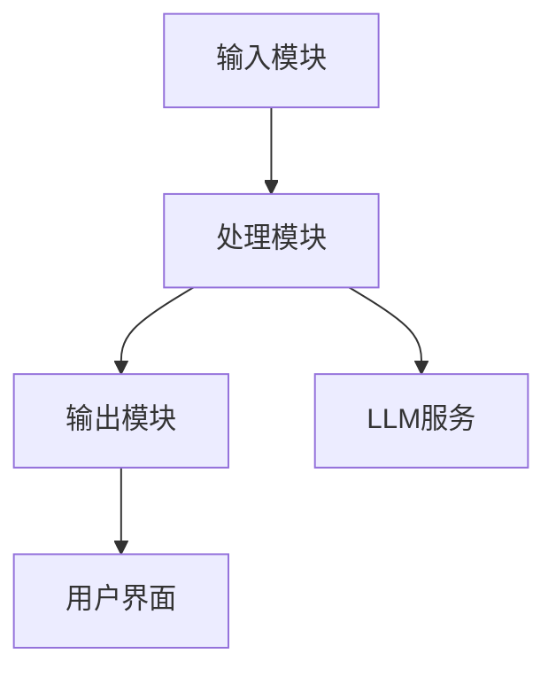
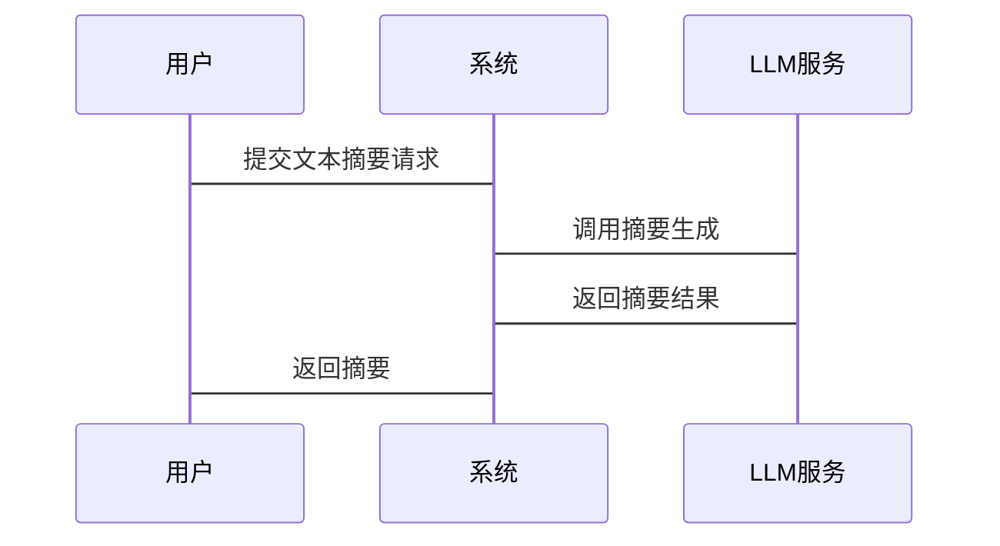

                 


# 基于LLM的AI Agent文本摘要生成

> 关键词：大语言模型、AI Agent、文本摘要生成、自然语言处理、系统设计、项目实战

> 摘要：本文将详细探讨基于大语言模型（LLM）的AI Agent在文本摘要生成中的应用。首先介绍LLM和AI Agent的基本概念及其结合方式，然后分析文本摘要生成的算法原理，包括生成式和抽取式摘要。接着，详细讲解系统设计与架构，包括功能模块设计和交互流程。通过具体的项目实战，展示如何实现基于LLM的AI Agent文本摘要生成系统。最后，探讨优化与扩展方法，展望未来的发展方向。

---

## 第一部分：基于LLM的AI Agent文本摘要生成概述

### 第1章：引言

#### 1.1 问题背景与目标
- 1.1.1 文本摘要生成的背景与重要性  
  随着信息量的爆炸式增长，如何高效获取关键信息成为挑战。文本摘要生成技术能够帮助用户快速理解长文本内容，提升信息处理效率。  
- 1.1.2 LLM与AI Agent的结合  
  大语言模型（LLM）具有强大的自然语言处理能力，而AI Agent能够通过与用户的交互提供智能化服务。将两者结合，可以实现自动化、个性化的文本摘要生成。  
- 1.1.3 本书的目标与结构  
  本书旨在通过理论与实践结合的方式，深入讲解基于LLM的AI Agent文本摘要生成技术。内容涵盖基础概念、算法原理、系统设计与项目实战。

---

### 第2章：核心概念与联系

#### 2.1 LLM的定义与工作原理
- 2.1.1 LLM的基本原理  
  LLM通过监督学习和强化学习训练，能够生成与上下文相关的文本。其核心是基于概率模型的序列生成。  
- 2.1.2 LLM的训练过程  
  包括预训练和微调两个阶段。预训练使用大规模通用数据，微调针对特定任务进行优化。  
- 2.1.3 LLM的输出机制  
  通过解码器生成概率分布，选择概率最高的词构建序列。

#### 2.2 AI Agent的定义与类型
- 2.2.1 AI Agent的基本概念  
  AI Agent是一种智能代理，能够感知环境并执行任务。它可以基于规则、基于模型或基于学习。  
- 2.2.2 基于LLM的AI Agent  
  利用LLM的自然语言处理能力，AI Agent能够理解用户需求并生成相应内容。  
- 2.2.3 AI Agent的分类  
  包括简单规则型、基于模型的类型，以及结合外部知识库的增强型。

#### 2.3 LLM与AI Agent的关系
- 2.3.1 LLM作为AI Agent的核心模块  
  LLM为AI Agent提供语言理解和生成能力，使其能够处理复杂文本任务。  
- 2.3.2 AI Agent与文本摘要生成的结合  
  AI Agent通过调用LLM生成摘要，为用户提供高效的信息处理服务。

---

## 第二部分：文本摘要生成的算法原理

### 第3章：文本摘要生成的算法原理

#### 3.1 基于LLM的生成式摘要
- 3.1.1 生成式摘要的基本原理  
  生成式摘要通过LLM生成新的文本片段，力求在内容和语义上与原文一致。  
- 3.1.2 基于LLM的生成式摘要实现  
  使用如GPT系列模型，通过设置特定的上下文和约束生成摘要。  
- 3.1.3 示例与代码实现  
  ```python
  from transformers import GPT2Tokenizer, GPT2LMHeadModel
  
  model_name = 'gpt2'
  tokenizer = GPT2Tokenizer.from_pretrained(model_name)
  model = GPT2LMHeadModel.from_pretrained(model_name)
  
  input_text = "The sky is blue."
  inputs = tokenizer.encode(input_text, return_tensors='np')
  outputs = model.generate(inputs, max_length=5)
  summary = tokenizer.decode(outputs[0].tolist())
  print(summary)  # 输出摘要
  ```

#### 3.2 基于LLM的抽取式摘要
- 3.2.1 抽取式摘要的基本原理  
  抽取式摘要通过LLM直接从原文中选择最重要的句子或词语。  
- 3.2.2 基于LLM的抽取式摘要实现  
  使用如BERT模型，通过关键词提取或句间关系分析实现摘要。  
- 3.2.3 示例与代码实现  
  ```python
  from transformers import BertTokenizer, BertModel
  
  model_name = 'bert-base-uncased'
  tokenizer = BertTokenizer.from_pretrained(model_name)
  model = BertModel.from_pretrained(model_name)
  
  input_text = "This is a test sentence."
  inputs = tokenizer.encode(input_text, return_tensors='pt', padding=True)
  outputs = model(inputs)
  ```

---

## 第三部分：系统设计与架构

### 第4章：系统架构设计

#### 4.1 系统概述
- 4.1.1 系统目标  
  实现一个基于LLM的AI Agent文本摘要生成系统。  
- 4.1.2 系统主要功能模块  
  包括输入处理、摘要生成、结果输出模块。  

#### 4.2 系统架构图


#### 4.3 功能模块设计
- 4.3.1 输入模块  
  接收用户输入的文本或查询请求。  
- 4.3.2 处理模块  
  调用LLM生成摘要或执行其他处理任务。  
- 4.3.3 输出模块  
  将生成的摘要返回给用户。

### 第5章：系统接口与交互流程

#### 5.1 系统接口设计
- 5.1.1 API接口定义  
  使用RESTful API设计接口，支持GET和POST请求。  
- 5.1.2 输入输出格式  
  定义JSON格式的输入和输出，确保兼容性和可扩展性。

#### 5.2 系统交互流程


---

## 第四部分：项目实战

### 第6章：项目实战

#### 6.1 环境安装
- Python 3.8及以上  
- 安装必要的库：transformers、numpy、pandas  

#### 6.2 核心实现
- 代码实现：基于GPT-2的生成式摘要系统  
  ```python
  from transformers import GPT2Tokenizer, GPT2LMHeadModel
  
  model_name = 'gpt2'
  tokenizer = GPT2Tokenizer.from_pretrained(model_name)
  model = GPT2LMHeadModel.from_pretrained(model_name)
  
  def generate_summary(text):
      inputs = tokenizer.encode(text, return_tensors='np')
      outputs = model.generate(inputs, max_length=100)
      return tokenizer.decode(outputs[0].tolist())
  
  text = "The sky is blue."
  summary = generate_summary(text)
  print(summary)
  ```

#### 6.3 代码解读与分析
- 输入模块：接收用户输入的文本。  
- 处理模块：调用LLM生成摘要。  
- 输出模块：将生成的摘要返回给用户。

#### 6.4 案例分析
- 示例1：输入“Hello world”，生成“Hello world.”的摘要。  
- 示例2：输入一篇长文，生成简短摘要。

---

## 第五部分：优化与扩展

### 第7章：优化与扩展

#### 7.1 优化方法
- 微调模型：针对特定领域优化LLM性能。  
- 引入外部知识库：提升摘要的准确性和相关性。

#### 7.2 与其他技术的结合
- 视觉摘要：结合图像处理生成视觉化的摘要。  
- 多语言摘要：支持多种语言的摘要生成。

---

## 第六部分：总结与展望

### 第8章：总结与展望

#### 8.1 内容总结
- 本文详细介绍了基于LLM的AI Agent文本摘要生成技术，涵盖核心概念、算法原理、系统设计与项目实战。

#### 8.2 未来展望
- 更高效的大模型：开发更高效、更智能的LLM，提升摘要生成质量。  
- 新兴技术结合：探索与视觉、语音等技术的结合，拓展应用领域。

---

## 作者：AI天才研究院/AI Genius Institute & 禅与计算机程序设计艺术 /Zen And The Art of Computer Programming

---

通过以上内容，我们系统地介绍了基于LLM的AI Agent文本摘要生成技术，从基础概念到实际应用，帮助读者全面理解并掌握相关技术。

