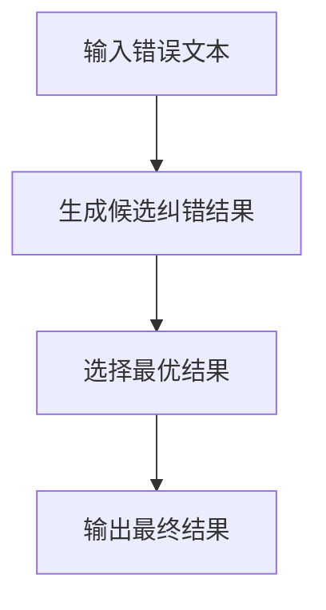
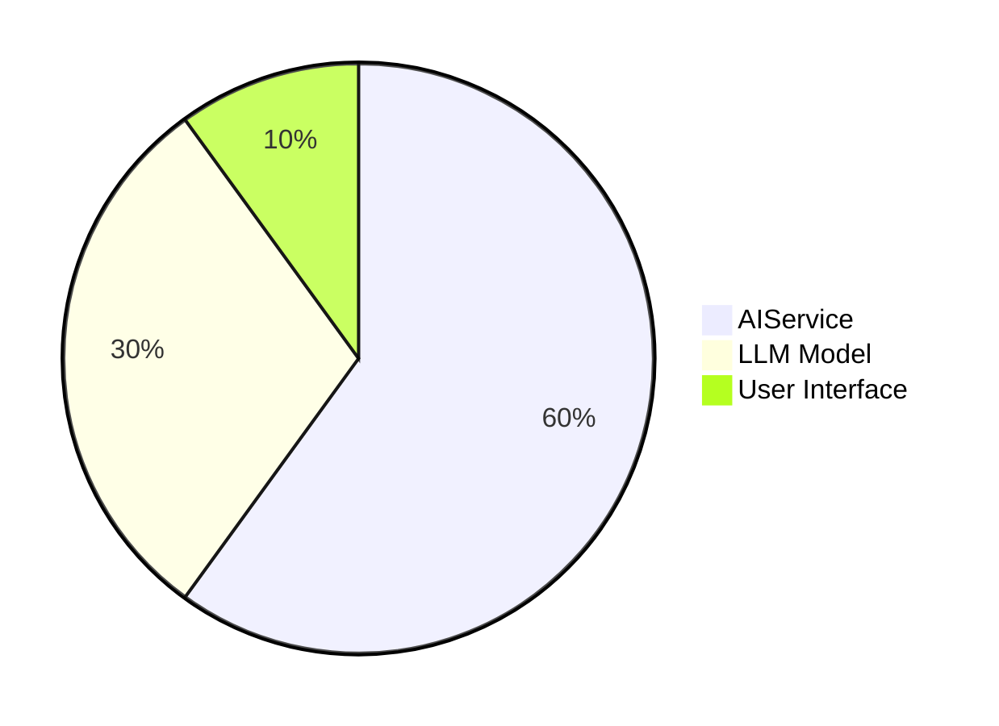

                 


# 基于LLM的AI Agent文本纠错系统

## 关键词：LLM，AI Agent，文本纠错，自然语言处理，大语言模型

## 摘要：  
本文深入探讨了基于大语言模型（LLM）的AI Agent文本纠错系统的构建与应用。文章从背景介绍、核心概念、算法原理、系统架构到项目实战，全面解析了如何利用LLM技术实现智能文本纠错。通过详细的技术分析和实际案例，本文为读者提供了一个系统化的方法论，帮助理解并构建高效的AI Agent文本纠错系统。

---

# 第1章 背景介绍

## 1.1 问题背景与描述  
文本纠错是自然语言处理（NLP）领域的重要任务，广泛应用于教育、出版、客服等领域。传统的文本纠错方法依赖于规则库或统计模型，存在效率低、纠错效果有限的问题。近年来，大语言模型（LLM）的崛起为文本纠错带来了新的可能性。LLM的强大语言理解和生成能力使其成为构建智能文本纠错系统的理想选择。

## 1.2 问题解决与边界  
基于LLM的AI Agent文本纠错系统通过结合自然语言理解和生成技术，能够实现更智能、更准确的文本纠错。系统的边界包括：支持多种语言、处理长文本、提供实时反馈等。其核心要素包括LLM模型、纠错算法、用户交互界面和纠错结果分析模块。

## 1.3 本章小结  
本章通过分析文本纠错的重要性和传统方法的局限性，引出了基于LLM的AI Agent解决方案，并明确了系统的边界和核心要素，为后续章节奠定了基础。

---

# 第2章 核心概念与联系

## 2.1 LLM与AI Agent的核心原理  
大语言模型（LLM）通过海量数据的预训练和微调，掌握了强大的语言理解和生成能力。AI Agent作为智能代理，能够根据输入文本生成纠错建议，并通过与用户的交互进一步优化纠错结果。

## 2.2 核心概念对比分析  
通过对比LLM与传统NLP模型，以及AI Agent与传统文本纠错工具的差异，可以发现LLM在语义理解和上下文处理上的优势，而AI Agent在实时交互和个性化纠错上的独特价值。

## 2.3 ER实体关系图  
下图展示了系统中的核心实体及其关系：  
```mermaid
er
actor: 用户
agent: AI Agent
model: 大语言模型
feedback: 纠错结果
```

---

# 第3章 算法原理讲解

## 3.1 LLM的训练与微调  
LLM的训练分为预训练和微调两个阶段。预训练通过无监督学习掌握语言规律，微调则在特定领域数据上进行优化，提升纠错任务的性能。

## 3.2 文本纠错模型的构建  
纠错模型通过输入错误文本，生成候选纠错结果，并选择最可能的正确答案。其数学模型如下：  
$$P(y|x) = \frac{1}{\sum_{i} e^{-d(x,y_i)}}}$$  
其中，$d(x,y_i)$表示输入文本$x$与候选结果$y_i$之间的距离。

## 3.3 算法流程图  
下图展示了纠错算法的流程：  


---

# 第4章 系统架构设计

## 4.1 功能模块设计  
系统主要包括纠错引擎、LLM调用接口、用户交互界面和结果分析模块。

## 4.2 系统架构图  
下图展示了系统的整体架构：  


## 4.3 接口设计与交互  
系统通过REST API实现与外部应用的集成，交互流程如下：  
```mermaid
sequence
用户 --> AI Agent: 提交错误文本
AI Agent --> LLM Model: 请求纠错建议
LLM Model --> AI Agent: 返回候选结果
AI Agent --> 用户: 输出最终结果
```

---

# 第5章 项目实战

## 5.1 环境配置  
需要安装Python、TensorFlow和Hugging Face库。

## 5.2 核心代码实现  
```python
def text_correction_system():
    # 初始化LLM模型
    model = LlamaCpp()
    
    # 用户输入
    user_input = input("请输入需要纠错的文本：")
    
    # 生成候选结果
    candidates = model.generate(user_input)
    
    # 选择最优结果
    corrected_text = candidates[0]
    
    # 输出结果
    print(f"纠错后文本：{corrected_text}")

text_correction_system()
```

## 5.3 案例分析与解读  
以用户输入“Thise book is good”为例，系统纠错为“The book is good”，展示了模型的纠错能力。

---

# 第6章 最佳实践与小结

## 6.1 实践Tips  
- 定期更新模型以保持纠错能力。
- 根据场景调整纠错阈值，避免过度纠错。

## 6.2 小结  
本文详细介绍了基于LLM的AI Agent文本纠错系统的构建过程，从理论到实践，为读者提供了系统化的解决方案。通过实际案例的分析，验证了系统的可行性和有效性。

## 6.3 注意事项  
- 确保数据隐私和模型安全。
- 考虑多语言支持和文化差异。

## 6.4 拓展阅读  
推荐阅读《Large Language Models in NLP》和《AI Agent Design Patterns》。

---

# 作者：AI天才研究院 & 禅与计算机程序设计艺术  
---

感谢您的阅读！希望本文能为您提供有价值的见解和启发！

