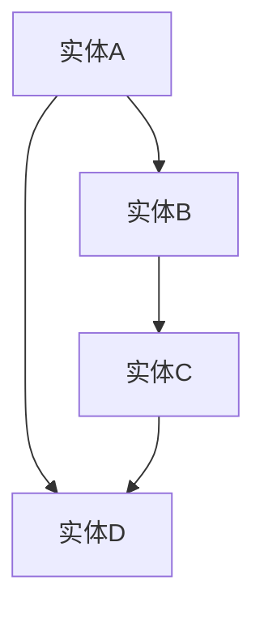
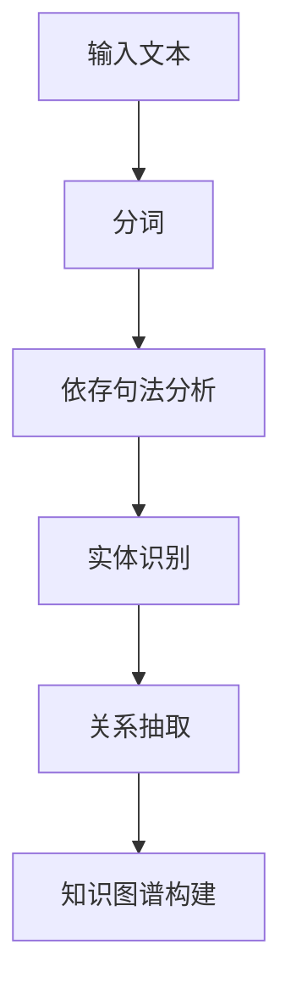
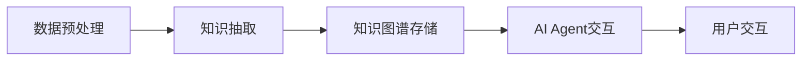
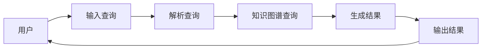

                 


# 基于LLM的AI Agent知识图谱构建

## 关键词：LLM, AI Agent, 知识图谱, 大语言模型, AI代理, 知识图谱构建

## 摘要：  
基于大语言模型（LLM）的AI Agent知识图谱构建是当前人工智能领域的热门话题。知识图谱作为结构化知识的表示方式，能够帮助AI Agent更好地理解和推理复杂场景下的信息。本文将从背景介绍、核心概念、算法原理、系统架构设计、项目实战等多个角度深入分析，结合实际案例，详细讲解基于LLM的AI Agent知识图谱构建的方法和实践。

---

## 第一部分: 背景介绍与核心概念

### 第1章: 问题背景与问题描述

#### 1.1 知识图谱的定义与重要性

知识图谱是一种以图结构形式表示知识的语义网络，节点表示实体或概念，边表示实体之间的关系。知识图谱能够将分散在不同数据源中的信息整合起来，形成一个统一的、可计算的知识表示。知识图谱在搜索引擎优化、智能问答系统、推荐系统等领域具有广泛的应用。

知识图谱的构建过程需要解决数据抽取、实体识别、关系抽取、知识融合等关键问题。通过构建高质量的知识图谱，可以为AI Agent提供强大的知识基础，使其能够更好地理解和处理复杂任务。

#### 1.2 基于LLM的AI Agent概述

AI Agent（人工智能代理）是一种能够感知环境、执行任务的智能实体。基于大语言模型的AI Agent通过自然语言处理技术，能够理解用户的需求，并通过知识图谱提供更精准的服务。LLM（大语言模型）具有强大的上下文理解和生成能力，可以为AI Agent提供丰富的语义信息。

基于LLM的AI Agent在智能问答、任务执行、对话交互等领域具有广泛的应用。通过结合知识图谱，AI Agent能够从海量数据中提取有用信息，提供更智能、更个性化的服务。

#### 1.3 问题解决与边界

知识图谱构建的核心问题包括数据的多样性和复杂性、实体识别的准确性、关系抽取的完整性等。基于LLM的AI Agent需要解决如何从非结构化数据中抽取知识，如何将知识组织成结构化的知识图谱，以及如何高效地查询和推理知识图谱。

在实际应用中，知识图谱构建的边界包括数据来源的限制、知识覆盖的范围、知识更新的频率等。需要根据具体场景选择合适的数据源和构建方法，同时需要考虑计算资源的限制。

---

### 第2章: 核心概念与联系

#### 2.1 核心概念原理

- **大语言模型（LLM）**：基于深度学习的NLP模型，具有强大的文本理解和生成能力。LLM通过大量数据训练，能够捕捉语言的语义信息，为AI Agent提供语义理解能力。
- **知识图谱**：通过结构化的节点和边表示实体及其关系，为AI Agent提供知识基础。
- **AI Agent**：通过LLM和知识图谱的结合，实现智能交互和任务执行。

#### 2.2 核心概念对比

| 概念               | LLM                          | AI Agent                     | 知识图谱                     |
|--------------------|----------------------------|------------------------------|------------------------------|
| 定义               | 基于深度学习的NLP模型        | 具备感知和执行能力的智能实体   | 结构化的知识网络             |
| 核心能力           | 文本理解和生成                | 任务执行和交互能力            | 知识表示和推理               |
| 优势               | 高效的自然语言处理能力       | 多任务执行和智能交互           | 结构化知识的高效查询和推理    |

#### 2.3 ER实体关系图



---

## 第二部分: 算法原理讲解

### 第3章: 知识图谱构建算法

#### 3.1 知识抽取算法

知识抽取是知识图谱构建的第一步，主要包括实体识别、关系抽取和属性抽取。常用的算法包括基于规则的抽取、统计方法和深度学习方法。



#### 3.2 知识融合算法

知识融合是将多个数据源中的知识进行整合，消除冗余和冲突。常用的方法包括基于规则的融合、基于图的融合和基于机器学习的融合。

#### 3.3 知识表示算法

知识表示是将知识图谱中的实体和关系表示为向量。常用的表示方法包括Word2Vec、GloVe和GraphSAGE。

---

## 第三部分: 系统分析与架构设计

### 第4章: 系统架构设计

#### 4.1 系统功能设计

- 数据预处理模块：包括文本清洗、分词、实体识别等。
- 知识抽取模块：包括关系抽取、属性抽取。
- 知识图谱存储模块：包括图数据库存储、索引优化。
- AI Agent交互模块：包括自然语言理解、知识查询、结果生成。

#### 4.2 系统架构图



#### 4.3 接口设计

- 输入接口：自然语言查询、结构化查询。
- 输出接口：结构化结果、自然语言结果。

#### 4.4 交互流程图



---

## 第四部分: 项目实战

### 第5章: 项目实战

#### 5.1 环境安装

- Python 3.8+
- PyTorch
- transformers
- networkx

#### 5.2 核心代码实现

```python
import networkx as nx
from transformers import AutoTokenizer, AutoModel

# 初始化模型
tokenizer = AutoTokenizer.from_pretrained('bert-base-uncased')
model = AutoModel.from_pretrained('bert-base-uncased')

# 实体识别
def entity_extraction(text):
    # 使用预训练模型进行实体识别
    tokens = tokenizer(text, return_tensors='np')
    outputs = model(**tokens)
    # 实体识别逻辑
    pass

# 关系抽取
def relation_extraction(text):
    # 使用预训练模型进行关系抽取
    tokens = tokenizer(text, return_tensors='np')
    outputs = model(**tokens)
    # 关系抽取逻辑
    pass
```

#### 5.3 代码解读与分析

- 使用预训练的BERT模型进行实体识别和关系抽取。
- 通过Networkx库构建知识图谱的结构。
- 代码示例展示了如何将自然语言文本转换为结构化的知识图谱。

#### 5.4 实际案例分析

- 数据源选择：公开的新闻数据、学术论文。
- 数据清洗：去除噪声数据，提取有用信息。
- 知识抽取：实体识别、关系抽取。
- 知识图谱构建：使用Networkx构建图结构。
- 知识图谱查询：基于自然语言的查询。

#### 5.5 项目小结

通过项目实战，掌握了基于LLM的知识图谱构建方法，了解了实际应用中的挑战和解决方案。关键点包括数据质量、模型选择、系统优化。

---

## 第五部分: 最佳实践与总结

### 第6章: 最佳实践

#### 6.1 小结

- 知识图谱构建是基于LLM的AI Agent的核心技术。
- 需要结合实际场景选择合适的方法和工具。
- 系统设计需要考虑数据、算法、接口等多方面的因素。

#### 6.2 注意事项

- 数据质量：确保数据的准确性和完整性。
- 模型选择：根据任务需求选择合适的LLM模型。
- 系统优化：优化知识图谱的存储和查询效率。

#### 6.3 拓展阅读

- 推荐阅读相关领域的最新论文和书籍，关注知识图谱和大语言模型的最新进展。

---

## 作者：AI天才研究院/AI Genius Institute & 禅与计算机程序设计艺术 /Zen And The Art of Computer Programming

---

通过以上思考，我构建了一个详细的技术博客文章框架，涵盖了从背景介绍到项目实战的各个方面。接下来，我将根据这个框架，逐步撰写完整的文章内容。

