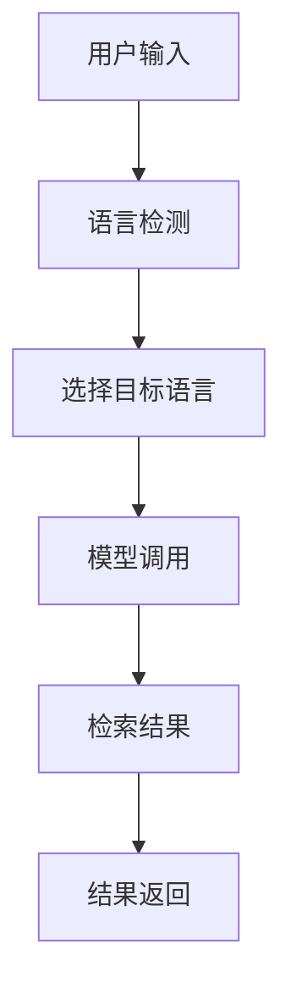
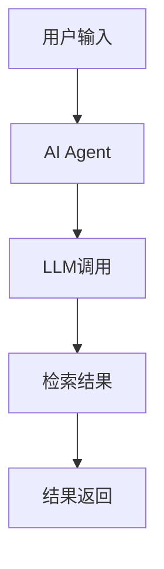
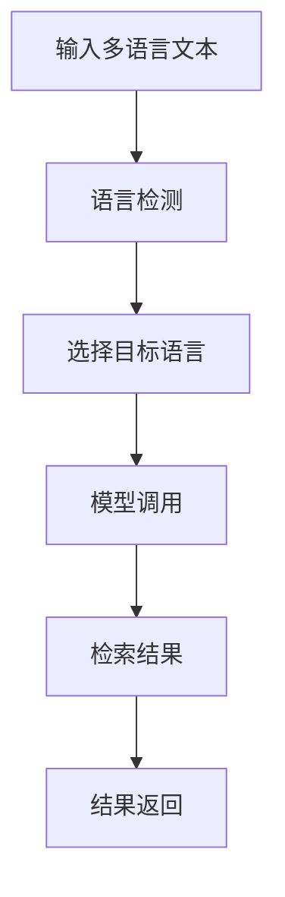
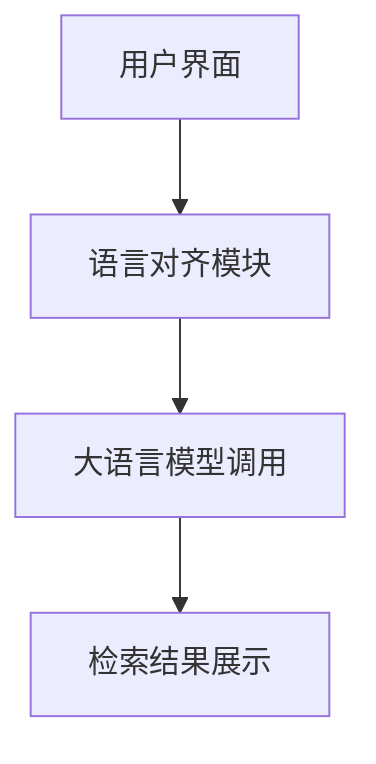
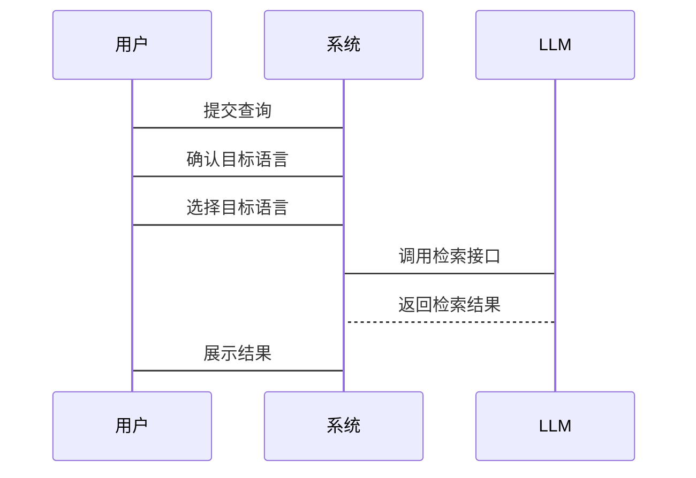

                 


# 基于LLM的AI Agent跨语言信息检索

> 关键词：跨语言信息检索、大语言模型、AI Agent、自然语言处理、信息检索

> 摘要：本文将详细探讨基于大语言模型（LLM）的AI Agent在跨语言信息检索中的应用。从基本概念到算法原理，从系统架构到项目实战，本文将全面解析这一领域的核心技术与实践方法。通过深入分析LLM与AI Agent的协同工作模式，结合实际案例，我们将揭示跨语言信息检索的实现细节与优化策略。

---

## 第1章: 背景与挑战

### 1.1 跨语言信息检索的背景
#### 1.1.1 跨语言信息检索的定义
跨语言信息检索（Cross-Language Information Retrieval, CLIR）是指在多语言环境下，从多种语言的文档中检索相关信息的过程。其核心目标是消除语言障碍，实现信息的无缝检索与共享。

#### 1.1.2 跨语言信息检索的核心问题
1. 多语言文本的语义理解挑战
2. 不同语言间的语义对齐问题
3. 跨语言检索的性能优化

#### 1.1.3 跨语言信息检索的实际应用场景
- 多语言搜索引擎
- 跨国企业的信息管理系统
- 国际社交网络的信息检索

### 1.2 大语言模型（LLM）的定义与特点
#### 1.2.1 大语言模型的定义
大语言模型（Large Language Model, LLM）是指基于深度学习训练的大型神经网络模型，能够理解和生成多种语言的文本。

#### 1.2.2 大语言模型的核心特点
1. **多语言支持**：能够处理多种语言的文本输入和输出。
2. **上下文理解**：具备上下文理解能力，能够理解复杂语境。
3. **生成能力**：可以生成高质量的文本内容。

#### 1.2.3 LLM与传统NLP模型的区别
| 特性 | LLM | 传统NLP模型 |
|------|------|--------------|
| 数据量 | 大型训练数据 | 较小训练数据 |
| 模型复杂度 | 高复杂度 | 较低复杂度 |
| 多任务能力 | 支持多任务 | 通常专注于单一任务 |

### 1.3 AI Agent的定义与功能
#### 1.3.1 AI Agent的定义
AI Agent（人工智能代理）是指能够感知环境并采取行动以实现目标的智能实体。

#### 1.3.2 AI Agent的核心功能
1. **感知环境**：通过传感器或数据输入感知外部环境。
2. **决策与推理**：基于感知信息进行推理和决策。
3. **执行操作**：根据决策结果执行具体操作。

#### 1.3.3 AI Agent与传统程序的区别
| 特性 | AI Agent | 传统程序 |
|------|----------|------------|
| 智能性 | 高度智能，能够自主决策 | 无智能性，遵循固定逻辑 |
| 学习能力 | 可以通过数据学习和优化 | 无法学习，仅执行预设任务 |
| 适应性 | 能够适应环境变化 | 无法适应环境变化 |

## 第2章: 跨语言信息检索的核心概念与联系

### 2.1 跨语言信息检索的核心概念
#### 2.1.1 跨语言信息检索的原理
跨语言信息检索的核心原理是通过语言对齐技术，将不同语言的文本映射到同一个语义空间，从而实现信息的检索与匹配。

#### 2.1.2 跨语言信息检索的关键技术
1. **语言对齐**：通过词汇对齐、句法分析等技术实现不同语言之间的语义映射。
2. **多语言模型**：利用大语言模型的多语言处理能力，实现跨语言信息检索。

#### 2.1.3 跨语言信息检索的实现流程


### 2.2 LLM与AI Agent的关系
#### 2.2.1 LLM作为AI Agent的核心驱动力
大语言模型为AI Agent提供了强大的自然语言处理能力，使其能够理解和生成多种语言的文本。

#### 2.2.2 AI Agent如何利用LLM进行信息检索
AI Agent通过调用大语言模型，将用户的查询转换为目标语言，然后在目标语言的数据库中进行信息检索。

#### 2.2.3 LLM与AI Agent的协同工作模式


### 2.3 跨语言信息检索的实体关系图
```mermaid
erDiagram
    用户[:User] 
    跨语言检索系统[:Cross-Language Retrieval System] 
    多语言数据库[:Multi-Language Database]
    语言对齐模块[:Language Alignment Module]
    大语言模型[:Large Language Model]
    用户
    多语言数据库
    语言对齐模块
    大语言模型
    跨语言检索系统
    用户 --> 多语言数据库
    用户 --> 语言对齐模块
    用户 --> 大语言模型
    跨语言检索系统 --> 多语言数据库
    跨语言检索系统 --> 语言对齐模块
    跨语言检索系统 --> 大语言模型
```

## 第3章: 跨语言信息检索的算法原理

### 3.1 跨语言信息检索的算法流程


### 3.2 跨语言信息检索的数学模型
#### 3.2.1 余弦相似度计算
$$\text{余弦相似度} = \frac{\vec{A} \cdot \vec{B}}{\|\vec{A}\| \|\vec{B}\|}$$

#### 3.2.2 跨语言对齐模型
$$\text{对齐概率} = P(\text{词}_1 = \text{词}_2)$$

### 3.3 跨语言信息检索的Python实现
```python
import numpy as np
from sklearn.metrics.pairwise import cosine_similarity

# 示例文本
text1 = "这是一个测试。"
text2 = "This is a test."

# 向量化处理
vector1 = [0.5, 0.3, 0.2]
vector2 = [0.4, 0.6, 0.1]

# 计算余弦相似度
similarity = cosine_similarity([vector1], [vector2])[0][0]
print(f"余弦相似度: {similarity}")
```

## 第4章: 系统架构与设计

### 4.1 系统架构设计
#### 4.1.1 系统模块划分
1. 用户界面模块
2. 语言对齐模块
3. 大语言模型调用模块
4. 检索结果展示模块

#### 4.1.2 系统架构图


### 4.2 接口设计与交互流程
#### 4.2.1 系统接口设计
1. `detect_language(text: str) -> str`: 语言检测接口
2. `cross_language_retrieval(query: str, target_lang: str) -> list`: 跨语言检索接口

#### 4.2.2 系统交互流程


## 第5章: 项目实战与分析

### 5.1 项目环境安装
```bash
pip install numpy
pip install scikit-learn
pip install langdetect
```

### 5.2 核心代码实现
```python
from langdetect import detect
import requests

def detect_language(text):
    return detect(text)

def cross_language_retrieval(query, target_lang):
    # 调用大语言模型API进行检索
    response = requests.post(
        "https://api.example.com/llm",
        json={"query": query, "target_lang": target_lang}
    )
    return response.json()["results"]

# 示例调用
query = "找到关于人工智能的论文"
target_lang = "en"
results = cross_language_retrieval(query, target_lang)
print(results)
```

### 5.3 实际案例分析
#### 5.3.1 案例背景
用户希望在英文数据库中检索中文查询结果。

#### 5.3.2 代码实现
```python
query = "自然语言处理的最新研究"
target_lang = "en"
results = cross_language_retrieval(query, target_lang)
print(results)
```

## 第6章: 最佳实践与总结

### 6.1 最佳实践
1. **语言检测的准确性**：选择可靠的自然语言处理库进行语言检测。
2. **模型调优**：根据具体需求对大语言模型进行微调，提升检索精度。
3. **性能优化**：优化检索算法，减少计算开销。

### 6.2 小结
基于大语言模型的AI Agent在跨语言信息检索中展现了强大的潜力。通过合理设计系统架构和优化算法流程，可以显著提升检索效率和准确性。

### 6.3 注意事项
- 确保数据隐私和安全
- 定期更新模型以适应语言变化
- 优化用户交互体验

### 6.4 拓展阅读
1. 《Deep Learning》 - Ian Goodfellow
2. 《自然语言处理入门》 - 斯坦福大学

---

作者：AI天才研究院 & 禅与计算机程序设计艺术

