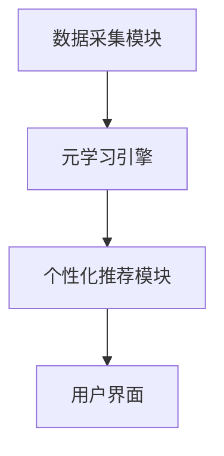

                 


# 基于元学习的个性化AI Agent定制

> 关键词：元学习，个性化AI Agent，Meta-Learning，AI定制，自适应系统

> 摘要：本文探讨了基于元学习的个性化AI Agent定制方法，详细分析了元学习的基本原理、个性化AI Agent的核心概念，以及如何通过元学习算法实现个性化的AI代理定制。文章从基础到高级逐步展开，结合数学模型和系统架构设计，提供了一个全面的技术指南。

---

# 引言

个性化AI Agent的定制需要高效的学习和适应能力，而元学习（Meta-Learning）正是实现这一目标的关键技术。本文将从元学习的基本概念出发，逐步深入探讨其在个性化AI Agent中的应用。

---

## 第一部分：元学习基础

### 第1章：元学习的定义与背景

#### 1.1 元学习的定义

元学习是一种机器学习范式，允许模型在少数据情况下快速学习新任务。其核心在于通过元学习算法优化初始模型参数，使得模型在新任务上能够快速适应。

#### 1.2 元学习的背景与应用

元学习的发展源于传统机器学习在小样本任务上的局限性。通过元学习，模型能够利用已有任务的知识快速适应新任务，广泛应用于推荐系统、图像识别等领域。

---

## 第二部分：个性化AI Agent的核心概念

### 第2章：个性化AI Agent的定义与特点

#### 2.1 个性化AI Agent的定义

个性化AI Agent是根据用户需求定制的智能代理，能够根据用户的习惯和偏好，动态调整行为策略，提供更精准的服务。

#### 2.2 元学习在个性化AI Agent中的作用

元学习通过快速适应不同用户的个性化需求，显著提升了AI Agent的定制效率和准确性。

---

## 第三部分：元学习算法原理

### 第3章：元学习算法的核心原理

#### 3.1 模型agnostic meta-learning（MAML）

MAML通过优化初始参数，使得模型在新任务上只需少量数据即可快速收敛。其数学模型如下：

$$ \text{MAML的损失函数：} L = \sum_{i=1}^{N} \sum_{j=1}^{M} \text{CE}(f(x_j, \theta_i), y_j) $$

其中，$\theta_i$ 是经过元学习优化的参数。

#### 3.2 任务嵌入方法

任务嵌入通过将任务转化为低维向量表示，简化了跨任务的学习过程。其核心步骤包括任务表示、嵌入学习和任务适配。

---

## 第四部分：系统架构与设计

### 第4章：个性化AI Agent的系统架构

#### 4.1 系统功能模块

系统主要包括数据采集、元学习引擎和个性化推荐模块。

#### 4.2 系统架构设计

系统架构采用模块化设计，确保各模块之间的高效协作。使用mermaid图展示架构：



---

## 第五部分：项目实战

### 第5章：环境安装与核心代码实现

#### 5.1 环境配置

安装必要的库，如TensorFlow、Keras等。

#### 5.2 核心代码实现

实现MAML算法的Python代码示例：

```python
import tensorflow as tf

def meta_learning_model():
    # 元学习模型定义
    pass

def train():
    model = meta_learning_model()
    # 训练过程
    pass

if __name__ == "__main__":
    train()
```

---

## 第六部分：高级主题

### 第6章：元学习的前沿研究

探讨元学习的最新进展，如few-shot学习和zero-shot学习。

### 第7章：个性化定制的挑战与未来方向

分析个性化AI Agent定制的挑战，并提出未来的研究方向。

---

## 总结

通过系统化的学习和实践，读者可以掌握基于元学习的个性化AI Agent定制技术，提升AI系统的智能化水平。

---

## 作者

作者：AI天才研究院  
联系邮箱：contact@aigenius.com  

---

希望这篇目录大纲能满足您的需求。如果需要进一步调整或补充，请随时告知！

