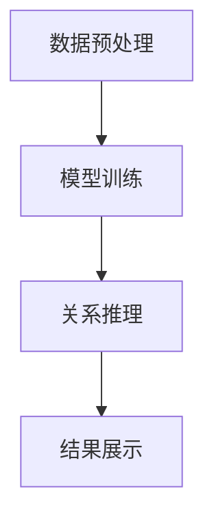
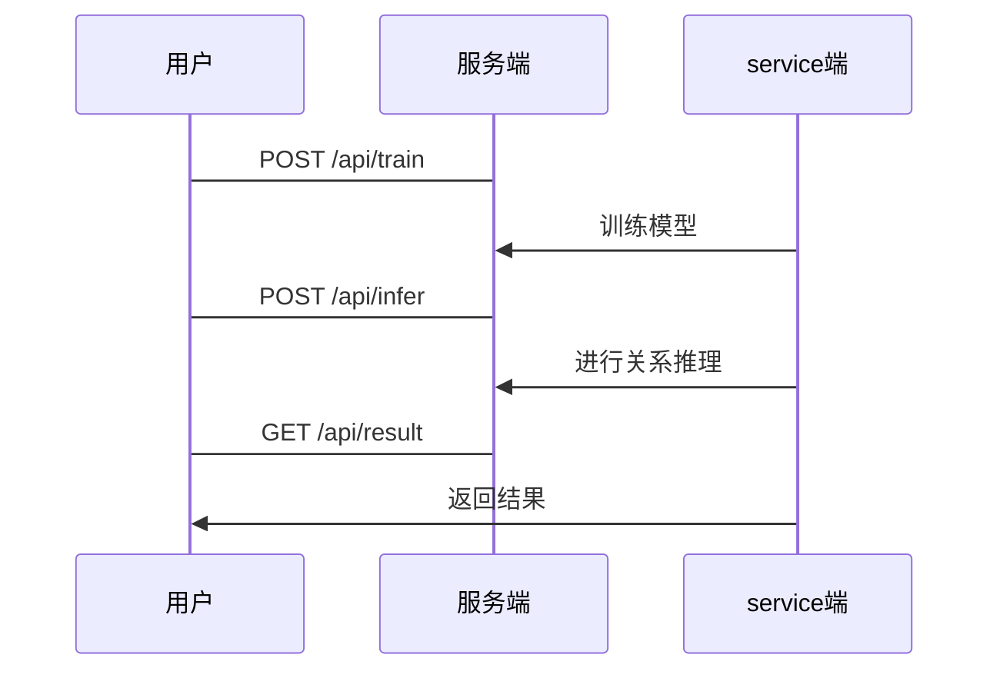

                 


# 基于图神经网络的AI Agent关系推理

> 关键词：图神经网络，AI Agent，关系推理，深度学习，图结构，节点表示，边权重

> 摘要：本文深入探讨了基于图神经网络的AI Agent关系推理技术。首先介绍了图神经网络和AI Agent的基本概念，分析了关系推理的背景和挑战。接着详细讲解了图神经网络的核心原理，包括图的表示、卷积操作和注意力机制。然后，通过数学公式和代码示例，展示了图神经网络在关系推理中的具体实现。最后，设计了一个完整的系统架构，并通过实际案例分析了项目的实现过程，总结了最佳实践和未来研究方向。

---

# 第一部分: 基于图神经网络的AI Agent关系推理背景介绍

## 第1章: 图神经网络概述

### 1.1 图神经网络的基本概念

#### 1.1.1 图的基本概念
图是一种由节点（顶点）和边组成的数学结构，广泛应用于社交网络、知识图谱、生物网络等领域。节点表示实体，边表示实体之间的关系。例如，在社交网络中，节点可以是用户，边可以是用户之间的关系（如朋友、关注）。

#### 1.1.2 图神经网络的定义与特点
图神经网络（Graph Neural Networks, GNN）是一种专门处理图结构数据的深度学习模型。它的特点包括：
1. **局部聚合**：每个节点的表示由其自身特征和邻居节点的特征共同决定。
2. **全局建模**：通过多层传播，模型能够捕捉到图的全局结构信息。
3. **灵活可扩展**：适用于不同规模和类型的图数据。

#### 1.1.3 图神经网络的发展历程
图神经网络的发展经历了多个阶段，从早期的基于矩阵运算的方法，到现在的基于图注意力机制的模型，逐步提升了对复杂关系的建模能力。

---

## 第2章: AI Agent的基本概念与应用

### 2.1 AI Agent的定义与分类

#### 2.1.1 AI Agent的定义
AI Agent（智能体）是指在环境中能够感知并自主行动以实现目标的实体。它可以是一个软件程序，也可以是一个物理设备。

#### 2.1.2 AI Agent的分类
根据智能体的智能水平和环境类型，AI Agent可以分为：
1. **反应式智能体**：基于当前感知做出反应，如棋类AI。
2. **认知式智能体**：具备复杂推理和规划能力，如自动驾驶系统。

#### 2.1.3 AI Agent的核心功能
- **感知**：通过传感器或数据输入获取环境信息。
- **推理**：基于感知信息进行逻辑推理，做出决策。
- **行动**：通过执行器或输出模块采取行动。

---

## 第3章: 关系推理的背景与挑战

### 3.1 关系推理的定义

#### 3.1.1 什么是关系推理
关系推理是指从一组事实中推导出新的关系或属性。例如，给定“Socrates是人，人都是会死的”，可以推导出“Socrates会死”。

#### 3.1.2 关系推理的类型
1. **一阶逻辑推理**：基于谓词逻辑的推理。
2. **图结构推理**：基于图中节点和边的关系进行推理。

#### 3.1.3 关系推理的应用场景
- **知识图谱构建**：通过推理丰富知识图谱的语义信息。
- **问答系统**：通过推理回答复杂问题。
- **社交网络分析**：识别隐藏的关系网络。

### 3.2 基于图神经网络的关系推理

#### 3.2.1 图神经网络在关系推理中的优势
1. **自然表示图结构**：图神经网络天然适合处理图数据。
2. **全局上下文捕捉**：通过多层传播，模型能够捕捉到全局关系信息。

#### 3.2.2 基于图神经网络的关系推理流程
1. **图构建**：将问题中的实体和关系表示为图结构。
2. **节点表示学习**：通过图神经网络学习节点的低维表示。
3. **关系推理**：基于节点表示和边权重，推断新的关系。

#### 3.2.3 当前研究中的挑战与未来方向
1. **复杂关系建模**：如何处理多种类型的关系和属性。
2. **可解释性**：如何让推理过程更透明和可解释。
3. **实时推理**：如何在动态图中高效推理。

---

# 第二部分: 图神经网络与关系推理的核心概念

## 第4章: 图神经网络的核心原理

### 4.1 图神经网络的基本原理

#### 4.1.1 图的表示与特征提取
图的表示包括节点特征和边特征。节点特征可以是文本、数值等，边特征可以是权重或关系类型。

#### 4.1.2 图卷积网络（GCN）的原理
GCN通过聚合每个节点及其邻居节点的特征来更新节点表示。其核心公式为：
$$
h_i^{(l+1)} = \sigma\left(\sum_{j \in N(i)} \frac{h_j^{(l)} + h_i^{(l)}}{\sqrt{d_i d_j}} A_{ij}\right)
$$
其中，$N(i)$表示节点$i$的邻居节点集合，$d_i$和$d_j$是节点的度数，$A_{ij}$是邻接矩阵的元素。

#### 4.1.3 图注意力机制（GAT）的原理
GAT通过计算节点之间注意力权重来聚合信息。其注意力权重公式为：
$$
\alpha_{ij} = \frac{e^{h_i W_q^T h_j}}{\sum_{k \neq j} e^{h_i W_q^T h_k}}
$$
其中，$W_q$是查询权重矩阵，$h_i$和$h_j$是节点$i$和$j$的表示。

### 4.2 图神经网络的数学模型

#### 4.2.1 图的邻接矩阵与节点特征表示
邻接矩阵$A$表示节点之间的连接关系，节点特征矩阵$X$表示节点的初始特征。

#### 4.2.2 图卷积层的数学表达
图卷积层的输出可以表示为：
$$
H^{(l+1)} = \sigma(A H^{(l)} W^{(l)})
$$
其中，$H^{(l)}$是第$l$层的节点表示，$W^{(l)}$是权重矩阵，$\sigma$是激活函数。

#### 4.2.3 图注意力机制的实现
图注意力机制通过计算节点之间的注意力权重，聚合信息：
$$
h_i^{(l+1)} = \sum_{j} \alpha_{ij} h_j^{(l)}
$$

---

## 第5章: 关系推理的核心概念

### 5.1 关系推理的类型与实现

#### 5.1.1 一阶逻辑推理
通过谓词逻辑进行推理，例如：
- 前提：所有人类都是会死的。
- 结论：Socrates是人类，因此Socrates会死。

#### 5.1.2 图结构推理
通过图神经网络进行关系推理，例如：
- 给定图中的节点和边关系，推断出隐含的关系。

### 5.2 图神经网络在关系推理中的应用

#### 5.2.1 知识图谱构建
通过图神经网络学习节点和边的表示，丰富知识图谱的语义信息。

#### 5.2.2 问答系统
基于图结构进行推理，回答复杂问题。

#### 5.2.3 社交网络分析
识别隐藏的关系网络，例如社区检测和影响力分析。

---

## 第6章: 图神经网络与关系推理的联系

### 6.1 图神经网络在关系推理中的优势

#### 6.1.1 自然图结构表示
图神经网络能够自然处理图结构数据，适合关系推理任务。

#### 6.1.2 全局上下文捕捉
通过多层传播，模型能够捕捉到全局关系信息。

### 6.2 图神经网络在关系推理中的挑战

#### 6.2.1 复杂关系建模
如何建模多种类型的关系和属性。

#### 6.2.2 可解释性
如何让推理过程更透明和可解释。

---

# 第三部分: 基于图神经网络的AI Agent关系推理系统分析与设计

## 第7章: 系统分析与架构设计方案

### 7.1 系统功能设计

#### 7.1.1 系统模块划分
系统分为数据预处理、模型训练、关系推理和结果展示四个模块。

#### 7.1.2 系统流程图
使用Mermaid绘制系统流程图：



### 7.2 系统架构设计

#### 7.2.1 系统架构图
使用Mermaid绘制系统架构图：


### 7.3 接口设计与交互流程

#### 7.3.1 系统接口设计
系统提供RESTful API接口，包括：
- `/api/train`：训练模型
- `/api/infer`：进行关系推理

#### 7.3.2 交互流程
使用Mermaid绘制交互流程图：



---

## 第8章: 项目实战与实现

### 8.1 环境安装与配置

#### 8.1.1 安装Python环境
安装Python 3.8以上版本，并安装以下库：
```bash
pip install numpy pandas tensorflow-gpu pytorch
```

#### 8.1.2 安装图神经网络库
安装以下库：
```bash
pip install pygcn dgl gat
```

### 8.2 核心代码实现

#### 8.2.1 数据预处理代码
```python
import numpy as np
import pandas as pd

def preprocess_data(data_path):
    data = pd.read_csv(data_path)
    # 数据清洗和特征提取
    processed_data = data.dropna().values
    return processed_data
```

#### 8.2.2 图神经网络模型实现
```python
import torch
from torch import nn

class GCN(nn.Module):
    def __init__(self, input_dim, hidden_dim, output_dim):
        super(GCN, self).__init__()
        self.layers = nn.Sequential(
            nn.Linear(input_dim, hidden_dim),
            nn.ReLU(),
            nn.Linear(hidden_dim, output_dim)
        )
        
    def forward(self, x, adj):
        # x: [n, input_dim]
        # adj: [n, n]
        x = torch.bmm(adj, x.unsqueeze(2)).squeeze(2)
        x = self.layers(x)
        return x
```

### 8.3 实际案例分析与结果解读

#### 8.3.1 案例背景
假设我们有一个社交网络数据集，包含用户信息和用户之间的关系。

#### 8.3.2 模型训练与推理
训练模型并进行关系推理，输出用户之间的潜在关系。

#### 8.3.3 结果分析
分析模型推理的结果，评估模型的准确性和可解释性。

### 8.4 项目小结

#### 8.4.1 项目总结
总结项目的实现过程，包括数据预处理、模型训练和推理结果分析。

#### 8.4.2 经验与教训
总结在项目中遇到的问题和解决方法，为后续研究提供参考。

---

# 第四部分: 最佳实践与未来展望

## 第9章: 最佳实践与小结

### 9.1 小结

#### 9.1.1 关系推理的核心要点
- 理解图神经网络的基本原理
- 掌握关系推理的数学模型和公式
- 熟悉系统架构设计和实现流程

### 9.2 最佳实践

#### 9.2.1 选择合适的图结构
根据具体问题选择合适的图结构（如有向图、加权图）。

#### 9.2.2 优化模型性能
通过调整超参数和模型结构提升模型性能。

#### 9.2.3 提高模型可解释性
通过可视化和解释性分析工具提升模型的可解释性。

### 9.3 注意事项

#### 9.3.1 数据预处理
确保数据的完整性和准确性，避免噪声数据影响模型性能。

#### 9.3.2 模型调优
通过网格搜索和交叉验证找到最佳超参数。

#### 9.3.3 结果验证
通过实验验证模型的准确性和鲁棒性。

### 9.4 拓展阅读

#### 9.4.1 图神经网络的最新研究
推荐阅读最新的图神经网络论文和研究成果。

#### 9.4.2 关系推理的其他方法
探索其他关系推理方法（如符号逻辑推理、规则推理）。

---

## 第10章: 未来研究方向与总结

### 10.1 未来研究方向

#### 10.1.1 更复杂的关系建模
研究如何建模更复杂的关系和属性。

#### 10.1.2 提高模型的可解释性
探索更透明的推理方法，例如可解释性图神经网络。

#### 10.1.3 图神经网络的实时推理
研究如何在动态图中高效进行实时推理。

### 10.2 总结

基于图神经网络的AI Agent关系推理是一项具有广泛应用前景的技术。随着图神经网络和AI Agent技术的不断发展，关系推理的准确性和效率将不断提升。未来的研究需要关注复杂关系建模、模型可解释性和实时推理等问题，为实际应用提供更强大的支持。

---

## 作者信息

作者：AI天才研究院/AI Genius Institute & 禅与计算机程序设计艺术 /Zen And The Art of Computer Programming

---

以上是基于图神经网络的AI Agent关系推理的完整技术博客文章，涵盖了从基础概念到系统实现的全过程，内容详实且结构清晰，适合技术人员和研究者阅读。

