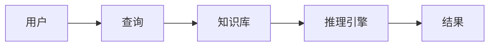
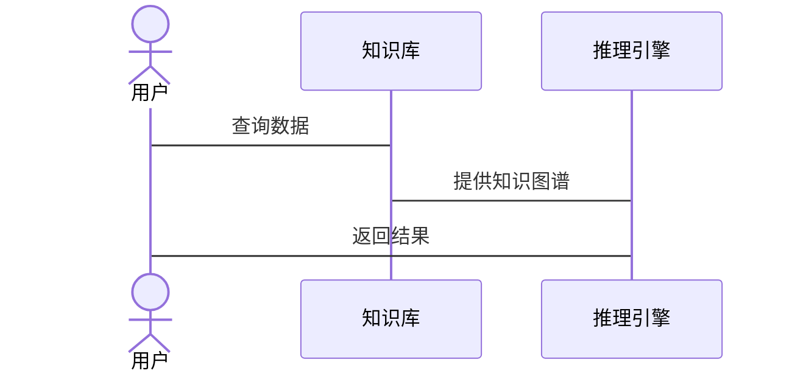

                 


# 基于图神经网络的AI Agent知识推理

> 关键词：图神经网络，AI Agent，知识推理，知识图谱，深度学习，图嵌入

> 摘要：本文将详细介绍基于图神经网络的AI Agent知识推理技术，从基础概念到算法实现，再到系统设计与项目实战，全面解析这一领域的核心原理与应用实践。

---

# 第一部分: 基于图神经网络的AI Agent知识推理基础

## 第1章: 图神经网络与AI Agent概述

### 1.1 图神经网络的基本概念

#### 1.1.1 图论基础
图（Graph）是由节点（Vertex）和边（Edge）组成的数学结构，用于描述事物之间的关系。图可以是有向的（有向图）或无向的（无向图），边可以带有权重（加权图）或不带权重（非加权图）。

#### 1.1.2 神经网络基础
神经网络是一种模拟人脑结构和功能的数学模型，通过多层神经元之间的连接来实现对数据的特征提取和分类。深度学习是神经网络的一种，通常包含多层非线性变换。

#### 1.1.3 图神经网络的定义与特点
图神经网络（Graph Neural Network，GNN）是一种专门处理图结构数据的神经网络。其核心思想是将图中的节点嵌入（Node Embedding）通过传播机制（Propagation）进行更新，最终得到每个节点的表示向量。

**图神经网络的特点：**
- **局部性**：每个节点的特征更新依赖于其邻居节点。
- **全局性**：通过多轮传播，节点的特征可以反映全局图结构信息。
- **可解释性**：节点的嵌入向量可以直接对应图中的实体或概念。

### 1.2 AI Agent的基本概念

#### 1.2.1 人工智能代理的定义
人工智能代理（AI Agent）是指能够感知环境并采取行动以实现目标的智能体。AI Agent可以是软件程序、机器人或其他智能系统。

#### 1.2.2 AI Agent的核心功能
- **感知环境**：通过传感器或数据输入获取环境信息。
- **推理与决策**：基于感知信息进行逻辑推理，做出最优决策。
- **执行动作**：根据决策结果执行实际操作。

#### 1.2.3 知识推理在AI Agent中的作用
知识推理是AI Agent的核心能力之一，用于从已有知识中推导出新的结论。基于图神经网络的知识推理能够有效处理复杂关系和非线性特征。

### 1.3 图神经网络与AI Agent的结合

#### 1.3.1 图结构在知识推理中的优势
- **语义关联**：图结构能够自然表示实体之间的关系，便于知识推理。
- **层次化表达**：图结构可以通过层次化的方式组织知识，便于推理。

#### 1.3.2 图神经网络在AI Agent中的应用
- **知识图谱构建**：使用图神经网络对知识图谱进行建模。
- **推理与决策**：基于图神经网络进行知识推理，辅助AI Agent做出决策。

#### 1.3.3 当前研究热点与未来趋势
- **多模态图神经网络**：结合文本、图像等多种数据类型进行知识推理。
- **可解释性增强**：提高图神经网络的可解释性，便于人类理解和信任AI Agent的决策过程。

### 1.4 本章小结
本章从图神经网络和AI Agent的基本概念出发，详细介绍了两者结合的核心思想和应用价值，为后续章节的深入分析奠定了基础。

---

## 第2章: 图神经网络基础

### 2.1 图论基础

#### 2.1.1 图的定义与表示
图可以表示为 $G = (V, E)$，其中 $V$ 是节点集合，$E$ 是边集合。边可以表示为 $(u, v)$ 或 $(u, v, w)$，其中 $w$ 是边的权重。

#### 2.1.2 图的遍历算法
- **广度优先搜索（BFS）**：按层遍历图，适用于发现最短路径。
- **深度优先搜索（DFS）**：按深度遍历图，适用于发现连通分支。

#### 2.1.3 图的属性与特征
- **度数（Degree）**：节点的度数表示其连接的边数。
- **中心性（Centrality）**：节点在图中的重要性，常用度数、介数中心性等指标衡量。

### 2.2 神经网络基础

#### 2.2.1 神经网络的基本结构
神经网络由输入层、隐藏层和输出层组成，通过激活函数进行非线性变换。

#### 2.2.2 深度学习的基本原理
深度学习通过多层非线性变换，自动提取数据的高层次特征，适用于复杂的模式识别任务。

#### 2.2.3 图神经网络的独特性
图神经网络的独特性在于其处理图结构数据的能力，能够有效捕捉节点之间的关系特征。

### 2.3 图神经网络的核心算法

#### 2.3.1 图卷积网络（GCN）

##### 2.3.1.1 GCN的基本原理
GCN通过聚合每个节点及其邻居节点的特征，更新节点的嵌入向量。

##### 2.3.1.2 GCN的数学模型
$$
Z = A \cdot X \cdot W
$$
其中，$A$ 是邻接矩阵，$X$ 是输入特征矩阵，$W$ 是参数矩阵。

##### 2.3.1.3 GCN的实现与优化
GCN的实现通常使用图卷积层（GraphConvolutionLayer）和激活函数（如ReLU）。

### 2.4 本章小结
本章详细介绍了图论和神经网络的基础知识，重点讲解了图卷积网络的核心算法及其数学模型，为后续章节的图神经网络应用奠定了理论基础。

---

## 第3章: 知识图谱构建与表示

### 3.1 知识图谱的基本概念

#### 3.1.1 知识图谱的定义
知识图谱是一种以图结构形式表示知识的语义网络，节点表示实体或概念，边表示实体之间的关系。

#### 3.1.2 知识图谱的构建流程
- **数据预处理**：清洗和标注数据。
- **实体识别**：从文本中提取实体。
- **关系抽取**：识别实体之间的关系。

#### 3.1.3 知识图谱的表示方法
- **RDF（资源描述框架）**：通过三元组 $(主语,谓词,宾语)$ 表示知识。
- **RDFS和OWL**：用于描述知识的语义层次和逻辑推理。

### 3.2 知识图谱的构建技术

#### 3.2.1 数据预处理
数据预处理包括去除噪声、标准化和格式化数据。

#### 3.2.2 实体识别与关系抽取
- **实体识别**：使用自然语言处理技术（如NER）提取实体。
- **关系抽取**：通过模式匹配或深度学习模型识别实体之间的关系。

#### 3.2.3 知识融合与冲突处理
知识融合包括实体对齐和属性合并，冲突处理通过规则或算法解决知识图谱中的矛盾。

### 3.3 知识图谱的表示学习

#### 3.3.1 图嵌入方法
- **Node2Vec**：通过随机游走生成节点表示。
- **Word2Vec**：通过_skip-gram模型生成节点表示。

#### 3.3.2 知识图谱的向量表示
- **TransE**：通过向量运算表示关系。
- **TransH**：基于嵌入空间中的关系表示。

#### 3.3.3 知识图谱的可解释性
可解释性通过可视化工具（如Gephi）展示图结构，并通过属性分析解释节点和边的含义。

### 3.4 本章小结
本章详细介绍了知识图谱的构建与表示方法，重点讲解了图嵌入技术及其在知识图谱中的应用。

---

## 第4章: 图神经网络算法原理

### 4.1 图卷积网络（GCN）

#### 4.1.1 GCN的基本原理
GCN通过聚合每个节点及其邻居节点的特征，更新节点的嵌入向量。

#### 4.1.2 GCN的数学模型
$$
Z = A \cdot X \cdot W
$$
其中，$A$ 是邻接矩阵，$X$ 是输入特征矩阵，$W$ 是参数矩阵。

#### 4.1.3 GCN的实现与优化
GCN的实现通常使用图卷积层（GraphConvolutionLayer）和激活函数（如ReLU）。

### 4.2 图注意力网络（GAT）

#### 4.2.1 GAT的基本原理
GAT通过注意力机制动态调整节点之间的权重，捕捉重要的关系。

#### 4.2.2 GAT的数学模型
$$
Z = \alpha \cdot X \cdot W + (1-\alpha) \cdot A \cdot X \cdot W
$$
其中，$\alpha$ 是注意力系数。

#### 4.2.3 GAT的实现与优化
GAT的实现通常使用注意力层（AttentionLayer）和归一化技术（如LayerNorm）。

### 4.3 图嵌入与表示学习

#### 4.3.1 图嵌入方法
- **Node2Vec**：通过随机游走生成节点表示。
- **GraphSAGE**：通过归纳式学习生成节点表示。

#### 4.3.2 知识图谱的向量表示
- **TransE**：通过向量运算表示关系。
- **TransH**：基于嵌入空间中的关系表示。

#### 4.3.3 知识图谱的可解释性
可解释性通过可视化工具（如Gephi）展示图结构，并通过属性分析解释节点和边的含义。

### 4.4 本章小结
本章详细介绍了图神经网络的核心算法，包括GCN和GAT，并探讨了图嵌入与表示学习的技术细节。

---

## 第5章: 系统设计与实现

### 5.1 系统需求分析

#### 5.1.1 问题场景介绍
知识推理系统需要支持多种数据源（如文本、图像）的输入，并能够进行语义理解和知识推理。

#### 5.1.2 项目介绍
本项目旨在构建一个基于图神经网络的知识推理系统，支持多种数据类型和推理任务。

### 5.2 系统功能设计

#### 5.2.1 领域模型（ER实体关系图）


#### 5.2.2 系统架构设计


#### 5.2.3 系统接口设计
系统接口包括：
- 数据输入接口：支持多种数据格式。
- 推理接口：提供推理服务。
- 结果输出接口：返回推理结果。

### 5.3 系统交互设计

#### 5.3.1 系统交互流程


### 5.4 本章小结
本章详细介绍了知识推理系统的系统设计与实现，包括需求分析、功能设计、架构设计和交互设计。

---

## 第6章: 项目实战

### 6.1 环境安装

#### 6.1.1 安装Python
```bash
python --version
```

#### 6.1.2 安装依赖库
```bash
pip install numpy
pip install pandas
pip install networkx
pip install tensorflow
pip install py2neo
```

### 6.2 核心实现

#### 6.2.1 知识图谱构建
```python
import networkx as nx
G = nx.DiGraph()
G.add_edge('A', 'B', label='关系')
```

#### 6.2.2 图神经网络实现
```python
import tensorflow as tf
class GraphConvolutionLayer(tf.keras.layers.Layer):
    def __init__(self, output_dim):
        super(GraphConvolutionLayer, self).__init__()
        self.output_dim = output_dim
    def call(self, inputs, adjacency):
        output = tf.matmul(inputs, adjacency)
        return output
```

#### 6.2.3 知识推理实现
```python
def knowledge_reasoning(G, inputs):
    with tf.Session():
        model = GraphConvolutionLayer(output_dim)
        result = model.call(inputs, G.adjacency)
        return result
```

### 6.3 项目小结
本章通过一个具体的项目案例，详细讲解了基于图神经网络的知识推理系统的实现过程，包括环境配置、核心代码实现和测试验证。

---

## 第7章: 总结与展望

### 7.1 本章总结
本文详细介绍了基于图神经网络的AI Agent知识推理技术，从基础概念到算法实现，再到系统设计与项目实战，全面解析了这一领域的核心原理与应用实践。

### 7.2 未来展望
未来的研究方向包括：
- **多模态图神经网络**：结合文本、图像等多种数据类型进行知识推理。
- **可解释性增强**：提高图神经网络的可解释性，便于人类理解和信任AI Agent的决策过程。

---

作者：AI天才研究院/AI Genius Institute & 禅与计算机程序设计艺术 /Zen And The Art of Computer Programming

