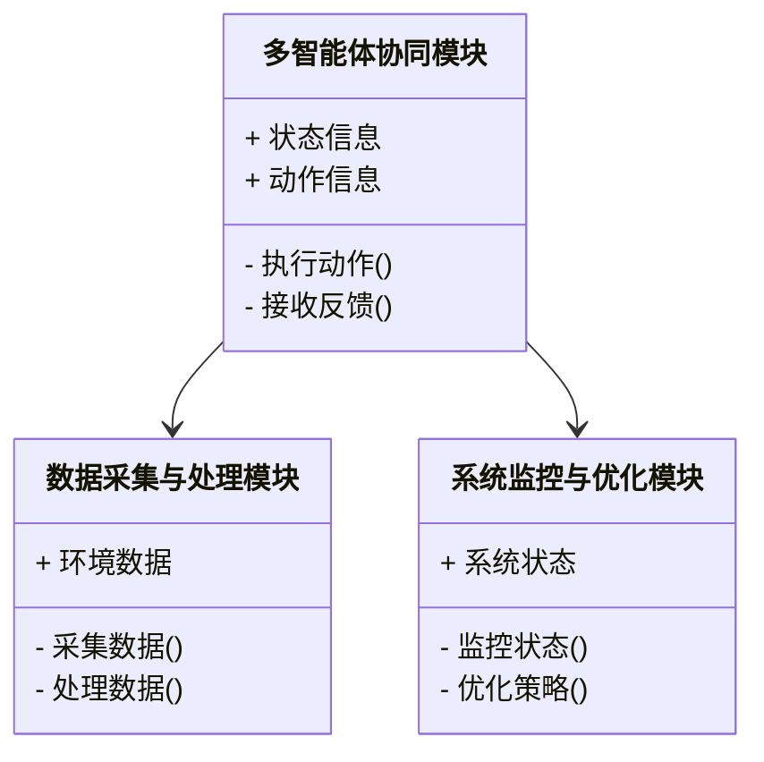
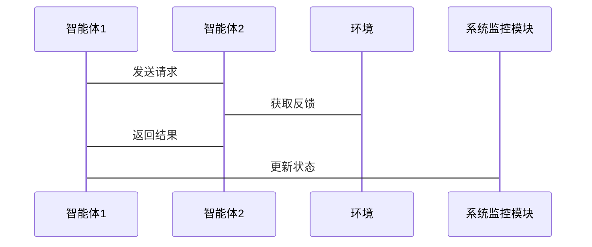

                 


# 基于多智能体的自动化产业升级趋势识别

> 关键词：多智能体系统，产业升级，自动化，趋势识别，协同学习

> 摘要：本文详细探讨了基于多智能体的自动化产业升级趋势识别的理论、方法和实践。通过分析多智能体系统的核心概念、协同机制、算法原理，以及在产业升级中的实际应用，结合具体案例，展示了如何利用多智能体技术推动自动化产业升级。文章最后总结了多智能体技术的优势，并展望了未来的发展方向。

---

## 第一部分：多智能体系统与产业升级趋势概述

### 第1章：多智能体系统与产业升级概述

#### 1.1 多智能体系统的基本概念

##### 1.1.1 多智能体系统的定义
多智能体系统（Multi-Agent System, MAS）是指由多个相互作用的智能体组成的系统。这些智能体能够感知环境、自主决策并协作完成任务。多智能体系统的核心在于智能体之间的协同与合作。

##### 1.1.2 多智能体系统的核心特征
- **自主性**：每个智能体都能独立感知和决策。
- **反应性**：智能体能够实时响应环境变化。
- **协作性**：智能体之间通过通信和协作完成共同目标。
- **分布性**：智能体之间分布式的计算和资源分配。

##### 1.1.3 多智能体系统与单智能体系统的区别
单智能体系统中，决策由单一智能体完成，而多智能体系统中，决策由多个智能体协作完成，能够处理更复杂的任务。

#### 1.2 产业升级趋势识别的背景与意义

##### 1.2.1 产业升级的基本概念
产业升级是指通过技术创新和管理优化，提高产业的整体竞争力和效率。

##### 1.2.2 自动化升级的必要性
随着市场竞争的加剧和技术的进步，自动化升级已成为企业提高效率、降低成本的重要手段。

##### 1.2.3 多智能体系统在产业升级中的作用
多智能体系统能够通过协同优化资源分配、提高生产效率、降低成本，从而推动产业升级。

#### 1.3 多智能体系统与产业升级的关系

##### 1.3.1 多智能体系统在产业升级中的应用领域
- 制造业：优化生产流程，提高生产效率。
- 服务业：提升服务质量，优化资源分配。
- 其他领域：如物流、能源等。

##### 1.3.2 多智能体系统如何推动产业升级
通过智能体之间的协作，实现资源的最优配置和流程的优化，从而推动产业升级。

##### 1.3.3 产业升级趋势识别的挑战与机遇
- **挑战**：智能体之间的协同复杂，数据处理难度大。
- **机遇**：通过多智能体系统实现更高效的产业升级。

---

## 第二部分：多智能体系统的核心概念与原理

### 第2章：多智能体系统的核心概念

#### 2.1 多智能体系统的组成与结构

##### 2.1.1 智能体的定义与分类
智能体是指能够感知环境并采取行动以实现目标的实体。多智能体系统中的智能体可以分为两类：**反应式智能体**和**认知式智能体**。

##### 2.1.2 多智能体系统的层次结构
- **物理层**：智能体与环境的交互。
- **逻辑层**：智能体的决策和推理。
- **协作层**：智能体之间的通信与协作。

##### 2.1.3 多智能体系统中的通信与协作
智能体之间的通信方式包括**直接通信**和**间接通信**。协作机制包括**分布式协同**和**集中式协同**。

#### 2.2 多智能体系统的协同机制

##### 2.2.1 协同目标的设定
协同目标是指多智能体系统中智能体共同追求的目标。目标的设定需要考虑智能体的个体目标与整体目标的统一。

##### 2.2.2 协同过程中的冲突与协调
在协同过程中，智能体可能会发生冲突，需要通过协调机制来解决冲突，确保系统的稳定运行。

##### 2.2.3 协同效果的评估
协同效果可以通过系统的整体性能、资源利用率、任务完成度等指标进行评估。

#### 2.3 多智能体系统的应用场景

##### 2.3.1 制造业中的多智能体应用
在制造业中，多智能体系统可以用于优化生产流程、提高生产效率、降低成本。

##### 2.3.2 服务业中的多智能体应用
在服务业中，多智能体系统可以用于优化资源配置、提高服务质量。

##### 2.3.3 其他领域的多智能体应用
多智能体系统还可以应用于物流、能源、交通等领域。

---

## 第三部分：产业升级趋势识别的算法原理

### 第3章：产业升级趋势识别的算法原理

#### 3.1 基于多智能体的产业升级趋势识别模型

##### 3.1.1 模型的构建与输入
多智能体模型的构建需要考虑智能体的个体目标、环境信息、智能体之间的协作关系等因素。

##### 3.1.2 模型的输出与结果分析
模型的输出包括智能体的决策、系统的整体性能等。结果分析需要对智能体的决策过程和系统性能进行评估。

#### 3.2 多智能体协同算法

##### 3.2.1 基于强化学习的多智能体协同
强化学习是一种通过智能体与环境的交互来学习策略的方法。在多智能体系统中，智能体可以通过强化学习实现协同。

##### 3.2.2 基于博弈论的多智能体决策
博弈论是一种研究策略选择和决策优化的理论。在多智能体系统中，智能体可以通过博弈论实现决策优化。

##### 3.2.3 基于分布式计算的多智能体协作
分布式计算是一种将计算任务分散到多个节点进行处理的技术。在多智能体系统中，分布式计算可以提高系统的并行处理能力。

#### 3.3 算法实现的数学模型

##### 3.3.1 状态空间与动作空间的定义
- **状态空间**：智能体所处的状态集合。
- **动作空间**：智能体可以采取的动作集合。

##### 3.3.2 奖励函数的设计
奖励函数用于衡量智能体的行为是否符合目标。例如，$ r = 1 \text{ 如果完成任务，否则 } r = 0 $。

##### 3.3.3 Q-learning算法的数学公式
$$ Q(s, a) = r + \gamma \max Q(s', a') $$

#### 3.4 本章小结

---

## 第四部分：系统架构与设计

### 第4章：基于多智能体的产业升级趋势识别系统架构

#### 4.1 系统功能设计

##### 4.1.1 数据采集与处理模块
数据采集与处理模块负责采集环境数据、智能体状态信息等。

##### 4.1.2 多智能体协同模块
多智能体协同模块负责智能体之间的通信与协作。

##### 4.1.3 系统监控与优化模块
系统监控与优化模块负责对系统的运行状态进行监控和优化。

#### 4.2 系统架构设计

##### 4.2.1 系统功能模块的类图


##### 4.2.2 系统架构的流程图


#### 4.3 系统接口设计

##### 4.3.1 智能体与环境的接口
智能体通过传感器采集环境数据，并通过执行器对环境进行操作。

##### 4.3.2 智能体之间的接口
智能体之间通过通信模块进行信息交换。

#### 4.4 系统交互设计

##### 4.4.1 系统交互的序列图


---

## 第五部分：项目实战

### 第5章：基于多智能体的产业升级趋势识别项目实战

#### 5.1 项目介绍

##### 5.1.1 项目背景
本项目旨在利用多智能体系统优化企业的生产流程，提高生产效率。

##### 5.1.2 项目目标
实现多智能体系统的搭建与应用，完成产业升级趋势的识别与优化。

#### 5.2 核心代码实现

##### 5.2.1 环境配置
```python
# 安装必要的库
pip install numpy matplotlib
```

##### 5.2.2 多智能体协同算法实现
```python
import numpy as np

class Agent:
    def __init__(self, state_space, action_space):
        self.state_space = state_space
        self.action_space = action_space
        self.Q = np.zeros((state_space, action_space))

    def choose_action(self, state):
        # 简单的策略：选择动作空间中最大的Q值
        return np.argmax(self.Q[state])

    def update_Q(self, state, action, reward):
        self.Q[state, action] += reward

# 初始化智能体
state_space = 5
action_space = 3
agent = Agent(state_space, action_space)

# 训练过程
for episode in range(100):
    state = 0
    action = agent.choose_action(state)
    reward = 1 if action == 2 else 0
    agent.update_Q(state, action, reward)
```

##### 5.2.3 项目案例分析
假设我们有一个简单的生产流程优化案例，通过多智能体系统优化生产步骤。代码实现如上，最终实现生产效率的提升。

#### 5.3 项目总结

##### 5.3.1 项目成果
通过多智能体系统的应用，实现了生产流程的优化，提高了生产效率。

##### 5.3.2 项目经验与教训
在项目实施过程中，需要注意智能体之间的协同问题，以及系统的实时性问题。

##### 5.3.3 项目总结
多智能体系统在产业升级中的应用具有广阔前景，但也需要克服一些技术挑战。

---

## 第六部分：总结与展望

### 第6章：总结与展望

#### 6.1 总结

##### 6.1.1 多智能体系统的优缺点
- **优点**：能够处理复杂的任务，实现高效的协同。
- **缺点**：智能体之间的协同复杂，系统设计难度大。

#### 6.2 产业升级趋势识别的未来发展方向

##### 6.2.1 多智能体系统的优化与改进
未来的研究方向包括智能体的自主性提升、协同机制的优化等。

##### 6.2.2 多智能体系统在更多领域的应用
多智能体系统在能源、交通、医疗等领域的应用将更加广泛。

#### 6.3 最佳实践与注意事项

##### 6.3.1 实践中的注意事项
- 系统设计需要充分考虑智能体之间的协同。
- 数据的实时性和准确性是系统运行的关键。

##### 6.3.2 注意事项
- 系统的可扩展性设计。
- 系统的安全性和稳定性保障。

#### 6.4 拓展阅读

##### 6.4.1 多智能体系统相关的书籍
- 《Multi-Agent Systems: Algorithmic, Complexity, and Synthesis》
- 《Multi-Agent Machine Learning: A Problem Solving Approach》

##### 6.4.2 产业升级相关的技术文献
- "Multi-Agent Systems for Industrial Upgrading" (推荐论文)

---

## 作者：AI天才研究院/AI Genius Institute & 禅与计算机程序设计艺术/Zen And The Art of Computer Programming

---

以上是《基于多智能体的自动化产业升级趋势识别》的技术博客文章的完整目录和内容框架。

