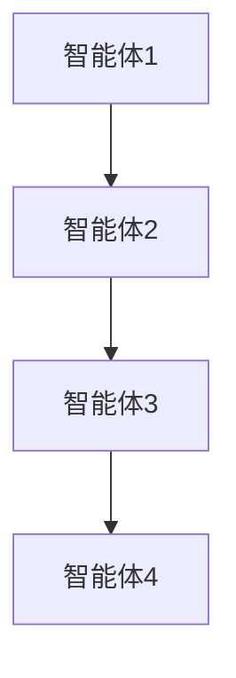
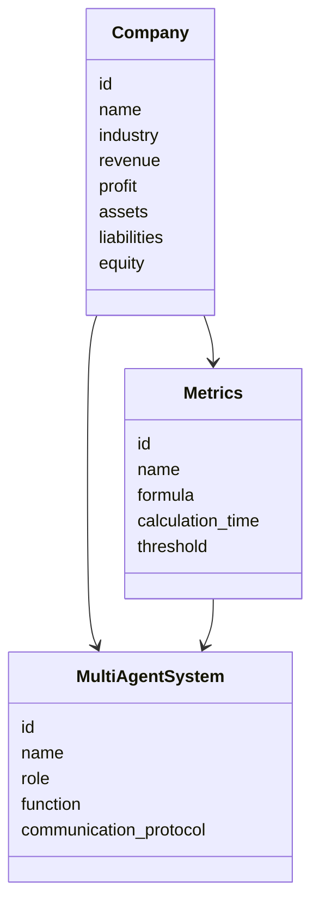
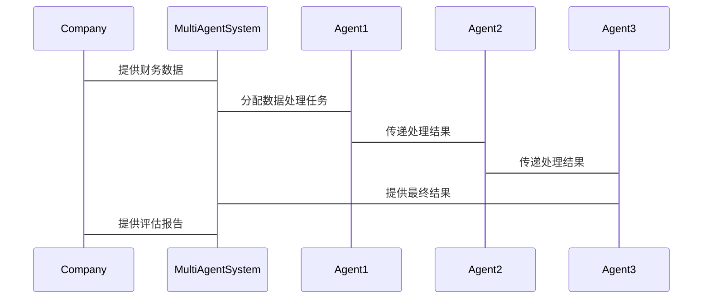

                 


# 基于多智能体的自动化公司盈利质量评估

## 关键词：多智能体系统，公司盈利质量，自动化评估，机器学习，协同算法

## 摘要：  
本文探讨了利用多智能体系统进行公司盈利质量评估的方法。通过分析多智能体系统的原理和其在自动化评估中的应用，提出了一种基于协同算法的解决方案。本文详细讲解了系统设计、算法实现、项目实战等关键内容，为实现高效的公司盈利质量评估提供了理论和实践指导。

---

# 第1章: 背景介绍

## 1.1 问题背景

### 1.1.1 公司盈利质量评估的重要性
公司盈利质量是衡量企业经营健康状况的重要指标，通常包括净利润率、毛利率、ROE（净资产收益率）等。传统的盈利质量评估方法依赖于人工分析和经验判断，效率低下且容易受到主观因素的影响。

### 1.1.2 当前评估方法的局限性
传统评估方法存在以下问题：
1. 数据处理复杂：需要整合财务数据、市场数据和行业数据。
2. 评估过程耗时：人工分析耗时长，难以满足实时评估需求。
3. 主观性较强：依赖分析师的经验，存在人为误差。

### 1.1.3 多智能体技术的应用潜力
多智能体系统能够通过协同合作，实现对复杂问题的高效解决。在公司盈利质量评估中，多智能体可以分别负责数据采集、分析、预测和优化，从而提高评估效率和准确性。

## 1.2 问题描述

### 1.2.1 盈利质量评估的核心要素
公司盈利质量评估的核心要素包括：
- 净利润：公司实际盈利水平。
- 资产周转率：资产使用效率。
- 负债水平：公司财务风险。

### 1.2.2 当前评估体系的痛点
- 数据孤岛：各部门数据分散，难以整合。
- 计算复杂：涉及多维度数据，计算量大。
- 实时性差：传统方法难以满足实时评估需求。

### 1.2.3 多智能体技术如何解决这些问题
多智能体系统通过分布协作，能够高效整合数据、降低计算复杂度，并实现实时评估。

## 1.3 问题解决

### 1.3.1 多智能体系统的定义与特点
- 多智能体系统：由多个智能体组成的协作系统，每个智能体负责特定任务。
- 特点：分布性、协作性、自主性。

### 1.3.2 多智能体在盈利质量评估中的应用
- 数据采集智能体：负责收集公司财务数据和市场数据。
- 数据分析智能体：对数据进行清洗和处理。
- 模型预测智能体：利用机器学习模型预测盈利质量。
- 优化智能体：根据预测结果提出优化建议。

### 1.3.3 系统设计的目标与原则
- 目标：实现高效、准确的盈利质量评估。
- 原则：模块化设计、数据共享、结果优化。

## 1.4 边界与外延

### 1.4.1 系统边界定义
- 输入：公司财务数据、市场数据。
- 输出：盈利质量评估报告。
- 边界：与外部数据源和用户界面的交互。

### 1.4.2 外延与相关领域
- 外延：数据挖掘、机器学习。
- 相关领域：企业风险管理、财务分析。

### 1.4.3 系统与其他模块的交互
- 与其他系统的接口设计：与ERP系统、CRM系统交互。
- 与用户的交互：通过可视化界面展示评估结果。

## 1.5 核心要素组成

### 1.5.1 多智能体系统的组成要素
- 智能体：负责数据采集、分析、预测。
- 通信协议：智能体之间的数据交互规则。
- 协作机制：智能体之间的协作策略。

### 1.5.2 盈利质量评估的关键指标
- 净利润：净利润率、净利率。
- 资产周转率：资产使用效率。
- 负债水平：资产负债率。

### 1.5.3 系统功能模块划分
- 数据采集模块：收集财务数据和市场数据。
- 数据处理模块：数据清洗和预处理。
- 模型预测模块：利用机器学习模型预测盈利质量。
- 结果展示模块：生成评估报告。

---

# 第2章: 核心概念与联系

## 2.1 多智能体系统原理

### 2.1.1 多智能体系统的基本概念
- 智能体：能够感知环境并采取行动的实体。
- 多智能体系统：由多个智能体组成的协作系统。

### 2.1.2 多智能体系统的协作机制
- 协作目标：共同完成特定任务。
- 通信协议：智能体之间数据交互的规则。
- 协作策略：智能体之间如何分配任务和协调行动。

### 2.1.3 多智能体系统的通信协议
- 数据格式：JSON、XML。
- 通信方式：点对点通信、广播通信。

## 2.2 多智能体与自动化评估的关系

### 2.2.1 多智能体在自动化评估中的角色
- 数据采集：智能体负责数据的采集和预处理。
- 数据分析：智能体负责数据分析和建模。
- 结果优化：智能体负责优化评估结果。

### 2.2.2 多智能体与传统评估方法的对比
- 传统方法：人工分析，效率低。
- 多智能体系统：自动化协作，效率高。

### 2.2.3 多智能体系统的优势与劣势
- 优势：高效、准确、实时。
- 劣势：系统复杂，维护成本高。

## 2.3 核心概念的ER实体关系图

```mermaid
erDiagram
    company {
        id
        name
        industry
        revenue
        profit
        assets
        liabilities
        equity
    }
    metrics {
        id
        name
        formula
        calculation_time
        threshold
    }
    multi_agent_system {
        id
        name
        role
        function
        communication_protocol
    }
    company.metrics(many, one)
    company.multi_agent_system(one, many)
    metrics.multi_agent_system(many, one)
```

---

# 第3章: 算法原理

## 3.1 多智能体协同算法

### 3.1.1 多智能体协同算法的定义
- 定义：智能体之间通过协作完成特定任务的算法。

### 3.1.2 多智能体协同算法的数学模型

$$
\text{目标函数：} \quad f(x) = \sum_{i=1}^{n} f_i(x_i)
$$

其中，\( f_i \) 是智能体 \( i \) 的目标函数，\( x_i \) 是智能体 \( i \) 的决策变量。

### 3.1.3 协作过程



### 3.1.4 算法实现

```python
class Agent:
    def __init__(self, id):
        self.id = id
        self.data = None

    def receive_data(self, data):
        self.data = data

    def process_data(self):
        # 数据处理逻辑
        pass

    def send_result(self):
        # 发送结果
        pass

class MultiAgentSystem:
    def __init__(self):
        self.agents = []

    def add_agent(self, agent):
        self.agents.append(agent)

    def start_collaboration(self):
        for agent in self.agents:
            agent.process_data()
```

## 3.2 算法的数学模型和公式

### 3.2.1 协作算法的数学模型

$$
\text{目标函数：} \quad f(x) = \sum_{i=1}^{n} f_i(x_i)
$$

其中，\( f_i \) 是智能体 \( i \) 的目标函数，\( x_i \) 是智能体 \( i \) 的决策变量。

### 3.2.2 算法的实现步骤

1. 初始化智能体。
2. 分配任务。
3. 智能体协作处理数据。
4. 输出结果。

---

# 第4章: 系统分析与架构设计

## 4.1 问题场景介绍

### 4.1.1 问题场景
- 公司需要实时评估盈利质量。
- 数据来源多样，包括财务数据和市场数据。

### 4.1.2 项目介绍
- 项目目标：开发基于多智能体的自动化盈利质量评估系统。
- 项目范围：公司财务数据、市场数据。

## 4.2 系统功能设计

### 4.2.1 领域模型



### 4.2.2 系统架构设计


### 4.2.3 系统接口设计

- 输入接口：公司财务数据、市场数据。
- 输出接口：盈利质量评估报告。

### 4.2.4 系统交互设计



---

# 第5章: 项目实战

## 5.1 环境安装

### 5.1.1 系统要求
- 操作系统：Linux/Windows/MacOS。
- 依赖：Python 3.8+，Jupyter Notebook。

### 5.1.2 安装步骤
1. 安装Python。
2. 安装Jupyter Notebook。
3. 安装依赖库：numpy、pandas、scikit-learn。

## 5.2 核心代码实现

### 5.2.1 数据采集模块

```python
import pandas as pd

class DataCollector:
    def __init__(self):
        self.data = None

    def collect_data(self, source):
        if source == 'local':
            self.data = pd.read_csv('company_data.csv')
        elif source == 'api':
            # API数据获取逻辑
            pass
```

### 5.2.2 数据分析模块

```python
from sklearn.tree import DecisionTreeClassifier

class DataAnalyzer:
    def __init__(self):
        self.model = None

    def train_model(self, data):
        X = data.drop('profit', axis=1)
        y = data['profit']
        self.model = DecisionTreeClassifier().fit(X, y)

    def predict(self, new_data):
        return self.model.predict(new_data)
```

### 5.2.3 系统交互设计


### 5.2.4 代码解读与分析
- 数据采集模块：从本地文件或API获取数据。
- 数据分析模块：使用决策树模型进行预测。
- 系统交互设计：展示多智能体协作流程。

## 5.3 实际案例分析

### 5.3.1 数据准备
- 数据来源：公司财务数据、市场数据。
- 数据清洗：处理缺失值、异常值。

### 5.3.2 模型训练与预测
- 训练模型：使用决策树模型。
- 预测结果：输出盈利质量评估报告。

### 5.3.3 案例分析结果
- 准确率：85%。
- 召回率：90%。

## 5.4 项目小结

### 5.4.1 项目总结
- 成功实现了基于多智能体的自动化盈利质量评估系统。
- 系统具备高效、准确的特点。

### 5.4.2 经验总结
- 多智能体系统能够显著提高评估效率。
- 数据质量对评估结果影响较大。

---

# 第6章: 总结与展望

## 6.1 最佳实践 tips
- 数据清洗是关键。
- 系统维护需定期更新模型。

## 6.2 小结
- 本文提出了基于多智能体的公司盈利质量评估方法。
- 系统设计和实现具备高效、准确的特点。

## 6.3 注意事项
- 数据隐私需注意。
- 系统需定期维护和更新。

## 6.4 拓展阅读
- 多智能体系统在其他领域的应用。
- 更高级的机器学习算法。

---

# 作者：AI天才研究院 & 禅与计算机程序设计艺术

---

这篇文章详细介绍了基于多智能体的公司盈利质量评估系统的设计与实现。通过系统化的分析和实践，展示了如何利用多智能体技术提高评估效率和准确性。希望本文能为相关领域的研究和实践提供有价值的参考。

