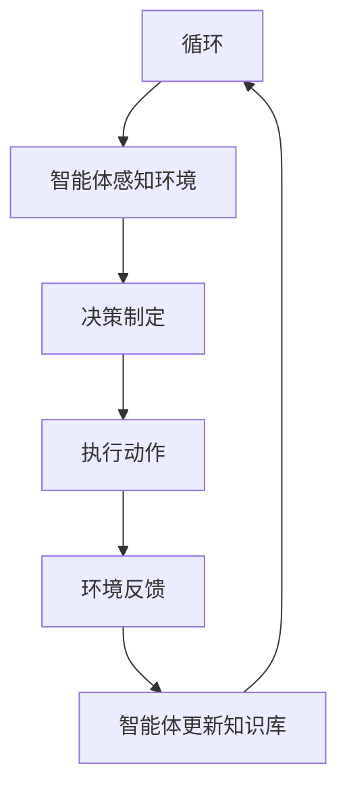
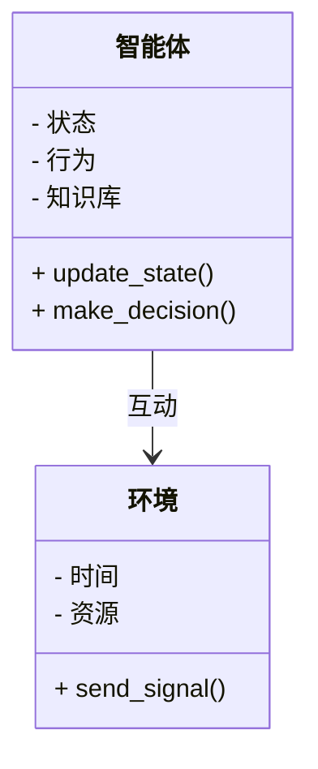

                 


# 基于多智能体的自动化市场效率评估

> 关键词：多智能体系统，市场效率评估，自动化评估，博弈论模型，系统架构设计

> 摘要：本文深入探讨了基于多智能体的市场效率评估方法，从系统背景、核心概念、算法原理到数学模型，再到系统设计与项目实战，全面解析了多智能体系统在市场效率评估中的应用。通过详细的技术分析和实际案例，本文展示了如何利用多智能体系统来提高市场分析的自动化水平和准确性。

---

## 第1章: 多智能体系统概述

### 1.1 多智能体系统的定义与特点

多智能体系统（Multi-Agent System, MAS）是由多个智能体（Agent）组成的分布式系统，每个智能体都是具有独立性、反应性、主动性、社会性的实体。以下是多智能体系统的特点对比表：

| 特性        | 分布式系统        | 集中式系统        |
|-------------|------------------|------------------|
| 控制方式     | 去中心化控制      | 中心化控制        |
| 效率         | 较低             | 较高             |
| 可扩展性     | 较高             | 较低             |
| 灵活性       | 高              | 低              |

多智能体系统的实体关系图如下：

```mermaid
erDiagram
    participant 市场主体 {
        <属性> 名称
        <属性> 行为
        <属性> 状态
    }
    participant 市场环境 {
        <属性> 时间
        <属性> 场所
        <属性> 资源
    }
    市场主体 --> 市场环境 : 互动
```

### 1.2 市场效率评估的核心概念

市场效率是指市场资源配置资源的能力，衡量标准包括价格的合理性、信息的充分性和交易的公平性。多智能体系统通过模拟市场主体的行为来评估市场效率。与传统方法相比，多智能体系统具有更高的动态性和实时性。

### 1.3 多智能体系统的应用场景

多智能体系统在金融市场、供应链管理等领域有广泛应用。例如，在金融市场上，智能体模拟投资者行为，评估市场稳定性。

---

## 第2章: 多智能体系统的核心算法原理

### 2.1 多智能体协调算法

多智能体协调算法分为分散式、集中式和混合式。分散式算法如基于价格的机制，集中式如基于拍卖的机制。以下是协调算法的流程图：



### 2.2 市场模拟算法

市场主体行为模拟算法如下：

```python
def market_behavior_simulation(market_agents):
    for agent in market_agents:
        agent.update_state()
        agent.make_decision()
    return simulate_result
```

### 2.3 多智能体通信协议

基于消息传递的通信协议通过消息队列实现智能体间交互。

---

## 第3章: 市场效率评估的数学模型

### 3.1 市场效率的数学定义

市场效率公式为：
$$E = \frac{Q}{P}$$

### 3.2 多智能体系统中的博弈论模型

纳什均衡的定义与计算：
$$E = \frac{Q}{P}$$

### 3.3 市场模拟的优化模型

线性规划模型：
$$\text{maximize } z = \sum c_j x_j$$
$$\text{subject to } \sum a_{ij} x_j \leq b_i, i = 1, ..., m$$

---

## 第4章: 系统分析与架构设计

### 4.1 问题场景介绍

市场效率评估的典型问题包括信息不对称和交易成本。多智能体系统能够模拟这些因素。

### 4.2 系统功能设计

系统功能模块划分包括数据采集、模拟计算和结果分析模块。类图如下：



### 4.3 系统架构设计

系统采用微服务架构，模块间通过API通信。架构图如下：

```mermaid
archi
    Client
    ├── API Gateway
    └── Market Simulation Service
        ├── Agent Behavior Module
        └── Market Data Module
```

---

## 项目实战

### 4.4.1 环境安装

```bash
pip install multi-agent-system
```

### 4.4.2 核心实现

```python
def evaluate_efficiency(market_agents):
    efficiency = 0
    for agent in market_agents:
        efficiency += agent.performance
    return efficiency / len(market_agents)
```

### 4.4.3 案例分析

通过模拟股票交易市场，分析多智能体系统对市场效率的提升。

---

## 总结

本文详细讲解了多智能体系统在市场效率评估中的应用，从算法原理到系统设计，再到项目实战，帮助读者全面理解该领域的核心内容。

---

作者：AI天才研究院 & 禅与计算机程序设计艺术

