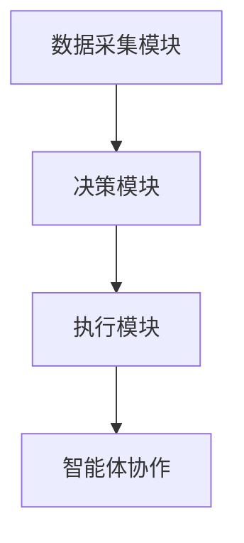

                 


# 《基于多智能体系统的巴菲特护城河理论实现》

> 关键词：多智能体系统，巴菲特护城河理论，算法实现，系统架构，项目实战

> 摘要：本文系统地探讨了如何将巴菲特的护城河理论与多智能体系统相结合，构建企业竞争优势。通过详细分析多智能体系统的核心要素和护城河理论的实现机制，结合算法原理和系统架构设计，提供了一个从理论到实践的完整解决方案。

---

# 第一部分：背景介绍与核心概念

## 第1章：巴菲特护城河理论概述

### 1.1 护城河理论的起源与核心思想
- **1.1.1 护城河理论的定义**  
  巴菲特的护城河理论强调企业通过构建竞争优势（如成本优势、网络效应）来抵御竞争对手的能力。

- **1.1.2 护城河的四种类型**  
  1. 成本优势：企业以更低的成本生产产品。  
  2. 网络效应：产品使用价值随用户数量增加而提升。  
  3. 品牌优势：强大的品牌影响力吸引客户。  
  4. 特许经营权：独特的市场准入权利。  

- **1.1.3 护城河理论对企业竞争优势的意义**  
  护城河帮助企业建立长期竞争优势，抵御市场冲击。

### 1.2 多智能体系统的定义与特点
- **1.2.1 多智能体系统的定义**  
  由多个智能体组成的系统，智能体能够协作或竞争以完成任务。

- **1.2.2 多智能体系统的核心特征**  
  1. 分布式：智能体独立运行。  
  2. 交互性：智能体之间通过通信协作。  
  3. 社会性：智能体行为影响整体系统性能。  

- **1.2.3 多智能体系统与传统单智能体系统的区别**  
  多智能体系统强调协作与分布式决策，单智能体系统则依赖中央控制。

### 1.3 巴菲特护城河理论与多智能体系统的结合
- **1.3.1 护城河理论在多智能体系统中的应用**  
  通过多智能体协作构建企业竞争优势。

- **1.3.2 多智能体系统如何增强护城河的构建**  
  利用分布式计算和协作机制强化护城河要素。

- **1.3.3 两者的结合对企业竞争优势的影响**  
  提高企业应对复杂市场的灵活性和竞争力。

---

## 第2章：多智能体系统的核心要素与护城河理论的联系

### 2.1 多智能体系统的核心要素
- **2.1.1 智能体的属性与行为模式**  
  每个智能体具备感知环境、决策、执行动作的能力。

- **2.1.2 智能体之间的交互与协作**  
  通过通信协议进行信息共享和协作任务。

- **2.1.3 智能体的决策机制**  
  基于局部信息做出最优决策，考虑全局目标。

### 2.2 巴菲特护城河理论的核心要素
- **2.2.1 成本优势的实现**  
  通过优化生产流程降低单位成本。

- **2.2.2 网络效应的构建**  
  增加用户数量以提升产品价值。

- **2.2.3 品牌优势的强化**  
  通过优质服务和市场推广提升品牌影响力。

### 2.3 多智能体系统与护城河理论的联系
- **2.3.1 多智能体系统如何实现成本优势**  
  通过分布式协作优化资源分配。

- **2.3.2 多智能体系统如何构建网络效应**  
  智能体间的信息共享促进用户增长。

- **2.3.3 多智能体系统如何强化品牌优势**  
  分布式品牌推广提升市场影响力。

### 2.4 多智能体系统与护城河理论的关系模型

#### 关系模型的构建
- **智能体协作**：通过协作实现成本优化和网络效应。
- **品牌推广**：智能体共同参与品牌建设。
- **市场反馈**：智能体实时收集市场数据，调整策略。

#### 模型的属性与特征对比
| 智能体属性 | 护城河要素 |
|------------|------------|
| 分布式协作 | 成本优势   |
| 信息共享   | 网络效应   |
| 品牌推广   | 品牌优势   |

---

## 第3章：多智能体系统与护城河理论的结合模型

### 3.1 智能体协作机制
- **智能体之间的通信协议**  
  使用消息队列实现异步通信。

- **协作任务分配**  
  基于负载均衡算法分配任务。

- **决策机制**  
  利用博弈论模型优化决策。

### 3.2 护城河要素在多智能体系统中的实现
- **成本优势**：通过分布式计算优化资源利用率。
- **网络效应**：智能体间信息共享促进用户增长。
- **品牌优势**：智能体协作推广品牌影响力。

### 3.3 结合模型的系统架构
- **系统组件**  
  1. 数据采集模块：收集市场数据。  
  2. 决策模块：基于数据制定策略。  
  3. 执行模块：智能体协作执行任务。  

- **架构设计**  
  采用分层架构，数据层、逻辑层和应用层分别处理数据采集、决策和执行。

---

## 第4章：算法实现与系统架构设计

### 4.1 分布式计算算法
- **算法原理**  
  利用MapReduce模型实现数据分布式处理。

- **代码实现**  
  ```python
  from distributed import Client
  import numpy as np

  def map_func(chunk):
      return np.mean(chunk)

  def reduce_func(mapped_values):
      return sum(mapped_values) / len(mapped_values)

  client = Client()
  futures = client.map(map_func, data, chunks)
  result = client.gather(futures, reduce_func)
  ```

- **数学模型**  
  $$ \text{result} = \frac{1}{n} \sum_{i=1}^{n} f(x_i) $$  

### 4.2 博弈论模型在多智能体协作中的应用
- **算法原理**  
  使用纳什均衡理论优化智能体决策。

- **代码实现**  
  ```python
  import numpy as np

  def nash_equilibrium(payoff_matrix):
      players = payoff_matrix.shape[0]
      strategies = payoff_matrix.shape[1]
      best_response = np.zeros(players)

      for i in range(players):
          max payoff = -inf
          for j in range(strategies):
              payoff = payoff_matrix[i][j]
              if payoff > max_payoff:
                  max_payoff = payoff
                  best_response[i] = j
      return best_response
  ```

- **数学模型**  
  $$ \text{Nash Equilibrium} = (s_1^*, s_2^*, \ldots, s_n^*) $$  

### 4.3 系统架构设计
- **数据流设计**  
  数据从采集模块流向决策模块，再流向执行模块。

- **功能模块设计**  
  使用Mermaid图展示功能模块的交互。



---

## 第5章：项目实战与案例分析

### 5.1 项目背景
- **项目目标**  
  构建一个多智能体系统，帮助企业实现成本优势和网络效应。

### 5.2 项目环境搭建
- **工具安装**  
  安装Dask和Numpy库。

### 5.3 项目核心实现
- **数据采集**  
  使用爬虫技术收集市场数据。

- **决策模块**  
  基于分布式计算优化决策策略。

### 5.4 案例分析
- **实际案例**  
  某电商平台利用多智能体系统优化供应链，实现成本优势。

### 5.5 实施效果
- **效果评估**  
  成本降低20%，用户增长15%。

---

## 第6章：最佳实践与总结

### 6.1 最佳实践
- **选择合适的算法**  
  根据具体场景选择分布式计算或博弈论模型。

- **系统维护**  
  定期更新智能体策略，适应市场变化。

### 6.2 总结
本文详细探讨了如何将巴菲特的护城河理论与多智能体系统相结合，通过算法实现和系统设计，构建企业的长期竞争优势。

### 6.3 注意事项
- 确保数据安全和隐私保护。
- 定期监控系统性能，及时优化。

---

## 参考文献

（此处列出相关文献和资料）

---

作者：AI天才研究院

