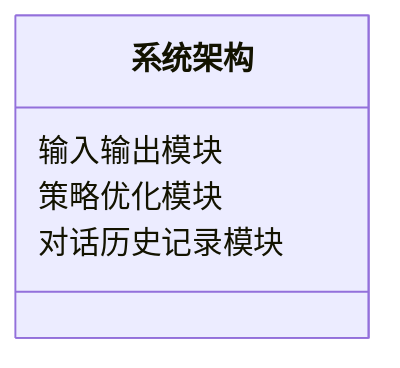

                 


# 基于强化学习的AI Agent对话策略

## 关键词
强化学习, AI Agent, 对话策略, 策略梯度, 值函数方法, 神经网络

## 摘要
本文系统地探讨了基于强化学习的AI Agent对话策略，从强化学习的基本概念到对话系统的架构设计，再到具体的算法实现，逐步展开。通过详细分析强化学习的核心算法（如策略梯度和值函数方法），结合对话系统的实际应用场景，深入讲解了如何利用强化学习优化对话策略。文章还提供了基于Python的代码示例和系统架构图，帮助读者更好地理解和实现AI Agent对话系统。

---

## 第一部分: 强化学习与AI Agent对话策略基础

### 第1章: 强化学习与对话系统概述

#### 1.1 强化学习的基本概念
强化学习是一种机器学习范式，通过智能体与环境的交互，学习最优策略以最大化累积奖励。与监督学习和无监督学习不同，强化学习强调实时反馈（奖励）的利用，适用于动态和不确定的环境。

#### 1.2 AI Agent对话系统的定义与特点
AI Agent（智能体）通过与用户交互，理解用户需求并生成合适的回应。对话系统的特点包括多轮交互、上下文依赖性和实时反馈。

#### 1.3 本章小结
本章介绍了强化学习的基本概念及其在AI Agent对话系统中的应用潜力。

---

## 第二部分: 强化学习算法原理与数学模型

### 第2章: 强化学习的核心算法

#### 2.1 策略梯度方法
策略梯度通过优化策略的参数，直接最大化期望奖励。在对话系统中，策略可以是生成回复的概率分布。

##### 2.1.1 策略梯度的基本原理
策略梯度方法通过梯度上升优化策略，公式如下：
$$ \theta \leftarrow \theta + \alpha \nabla_\theta J(\theta) $$
其中，$J(\theta)$是目标函数，$\alpha$是学习率。

##### 2.1.2 基于策略梯度的对话策略优化
在对话系统中，策略梯度用于优化回复生成策略，通过最大化累积奖励。

##### 2.1.3 策略梯度的数学模型与公式推导
策略梯度的梯度计算公式为：
$$ \nabla_\theta J(\theta) = \mathbb{E}_{\tau \sim \pi_\theta} \left[ \nabla_\theta \log \pi_\theta(a|s) Q(s,a) \right] $$

#### 2.2 值函数方法
值函数方法通过学习状态或动作-状态的价值，间接优化策略。

##### 2.2.1 Q-learning与SARSA算法在对话系统中的应用
Q-learning适用于离散动作空间，而SARSA适用于连续动作空间。

##### 2.2.2 值函数的数学模型与公式推导
贝尔曼方程定义了价值函数的递归关系：
$$ Q(s,a) = r + \gamma \max_{a'} Q(s',a') $$

#### 2.3 神经网络在强化学习中的应用
深度神经网络用于近端策略优化和价值函数逼近。

##### 2.3.1 神经网络强化学习的数学模型
神经网络用于逼近策略或价值函数，通过反向传播优化权重。

### 第3章: 强化学习的数学模型与公式

#### 3.1 状态-动作-奖励空间
状态空间定义为$S$，动作空间为$A$，奖励函数为$r: S \times A \rightarrow \mathbb{R}$。

#### 3.2 策略梯度方法的数学推导
策略梯度的梯度计算公式为：
$$ \nabla_\theta J(\theta) = \mathbb{E}_{s,a} [\nabla_\theta \log \pi_\theta(a|s) Q(s,a)] $$

#### 3.3 值函数方法的数学推导
贝尔曼方程定义了价值函数的递归关系：
$$ V(s) = \max_{a} [r(s,a) + \gamma V(s')] $$

---

## 第三部分: AI Agent对话策略的系统架构与实现

### 第4章: 对话系统的需求分析与架构设计

#### 4.1 对话系统的功能需求
- 用户输入的处理
- 多轮对话的管理
- 策略优化的实现

#### 4.2 对话系统的架构设计
系统架构包括输入输出模块、策略优化模块和对话历史记录模块。

#### 4.3 系统架构的ER图与类图
使用Mermaid绘制系统架构图：



### 第5章: 对话系统的接口设计与实现

#### 5.1 对话系统的输入输出接口
定义输入输出接口的API：

```python
def process_input(user_input):
    # 处理用户输入并返回系统回应
    pass
```

---

## 第四部分: 项目实战

### 第6章: 对话系统的实现与优化

#### 6.1 环境安装
安装必要的库：
```bash
pip install gym tensorflow numpy
```

#### 6.2 系统核心实现源代码
实现基于强化学习的对话策略：

```python
import numpy as np
import tensorflow as tf

class AI-Agent:
    def __init__(self):
        self.model = self.build_model()
    
    def build_model(self):
        model = tf.keras.Sequential([
            tf.keras.layers.Dense(64, activation='relu'),
            tf.keras.layers.Dense(1, activation='sigmoid')
        ])
        return model

    def call(self, input):
        return self.model(input)
```

#### 6.3 代码应用解读与分析
解释代码实现，说明如何优化对话策略。

---

## 第五部分: 总结与展望

### 第7章: 总结与最佳实践

#### 7.1 总结
强化学习在对话策略中的应用前景广阔，但仍需解决实时性和可解释性问题。

#### 7.2 最佳实践 tips
- 确保奖励函数设计合理
- 选择合适的强化学习算法
- 定期更新策略以适应新数据

---

## 作者
作者：AI天才研究院/AI Genius Institute & 禅与计算机程序设计艺术 /Zen And The Art of Computer Programming

