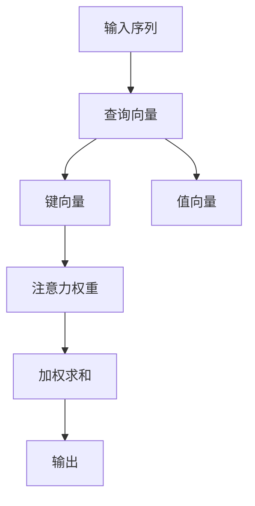

                 

# 基于注意力机制的AI Agent记忆增强

> 关键词：注意力机制，AI Agent，记忆增强，自然语言处理，机器学习，深度学习

> 摘要：本文深入探讨了基于注意力机制的AI Agent记忆增强技术，结合数学公式和算法实现，详细分析了注意力机制的核心原理及其在记忆增强中的应用。文章从背景介绍到算法实现，从系统设计到项目实战，全面解析了基于注意力机制的AI Agent记忆增强的理论与实践。

---

# 第一部分: 基于注意力机制的AI Agent记忆增强基础

---

# 第1章: 注意力机制与AI Agent概述

## 1.1 注意力机制的起源与核心概念

### 1.1.1 注意力机制的起源
注意力机制起源于人类认知科学，最早由心理学家在研究人类注意力分配时提出。在计算机科学领域，注意力机制首次被引入自然语言处理（NLP）领域，由Bahdanau等在2014年提出用于机器翻译任务。近年来，注意力机制在深度学习领域的应用取得了突破性进展，尤其是在Transformer模型中得到了广泛应用。

**公式1.1**: 机器翻译中注意力机制的基本公式如下：
$$
\text{score}(q, k, v) = \text{softmax}\left( \frac{q \cdot k^T}{\sqrt{d_k}} \right) v
$$

其中，$q$是查询向量，$k$是键向量，$v$是值向量，$d_k$是向量的维度。

### 1.1.2 注意力机制的核心概念
注意力机制是一种加权计算方法，用于计算序列中每个位置的重要性。通过自注意力机制，模型可以自动关注输入序列中的关键部分，从而提高任务性能。注意力机制的核心在于计算查询与键之间的相似性，并根据相似性分配权重。

### 1.1.3 注意力机制在自然语言处理中的应用
注意力机制在自然语言处理中的应用非常广泛，主要包括文本摘要、机器翻译、问答系统等。通过注意力机制，模型可以更好地捕捉文本中的语义信息，提高生成结果的质量。

**图1.1**: 注意力机制在机器翻译中的应用示意图

## 1.2 AI Agent的基本概念与分类

### 1.2.1 AI Agent的定义与特点
AI Agent是一种智能体，能够在复杂环境中感知环境、做出决策并执行任务。AI Agent的核心特点包括自主性、反应性、目标导向性和社会性。AI Agent可以通过传感器获取环境信息，通过执行器与环境交互。

### 1.2.2 基于记忆的AI Agent
基于记忆的AI Agent是一种能够存储和利用过去交互信息的智能体。记忆机制可以帮助AI Agent在复杂任务中保持长期状态，提高任务处理能力。常见的记忆机制包括基于LSTM的记忆网络和基于Transformer的记忆网络。

### 1.2.3 AI Agent的分类与应用场景
AI Agent可以根据功能分为感知型AI Agent、决策型AI Agent和执行型AI Agent。感知型AI Agent主要用于数据采集和环境感知，决策型AI Agent主要用于任务规划和决策，执行型AI Agent主要用于任务执行和操作。

**表1.1**: AI Agent的分类与应用场景

| 类型         | 描述                         | 应用场景                   |
|--------------|------------------------------|---------------------------|
| 感知型AI Agent | 用于数据采集和环境感知       | 自动驾驶、机器人控制         |
| 决策型AI Agent | 用于任务规划和决策           | 智能助手、游戏AI             |
| 执行型AI Agent | 用于任务执行和操作           | 工厂自动化、物流管理         |

## 1.3 注意力机制与AI Agent的结合

### 1.3.1 注意力机制在记忆增强中的作用
注意力机制可以增强AI Agent的记忆能力，通过自注意力机制，AI Agent可以更好地关注重要的历史交互信息，提高任务处理能力。

### 1.3.2 基于注意力机制的AI Agent的优势
基于注意力机制的AI Agent具有以下优势：
1. 自适应性：可以根据任务需求自适应地关注重要信息。
2. 信息压缩：可以通过注意力机制压缩冗余信息，提高计算效率。
3. 语义理解：可以更好地捕捉输入序列中的语义信息，提高任务性能。

### 1.3.3 当前研究进展与挑战
当前，基于注意力机制的AI Agent研究主要集中在以下几个方面：
1. 增强型注意力机制：通过改进注意力机制，进一步提高记忆增强效果。
2. 多模态注意力机制：结合多模态信息，提高AI Agent的感知能力。
3. 实时性优化：通过优化算法，提高AI Agent的实时性。

---

# 第2章: 注意力机制的核心原理

## 2.1 注意力机制的数学模型

### 2.1.1 注意力机制的基本公式
自注意力机制的基本公式如下：
$$
\text{score}(q, k, v) = \text{softmax}\left( \frac{q \cdot k^T}{\sqrt{d_k}} \right) v
$$

其中，$q$是查询向量，$k$是键向量，$v$是值向量，$d_k$是向量的维度。

### 2.1.2 自注意力机制的计算过程
自注意力机制的计算过程包括以下步骤：
1. 将输入序列编码为查询、键和值向量。
2. 计算查询与键之间的相似性，得到注意力权重。
3. 根据注意力权重对值向量进行加权求和，得到最终的注意力输出。

### 2.1.3 多头注意力机制的原理
多头注意力机制通过并行计算多个自注意力头，进一步提高模型的表达能力。每个自注意力头具有独立的查询、键和值向量，最终通过拼接和线性变换得到最终的输出。

**公式2.1**: 多头注意力机制的公式如下：
$$
\text{MultiHead}(Q, K, V) = \text{Concat}( \text{Head}_1, \text{Head}_2, \ldots, \text{Head}_n )
$$

其中，$\text{Head}_i = \text{Attention}(Q_i, K_i, V_i)$。

## 2.2 注意力机制的实现细节

### 2.2.1 查询、键、值的概念与作用
查询向量用于表示输入序列中的当前位置，键向量用于表示输入序列中的其他位置，值向量用于表示输入序列中的具体信息。

### 2.2.2 注意力权重的计算与归一化
注意力权重的计算公式如下：
$$
\text{score}(q, k) = \frac{q \cdot k^T}{\sqrt{d_k}}
$$

归一化后的注意力权重为：
$$
\alpha = \text{softmax}(\text{score}(q, k))
$$

### 2.2.3 多头注意力的并行计算
多头注意力机制通过并行计算多个自注意力头，进一步提高模型的表达能力。每个自注意力头具有独立的查询、键和值向量，最终通过拼接和线性变换得到最终的输出。

## 2.3 注意力机制的变体与优化

### 2.3.1 局部注意力与全局注意力
局部注意力机制仅关注输入序列中的局部区域，适用于图像处理任务。全局注意力机制关注整个输入序列，适用于文本处理任务。

### 2.3.2 相关注意力机制
相关注意力机制通过计算输入序列中每个位置的相关性，进一步提高注意力机制的表达能力。

### 2.3.3 增量式注意力机制
增量式注意力机制通过逐步更新注意力权重，提高模型的实时性和适应性。

---

# 第3章: 基于注意力机制的记忆增强模型

## 3.1 基于记忆的AI Agent模型

### 3.1.1 基于记忆网络的模型
记忆网络是一种基于记忆的AI Agent模型，通过存储和检索历史信息，提高任务处理能力。

### 3.1.2 基于Transformer的模型
Transformer模型是一种基于注意力机制的深度学习模型，广泛应用于自然语言处理任务。

### 3.1.3 基于LSTM的模型
LSTM模型是一种基于循环神经网络的深度学习模型，通过记忆单元存储历史信息。

## 3.2 注意力机制在记忆增强中的应用

### 3.2.1 基于自注意力的记忆网络
基于自注意力的记忆网络通过自注意力机制，增强模型的记忆能力。

### 3.2.2 基于多头注意力的记忆增强
基于多头注意力的记忆增强通过并行计算多个自注意力头，进一步提高模型的表达能力。

### 3.2.3 注意力机制与记忆网络的结合
注意力机制与记忆网络的结合通过自注意力机制，增强模型的记忆能力。

## 3.3 增强型注意力机制的设计

### 3.3.1 增量式注意力机制
增量式注意力机制通过逐步更新注意力权重，提高模型的实时性和适应性。

### 3.3.2 基于门控机制的注意力增强
基于门控机制的注意力增强通过门控机制，进一步提高注意力机制的表达能力。

### 3.3.3 基于位置编码的注意力增强
基于位置编码的注意力增强通过引入位置编码，提高模型的位置感知能力。

---

# 第4章: 基于注意力机制的记忆增强算法实现

## 4.1 基于Transformer的记忆增强模型

### 4.1.1 Transformer模型的结构
Transformer模型由编码器和解码器组成，编码器用于输入序列的编码，解码器用于输出序列的生成。

### 4.1.2 自注意力机制的实现
自注意力机制的实现包括查询、键和值向量的计算，注意力权重的计算和归一化，以及值向量的加权求和。

### 4.1.3 增强型注意力机制的实现
增强型注意力机制的实现包括多头注意力机制的实现，以及门控机制的引入。

## 4.2 基于LSTM的记忆增强模型

### 4.2.1 LSTM模型的结构
LSTM模型由输入门、遗忘门和输出门组成，通过记忆单元存储历史信息。

### 4.2.2 注意力机制的集

---

**作者：AI天才研究院/AI Genius Institute & 禅与计算机程序设计艺术 /Zen And The Art of Computer Programming**

