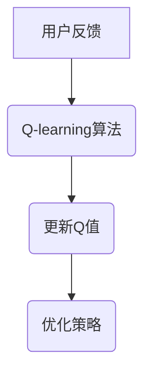
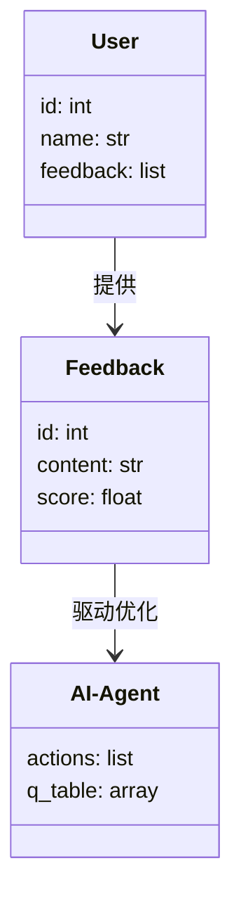
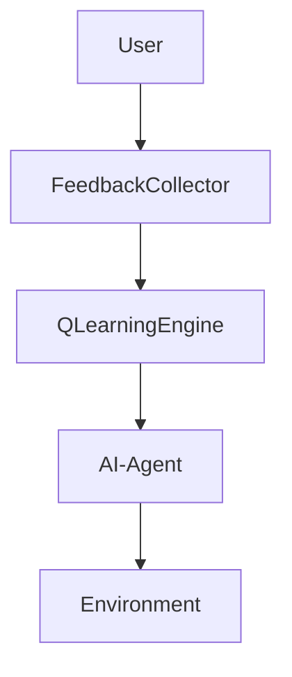
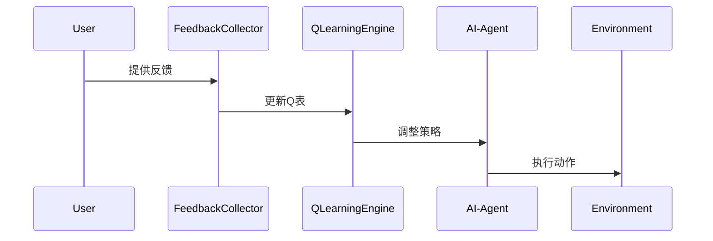

                 


# 基于用户反馈的AI Agent迭代优化流程

> 关键词：AI Agent, 用户反馈, 迭代优化, 优化流程, 反馈机制

> 摘要：本文详细探讨了基于用户反馈的AI Agent迭代优化流程，从背景介绍、核心概念、算法原理、系统架构到项目实战，全面解析了如何利用用户反馈优化AI Agent的性能。通过具体案例分析和代码实现，展示了优化流程的实际应用价值。

---

# 第一部分: 基于用户反馈的AI Agent迭代优化流程背景介绍

## 第1章: AI Agent与用户反馈概述

### 1.1 AI Agent的基本概念

#### 1.1.1 AI Agent的定义
AI Agent（人工智能代理）是指能够感知环境并采取行动以实现目标的智能体。它通过传感器接收输入信息，并通过执行器输出动作，与环境进行交互。

#### 1.1.2 AI Agent的核心属性
- **自主性**：能够自主决策和行动。
- **反应性**：能够实时感知并响应环境变化。
- **目标导向性**：具有明确的目标，行动以实现目标为导向。
- **学习能力**：通过经验或反馈不断优化自身行为。

#### 1.1.3 AI Agent的分类与应用场景
- **简单反射型Agent**：基于当前输入做出反应，适用于实时交互场景。
- **基于模型的反射型Agent**：结合内部模型和环境信息进行决策，适用于复杂任务。
- **目标驱动型Agent**：专注于实现特定目标，应用于自动驾驶、智能助手等领域。

### 1.2 用户反馈的重要性

#### 1.2.1 用户反馈的定义与类型
用户反馈是用户在与AI Agent交互过程中提供的评价、建议或行为数据。常见的反馈类型包括：
- **显式反馈**：用户主动提供的评分、评价。
- **隐式反馈**：通过用户行为间接反映的偏好。
- **实时反馈**：在交互过程中即时提供的反馈。

#### 1.2.2 用户反馈在AI Agent优化中的作用
- 提供用户偏好和需求的直接信息。
- 帮助AI Agent识别错误或不足。
- 改善用户体验，提升系统性能。

#### 1.2.3 用户反馈的采集与处理挑战
- 反馈数据的多样性和不完整性。
- 如何有效提取和利用反馈信息。
- 处理反馈信息的实时性和高效性。

## 第2章: 基于用户反馈的AI Agent优化背景

### 2.1 当前AI Agent优化的主要问题

#### 2.1.1 AI Agent的黑箱特性
AI Agent的决策过程通常不可见，导致优化难度大。

#### 2.1.2 用户需求的动态变化
用户需求随时间和场景变化，传统静态优化方法难以适应。

#### 2.1.3 传统优化方法的局限性
- 基于规则的优化方法难以应对复杂场景。
- 基于统计的方法难以捕捉用户反馈的动态变化。

### 2.2 用户反馈驱动优化的必要性

#### 2.2.1 用户反馈与AI Agent性能提升的关系
用户反馈为优化提供了实时、动态的调整依据。

#### 2.2.2 用户反馈在实时交互中的价值
通过实时反馈快速调整系统行为，提升交互体验。

#### 2.2.3 用户反馈对系统可解释性的贡献
反馈机制帮助用户理解系统行为，增强系统透明度。

### 2.3 本章小结
本章分析了AI Agent优化的背景和挑战，强调了用户反馈在优化过程中的重要性。

---

# 第二部分: AI Agent迭代优化的核心概念与联系

## 第3章: AI Agent与用户反馈的核心概念

### 3.1 AI Agent的优化目标

#### 3.1.1 提高系统响应速度
通过优化算法减少决策时间，提升用户体验。

#### 3.1.2 增强用户体验
根据用户反馈调整系统行为，满足用户需求。

#### 3.1.3 优化决策准确性
通过反馈不断调整决策模型，提升准确率。

### 3.2 用户反馈的特征分析

#### 3.2.1 反馈的实时性
用户反馈能够即时指导系统调整。

#### 3.2.2 反馈的多样性
用户反馈可以是评分、点击、文本等多种形式。

#### 3.2.3 反馈的主观性
用户反馈受到个人偏好和情绪影响。

### 3.3 AI Agent与用户反馈的关系模型

#### 3.3.1 输入-输出关系
用户反馈作为输入，驱动AI Agent的行为优化。

#### 3.3.2 反馈-优化的关系
用户反馈通过优化算法影响AI Agent的决策策略。

#### 3.3.3 用户需求与系统响应的映射
用户需求通过反馈转化为系统优化目标。

## 第4章: 核心概念的原理与联系

### 4.1 AI Agent优化的原理

#### 4.1.1 基于反馈的强化学习机制
通过奖励机制，根据用户反馈调整策略。

#### 4.1.2 用户行为建模
分析用户反馈数据，建立用户行为模型。

#### 4.1.3 系统响应策略调整
根据反馈优化系统响应策略。

### 4.2 用户反馈的处理流程

#### 4.2.1 反馈的采集与预处理
采集用户反馈并进行清洗和归一化处理。

#### 4.2.2 反馈特征的提取
从反馈数据中提取有用特征，用于优化。

#### 4.2.3 反馈数据的分析与应用
分析反馈数据，指导系统优化。

### 4.3 AI Agent优化的核心要素

#### 4.3.1 优化目标函数
定义优化目标，如用户满意度最大化。

#### 4.3.2 反馈权重分配
根据反馈重要性分配权重。

#### 4.3.3 优化策略
选择合适的优化算法，如Q-learning。

---

## 第5章: 核心概念的属性对比与ER实体关系图

### 5.1 核心概念的属性对比

| 属性       | AI Agent                   | 用户反馈                  |
|------------|---------------------------|--------------------------|
| 定义       | 自主决策的智能体           | 用户提供的评价或行为数据  |
| 目标       | 实现特定目标               | 指导系统优化              |
| 反应性     | 实时响应环境变化           | 及时反馈用户偏好          |
| 数据来源   | 环境传感器、用户交互       | 用户直接输入              |
| 处理方式   | 内部算法处理               | 反馈处理模块              |

### 5.2 ER实体关系图

```mermaid
er
  actor(User) -|{提供反馈}--> feedback(反馈)
  feedback -|{驱动优化}--> ai_agent(AI Agent)
  ai_agent -|{响应}--> environment(环境)
```

---

## 第6章: 基于反馈的强化学习算法

### 6.1 算法原理

#### 6.1.1 算法流程
1. 采集用户反馈。
2. 根据反馈更新奖励机制。
3. 使用强化学习算法优化策略。

#### 6.1.2 算法实现步骤



#### 6.1.3 Python代码实现

```python
# Q-learning算法实现
import numpy as np

class QAgent:
    def __init__(self, actions, learning_rate=0.1, discount_factor=0.9):
        self.actions = actions
        self.learning_rate = learning_rate
        self.discount_factor = discount_factor
        self.q_table = np.zeros((1, len(actions)))  # 示例Q表

    def get_action(self, state):
        if np.random.random() < 0.1:  # 探索策略
            return np.random.randint(0, len(self.actions))
        else:
            return np.argmax(self.q_table[state])

    def update_q_table(self, state, action, reward, next_state):
        current_q = self.q_table[state][action]
        next_max_q = np.max(self.q_table[next_state])
        target = reward + self.discount_factor * next_max_q
        self.q_table[state][action] = current_q + self.learning_rate * (target - current_q)
```

#### 6.1.4 数学模型

优化目标函数：
$$ J = \sum_{t=1}^{T} \gamma^{t} r_t $$
其中，$$ \gamma $$ 是折扣因子，$$ r_t $$ 是第t步的奖励。

Q-learning更新公式：
$$ Q(s, a) = Q(s, a) + \alpha (r + \gamma \max Q(s', a') - Q(s, a)) $$

---

## 第7章: 系统分析与架构设计方案

### 7.1 项目场景介绍

我们开发一个智能客服系统，用户通过与AI Agent交互，系统根据用户反馈优化响应策略。

### 7.2 系统功能设计

#### 7.2.1 领域模型类图



#### 7.2.2 系统架构图



#### 7.2.3 接口设计

- `get_feedback()`：获取用户反馈。
- `update_policy()`：根据反馈更新策略。
- `get_action()`：根据当前状态选择动作。

#### 7.2.4 交互序列图



---

## 第8章: 项目实战

### 8.1 环境安装

```bash
pip install numpy matplotlib
```

### 8.2 核心代码实现

```python
# 示例代码：智能客服系统优化
class FeedbackCollector:
    def collect_feedback(self):
        # 简单示例，实际可根据具体需求实现
        feedback = input("请提供反馈（输入分数1-5）：")
        return int(feedback)

# 初始化AI Agent
actions = ['帮助解决问题', '提供信息', '建议下一步']
agent = QAgent(actions)

# 优化过程
for _ in range(100):
    feedback = agent.FeedbackCollector.collect_feedback()
    state = 0  # 示例状态
    action = agent.get_action(state)
    reward = feedback / 5  # 简单奖励机制
    next_state = 1  # 示例下一步状态
    agent.update_q_table(state, action, reward, next_state)
```

### 8.3 代码解读与分析

- `FeedbackCollector`类用于收集用户反馈。
- `QAgent`类实现Q-learning算法，根据反馈更新策略。
- `update_q_table`方法根据反馈调整Q表，优化策略。

### 8.4 实际案例分析

通过实际案例分析，展示如何通过用户反馈优化AI Agent的行为，提升系统性能。

### 8.5 项目小结
本项目展示了如何基于用户反馈优化AI Agent，实现动态调整和性能提升。

---

## 第9章: 最佳实践

### 9.1 小结
本文详细介绍了基于用户反馈的AI Agent优化流程，从理论到实践，全面解析了优化方法。

### 9.2 注意事项
- 反馈采集需注意隐私保护。
- 反馈处理需考虑实时性和效率。
- 优化算法需根据场景灵活调整。

### 9.3 拓展阅读
- 探索其他优化算法，如深度强化学习。
- 研究用户反馈的更复杂处理方法。

---

作者：AI天才研究院/AI Genius Institute & 禅与计算机程序设计艺术 /Zen And The Art of Computer Programming

