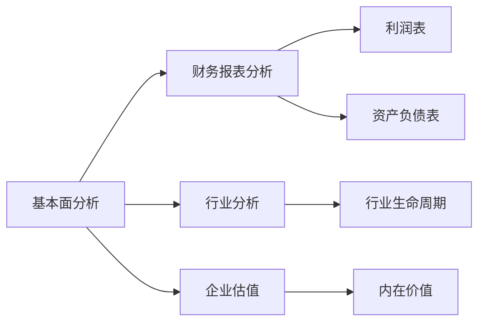

                 


# 基本面分析：识别长期优质投资标的的关键

## 关键词：基本面分析、投资策略、财务报表、企业估值、风险管理

## 摘要：基本面分析是识别长期优质投资标的的关键方法，通过对企业的财务状况、行业地位、竞争优势、估值指标等多维度分析，结合数学模型和系统架构，帮助投资者制定科学的投资策略和风险管理方案。本文从基础概念到实战技巧，系统性地阐述基本面分析的核心原理和应用方法。

---

## 第一部分: 基本面分析基础

### 第1章: 基本面分析概述

#### 1.1 什么是基本面分析
基本面分析是一种通过研究企业的财务状况、行业地位、竞争优势等内在因素，来评估其长期投资价值的方法。它不同于技术分析，后者主要关注价格走势和市场情绪。

**核心概念对比表：**

| **分析方法** | **关注点**          | **主要工具**       |
|--------------|---------------------|---------------------|
| 基本面分析   | 企业的内在价值      | 财务报表、行业数据   |
| 技术分析     | 价格走势和市场情绪  | K线图、技术指标     |

#### 1.2 基本面分析的重要性
基本面分析帮助投资者识别企业的长期发展潜力，减少市场波动对企业价值判断的干扰。

**数学模型：**
基本面分析的核心是通过财务指标计算企业的内在价值。例如，使用市盈率（P/E）评估企业估值：

$$ P/E = \frac{股价}{每股收益} $$

#### 1.3 基本面分析与技术分析的区别
基本面分析侧重于企业的内在价值，而技术分析关注市场的外在表现。

**Mermaid图：**



### 1.4 本章小结
基本面分析是通过研究企业的内在因素来评估其投资价值的方法，是长期投资决策的重要依据。

---

## 第二部分: 财务报表分析

### 第2章: 财务报表基础

#### 2.1 财务报表的构成
企业财务报表包括利润表、资产负债表和现金流量表。

**利润表：**
反映企业在一定时期内的收入和支出情况。

$$ 利润 = 收入 - 成本 - 费用 $$

**资产负债表：**
显示企业在某一特定时点的资产、负债和所有者权益情况。

$$ 资产 = 负债 + 所有者权益 $$

**现金流量表：**
记录企业在一定时期内的现金流入和流出情况。

#### 2.2 财务报表分析的关键指标
**收益能力分析：**
- 净利润率（Net Profit Margin）= 净利润 / 收入

**资产周转能力分析：**
- 资产周转率 = 营业收入 / 平均资产总额

**偿债能力分析：**
- 速动比率 = （流动资产 - 存货） / 流动负债

#### 2.3 财务报表分析的局限性
- 数据滞后性：财务报表反映的是过去的情况。
- 会计政策差异：不同企业会计处理方式不同。
- 人为操控风险：管理层可能通过操控财务数据影响报表。

### 2.4 本章小结
财务报表是基本面分析的核心工具，通过关键指标分析可以评估企业的财务健康状况。

---

## 第三部分: 行业与竞争优势分析

### 第3章: 行业分析

#### 3.1 行业生命周期
行业生命周期分为导入期、成长期、成熟期和衰退期。

**行业生命周期图：**


#### 3.2 行业竞争结构
使用五力模型分析行业竞争结构。

**五力模型：**
1. 新进入者的威胁
2. 替代品的威胁
3. 供应商的议价能力
4. 客户的议价能力
5. �行业内竞争者的竞争程度

#### 3.3 行业趋势分析
分析技术进步、政策法规和消费者需求变化对行业的影响。

### 3.4 本章小结
行业分析帮助投资者识别行业的成长潜力和竞争优势。

---

## 第四部分: 企业估值与投资决策

### 第4章: 企业估值方法

#### 4.1 常用估值方法概述
- 市盈率（P/E）：股价与每股收益的比率。
- 市净率（P/B）：股价与每股净资产的比率。
- 现金流折现法（DCF）：通过现金流的现值评估企业价值。

**DCF模型：**


#### 4.2 估值模型的数学公式
$$ DCF = \sum_{t=1}^{n} \frac{CF_t}{(1 + r)^t} $$

其中，CF_t为第t年的现金流，r为折现率。

#### 4.3 估值的注意事项
- 数据的准确性：现金流预测需要基于可靠的数据。
- 折现率的选择：不同企业折现率不同。
- 行业特性：不同行业估值方法不同。

### 4.4 本章小结
企业估值是基本面分析的重要环节，通过合理的估值方法可以判断企业是否具备投资价值。

---

## 第五部分: 投资策略与风险管理

### 第5章: 投资策略

#### 5.1 长期投资策略
- 选择具有持续增长潜力的企业。
- 重视企业的竞争优势和行业地位。

#### 5.2 风险管理
- 分散投资：通过投资不同行业和企业降低风险。
- 设置止损：避免单次损失过大。

#### 5.3 投资组合管理
- 定期调整投资组合，根据市场变化优化持仓。

### 5.4 本章小结
科学的投资策略和有效的风险管理是实现长期投资收益的关键。

---

## 第六部分: 系统架构与实战技巧

### 第6章: 系统架构设计

#### 6.1 系统功能设计
- 数据收集：获取企业的财务数据和行业信息。
- 数据分析：使用算法对数据进行处理和分析。
- 结果展示：生成可视化报告和估值结果。

**系统架构图：**


#### 6.2 系统实现
- 环境安装：Python、Pandas、Matplotlib。
- 核心代码：数据处理和分析模块。

```python
import pandas as pd
import matplotlib.pyplot as plt

# 数据加载
df = pd.read_csv('financial_data.csv')

# 利润率计算
df['Net Margin'] = df['净利润'] / df['收入']

# 可视化
plt.plot(df['日期'], df['Net Margin'])
plt.xlabel('日期')
plt.ylabel('利润率')
plt.show()
```

### 6.3 本章小结
通过系统架构和代码实现，可以高效地进行基本面分析。

---

## 第七部分: 总结与展望

### 第7章: 总结

#### 7.1 核心内容回顾
- 基本面分析的核心方法和工具。
- 财务报表分析的关键指标。
- 企业估值的常用方法。

#### 7.2 投资策略与风险管理
- 长期投资需要基本面分析的支持。
- 风险管理是投资成功的重要保障。

### 7.3 本章小结
基本面分析是识别长期优质投资标的的关键方法，结合系统架构和风险管理可以实现稳健的投资收益。

---

## 作者：AI天才研究院 & 禅与计算机程序设计艺术

---

这篇文章系统性地介绍了基本面分析的核心方法和应用技巧，通过丰富的案例和详细的代码实现，帮助读者掌握识别长期优质投资标的的关键步骤。

