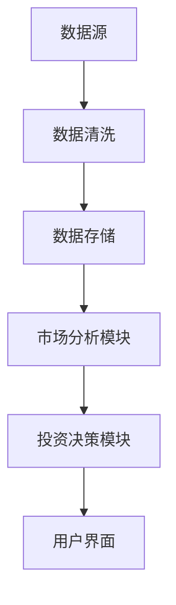
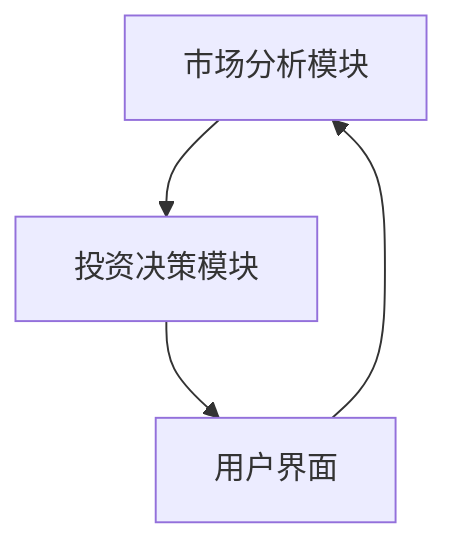
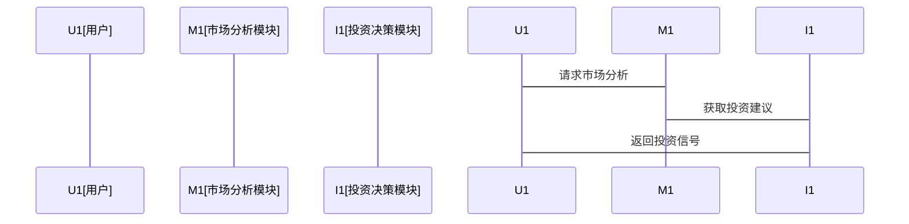

                 


# 塞思·卡拉曼的特殊情况投资

**关键词**：特殊情况投资、塞思·卡拉曼、安全边际、逆向投资、价值投资、风险管理

**摘要**：  
塞思·卡拉曼是投资领域的重要人物，他的特殊情况投资方法以其独特的安全边际理论和逆向投资策略闻名。本文将详细解析塞思·卡拉曼的投资哲学、数学模型、系统架构以及实际案例，帮助读者深入了解特殊情况投资的核心原理和实践应用。

---

# 第1章: 特殊情况投资的背景与概念

## 1.1 投资领域的演变

### 1.1.1 传统投资与现代投资的区别

传统投资方法通常依赖于市场趋势和技术分析，而现代投资则更注重基本面分析和风险管理。塞思·卡拉曼的特殊情况投资方法结合了这两种方法的核心思想，强调在市场恐慌时寻找被低估的投资机会。

### 1.1.2 什么是特殊情况投资

特殊情况投资是指在市场出现极端情况（如金融危机、市场恐慌）时，寻找那些被市场低估但具备长期价值的企业进行投资。这种方法的核心在于利用市场的非理性行为，捕捉被忽视的投资机会。

### 1.1.3 塞思·卡拉曼在投资领域的地位

塞思·卡拉曼是价值投资的代表人物之一，他的投资理念深刻影响了后来的投资者。他的著作《安全边际》是投资领域的经典之作，为特殊情况投资奠定了理论基础。

## 1.2 特殊情况投资的核心要素

### 1.2.1 安全边际的定义与作用

安全边际是内在价值与市场价格之间的差额，是投资决策的重要依据。卡拉曼认为，只有当安全边际足够大时，投资才能被认为是安全的。

### 1.2.2 市场逆向分析的重要性

逆向投资是指在市场低迷时买入，在市场繁荣时卖出。卡拉曼强调，市场情绪的波动是投资机会的来源，逆向思维是抓住投资机会的关键。

### 1.2.3 投资者的心理与行为

投资者的心理偏差（如过度恐惧和贪婪）是市场波动的主要原因。卡拉曼通过分析投资者行为，提出了一系列应对策略，以帮助投资者克服心理障碍，做出理性决策。

## 1.3 塞思·卡拉曼的投资哲学

### 1.3.1 价值投资的核心理念

卡拉曼认为，投资的本质是购买企业的部分股权，而非仅仅交易股票。他强调对企业的基本面进行深入分析，寻找那些具有持续竞争优势和合理估值的企业。

### 1.3.2 逆向投资的策略与实践

逆向投资的核心在于识别市场的非理性行为，并在市场底部买入优质资产。卡拉曼通过分析市场情绪和估值水平，制定逆向投资策略。

### 1.3.3 风险控制的三大原则

1. **分散投资**：避免过度集中，降低单一投资的风险。
2. **安全边际**：确保投资的安全性，避免亏损。
3. **长期视角**：关注企业的长期价值，而非短期波动。

## 1.4 本章小结

塞思·卡拉曼的特殊情况投资方法以安全边际为核心，结合逆向投资和价值投资的理念，为投资者提供了一种独特且有效的投资策略。他的投资哲学不仅注重理论分析，还强调实践中的心理和行为管理。

---

# 第2章: 特殊情况投资的数学模型与公式

## 2.1 安全边际的数学计算

### 2.1.1 安全边际公式

$$ \text{安全边际} = \text{内在价值} - \text{市场价格} $$

### 2.1.2 安全边际率的计算

$$ \text{安全边际率} = \frac{\text{安全边际}}{\text{内在价值}} \times 100\% $$

### 2.1.3 内在价值的计算公式

$$ \text{内在价值} = \frac{\text{年现金流}}{\text{折现率}} $$

---

## 2.2 市场逆向分析的数学模型

### 2.2.1 市场情绪指数的计算

$$ \text{市场情绪指数} = \frac{\text{市场恐慌指数}}{\text{市场平均波动率}} \times 100\% $$

### 2.2.2 个股与市场的相关性分析

$$ \text{相关性系数} = \frac{\sum (x_i - \bar{x})(y_i - \bar{y})}{\sqrt{\sum (x_i - \bar{x})^2 \sum (y_i - \bar{y})^2}} $$

---

## 2.3 投资组合优化的数学公式

### 2.3.1 马科维茨投资组合理论

$$ \min_w \left( \frac{1}{2} w^T \Sigma w \right) $$
$$ \text{subject to } w^T \mu = \text{目标收益} $$

### 2.3.2 塞思·卡拉曼投资组合的优化策略

$$ \text{投资组合权重} = \frac{\text{安全边际}}{\sum \text{所有资产的安全边际}} $$

---

## 2.4 本章小结

数学模型是塞思·卡拉曼投资方法的重要工具。通过安全边际的计算、市场情绪的分析以及投资组合优化的公式，投资者可以更科学地进行决策。这些模型不仅帮助投资者识别投资机会，还为风险控制提供了理论依据。

---

# 第3章: 特殊情况投资的系统架构与设计

## 3.1 投资系统的功能模块

### 3.1.1 数据采集模块

- 数据源：股票价格、财务报表、市场情绪指数等。
- 数据清洗：去除噪声数据，确保数据质量。
- 数据存储：将清洗后的数据存储在数据库中。

### 3.1.2 市场分析模块

- 市场情绪分析：计算市场恐慌指数和相关性系数。
- 估值分析：计算内在价值和安全边际。
- 投资机会识别：筛选出符合安全边际条件的股票。

### 3.1.3 投资决策模块

- 风险评估：根据安全边际和市场情绪制定投资策略。
- 投资组合优化：调整权重，分散风险。
- 决策输出：生成买入或卖出信号。

## 3.2 系统架构设计

### 3.2.1 分层架构设计

- 数据层：数据采集、清洗和存储。
- 业务逻辑层：市场分析和投资决策。
- 用户界面层：展示分析结果和决策信号。

### 3.2.2 模块化设计

- 数据采集模块：独立处理数据输入和输出。
- 市场分析模块：独立计算市场情绪和估值指标。
- 投资决策模块：独立制定投资策略。

### 3.2.3 可扩展性设计

- 模块之间通过接口通信，便于功能扩展。
- 数据层支持多种数据源的接入。

## 3.3 数据流与交互设计

### 3.3.1 数据流图



### 3.3.2 模块交互图



### 3.3.3 序列图



## 3.4 本章小结

通过系统架构设计，投资者可以更高效地进行特殊情况投资。模块化设计和可扩展性设计确保了系统的灵活性和高效性，而数据流与交互设计则为投资决策提供了清晰的流程。

---

# 第4章: 特殊情况投资的项目实战

## 4.1 项目背景

选择一家企业进行分析，评估其内在价值和市场价格，计算安全边际，判断是否符合投资条件。

## 4.2 环境安装

- 数据分析工具：Python、Pandas、NumPy。
- 数据可视化工具：Matplotlib、Seaborn。
- 投资分析工具：Morningstar、FactSet。

## 4.3 核心代码实现

```python
import pandas as pd
import numpy as np

# 示例代码：计算内在价值和安全边际
def calculate_intrinsic_value(FCF, discount_rate):
    return FCF / discount_rate

def calculate_margin_of_safety(intrinsic_value, market_price):
    return intrinsic_value - market_price

# 示例数据
FCF = 100  # 年现金流
discount_rate = 0.1  # 折现率
market_price = 80  # 市场价格

# 计算内在价值和安全边际
iv = calculate_intrinsic_value(FCF, discount_rate)
mos = calculate_margin_of_safety(iv, market_price)

print(f"内在价值：{iv}")
print(f"安全边际：{mos}")
```

## 4.4 代码解读与分析

- **内在价值计算**：通过年现金流和折现率计算企业的内在价值。
- **安全边际计算**：比较内在价值与市场价格，判断投资的安全性。
- **案例分析**：通过具体数据展示如何识别投资机会。

## 4.5 投资决策

根据计算结果，判断企业是否具备投资价值。如果安全边际为正，可以考虑买入；如果安全边际为负，应考虑卖出。

## 4.6 本章小结

通过实际案例分析，投资者可以更好地理解塞思·卡拉曼的特殊情况投资方法。代码实现和案例分析为理论提供了实践支持，帮助投资者在实际操作中应用这些方法。

---

# 作者：AI天才研究院 & 禅与计算机程序设计艺术

