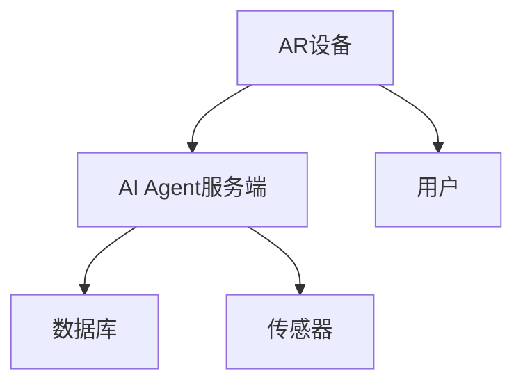

                 

# 增强现实技术与AI Agent的结合

> 关键词：增强现实，人工智能代理，技术结合，应用案例，算法原理

> 摘要：本文深入探讨了增强现实（AR）技术与人工智能代理（AI Agent）的结合，分析了两者的结合意义、技术实现、实际应用及其未来发展趋势。通过详细的技术分析和实际案例，本文为读者提供了从理论到实践的全面解读。

---

## 第一章: 增强现实技术与AI Agent的基本概念

### 1.1 增强现实技术的定义与特点

#### 1.1.1 增强现实技术的定义
增强现实（Augmented Reality，AR）是一种将虚拟信息叠加在真实世界上的技术，通过计算机图形学、传感器技术和用户界面设计，使用户能够以更直观的方式与数字信息互动。

#### 1.1.2 增强现实的核心特点
- **实时性**：AR需要实时处理和显示，与用户的动作或环境变化同步。
- **交互性**：用户可以通过手势、语音等方式与AR内容互动。
- **沉浸性**：AR通过叠加虚拟元素，增强了用户的沉浸感，但不完全替代真实世界。

#### 1.1.3 增强现实与虚拟现实的区别
| 方面 | 增强现实（AR） | 虚拟现实（VR） |
|------|----------------|----------------|
| 定义 | 在真实环境中叠加虚拟信息 | 完全沉浸于虚拟环境中 |
| 应用 | 教育、医疗、游戏 | 游戏、模拟训练 |
| 沉浸感 | 部分沉浸 | 完全沉浸 |

### 1.2 AI Agent的定义与特点

#### 1.2.1 AI Agent的定义
AI Agent（人工智能代理）是一种能够感知环境、自主决策并执行任务的智能实体。它可以是一个软件程序或物理设备，具备学习、推理和自适应能力。

#### 1.2.2 AI Agent的核心特点
- **自主性**：AI Agent能够自主决策，无需外部干预。
- **反应性**：能够实时感知环境并做出反应。
- **目标导向**：基于目标进行决策和行动。

#### 1.2.3 AI Agent与传统AI的区别
| 方面 | 传统AI | AI Agent |
|------|--------|-----------|
| 智能水平 | 依赖规则和数据 | 具备自主决策能力 |
| 应用场景 | 数据分析、模式识别 | 自动化任务、智能交互 |
| 学习能力 | 无 | 有 |

### 1.3 增强现实技术与AI Agent的结合意义

#### 1.3.1 结合的背景与动机
随着AR和AI技术的快速发展，两者的结合能够为用户提供更智能、更直观的交互体验。AR提供直观的视觉反馈，AI Agent提供智能决策支持。

#### 1.3.2 结合的潜在应用领域
- **教育**：通过AR展示动态的3D模型，AI Agent作为智能导师提供讲解。
- **医疗**：AR辅助手术，AI Agent提供实时诊断建议。
- **工业**：AR用于设备维修，AI Agent优化操作流程。

#### 1.3.3 结合的优势与挑战
优势：
- 提高用户交互体验
- 增强系统智能性
- 提高效率和准确性

挑战：
- 技术实现复杂
- 数据处理的实时性要求高
- 用户隐私和安全问题

---

## 第二章: 增强现实技术与AI Agent的结合原理

### 2.1 增强现实技术的核心原理

#### 2.1.1 增强现实的实现流程
1. **环境感知**：通过摄像头、传感器等获取真实环境数据。
2. **数据处理**：对环境数据进行分析和建模。
3. **虚拟信息叠加**：将虚拟信息与真实环境融合，生成AR画面。
4. **用户交互**：用户通过手势、语音等方式与AR内容互动。

#### 2.1.2 增强现实的关键技术
- **计算机视觉**：用于环境识别和跟踪。
- **图形渲染**：实现虚拟信息的叠加和显示。
- **传感器融合**：结合多种传感器数据提高精度。

#### 2.1.3 增强现实的数学模型与公式
AR的坐标变换可以表示为：
$$
T_{world} = T_{camera} \cdot T_{object}
$$
其中，$T_{world}$是世界坐标系中的变换矩阵，$T_{camera}$是相机坐标系的变换矩阵，$T_{object}$是物体在相机坐标系中的变换矩阵。

### 2.2 AI Agent的核心原理

#### 2.2.1 AI Agent的感知与决策机制
1. **感知**：通过传感器、摄像头等获取环境数据。
2. **决策**：基于感知数据，利用机器学习算法进行推理和决策。
3. **执行**：根据决策结果执行动作。

#### 2.2.2 AI Agent的行为规划与执行
- **路径规划**：利用A*算法或其他算法规划最优路径。
- **行为决策**：基于当前状态和目标，选择最优行为。

#### 2.2.3 AI Agent的学习与优化算法
常用的算法包括：
- **强化学习**：通过奖励机制优化决策策略。
- **监督学习**：基于标注数据进行分类和回归。

### 2.3 增强现实与AI Agent的结合原理

#### 2.3.1 增强现实为AI Agent提供实时环境感知
AR通过摄像头和传感器为AI Agent提供环境数据，AI Agent利用这些数据进行决策。

#### 2.3.2 AI Agent为增强现实提供智能决策支持
AI Agent分析用户的动作和环境数据，为AR提供动态的虚拟信息。

#### 2.3.3 两者的协同工作流程
1. **环境感知**：AR设备获取环境数据。
2. **数据传输**：将环境数据传输给AI Agent。
3. **智能决策**：AI Agent分析数据，生成决策。
4. **反馈与显示**：AR设备将决策结果反馈给用户，显示动态的虚拟信息。

---

## 第三章: 增强现实技术与AI Agent的核心概念对比与联系

### 3.1 增强现实与AI Agent的核心概念对比

#### 3.1.1 技术特点对比
| 方面 | 增强现实 | AI Agent |
|------|----------|-----------|
| 核心技术 | 图形渲染、传感器融合 | 机器学习、决策算法 |
| 应用场景 | 教育、医疗、工业 | 自动化、智能交互 |

#### 3.1.2 应用场景对比
- **教育**：AR用于展示3D模型，AI Agent用于讲解知识点。
- **医疗**：AR辅助手术，AI Agent提供实时诊断建议。
- **工业**：AR用于设备维修，AI Agent优化操作流程。

#### 3.1.3 优缺点对比
| 方面 | 增强现实 | AI Agent |
|------|----------|-----------|
| 优点 | 提高用户交互体验 | 提供智能决策支持 |
| 缺点 | 技术实现复杂 | 可能存在隐私和安全问题 |

### 3.2 增强现实与AI Agent的联系

#### 3.2.1 增强现实为AI Agent提供交互界面
AR通过视觉化的方式展示AI Agent的决策结果，使用户更直观地理解和操作。

#### 3.2.2 AI Agent为增强现实提供智能支持
AI Agent通过分析环境数据，为AR提供动态的虚拟信息，使AR系统更加智能化。

#### 3.2.3 两者结合的创新应用场景
- **智能助手**：AI Agent通过AR界面为用户提供实时帮助。
- **智能导航**：AI Agent分析环境数据，通过AR显示最优路径。

---

## 第四章: 增强现实技术与AI Agent的结合技术实现

### 4.1 增强现实与AI Agent的技术实现流程

#### 4.1.1 系统架构设计
系统架构包括：
1. **前端**：AR设备（如智能手机、AR眼镜）。
2. **后端**：AI Agent服务端，负责数据处理和智能决策。
3. **数据传输**：通过网络传输环境数据和决策结果。

#### 4.1.2 系统功能设计
- **环境感知**：通过摄像头和传感器获取环境数据。
- **智能决策**：AI Agent分析数据，生成决策。
- **动态显示**：AR设备将决策结果以动态形式展示。

#### 4.1.3 算法实现
- **图像处理**：使用OpenCV进行图像处理。
- **目标检测**：使用YOLO等算法检测环境中的目标。
- **决策算法**：使用强化学习优化AI Agent的决策策略。

### 4.2 增强现实与AI Agent的协同工作流程

#### 4.2.1 环境感知与数据传输
AR设备通过摄像头获取环境数据，通过网络传输给AI Agent服务端。

#### 4.2.2 智能决策与反馈
AI Agent分析环境数据，生成决策，并将结果反馈给AR设备。

#### 4.2.3 动态显示与用户交互
AR设备将决策结果以动态形式展示给用户，并通过手势、语音等方式进行交互。

---

## 第五章: 增强现实技术与AI Agent的结合应用案例

### 5.1 教育领域的应用

#### 5.1.1 应用场景
- **虚拟教室**：通过AR技术展示3D模型，AI Agent作为智能导师为学生提供讲解。

#### 5.1.2 技术实现
- **环境感知**：摄像头获取教室环境数据。
- **智能决策**：AI Agent分析学生位置和动作，提供个性化教学内容。
- **动态显示**：AR设备显示动态的3D模型和教学内容。

### 5.2 医疗领域的应用

#### 5.2.1 应用场景
- **手术辅助**：通过AR技术展示患者体内结构，AI Agent提供实时诊断建议。

#### 5.2.2 技术实现
- **环境感知**：摄像头获取手术环境数据。
- **智能决策**：AI Agent分析患者数据，生成诊断建议。
- **动态显示**：AR设备显示患者体内结构和诊断建议。

### 5.3 工业领域的应用

#### 5.3.1 应用场景
- **设备维修**：通过AR技术展示设备内部结构，AI Agent提供维修指导。

#### 5.3.2 技术实现
- **环境感知**：摄像头获取设备环境数据。
- **智能决策**：AI Agent分析设备数据，生成维修方案。
- **动态显示**：AR设备显示设备内部结构和维修步骤。

---

## 第六章: 增强现实技术与AI Agent的结合系统设计与优化

### 6.1 系统架构设计

#### 6.1.1 系统模块划分
1. **前端模块**：AR设备，负责环境感知和用户交互。
2. **后端模块**：AI Agent服务端，负责智能决策和数据处理。
3. **数据传输模块**：网络通信，负责数据传输。

#### 6.1.2 系统架构图

### 6.2 系统优化策略

#### 6.2.1 数据处理优化
- **传感器数据融合**：通过Kalman滤波优化传感器数据精度。
- **实时渲染优化**：使用异步渲染减少延迟。

#### 6.2.2 系统性能优化
- **并行计算**：利用多线程和分布式计算提高处理效率。
- **算法优化**：优化AI Agent的决策算法，减少计算时间。

#### 6.2.3 系统安全性优化
- **数据加密**：对传输数据进行加密处理。
- **访问控制**：通过权限管理控制系统的访问范围。

---

## 第七章: 增强现实技术与AI Agent的结合未来展望与挑战

### 7.1 未来发展趋势

#### 7.1.1 技术融合
- **更深层次的AI与AR结合**：AI Agent将更加智能化，AR显示将更加逼真。
- **边缘计算的应用**：通过边缘计算实现更低延迟的实时处理。

#### 7.1.2 新兴应用场景
- **智能城市**：通过AR技术展示城市信息，AI Agent提供智能服务。
- **智能家居**：通过AR技术展示家居信息，AI Agent提供智能控制。

### 7.2 挑战与解决方案

#### 7.2.1 技术挑战
- **实时性要求高**：需要优化算法和硬件性能。
- **数据处理复杂**：需要更高效的传感器数据处理算法。

#### 7.2.2 应用挑战
- **用户隐私问题**：需要加强数据隐私保护。
- **系统安全性问题**：需要提高系统的防攻击能力。

---

## 附录: 增强现实技术与AI Agent的结合相关资源

### 附录A: 增强现实技术开发工具推荐
- **ARKit**：苹果公司推出的AR开发框架。
- **ARCore**：谷歌公司推出的AR开发框架。
- **OpenCV**：常用的图像处理库。

### 附录B: AI Agent开发框架推荐
- **TensorFlow**：谷歌开发的机器学习框架。
- **Keras**：基于TensorFlow的高级接口。
- **OpenAI Gym**：强化学习的开源库。

---

## 作者：AI天才研究院/AI Genius Institute & 禅与计算机程序设计艺术 /Zen And The Art of Computer Programming

