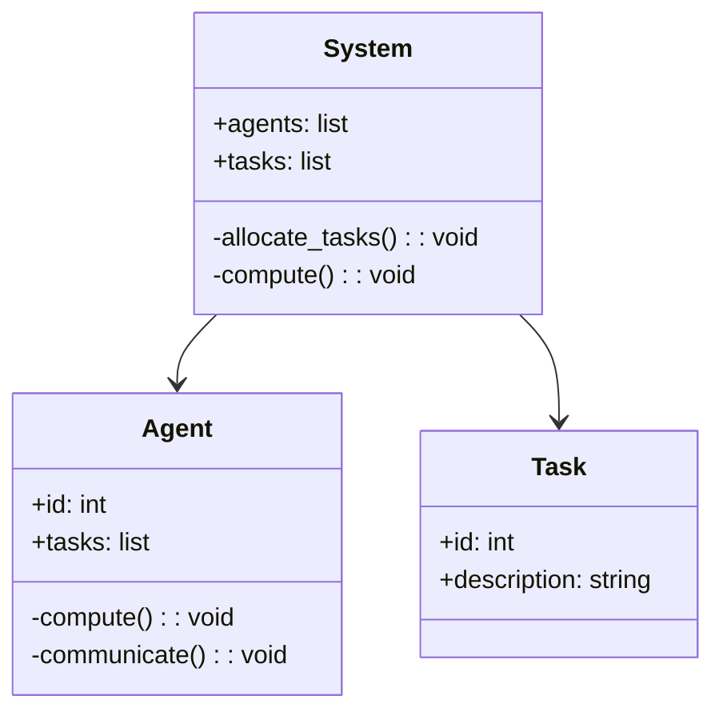
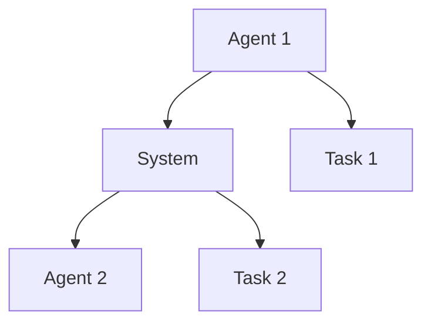
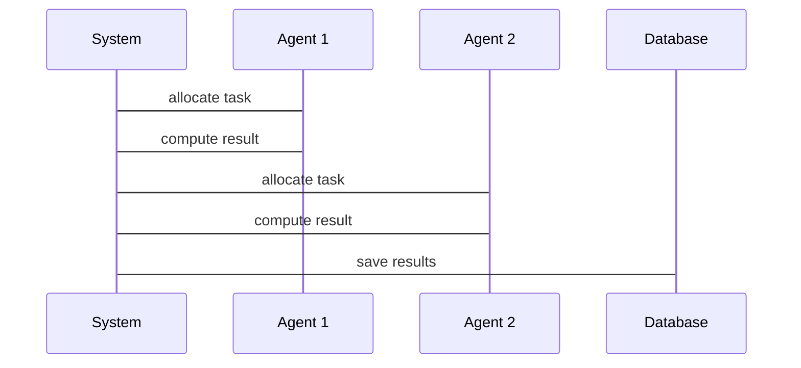

                 


# 多Agent协作：构建复杂的智能系统

## 关键词：多Agent协作、智能系统、分布式计算、共识算法、系统架构

## 摘要：
多Agent协作是一种构建复杂智能系统的重要方法，通过多个智能体之间的协作，能够实现更高效、更灵活的系统设计。本文从多Agent协作的基本概念出发，详细讲解其核心原理、算法实现、系统架构设计，最后通过实际案例展示其应用。文章内容丰富，涵盖从理论到实践的各个方面，帮助读者全面理解多Agent协作技术。

---

# 第一部分: 多Agent协作基础

## 第1章: 多Agent协作概述

### 1.1 多Agent协作的背景与意义
#### 1.1.1 问题背景
在现代计算机系统中，单点处理的能力逐渐接近物理极限，而复杂系统的规模和需求却在不断增加。传统的单体架构难以应对分布式、动态变化的场景，例如分布式计算、自动驾驶、智能城市等领域，需要多个智能体协同工作以完成复杂的任务。

#### 1.1.2 多Agent协作的意义
多Agent协作通过多个智能体的分工合作，能够更好地处理复杂任务，提高系统的可靠性和容错性。通过分布式计算和自主决策，多Agent协作能够实现更高效、更灵活的系统设计。

#### 1.1.3 多Agent协作的应用场景
- 分布式计算：如分布式数据库、云计算平台。
- 自动驾驶：多个车辆协同完成交通管理。
- 智能城市：智能交通系统、智能家居等。

### 1.2 多Agent协作的核心概念
#### 1.2.1 Agent的定义与特点
- **定义**：Agent是一个具有自主性、反应性、社会性的实体，能够感知环境并采取行动。
- **特点**：自主性、反应性、社会性、协作性。

#### 1.2.2 多Agent协作的定义
多Agent协作是指多个Agent通过通信和协调，共同完成一个复杂任务的过程。

#### 1.2.3 多Agent协作的核心要素
- 通信机制：Agent之间通过消息传递进行通信。
- 协调机制：通过协商和任务分配实现协作。
- 分布式决策：每个Agent基于本地信息做出决策。

### 1.3 多Agent协作的边界与外延
- **边界**：多Agent协作的边界在于单个Agent的能力范围和协作任务的复杂性。
- **外延**：多Agent协作可以与其他技术（如分布式系统、人工智能）结合，实现更复杂的智能系统。

---

## 第2章: 多Agent协作的核心概念与联系

### 2.1 多Agent协作的原理
#### 2.1.1 Agent的结构与功能
- **结构**：感知层、决策层、执行层。
- **功能**：感知环境、决策、执行行动。

#### 2.1.2 多Agent协作的机制
- 通信机制：通过消息传递进行信息交换。
- 协调机制：通过协商和任务分配实现协作。
- 决策机制：基于局部信息做出决策。

#### 2.1.3 多Agent协作的数学模型
$$C = \text{Consensus}(A_1, A_2, ..., A_n)$$
其中，$C$ 表示协作结果，$A_i$ 表示各个Agent。

### 2.2 多Agent协作的核心概念对比
#### 2.2.1 Agent与传统程序的对比
| 特性       | Agent          | 传统程序       |
|------------|----------------|----------------|
| 自主性      | 高             | 低             |
| 反应性      | 高             | 低             |
| 社会性      | 高             | 无             |

#### 2.2.2 单Agent与多Agent的对比
| 特性       | 单Agent        | 多Agent         |
|------------|----------------|----------------|
| 任务处理    | 单一           | 分布式          |
| 容错性      | 低             | 高             |
| 扩展性      | 低             | 高             |

#### 2.2.3 协作与竞争的对比
| 特性       | 协作           | 竞争           |
|------------|----------------|----------------|
| 目标        | 共同目标       | 独立目标       |
| 行为        | 协同           | 独立           |
| 效率        | 高             | 低             |

### 2.3 多Agent协作的ER实体关系图
```mermaid
er
  actor: 多Agent协作系统
  entity: Agent
  relation: 协作关系
  actor -[创建和管理]-> entity
  entity -[协作关系]-> entity
```

---

## 第3章: 多Agent协作的算法原理

### 3.1 多Agent协作算法概述
#### 3.1.1 分布式计算
- **定义**：多个Agent分别计算部分任务，最终汇总结果。
- **特点**：并行性、分布性。

#### 3.1.2 共识算法
- **定义**：多个Agent达成一致协议的过程。
- **特点**：一致性、可靠性。

#### 3.1.3 协作任务分配
- **定义**：将任务分配给多个Agent，确保任务高效完成。
- **特点**：动态性、优化性。

### 3.2 多Agent协作算法实现
#### 3.2.1 分布式计算的实现
```python
def distributed_computation(n):
    agents = [Agent(i) for i in range(n)]
    results = []
    for agent in agents:
        results.append(agent.compute())
    return sum(results)
```

#### 3.2.2 共识算法的实现
```python
def consensus(algorithm, agents):
    if algorithm == 'raft':
        return raft.Consensus(agents)
    elif algorithm == 'paxos':
        return paxos.Consensus(agents)
    else:
        return None
```

#### 3.2.3 协作任务分配的实现
```python
def task_allocation(tasks, agents):
    agent_tasks = {}
    for task in tasks:
        agent = select_agent(agents)
        agent_tasks[agent] = task
    return agent_tasks
```

### 3.3 多Agent协作算法的数学模型
#### 3.3.1 分布式计算的数学模型
$$f(x) = \sum_{i=1}^{n} f_i(x_i)$$
其中，$f_i(x_i)$ 表示每个Agent计算的部分。

#### 3.3.2 共识算法的数学模型
$$C = \text{Consensus}(P_1, P_2, ..., P_n)$$
其中，$P_i$ 表示每个Agent的提案。

#### 3.3.3 协作任务分配的数学模型
$$T_i = \text{Task}(A_1, A_2, ..., A_n)$$
其中，$A_i$ 表示每个Agent，$T_i$ 表示分配的任务。

---

## 第4章: 多Agent协作的系统分析与架构设计

### 4.1 系统分析
#### 4.1.1 问题场景介绍
- 问题：多个Agent需要协作完成任务。
- 约束：通信延迟、计算资源有限。

#### 4.1.2 项目介绍
- 目标：设计一个多Agent协作系统，实现高效的任务分配和计算。

### 4.2 系统功能设计
#### 4.2.1 领域模型类图


#### 4.2.2 系统架构设计


#### 4.2.3 系统接口设计
- 接口1：Agent与System通信接口。
- 接口2：Task分配接口。

#### 4.2.4 系统交互序列图


---

## 第5章: 项目实战

### 5.1 环境配置
- 安装Python和必要的库（如raft、paxos）。

### 5.2 核心代码实现
```python
class Agent:
    def __init__(self, id):
        self.id = id
        self.tasks = []
    
    def compute(self):
        result = sum([task.value for task in self.tasks])
        return result

class Task:
    def __init__(self, description):
        self.description = description
        self.value = random.randint(1, 100)

class System:
    def __init__(self, num_agents):
        self.agents = [Agent(i) for i in range(num_agents)]
        self.tasks = []
    
    def allocate_tasks(self, tasks):
        for agent in self.agents:
            task = tasks.pop()
            agent.tasks.append(task)
    
    def compute(self):
        results = []
        for agent in self.agents:
            results.append(agent.compute())
        return sum(results)
```

### 5.3 代码应用解读与分析
- **Agent类**：负责接收任务并执行计算。
- **Task类**：表示需要分配的任务。
- **System类**：负责任务分配和计算协调。

### 5.4 实际案例分析
- **案例**：多Agent协作的物流系统。
- **实现**：多个Agent分别负责不同的物流节点，协作完成订单处理和配送。

### 5.5 项目小结
通过实际案例，展示了多Agent协作在复杂系统中的应用，验证了其高效性和可靠性。

---

## 第6章: 总结与展望

### 6.1 总结
多Agent协作是一种构建复杂智能系统的重要方法，通过多个智能体的协作，能够实现更高效、更灵活的系统设计。

### 6.2 小结
本文从多Agent协作的基本概念出发，详细讲解了其核心原理、算法实现、系统架构设计，最后通过实际案例展示其应用。

### 6.3 展望
未来，随着人工智能和分布式计算的发展，多Agent协作将在更多领域得到应用，推动智能系统的进一步发展。

---

## 作者
作者：AI天才研究院/AI Genius Institute  
作者：禅与计算机程序设计艺术/Zen And The Art of Computer Programming

