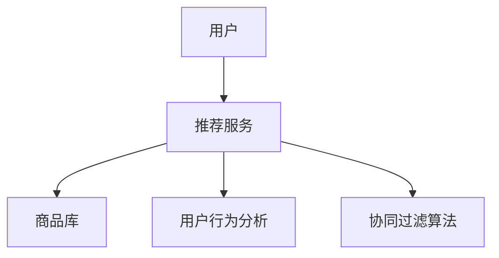
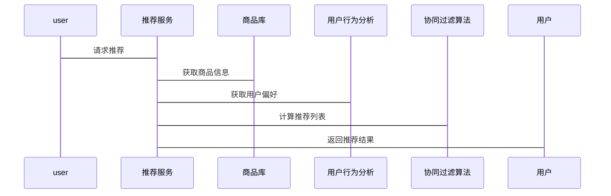

                 


# 多Agent系统：协作与竞争中的AI生态

> 关键词：多Agent系统，协作，竞争，AI生态，分布式计算，博弈论，系统架构

> 摘要：多Agent系统是一种由多个智能体组成的分布式系统，这些智能体能够自主决策、协作和竞争，形成复杂的AI生态系统。本文将从基本概念、算法原理、系统设计到实际应用，全面探讨多Agent系统的协作与竞争机制，分析其在现代AI生态中的重要地位。

---

# 第一部分: 多Agent系统基础

## # 第1章: 多Agent系统概述

### ## 1.1 多Agent系统的基本概念
#### ### 1.1.1 什么是多Agent系统
多Agent系统（Multi-Agent System, MAS）是由多个智能体（Agent）组成的分布式系统，这些智能体能够感知环境、自主决策并进行协作或竞争。每个Agent都有自己的目标和行为策略，通过通信和协作完成复杂的任务。

#### ### 1.1.2 多Agent系统的特点
- **自主性**：每个Agent独立决策，无需中央控制。
- **反应性**：能够实时感知环境并做出反应。
- **协作性**：Agent之间可以通过通信协作完成共同目标。
- **分布式计算**：任务分布在多个Agent上，避免单点故障。

#### ### 1.1.3 多Agent系统与传统AI的区别
- 传统AI：单个智能体完成任务，依赖中心化控制。
- 多Agent系统：多个智能体协作，任务分布，具备更高的灵活性和容错性。

#### ### 1.1.4 多Agent系统的应用领域
- 智能交通管理
- 分布式推荐系统
- 智能电网
- 自动化制造

### ## 1.2 多Agent系统的组成与结构
#### ### 1.2.1 Agent的定义与分类
- **Agent**：能够感知环境并采取行动以实现目标的实体。
- 分类：简单反射型、基于模型的反射型、目标驱动型、效用驱动型。

| 类型 | 描述 | 示例 |
|------|------|------|
| 简单反射型 | 基于当前感知直接反应 | 自动门传感器 |
| 基于模型的反射型 | 使用内部模型推理 | 智能音箱 |
| 目标驱动型 | 为实现特定目标而行动 | 任务分配系统 |
| 效用驱动型 | 最大化效用函数 | 电商推荐系统 |

#### ### 1.2.2 多Agent系统的层次结构
- **感知层**：收集环境信息。
- **决策层**：制定策略。
- **执行层**：执行动作。

#### ### 1.2.3 多Agent系统的通信机制
- **通信协议**：定义消息格式和交互规则。
- **通信模型**：发布-订阅、请求-响应。

#### ### 1.2.4 多Agent系统的协作模型
- **协作协议**：定义协作规则。
- **协作任务分配**：基于角色分配任务。

---

## # 第2章: 多Agent系统的核心概念

### ## 2.1 多Agent系统的核心原理
#### ### 2.1.1 Agent的自主性与反应性
- 自主性：Agent独立决策。
- 反应性：实时感知环境并调整行为。

#### ### 2.1.2 多Agent系统的分布式计算
- 分布式计算：任务分布在多个Agent上。
- 一致性问题：确保系统状态一致。

#### ### 2.1.3 多Agent系统的动态协作
- 动态协作：Agent根据环境变化调整协作方式。

### ## 2.2 多Agent系统的协作机制
#### ### 2.2.1 协作协议的选择与设计
- 协作协议：定义协作规则。
- 协作协议设计：基于角色分配、任务分解。

#### ### 2.2.2 协作过程中的冲突解决
- 冲突检测：识别潜在冲突。
- 冲突解决：协商、仲裁。

#### ### 2.2.3 协作结果的评估与优化
- 协作效果评估：基于任务完成度。
- 协作优化：动态调整协作策略。

---

## # 第3章: 多Agent系统的算法基础

### ## 3.1 分布式计算与一致性算法
#### ### 3.1.1 分布式计算的基本概念
- 分布式系统：任务分布在多个节点上。
- 分布式计算：多个节点协作完成任务。

#### ### 3.1.2 分布式一致性算法
- **Paxos算法**：确保分布式系统的一致性。
- **Raft算法**：Paxos的简化实现。

#### ### 3.1.3 分布式锁机制
- 分布式锁：防止多个Agent同时修改同一资源。

### ## 3.2 共识算法与拜占庭容错
#### ### 3.2.1 共识算法的原理与实现
- **PBFT**：实用拜占庭容错算法。
- 共识算法实现：确保多个节点达成一致。

#### ### 3.2.2 拜占庭容错机制的应用
- 拜占庭容错：在不可靠网络中达成一致。

---

## # 第4章: 多Agent协作与竞争的数学模型

### ## 4.1 博弈论基础
#### ### 4.1.1 纳什均衡的定义与应用
- 纳什均衡：策略组合中，每个Agent的最佳策略。
- 应用：市场博弈、资源分配。

#### ### 4.1.2 帕累托最优的实现与挑战
- 帕累托最优：无法通过重新分配使任何人更好。
- 实现挑战：全局最优与局部最优的平衡。

### ## 4.2 多Agent系统的博弈模型
#### ### 4.2.1 协作博弈的数学表达
- 协作博弈：Agent之间合作以实现共同目标。
- 数学模型：定义收益函数，求解纳什均衡。

#### ### 4.2.2 竞争博弈的数学分析
- 竞争博弈：Agent之间竞争有限资源。
- 数学分析：最大化收益，最小化损失。

#### ### 4.2.3 博弈树的构建与分析
- 博弈树：表示所有可能的决策路径。
- 构建与分析：找出最优策略。

---

## # 第5章: 多Agent系统的系统设计与架构

### ## 5.1 系统设计原则
#### ### 5.1.1 开放性与可扩展性
- 开放性：支持新Agent加入。
- 可扩展性：系统规模可扩展。

#### ### 5.1.2 安全性与隐私保护
- 安全性：防止恶意攻击。
- 隐私保护：保护Agent的敏感信息。

### ## 5.2 系统架构设计方案
#### ### 5.2.1 项目介绍
- 电商推荐系统：多个Agent协作推荐商品。

#### ### 5.2.2 系统功能设计
- **领域模型**：用户、商品、推荐规则。
- **系统架构**：分布式架构，使用微服务设计。

#### ### 5.2.3 系统架构图


#### ### 5.2.4 系统接口设计
- 接口1：用户请求推荐。
- 接口2：获取商品信息。

#### ### 5.2.5 系统交互图


---

## # 第6章: 项目实战

### ## 6.1 环境安装
- 安装Python、Django框架、分布式计算库。

### ## 6.2 系统核心实现
- 实现推荐服务：基于协同过滤算法。
- 实现商品库访问：RESTful API。
- 实现用户行为分析：数据挖掘。

### ## 6.3 代码实现
```python
# 推荐服务
class RecommenderSystem:
    def __init__(self):
        self.user_data = {}  # 用户行为数据
        self.item_data = {}  # 商品数据

    def get_recommendations(self, user_id):
        # 协同过滤算法
        similar_users = self.find_similar_users(user_id)
        recommendations = []
        for u in similar_users:
            recommendations.extend(self.get_top_items(u))
        return recommendations

    def find_similar_users(self, user_id):
        # 基于用户行为的相似性计算
        pass

    def get_top_items(self, user_id):
        # 获取用户偏好商品
        pass

# 商品库访问
class ProductCatalog:
    def __init__(self):
        self.products = {}  # 商品信息

    def get_product_info(self, product_id):
        return self.products.get(product_id, {})
```

### ## 6.4 功能解读与案例分析
- 功能解读：推荐系统通过分析用户行为和商品信息，生成个性化推荐。
- 案例分析：用户A的推荐结果基于相似用户的购买记录。

---

## # 第7章: 最佳实践与总结

### ## 7.1 最佳实践
#### ### 7.1.1 设计原则
- 简单性：避免过度复杂。
- 可扩展性：支持新Agent加入。

#### ### 7.1.2 性能优化
- 并行计算：提高处理效率。
- 缓存机制：减少重复计算。

#### ### 7.1.3 安全与隐私
- 加密通信：保护数据安全。
- 数据匿名化：保护用户隐私。

### ## 7.2 小结
多Agent系统通过协作与竞争，形成高效的AI生态系统。理解和掌握多Agent系统的原理与应用，对于构建分布式智能系统至关重要。

---

## # 作者

作者：AI天才研究院/AI Genius Institute & 禅与计算机程序设计艺术 /Zen And The Art of Computer Programming

---

通过以上详细的大纲，我可以开始撰写完整的文章，确保每个部分都包含丰富的细节和实际案例，帮助读者深入理解多Agent系统的核心思想和应用技巧。

