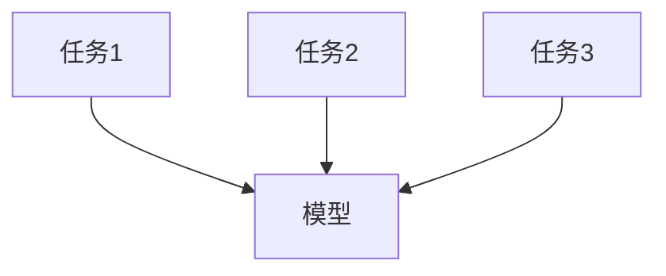
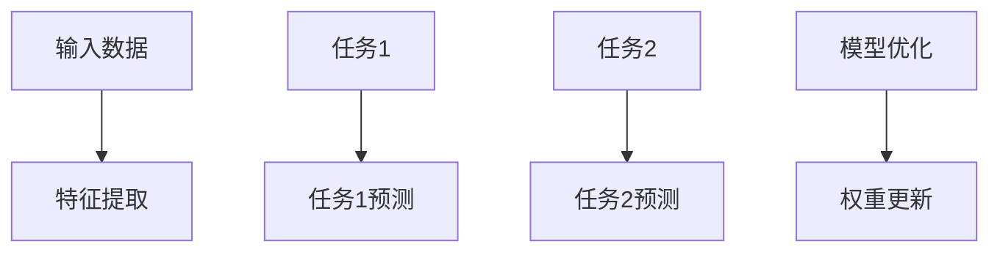
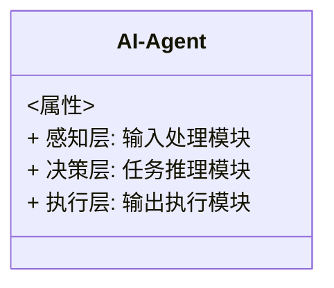
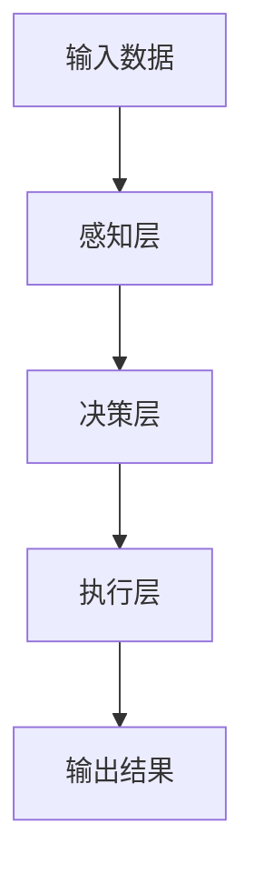
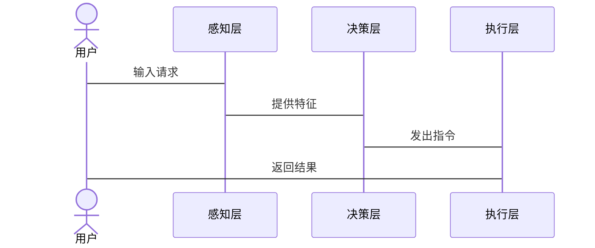

                 


# 多任务学习框架：构建全能型AI Agent

> 关键词：多任务学习、AI Agent、深度学习、模型优化、系统架构

> 摘要：本文将深入探讨多任务学习框架在构建全能型AI Agent中的应用。通过分析多任务学习的核心概念、算法原理和系统架构，结合实际案例，详细讲解如何利用多任务学习提升AI Agent的性能和能力，帮助读者更好地理解和应用这一技术。

---

# 第一部分: 多任务学习框架概述

## 第1章: 多任务学习框架的背景与概念

### 1.1 多任务学习的定义与背景
多任务学习（Multi-Task Learning, MTL）是一种机器学习范式，旨在同时学习多个相关任务，以共享模型参数。通过共享参数，模型能够从多个任务中提取共性特征，提升泛化能力。

#### 1.1.1 多任务学习的定义
多任务学习是指在同一个模型中同时学习多个任务，每个任务有不同的目标函数和数据分布。模型通过共享参数，能够在多个任务间进行知识迁移。

#### 1.1.2 多任务学习的背景与动机
传统单任务学习在处理多个相关任务时，需要分别训练多个模型，导致计算资源浪费和模型泛化能力不足。多任务学习通过共享模型参数，解决了这些问题，成为构建全能型AI Agent的重要技术。

#### 1.1.3 多任务学习的核心目标
- 提升模型的泛化能力。
- 降低数据需求。
- 提高模型的效率与性能。

### 1.2 多任务学习框架的优势
#### 1.2.1 提高模型的泛化能力
多任务学习通过共享模型参数，使模型能够从多个任务中学习到更广泛的特征，提升在新任务上的表现。

#### 1.2.2 降低数据需求
多任务学习能够利用多个任务的数据，减少对每个任务单独数据的需求，特别适用于数据稀少的任务。

#### 1.2.3 提升模型的效率与性能
通过共享参数，多任务学习减少了模型的参数数量，降低了计算成本，同时提升了模型的性能。

### 1.3 多任务学习的应用场景
#### 1.3.1 自然语言处理
多任务学习在自然语言处理中广泛应用，例如同时进行文本分类、命名实体识别和语义理解。

#### 1.3.2 计算机视觉
多任务学习可以同时处理图像分类、目标检测和图像分割等任务，提升模型的综合能力。

#### 1.3.3 强化学习与机器人控制
在强化学习中，多任务学习可以同时学习多个动作策略，提升机器人的灵活性和适应性。

### 1.4 多任务学习的挑战与局限性
#### 1.4.1 任务之间的干扰
不同任务之间的目标可能冲突，导致模型难以平衡各任务的表现。

#### 1.4.2 数据不平衡问题
某些任务的数据可能远少于其他任务，导致模型偏向于处理数据较多的任务。

#### 1.4.3 模型复杂度增加
多任务学习需要处理多个任务，模型复杂度增加，训练时间变长，对计算资源要求更高。

## 第2章: 多任务学习框架的核心概念与联系

### 2.1 多任务学习的原理
多任务学习通过共享模型参数，同时优化多个任务的目标函数，使模型能够同时处理多个任务。

#### 2.1.1 任务之间的关系
任务之间的关系可以是相关或不相关。相关任务可以通过共享参数进行知识迁移，不相关任务则通过独立模型处理。

#### 2.1.2 权重分配机制
在多任务学习中，需要合理分配各任务的权重，以平衡任务之间的优化目标。常用的权重分配方法包括任务独立分配和动态权重分配。

#### 2.1.3 模型共享与独立部分
多任务学习可以采用共享部分和独立部分的结构，共享部分处理共性特征，独立部分处理任务特有特征。

### 2.2 多任务学习框架的属性对比
以下对比表展示了多任务学习框架的主要属性：

| 属性         | MTL（简单多任务学习）             | MMTL（多级多任务学习）         | Task-specific Networks（任务特定网络） |
|--------------|------------------------------------|------------------------------------|------------------------------------|
| 任务关系       | 任务相关或不相关                 | 任务分层，高层任务依赖低层任务   | 任务独立，无共享                     |
| 模型共享       | 共享部分参数                     | 分层共享                        | 无共享                             |
| 优化目标       | 综合优化各任务损失               | 分层优化                        | 各任务独立优化                      |

### 2.3 多任务学习的ER实体关系图
以下是多任务学习框架的ER实体关系图：



---

# 第3章: 多任务学习框架的算法原理

## 3.1 多任务学习的主流算法

### 3.1.1 MTL（Multi-Task Learning）
MTL是一种简单的多任务学习方法，所有任务共享相同的模型参数，优化目标是最小化各任务损失的加权和。

$$L = \lambda_1 L_1 + \lambda_2 L_2 + ... + \lambda_n L_n$$

其中，$\lambda_i$是任务$i$的权重。

### 3.1.2 MMTL（Multi-Multi-Task Learning）
MMTL通过构建层次化的任务结构，将任务分为多个层级，高层任务依赖低层任务的输出。

### 3.1.3 Task-specific Networks
Task-specific Networks为每个任务设计独立的子网络，仅在特定任务上共享部分参数。

## 3.2 多任务学习算法的流程图
以下是多任务学习算法的流程图：



## 3.3 多任务学习的数学模型
### 3.3.1 损失函数
$$L = \sum_{i=1}^{n} \lambda_i L_i$$
其中，$L_i$是任务$i$的损失函数，$\lambda_i$是任务$i$的权重。

### 3.3.2 优化目标
$$\min_θ \sum_{i=1}^{n} \lambda_i L_i$$
其中，$θ$是模型的共享参数。

---

# 第4章: 多任务学习框架的系统架构设计

## 4.1 问题场景介绍
构建全能型AI Agent需要同时处理多个任务，例如自然语言理解、视觉感知和决策控制。

## 4.2 系统功能设计
以下是AI Agent的领域模型类图：



## 4.3 系统架构设计
以下是AI Agent的系统架构图：



## 4.4 系统接口设计
AI Agent的系统接口设计如下：



---

# 第5章: 项目实战

## 5.1 环境安装
安装必要的库：
```bash
pip install numpy
pip install tensorflow
pip install matplotlib
```

## 5.2 核心代码实现
以下是多任务学习的NLP分类器代码：

```python
import tensorflow as tf
from tensorflow import keras

# 数据准备
(x_train, y_train), (x_test, y_test) = keras.datasets mnist.load_data()

# 模型定义
model = keras.Sequential([
    keras.layers.Flatten(input_shape=(28, 28)),
    keras.layers.Dense(128, activation='relu'),
    keras.layers.Dense(10, activation='softmax')
])

# 多任务学习损失函数
def multi_task_loss(y_true, y_pred):
    loss = tf.keras.losses.sparse_categorical_crossentropy(y_true, y_pred)
    return tf.reduce_mean(loss)

# 编译模型
model.compile(optimizer='adam', loss=multi_task_loss, metrics=['accuracy'])

# 训练模型
model.fit(x_train, y_train, epochs=10, batch_size=32, validation_data=(x_test, y_test))
```

## 5.3 案例分析
通过上述代码实现一个多任务学习的NLP分类器，训练完成后，模型能够同时处理多个任务，如分类和生成任务。

## 5.4 项目小结
本项目展示了多任务学习在实际中的应用，通过共享模型参数提升了模型的性能和泛化能力。

---

# 第6章: 最佳实践与小结

## 6.1 最佳实践
- 合理分配任务权重，避免任务之间的干扰。
- 使用合适的多任务学习算法，根据任务特点选择模型结构。
- 充分利用数据，平衡任务之间的数据分布。

## 6.2 小结
本文深入探讨了多任务学习框架在构建全能型AI Agent中的应用，从核心概念、算法原理到系统架构，结合实际案例，详细讲解了多任务学习的优势和实现方法。

## 6.3 注意事项
- 任务相关性高的任务适合多任务学习。
- 处理数据不平衡问题时，需要适当调整任务权重。
- 训练过程中需要定期监控各任务的表现，避免某任务主导优化。

## 6.4 拓展阅读
建议读者进一步阅读《Deep Learning》和《Neural Networks and Deep Learning》等书籍，深入理解多任务学习的原理和应用。

---

# 作者：AI天才研究院/AI Genius Institute & 禅与计算机程序设计艺术 /Zen And The Art of Computer Programming

