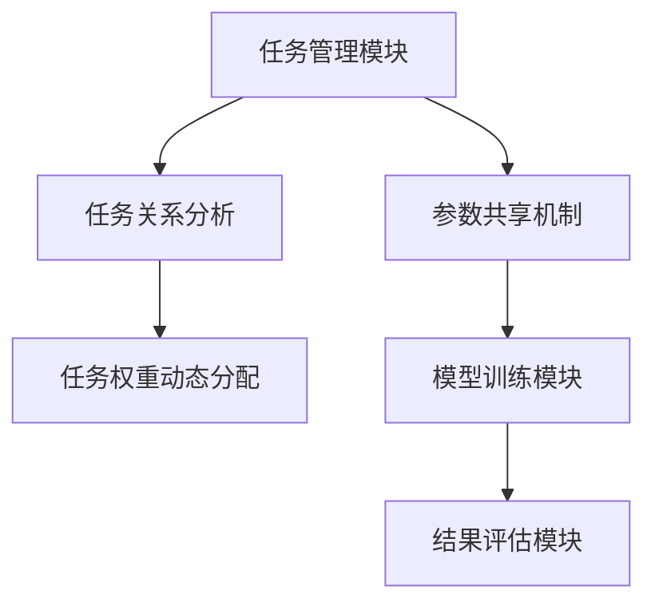

                 


# 多任务学习：构建全能型AI Agent

> **关键词**：多任务学习，AI Agent，参数共享，任务权重，系统架构

> **摘要**：  
> 多任务学习（Multi-Task Learning，MTL）是一种通过同时学习多个相关任务来提升模型泛化能力的机器学习方法。本文将从多任务学习的核心概念、算法原理、系统架构到实际应用进行深入分析，探讨如何通过多任务学习构建一个全能型AI Agent。文章不仅涵盖多任务学习的理论基础，还将通过具体案例和代码实现，帮助读者掌握多任务学习的核心技术和实践技巧。

---

## 第一部分: 多任务学习的背景与核心概念

### 第1章: 多任务学习的定义与背景

#### 1.1 多任务学习的定义与背景
多任务学习（Multi-Task Learning，MTL）是一种机器学习范式，旨在通过同时学习多个相关任务来提升模型的泛化能力和性能。与单一任务学习（Single-Task Learning，STL）相比，多任务学习能够充分利用任务之间的共享信息，从而在数据量有限的情况下显著提升模型的性能。

#### 1.2 多任务学习的核心概念
多任务学习的核心概念包括以下几个方面：
1. **任务参数共享**：多个任务共享部分模型参数，通过参数共享机制提升模型的泛化能力。
2. **任务关系**：不同任务之间的关系（如相关性、相似性）对多任务学习的性能有重要影响。
3. **任务权重动态分配**：不同任务在学习过程中可以分配不同的权重，以平衡各个任务的重要性。

#### 1.3 多任务学习的背景与现状
随着人工智能技术的快速发展，多任务学习在多个领域得到了广泛应用。特别是在自然语言处理、计算机视觉和机器人控制等领域，多任务学习能够帮助模型在多个任务之间实现知识共享，从而构建更强大的AI Agent。

---

### 第2章: 多任务学习的核心概念与原理

#### 2.1 多任务学习的核心概念
多任务学习的核心在于通过参数共享机制，让模型能够同时学习多个任务。这种共享机制可以显著减少模型的参数量，同时提升模型的泛化能力。

#### 2.2 多任务学习的算法原理
多任务学习的算法原理主要体现在以下几个方面：
1. **参数共享机制**：通过共享部分参数，多个任务可以共享模型的底层特征。
2. **任务权重动态调整**：在训练过程中，不同任务的权重可以动态调整，以平衡各个任务的学习效果。
3. **任务间的信息交互**：通过信息交互机制，不同任务之间可以共享梯度信息，进一步提升模型的性能。

#### 2.3 多任务学习的核心要素对比
以下是多任务学习核心要素的对比分析：

| **核心要素**       | **描述**                                                                 |
|--------------------|--------------------------------------------------------------------------|
| **任务参数共享**    | 多任务学习的核心机制，通过共享参数降低模型复杂度，提升泛化能力。                           |
| **任务权重动态分配** | 不同任务在训练过程中可以动态调整权重，以平衡各个任务的重要性。                             |
| **任务间信息交互**   | 通过信息交互机制，不同任务之间可以共享梯度信息，进一步提升模型性能。                       |

---

### 第3章: 多任务学习的数学模型与公式

#### 3.1 多任务学习的数学模型
多任务学习的数学模型通常可以表示为一个联合优化问题。假设我们有多个任务，每个任务的损失函数为$L_i$，则多任务学习的总损失函数可以表示为：

$$
L_{\text{total}} = \sum_{i=1}^{N} \lambda_i L_i
$$

其中，$\lambda_i$是任务$i$的权重系数，$N$是任务的总数。

#### 3.2 多任务学习的数学公式
以下是多任务学习的数学公式示例：

1. **参数共享机制**：
$$
\theta = \{\theta_1, \theta_2, \ldots, \theta_N\}
$$
其中，$\theta_i$表示任务$i$的参数。

2. **任务权重动态调整**：
$$
\lambda_i = \frac{1}{1 + e^{-\alpha t_i}}
$$
其中，$\alpha$是一个调节系数，$t_i$是任务$i$的训练时间。

3. **任务间信息交互**：
$$
g_i = g_{i-1} + \Delta g_i
$$
其中，$g_i$表示任务$i$的梯度，$\Delta g_i$是任务$i$的梯度变化量。

---

## 第二部分: 多任务学习的系统架构与实现

### 第4章: 多任务学习的系统架构设计

#### 4.1 系统功能模块设计
多任务学习系统的功能模块设计通常包括以下几个部分：
1. **任务管理模块**：负责任务的定义、任务之间的关系分析以及任务权重的动态分配。
2. **模型训练模块**：负责模型的训练，包括参数共享机制和任务权重的动态调整。
3. **结果评估模块**：负责模型的性能评估，包括各个任务的损失函数值和模型的准确率。

#### 4.2 系统架构设计
以下是多任务学习系统的架构设计：



#### 4.3 系统接口设计
多任务学习系统的接口设计通常包括以下几个部分：
1. **任务定义接口**：用于定义各个任务的具体内容和目标。
2. **任务权重接口**：用于动态调整各个任务的权重系数。
3. **模型训练接口**：用于训练模型并更新参数。

---

### 第5章: 多任务学习的项目实战

#### 5.1 项目背景与需求
假设我们有一个自然语言处理任务，需要同时进行文本分类和实体识别。通过多任务学习，我们可以同时优化这两个任务，从而提升模型的性能。

#### 5.2 项目核心实现
以下是多任务学习项目的Python代码实现：

```python
import torch
import torch.nn as nn
import torch.optim as optim

class MultiTaskModel(nn.Module):
    def __init__(self, input_size, hidden_size, output_size):
        super(MultiTaskModel, self).__init__()
        self.input_size = input_size
        self.hidden_size = hidden_size
        self.output_size = output_size
        self.shared_layer = nn.Linear(input_size, hidden_size)
        self.task_specific_layers = nn.ModuleList([
            nn.Linear(hidden_size, output_size) for _ in range(2)
        ])
    
    def forward(self, x, task_id):
        x = self.shared_layer(x)
        x = self.task_specific_layers[task_id](x)
        return x

def train(model, optimizer, criterion, tasks):
    for task_id in range(len(tasks)):
        optimizer.zero_grad()
        inputs, labels = tasks[task_id]
        outputs = model(inputs, task_id)
        loss = criterion(outputs, labels)
        loss.backward()
        optimizer.step()
    return model

# 示例数据
tasks = [
    (torch.randn(10, input_size), torch.randint(0, output_size, (10,))),
    (torch.randn(10, input_size), torch.randint(0, output_size, (10,)))
]

model = MultiTaskModel(input_size, hidden_size, output_size)
optimizer = optim.SGD(model.parameters(), lr=0.01)
criterion = nn.CrossEntropyLoss()

model = train(model, optimizer, criterion, tasks)
```

---

## 第三部分: 多任务学习的最佳实践与总结

### 第6章: 多任务学习的最佳实践

#### 6.1 任务设计的技巧
在多任务学习中，任务的设计非常重要。以下是几个任务设计的技巧：
1. **任务相关性分析**：确保各个任务之间具有一定的相关性，避免任务之间的冲突。
2. **任务权重动态分配**：根据任务的重要性和难度动态调整任务权重，以平衡各个任务的学习效果。

#### 6.2 模型选择与优化策略
在选择模型时，需要根据具体任务的特点选择合适的模型架构。以下是几个模型选择的建议：
1. **参数共享机制**：选择适合参数共享的模型架构，如卷积神经网络（CNN）和循环神经网络（RNN）。
2. **任务权重动态调整**：根据任务的复杂性和重要性动态调整任务权重。

#### 6.3 数据处理的注意事项
在数据处理过程中，需要注意以下几点：
1. **数据均衡**：确保各个任务的数据分布均衡，避免某个任务的数据过多或过少。
2. **数据预处理**：对数据进行标准化或归一化处理，确保模型的输入数据具有相似的分布。

---

### 第7章: 总结与展望

#### 7.1 总结
多任务学习是一种非常重要的机器学习范式，通过同时学习多个相关任务，可以显著提升模型的泛化能力和性能。本文从多任务学习的核心概念、算法原理、系统架构到实际应用进行了深入分析，帮助读者全面理解多任务学习的核心技术和实践技巧。

#### 7.2 展望
随着人工智能技术的不断发展，多任务学习将在更多领域得到广泛应用。未来的研究方向包括：
1. **更高效的参数共享机制**：探索更高效的参数共享方法，进一步提升模型的性能。
2. **动态任务权重分配**：研究动态任务权重分配的方法，以更好地平衡各个任务的学习效果。
3. **多任务学习的可解释性**：研究多任务学习的可解释性，帮助用户更好地理解和信任模型。

---

**作者：AI天才研究院/AI Genius Institute & 禅与计算机程序设计艺术 /Zen And The Art of Computer Programming**

