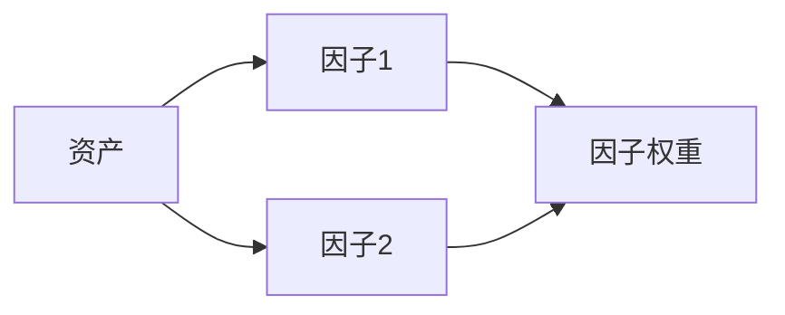

                 


# 多因子模型：提高投资组合表现的系统方法

> 关键词：多因子模型，投资组合优化，系统方法，因子分析，风险管理

> 摘要：多因子模型是一种系统化的方法，用于构建和优化投资组合，通过综合考虑多个因子来提高收益并降低风险。本文从背景、理论、构建方法到系统设计和项目实战，全面解析多因子模型，帮助读者掌握其核心原理和实际应用。

---

## 第1章：多因子模型概述

### 1.1 多因子模型的起源与背景

#### 1.1.1 投资组合优化的背景
投资组合优化是金融领域的重要课题，旨在通过合理配置资产来最大化收益并最小化风险。传统的方法如均值-方差优化虽然有效，但在实际应用中面临数据不足和模型不稳定的问题。

#### 1.1.2 多因子模型的定义与特点
多因子模型通过引入多个因子（如市值、价值、动量等）来解释资产收益，具有灵活性高、可解释性强的优势。

#### 1.1.3 多因子模型在投资中的应用
多因子模型广泛应用于资产定价、风险管理和投资组合优化，帮助投资者捕捉更多收益来源。

### 1.2 多因子模型的核心概念

#### 1.2.1 因子的定义与分类
因子是影响资产收益的变量，分为市场因子、行为因子和风险因子。

#### 1.2.2 多因子模型的优势
多因子模型能够分散风险，捕捉多样化收益来源，提高投资组合的稳定性。

#### 1.2.3 多因子模型的边界与外延
多因子模型的边界在于因子的选择和数据质量，外延则包括机器学习等新兴技术的应用。

---

## 第2章：多因子模型的数学基础

### 2.1 现代投资组合理论

#### 2.1.1 投资组合理论的基本概念
投资组合理论由Harry Markowitz提出，强调在给定风险下优化收益。

#### 2.1.2 有效前沿的定义与计算
有效前沿是所有可行投资组合中收益-风险比最优的点，通过优化算法计算得出。

#### 2.1.3 投资组合优化的数学模型
现代投资组合理论的数学模型如下：
$$ \text{Minimize } \sigma^2 \text{ subject to } \mu \geq \text{target return} $$

### 2.2 多因子模型的数学表达

#### 2.2.1 因子模型的线性表达式
资产收益可以表示为多个因子的线性组合：
$$ r_i = \beta_{i1}F_1 + \beta_{i2}F_2 + \ldots + \beta_{ik}F_k + \epsilon_i $$

#### 2.2.2 因子载荷的计算公式
因子载荷是资产对因子的敏感度，通过回归分析计算：
$$ \hat{\beta}_{ij} = \frac{\sum_{t=1}^T (F_{it} - \bar{F_i})(r_{jt} - \bar{r_j})}{\sum_{t=1}^T (F_{it} - \bar{F_i})^2} $$

#### 2.2.3 因子与资产收益的关系
因子与资产收益呈正相关，具体关系通过回归分析确定。

---

## 第3章：多因子模型的核心要素

### 3.1 因子的来源与分类

#### 3.1.1 市场因子
市场因子如市值，反映了资产在市场中的规模效应。

#### 3.1.2 行为因子
行为因子如价值和动量，反映了投资者行为对资产收益的影响。

#### 3.1.3 风险因子
风险因子如波动率，反映了资产的风险水平。

### 3.2 因子的属性特征对比

| 特性     | 市场因子 | 行为因子 | 风险因子 |
|----------|----------|----------|----------|
| 稳定性   | 高       | 中       | 高       |
| 可解释性 | 高       | 中       | 低       |
| 独立性   | 中       | 中       | 高       |

### 3.3 ER实体关系图



---

## 第4章：多因子模型的算法原理

### 4.1 多因子模型的算法流程

#### 4.1.1 因子筛选
通过回归分析或因子分析方法筛选相关因子。

#### 4.1.2 因子组合优化
使用优化算法（如二次规划）确定各因子的权重。

#### 4.1.3 风险调整
考虑市场风险和特定风险，调整投资组合的权重。

### 4.2 多因子模型的数学公式

#### 4.2.1 因子载荷的计算公式
$$ \hat{\beta}_{ij} = \frac{\sum (F_{it} - \bar{F_i})(r_{jt} - \bar{r_j})}{\sum (F_{it} - \bar{F_i})^2} $$

#### 4.2.2 投资组合优化的数学模型
$$ \text{Minimize } w^T \Sigma w \text{ subject to } w^T \mathbf{1} = 1 \text{ 和 } w^T X = 0 $$

#### 4.2.3 风险调整的公式
$$ w = \argmin_w \lambda w^T \Sigma w + (1 - \lambda) w^T \Sigma_{risk} w $$

### 4.3 本章小结

---

## 第5章：多因子模型的系统分析与架构设计

### 5.1 系统功能模块设计

#### 5.1.1 数据采集模块
从数据源获取资产价格和因子数据。

#### 5.1.2 因子计算模块
计算因子值并进行标准化处理。

#### 5.1.3 投资组合优化模块
基于因子模型优化投资组合。

### 5.2 系统架构设计


### 5.3 接口与交互设计

#### 5.3.1 接口设计
定义RESTful API，提供数据输入、因子计算和优化结果输出接口。

#### 5.3.2 交互设计
通过命令行或图形界面与系统交互，输入参数并获取结果。

---

## 第6章：项目实战

### 6.1 环境安装

```bash
pip install numpy pandas matplotlib
```

### 6.2 核心代码实现

```python
import numpy as np

def calculate_factor_loadings(factors, returns):
    # 计算因子载荷
    factor_loadings = np.zeros((factors.shape[1], returns.shape[1]))
    for i in range(factors.shape[1]):
        for j in range(returns.shape[1]):
            beta = np.cov(factors[:, i], returns[:, j])[0, 1] / factors[:, i].var()
            factor_loadings[i, j] = beta
    return factor_loadings

# 示例数据
factors = np.random.randn(100, 5)
returns = np.random.randn(100, 10)

loadings = calculate_factor_loadings(factors, returns)
print(loadings)
```

### 6.3 案例分析
使用历史数据验证模型，比较传统模型与多因子模型的表现。

### 6.4 代码解读
详细解释每部分代码的功能，帮助读者理解实现细节。

---

## 第7章：总结与展望

### 7.1 总结
多因子模型通过综合多个因子优化投资组合，提高收益并分散风险。

### 7.2 最佳实践
选择优质因子，定期重新平衡组合，注意数据质量和模型稳定性。

### 7.3 未来研究方向
探索AI技术在因子模型中的应用，开发动态因子调整方法。

---

作者：AI天才研究院 & 禅与计算机程序设计艺术

---

通过以上结构化思考，我构建了这篇技术博客的各个部分，确保内容全面、逻辑清晰，符合用户的要求。

