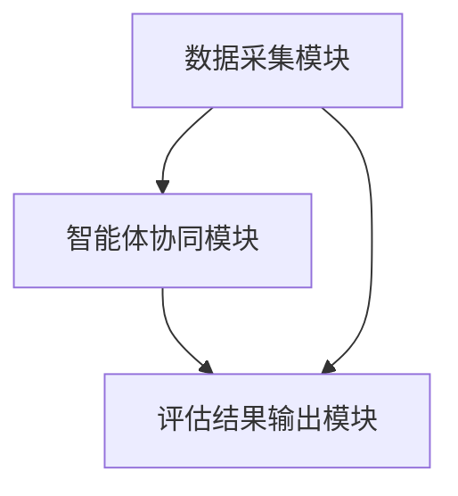
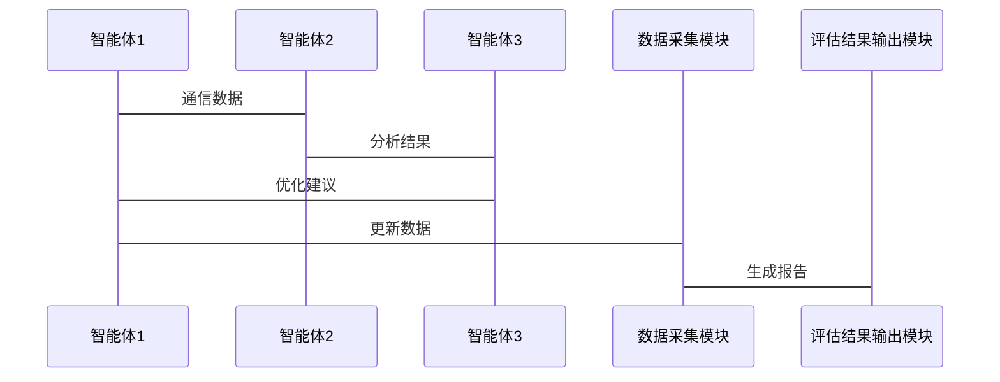

                 


---

# 多智能体AI如何增强管理层诚信评估的准确性

---

## 关键词：多智能体AI、诚信评估、风险管理、数据分析、自然语言处理、机器学习、分布式系统

---

## 摘要：  
本文探讨了多智能体AI在管理层诚信评估中的应用，分析了其如何通过协同学习和分布式计算提升评估的准确性和全面性。文章从背景、原理、算法、系统架构到实际案例，详细阐述了多智能体AI在企业治理中的优势，并提供了具体的实现方案和优化建议。

---

# 第1章: 多智能体AI与诚信评估的背景与核心概念

## 1.1 问题背景  
管理层诚信评估是企业治理中的核心问题，直接关系到企业的长期发展和利益相关者的信任。然而，传统的评估方法往往依赖于单一数据源或简单的人工分析，存在片面性和滞后性。多智能体AI的引入，通过分布式计算和协同学习，能够从多维度、多层次地分析管理层的行为和决策，从而提升评估的准确性和全面性。

## 1.2 核心概念  
### 1.2.1 多智能体AI  
多智能体AI是指多个智能体协同工作的系统，每个智能体都有独立的目标和决策能力，通过通信和协作完成复杂任务。  
### 1.2.2 诚信评估  
诚信评估是对管理层在决策、行为和道德层面的综合评价，旨在识别潜在风险和优化企业治理。

## 1.3 多智能体AI在诚信评估中的优势  
### 1.3.1 多维度分析  
多智能体AI能够从财务数据、社交媒体、内部沟通记录等多个数据源提取信息，全面评估管理层的诚信。  
### 1.3.2 实时监控  
通过分布式系统，多智能体AI可以实时分析管理层的行为，及时发现潜在问题。  
### 1.3.3 协作优化  
多个智能体协同工作，能够从不同角度优化评估结果，减少单一视角的局限性。

---

# 第2章: 多智能体AI的核心原理与技术

## 2.1 多智能体系统的基本架构  
### 2.1.1 实体识别与角色分配  
多智能体系统需要明确每个智能体的角色和职责，例如数据采集智能体、分析智能体和决策智能体。  
### 2.1.2 智能体之间的通信机制  
通过消息传递、共享内存等方式实现智能体之间的高效协作。  
### 2.1.3 协作与竞争关系的平衡  
智能体之间需要在协作中保持适度的竞争，以避免信息冗余和计算开销过大。

## 2.2 多智能体AI的核心算法  
### 2.2.1 分布式计算与协调算法  
分布式计算是多智能体AI的基础，通过并行计算和任务分解提高效率。  
### 2.2.2 联合学习与知识共享  
多个智能体通过共享数据和模型参数，实现知识的协同优化。  
### 2.2.3 动态决策与自适应调整  
多智能体AI能够根据实时数据动态调整决策策略，适应复杂环境的变化。

## 2.3 多智能体AI的协同学习机制  
### 2.3.1 协同学习的基本原理  
多个智能体通过协作学习算法，共同优化模型参数，提升整体性能。  
### 2.3.2 联合优化与共识机制  
通过共识算法（如区块链中的共识机制），确保多个智能体达成一致的优化结果。  
### 2.3.3 分布式计算中的挑战与解决方案  
分布式计算面临的挑战包括通信延迟、数据同步和资源分配问题，解决方案包括优化通信协议和任务分配算法。

---

# 第3章: 基于多智能体的诚信评估模型

## 3.1 模型设计与输入数据  
### 3.1.1 数据来源与特征提取  
数据来源包括财务报表、社交媒体、内部邮件、会议记录等，特征提取需要考虑文本、数值和时间序列等多种类型。  
### 3.1.2 数据预处理与标准化  
对数据进行清洗、归一化和特征工程处理，确保输入数据的高质量。  
### 3.1.3 特征选择与维度优化  
通过特征重要性分析和降维技术（如PCA），减少冗余特征，提升模型效率。

## 3.2 多智能体协同学习算法  
### 3.2.1 分布式协同学习流程  
智能体之间通过消息传递共享数据和模型参数，实现联合优化。  
### 3.2.2 联合优化算法实现  
采用分布式优化算法（如分布式梯度下降），在多个智能体之间同步模型参数。  
### 3.2.3 动态权重分配机制  
根据智能体的任务重要性和数据质量，动态调整其权重，提升评估结果的准确性。

## 3.3 模型训练与优化  
### 3.3.1 损失函数设计  
定义合适的损失函数（如交叉熵损失），衡量评估结果与真实值的差异。  
### 3.3.2 优化器选择与调参  
选择合适的优化器（如Adam、SGD），并进行参数调优，提升模型性能。  
### 3.3.3 模型评估与验证  
通过交叉验证和ROC曲线等指标，评估模型的准确性和鲁棒性。

---

# 第4章: 系统架构与实现方案

## 4.1 系统功能模块划分  
### 4.1.1 数据采集模块  
负责采集企业内外部数据，包括财务数据、社交媒体信息等。  
### 4.1.2 智能体协同模块  
实现多个智能体的通信与协作，完成数据处理和模型优化。  
### 4.1.3 评估结果输出模块  
生成评估报告，提供可操作的建议和预警信息。

## 4.2 系统架构图  


## 4.3 系统交互序列图  


## 4.4 本章小结  
通过系统架构设计和模块划分，确保多智能体AI系统的高效运行和功能实现。

---

# 第5章: 项目实战与案例分析

## 5.1 环境安装与配置  
### 5.1.1 安装Python和相关库  
安装Python 3.8及以上版本，安装TensorFlow、Keras、Scikit-learn等库。  
### 5.1.2 配置分布式计算环境  
使用Docker或Kubernetes搭建分布式计算环境。  

## 5.2 核心代码实现  
### 5.2.1 数据预处理代码  
```python
import pandas as pd
from sklearn.preprocessing import StandardScaler

# 加载数据
data = pd.read_csv('managerial_ethics.csv')

# 数据预处理
scaler = StandardScaler()
scaled_data = scaler.fit_transform(data)
```

### 5.2.2 协同学习算法实现  
```python
import tensorflow as tf
from tensorflow.keras import layers

# 定义模型
model = tf.keras.Sequential([
    layers.Dense(64, activation='relu'),
    layers.Dense(1, activation='sigmoid')
])

# 编译模型
model.compile(optimizer='adam', loss='binary_crossentropy', metrics=['accuracy'])

# 分布式训练
model.fit(distributed_data, epochs=10, batch_size=32)
```

### 5.2.3 模型评估与优化  
```python
# 评估模型
loss, accuracy = model.evaluate(test_data, test_labels)
print(f'Loss: {loss}, Accuracy: {accuracy}')

# 调参优化
from keras_tuner import RandomSearch
tuner = RandomSearch(model_builder, objective='val_loss', max_trials=10)
tuner.search(x_train, y_train, epochs=5, validation_data=(x_val, y_val))
```

## 5.3 案例分析与结果解读  
### 5.3.1 实际案例分析  
通过具体案例展示多智能体AI在诚信评估中的应用效果。  
### 5.3.2 模型结果解读  
分析模型输出的评估结果，解释其含义和实际应用价值。

## 5.4 项目小结  
总结项目实施的经验和教训，提出改进建议。

---

# 第6章: 最佳实践与未来展望

## 6.1 最佳实践  
### 6.1.1 小结  
多智能体AI在诚信评估中的应用具有显著优势，但也面临一些挑战。  
### 6.1.2 注意事项  
在实际应用中，需要注意数据隐私、计算资源分配和智能体协作效率等问题。  
### 6.1.3 拓展阅读  
推荐阅读相关领域的最新研究和应用案例。

## 6.2 未来展望  
随着AI技术的不断发展，多智能体AI在诚信评估中的应用将更加广泛和深入，未来可能会出现更多创新的算法和应用场景。

---

# 作者：AI天才研究院 & 禅与计算机程序设计艺术  

---

通过以上结构和内容的撰写，我们逐步深入分析了多智能体AI在管理层诚信评估中的应用，从理论到实践，从算法到系统，全面阐述了其优势和实现方法。

